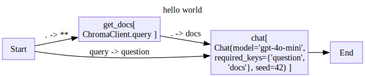

# StringDALE


<!-- WARNING: THIS FILE WAS AUTOGENERATED! DO NOT EDIT! -->

> String Diagram Agent Language Express (StringDale) is a library for
> building complex LLM agentic workflows easily using [string
> diagrams](https://julesh.com/the-art-of-string-diagrams/).

## Motivation

We found current agentic frameworks unnecessarily complex:

- Too many levels of abstractions and boilerplate code.
- Too many interfaces to learn
- To many wrappers to build for our code to fit these frameworks

As a response, we create stringdale which aims to:

- Have a small interface - making it easier to learn.
- Non-intrusive - You can use your own functions in stringdale, without
  fitting them to a complex interface.
- Have few levels of abstraction - we don’t create tons of wrappers you
  have to navigate, you bring your own functions and understand exactly
  what is happening at all times.
- Make tracing and debugging simple.

## Installation

``` bash
# in an environment with python>=3.10
pip install stringdale
```

`stringdale` uses [graphviz](https://graphviz.org) to draw your diagrams
in jupyter notebooks.

Make sure you [download and install](https://graphviz.org/download/)
graphviz on your system if you want diagrams to be rendered.

## Usage

Lets look at how to build a RAG workflow

``` python
# bring your own LLM based functions
# These can be any function or callable
# for now lets use example ones
from stringdale.chat import Chat
from stringdale.db import ChromaClient
```

Lets make an example vector db:

``` python
chroma_client = ChromaClient()

dog_docs = [
    {
        'id': 'dog1',
        'text': 'The Golden Retriever is a friendly, intelligent breed known for its golden coat. They make excellent family pets and are great with children.',
        'metadata': {'breed': 'Golden Retriever'}
    },
    {
        'id': 'dog2', 
        'text': 'German Shepherds are loyal, protective dogs often used in police work. They are highly trainable and good at various tasks.',
        'metadata': {'breed': 'German Shepherd'}
    },
    {
        'id': 'dog3',
        'text': 'The Golden Retriever is a friendly, intelligent breed with a beautiful golden coat. They are wonderful family pets that get along well with kids.',
        'metadata': {'breed': 'Golden Retriever'}  
    },
    {
        'id': 'dog4',
        'text': 'Huskies are energetic working dogs bred for cold climates. They have thick fur and often blue eyes.',
        'metadata': {'breed': 'Husky'}
    },
    {
        'id': 'dog5',
        'text': 'Siberian Huskies are active working dogs that thrive in cold weather. They are known for their thick coats and striking blue eyes.',
        'metadata': {'breed': 'Husky'} 
    }
]

chroma_client.add_collection("dog_docs",exists_ok=True)
chroma_client.upsert(collection_name="dog_docs",docs=dog_docs)
chroma_client.list(collection_name='dog_docs')
```

    [{'id': 'dog1',
      'text': 'The Golden Retriever is a friendly, intelligent breed known for its golden coat. They make excellent family pets and are great with children.',
      'metadata': {'breed': 'Golden Retriever'},
      'embedding': array([0.05813659, 0.02785078, 0.00372152, ..., 0.0241031 , 0.04067278,
             0.00027733])},
     {'id': 'dog2',
      'text': 'German Shepherds are loyal, protective dogs often used in police work. They are highly trainable and good at various tasks.',
      'metadata': {'breed': 'German Shepherd'},
      'embedding': array([ 0.03066194,  0.00074497,  0.01366658, ..., -0.0081617 ,
             -0.02541033, -0.01031713])},
     {'id': 'dog3',
      'text': 'The Golden Retriever is a friendly, intelligent breed with a beautiful golden coat. They are wonderful family pets that get along well with kids.',
      'metadata': {'breed': 'Golden Retriever'},
      'embedding': array([0.04065013, 0.02587523, 0.01385626, ..., 0.02761683, 0.03554016,
             0.00553581])},
     {'id': 'dog4',
      'text': 'Huskies are energetic working dogs bred for cold climates. They have thick fur and often blue eyes.',
      'metadata': {'breed': 'Husky'},
      'embedding': array([-0.02400597, -0.00190817, -0.02052087, ..., -0.02349378,
             -0.04244469, -0.02794758])},
     {'id': 'dog5',
      'text': 'Siberian Huskies are active working dogs that thrive in cold weather. They are known for their thick coats and striking blue eyes.',
      'metadata': {'breed': 'Husky'},
      'embedding': array([-0.01651848,  0.00581224, -0.02498457, ..., -0.00659932,
             -0.03063537, -0.02282516])}]

``` python
rag_chat = Chat(
    model='gpt-4o-mini',
    messages=[
        {'role':'system','content':'''
            You are a helpful assistant that answers questions about dogs.
            I found the following documents that may be relevant to the user's question:
            
            {{doc['text']}}
            
            '''},
        {'role':'user','content':'{{question}}'},
    ]
)
```

``` python
# import the basic building blocks
from stringdale import V,E,Define
```

``` python
# define your diagram schema
with Define('hello world') as RAG:
    V('get_docs',chroma_client.query)
    E('Start->get_docs(**)')
        
    V('chat',rag_chat)
    E('get_docs->chat(docs=.)')
    E('Start->chat(question=query)')
    E('chat->End')

RAG.draw()
```



``` python
# run the diagram
diagram = RAG()

diagram_input = {
    'query':'tell me some stuff about golden retrievers',
    'collection_name':'dog_docs',
    'k':2
}

for trace in diagram.run(diagram_input):
    # you can write any logging,tracing logic here
    trace.pprint(file='log_file.txt')
    pass

# after running, access the output 
diagram.output
```

    {'role': 'assistant',
     'content': 'The Golden Retriever is a friendly and intelligent breed known for its beautiful golden coat. They make excellent family pets and are particularly good with children, making them wonderful companions for families.',
     'meta': {'input_tokens': 198, 'output_tokens': 42}}

``` python
! cat log_file.txt
! rm log_file.txt
```

    Node Start:
    { 'input': { 'collection_name': 'dog_docs',
                 'k': 2,
                 'q': 'tell me some stuff about golden retrievers'},
      'output': { 'collection_name': 'dog_docs',
                  'k': 2,
                  'q': 'tell me some stuff about golden retrievers'}}
    ================================================================================
    Node Start:
    { 'input': { 'collection_name': 'dog_docs',
                 'k': 2,
                 'query': 'tell me some stuff about golden retrievers'},
      'output': { 'collection_name': 'dog_docs',
                  'k': 2,
                  'query': 'tell me some stuff about golden retrievers'}}
    ================================================================================
    Node get_docs:
    { 'input': { 'collection_name': 'dog_docs',
                 'k': 2,
                 'query': 'tell me some stuff about golden retrievers'},
      'output': [ { 'distance': 0.6993070840835571,
                    'id': 'dog3',
                    'metadata': {'breed': 'Golden Retriever'},
                    'text': 'The Golden Retriever is a friendly, intelligent breed '
                            'with a beautiful golden coat. They are wonderful '
                            'family pets that get along well with kids.'},
                  { 'distance': 0.7122190594673157,
                    'id': 'dog1',
                    'metadata': {'breed': 'Golden Retriever'},
                    'text': 'The Golden Retriever is a friendly, intelligent breed '
                            'known for its golden coat. They make excellent family '
                            'pets and are great with children.'}]}
    ================================================================================
    Node chat:
    { 'input': { 'docs': [ { 'distance': 0.6993070840835571,
                             'id': 'dog3',
                             'metadata': {'breed': 'Golden Retriever'},
                             'text': 'The Golden Retriever is a friendly, '
                                     'intelligent breed with a beautiful golden '
                                     'coat. They are wonderful family pets that '
                                     'get along well with kids.'},
                           { 'distance': 0.7122190594673157,
                             'id': 'dog1',
                             'metadata': {'breed': 'Golden Retriever'},
                             'text': 'The Golden Retriever is a friendly, '
                                     'intelligent breed known for its golden coat. '
                                     'They make excellent family pets and are '
                                     'great with children.'}],
                 'question': 'tell me some stuff about golden retrievers'},
      'output': { 'content': 'The Golden Retriever is a friendly and intelligent '
                             'breed known for its beautiful golden coat. They make '
                             'excellent family pets and are particularly good with '
                             'children, making them wonderful companions for '
                             'families.',
                  'meta': {'input_tokens': 198, 'output_tokens': 42},
                  'role': 'assistant'}}
    ================================================================================
    Node End:
    { 'input': { 0: { 'content': 'The Golden Retriever is a friendly and '
                                 'intelligent breed known for its beautiful golden '
                                 'coat. They make excellent family pets and are '
                                 'particularly good with children, making them '
                                 'wonderful companions for families.',
                      'meta': {'input_tokens': 198, 'output_tokens': 42},
                      'role': 'assistant'}},
      'output': { 'content': 'The Golden Retriever is a friendly and intelligent '
                             'breed known for its beautiful golden coat. They make '
                             'excellent family pets and are particularly good with '
                             'children, making them wonderful companions for '
                             'families.',
                  'meta': {'input_tokens': 198, 'output_tokens': 42},
                  'role': 'assistant'}}
    ================================================================================

## Reporting Bugs

Found bugs? Missing features? Feel free to [open an
issue](https://github.com/DeanLight/stringdale/issues)

## Contributing

Want to contribute to stringdale? Great! Feel free to submit a PR or
discuss a feature you would like to add in the Issues.

To get a working development environment:

``` bash
# clone the repo
git clone https://github.com/DeanLight/stringdale.git    
cd stringdale

# install stringdale in editable dev mode
pip install -e ".[dev]"

# run pre-commit to install commit hooks
pre-commit install
```

`stringdale` is developed using [nbdev](https://nbdev.fast.ai/)

``` bash
# Make changes under nbs/ directory
# ...

# clean and export notebooks into a python library
nbdev_clean && nbdev_export

# make sure tests pass
nbdev_test

# Changing the docs? make sure that they are rendering correctly
nbdev_docs
```
