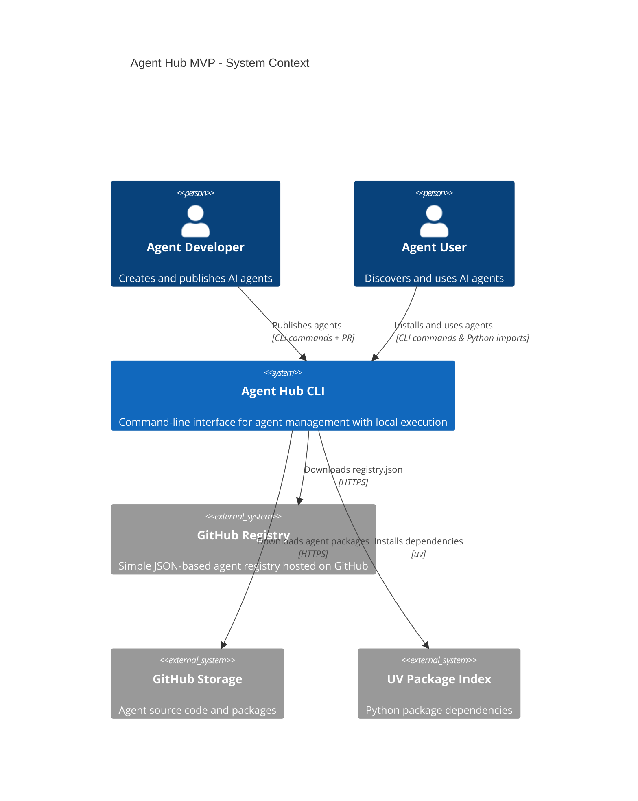
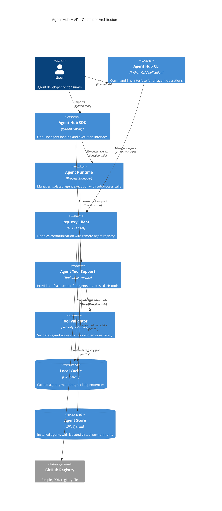
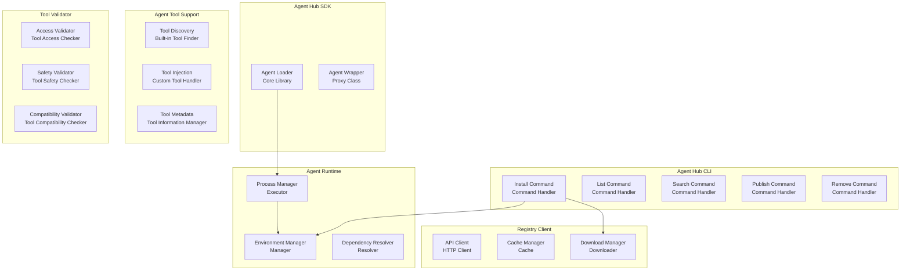
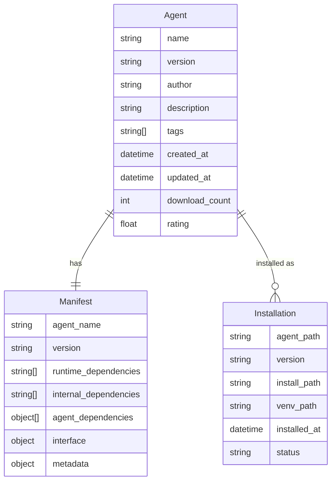
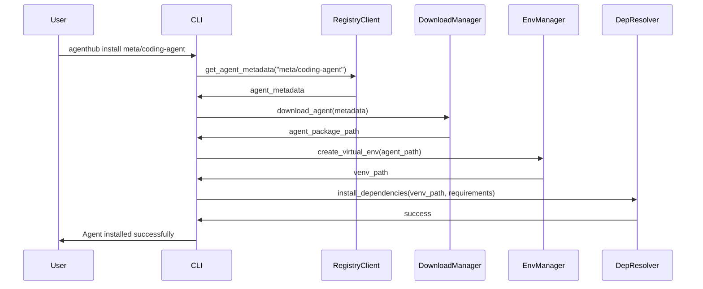
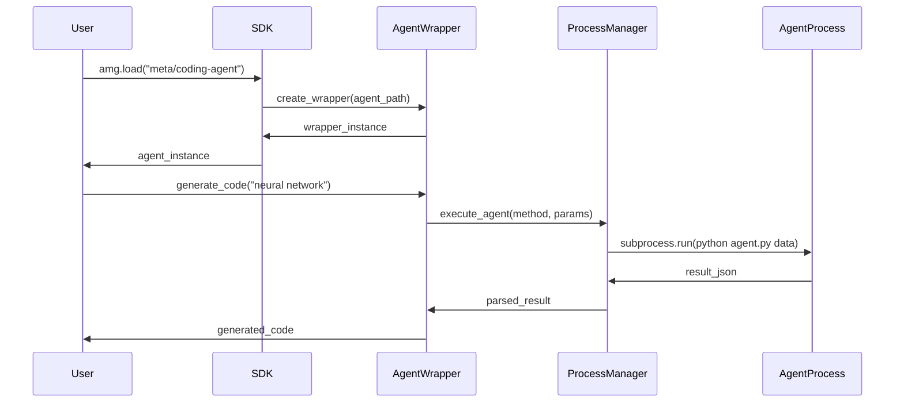
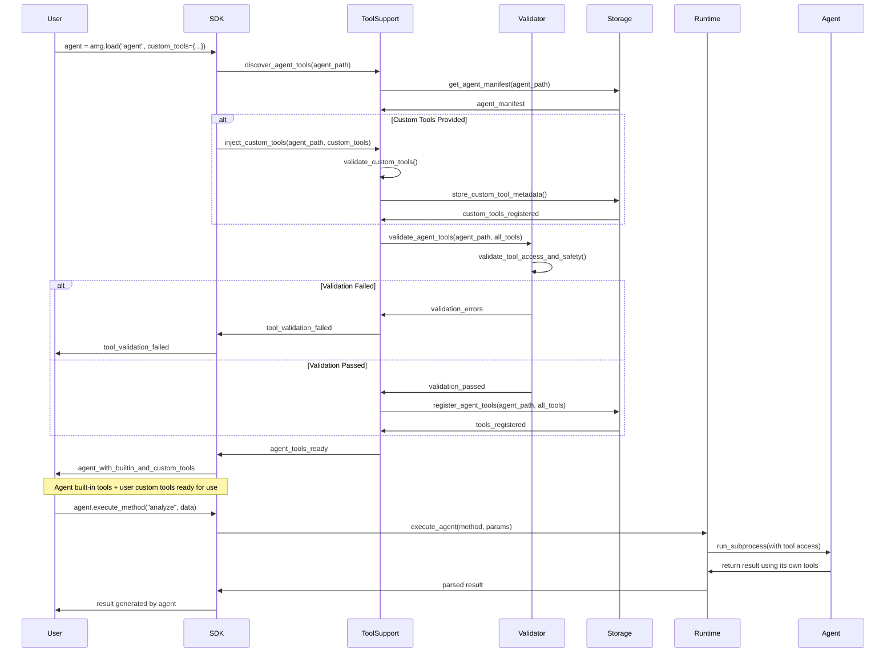

# Agent Hub Container Architecture

**Document Type**: Container Architecture
**Author**: William
**Date Created**: 2025-06-28
**Last Updated**: 2025-06-28
**Status**: Final
**Level**: L2 - Container Level
**Audience**: Technical Architects, Developers, DevOps Team

## Business Problem & Solution Mapping

### Core Problem Statement
As AI agent developers and users, we struggle with the fragmented and complex process of sharing, discovering, and integrating AI agents into existing systems, which causes significant development overhead, reduced adoption rates, and prevents the AI agent ecosystem from reaching its full potential.

### Solution Vision
Create a CLI-based Agent Hub MVP that enables one-line agent integration (`import agenthub as amg; agent = amg.load("meta/coding-agent")`) with process-based isolation for dependency management and local execution for fast development iteration.

### Business Value Justification
- **For Developers**: Eliminate distribution infrastructure overhead, reach broader audience
- **For Users**: Reduce integration time from weeks to minutes, standardized interfaces
- **For Ecosystem**: Increase agent adoption rates, enable agent composition and reuse

## System Context Diagram



## Container Architecture



## Component Architecture



## Key Architectural Decisions

### ADR-001: Process-Based Isolation
**Context**: Need to isolate agent dependencies to prevent conflicts
**Decision**: Use subprocess execution with virtual environments
**Rationale**: Simpler than containers, fast startup, full isolation
**Consequences**: +Fast development, +Simple setup, -Less security than containers

### ADR-002: CLI-First MVP
**Context**: Need to validate core functionality quickly
**Decision**: Start with CLI interface only, add GUI later
**Rationale**: Faster development, easier testing, targets developer audience
**Consequences**: +Quick to market, +Developer-friendly, -Limited to technical users

### ADR-003: Local Execution
**Context**: Users want fast iteration and offline capability
**Decision**: Execute all agents locally with option for remote execution later
**Rationale**: No network latency, works offline, simpler architecture
**Consequences**: +Fast execution, +Privacy, -Uses local resources

### ADR-004: GitHub-Based Registry
**Context**: Need agent registry without server maintenance
**Decision**: Use GitHub repository with JSON registry file
**Rationale**: No server costs, git-based versioning, familiar to developers
**Consequences**: +Zero maintenance, +Free hosting, +Git workflow, -Limited by GitHub API

### ADR-005: File-Based Agent Storage
**Context**: Need to store agents and metadata locally
**Decision**: Use file system with structured directories
**Rationale**: Simple, no database dependency, easy to debug
**Consequences**: +Simple implementation, +Easy backup, -No complex queries

## Data Model



## API Design

### CLI Commands
```bash
# Core agent management (simplified)
agenthub install <agent-path>          # Install an agent
agenthub list [--installed]            # List installed agents
agenthub search <query>                # Search for agents
agenthub remove <agent-path>           # Remove installed agent
agenthub info <agent-path>             # Show agent details

# Developer commands
agenthub init <agent-name>             # Create new agent template
agenthub validate <agent-path>         # Validate agent before publishing
agenthub package <agent-path>          # Package agent for distribution

# Discovery and recommendations
agenthub trending                      # Show trending agents
agenthub recommend                     # Get agent recommendations
```

### Python SDK Interface
```python
import agenthub as amg

# Load and use agents
agent = amg.load("meta/coding-agent")
result = agent.generate_code("Python class for neural network")

# Agent management
amg.install("meta/coding-agent")
amg.list_installed()
amg.remove("meta/coding-agent")
```

## File System Structure

```
~/.agenthub/
├── agents/                           # Installed agents
│   ├── meta/
│   │   └── coding-agent/
│   │       ├── venv/                 # Isolated virtual environment
│   │       ├── manifest.yaml        # Agent metadata and interface
│   │       ├── agent.py             # Main agent entry point
│   │       ├── core/                # Agent implementation modules
│   │       │   ├── __init__.py
│   │       │   ├── generator.py
│   │       │   └── analyzer.py
│   │       ├── tests/               # Agent tests
│   │       └── requirements.txt     # Agent dependencies
│   └── openai/
│       └── data-analyzer/
├── cache/                           # Cached registry data
│   ├── registry.json               # Cached agent registry
│   ├── downloads/                  # Downloaded but not installed agents
│   └── metadata/                   # Cached agent metadata
├── config/                         # Configuration
│   ├── settings.yaml              # Global settings
│   └── registry_cache.json        # Cached GitHub registry
└── logs/                          # Execution logs
    ├── install.log
    ├── execution.log
    └── errors.log
```

## Sequence Diagrams

### Agent Installation Flow


### Agent Execution Flow


### Agent Tool Support Flow


## Security Considerations

### Process Isolation Security
- **Subprocess execution** prevents agents from accessing parent process memory
- **Virtual environment isolation** prevents dependency conflicts
- **File system access control** through working directory restrictions
- **Environment variable isolation** prevents access to host environment

### Input Validation
- **Agent manifest validation** ensures proper structure and dependencies
- **Method parameter validation** prevents injection attacks
- **File path validation** prevents directory traversal attacks

### Trust Model
- **Agent signing** for published agents (future enhancement)
- **Community ratings** for trust building
- **Sandboxed execution** for untrusted agents (future enhancement)

## Performance Characteristics

### Expected Performance Targets
- **Agent installation**: < 30 seconds for typical agent
- **Agent loading**: < 500ms for cached agent
- **Method execution**: < 1 second overhead for subprocess call
- **Memory usage**: < 100MB for agent hub runtime

### Scalability Considerations
- **Local storage scaling**: Support for 100+ installed agents
- **Concurrent execution**: Support for multiple agents running simultaneously
- **Dependency caching**: Shared dependencies to reduce storage

## Technology Stack

### Core Technologies
- **Python 3.8+**: Main implementation language
- **Click**: CLI framework for command interface
- **subprocess**: Process isolation and execution
- **uv**: Fast Python package installer and virtual environment management
- **PyYAML**: Configuration and manifest parsing
- **requests**: HTTP client for registry communication

### Tool Support Technologies
- **inspect**: Python introspection for tool metadata extraction
- **pickle**: Tool serialization and storage
- **typing**: Type hints for tool validation
- **numpy**: Numerical operations for tool validation
- **pathlib**: Cross-platform path handling for tool discovery

### Development Tools
- **pytest**: Testing framework
- **black**: Code formatting
- **mypy**: Type checking
- **pre-commit**: Git hooks for quality

## Risk Assessment

### Technical Risks
- **Dependency conflicts**: Mitigated by virtual environment isolation
- **Performance overhead**: Subprocess calls add latency (acceptable for MVP)
- **Storage usage**: Multiple virtual environments use disk space
- **Platform compatibility**: Need to support Windows, macOS, Linux

### Business Risks
- **User adoption**: CLI might limit non-technical users (acceptable for MVP)
- **Agent quality**: Need validation and rating systems
- **Registry scaling**: Need robust backend for agent storage

## Implementation Roadmap

### Phase 1: Core Runtime (Week 1-2)
- Process manager for subprocess execution
- Virtual environment management
- Basic agent loading and execution

### Phase 2: CLI Interface (Week 3)
- Install, list, remove commands
- Local agent storage and management
- Basic error handling and logging

### Phase 3: GitHub Registry Integration (Week 3)
- Simple GitHub-based registry client
- Agent search and discovery from JSON
- Registry cache management

### Phase 4: Developer Experience (Week 4)
- Agent templates and validation
- Better error handling with solutions
- Agent packaging and recommendations

## Success Criteria

### Technical Success
- ✅ One-line agent loading: `agent = amg.load("meta/coding-agent")`
- ✅ Dependency isolation: No conflicts between agents
- ✅ Fast execution: < 1 second overhead for agent calls
- ✅ Cross-platform: Works on Windows, macOS, Linux

### Business Success
- ✅ Developer adoption: 10+ agents published in first month
- ✅ User adoption: 50+ installations in first month
- ✅ Integration success: 90%+ successful agent installations
- ✅ Performance: Average agent execution < 2 seconds

## Future Enhancements

### Post-MVP Features
- **Web interface** for non-technical users
- **Containerized execution** for enhanced security
- **Agent composition** for complex workflows
- **Monitoring and analytics** for agent performance
- **Monetization platform** for paid agents
- **Enterprise features** for governance and compliance

## Component Justification

### Agent Runtime (Process Manager)
**Business Problem**: Agent dependency conflicts prevent reliable execution
**User Outcome**: Users can run multiple agents without compatibility issues
**Business Value**: Enables agent ecosystem growth through reliable execution
**Decision Rationale**: Process isolation provides clean separation with acceptable performance

### Agent Tool Support Container
**Business Problem**: Agents need access to tools but Agent Hub shouldn't provide tools
**User Outcome**: Agents can use their built-in tools and users can inject custom tools
**Business Value**: Enables agent flexibility while maintaining platform simplicity
**Decision Rationale**: Tool support infrastructure separates concerns and enables customization

### Tool Validator Container
**Business Problem**: Custom tools need validation for safety and compatibility
**User Outcome**: Users can safely inject custom tools with automatic validation
**Business Value**: Reduces security risks while enabling customization
**Decision Rationale**: Validation ensures platform safety without limiting user capabilities

### CLI Interface
**Business Problem**: Developers need fast, scriptable agent management
**User Outcome**: Developers can integrate agent management into their workflows
**Business Value**: Reduces friction for developer adoption
**Decision Rationale**: CLI is fastest to develop and serves developer audience well

### Local Execution
**Business Problem**: Network latency and offline development needs
**User Outcome**: Developers can iterate quickly without network dependencies
**Business Value**: Better developer experience leads to higher adoption
**Decision Rationale**: Local execution optimizes for development speed over scalability

This architecture provides a solid foundation for the Agent Hub MVP while maintaining simplicity and focus on the core value proposition of one-line agent integration with dependency isolation.
