# Agent Hub CLI Module Design

**Document Type**: Module Design
**Author**: William
**Date Created**: 2025-06-28
**Last Updated**: 2025-06-28
**Status**: Final
**Level**: L3 - Module Level
**Audience**: Developers, Implementation Team

## 🎯 **Module Overview**

The CLI Module provides the primary user interface for Agent Hub, implementing all command-line operations for agent management. Built with Python Click framework, it offers a rich, user-friendly command-line experience with helpful error messages and intuitive workflows.

### **Business Justification**
- **Problem**: Developers need fast, scriptable interface for agent management
- **User Outcome**: Developers can integrate agent operations into their workflows
- **Business Value**: Reduces friction for developer adoption and enables automation

## 🏗️ **Module Architecture**

```mermaid
graph TD
    subgraph CLI["CLI Module"]
        ENTRY[CLI Entry Point]
        ROUTER[Command Router]

        subgraph COMMANDS["Command Handlers"]
            INSTALL[Install Command]
            LIST[List Command]
            SEARCH[Search Command]
            REMOVE[Remove Command]
            INFO[Info Command]
            INIT[Init Command]
            VALIDATE[Validate Command]
            TRENDING[Trending Command]
        end

        subgraph SERVICES["Service Layer"]
            REGISTRY[Registry Service]
            INSTALLER[Installer Service]
            VALIDATOR[Validator Service]
            TEMPLATE[Template Service]
        end

        subgraph UTILS["Utility Layer"]
            ERROR[Error Handler]
            OUTPUT[Output Formatter]
            CONFIG[Config Manager]
            ANALYTICS[Analytics Tracker]
        end
    end

    ENTRY --> ROUTER
    ROUTER --> COMMANDS
    COMMANDS --> SERVICES
    SERVICES --> UTILS
```



## 🔧 **Core Components**

### **CLI Entry Point**

```python
# cli/main.py
import click
from .commands import install, list_agents, search, remove, info
from .commands import init, validate, trending
from .utils import setup_logging, load_config

@click.group()
@click.version_option(version="1.0.0")
@click.option('--verbose', '-v', is_flag=True, help='Enable verbose output')
@click.option('--config', help='Config file path')
@click.pass_context
def cli(ctx, verbose, config):
    """Agent Hub CLI for managing AI agents."""
    ctx.ensure_object(dict)
    ctx.obj['verbose'] = verbose
    ctx.obj['config'] = load_config(config)
    setup_logging(verbose)

# Register commands
cli.add_command(install.install)
cli.add_command(list_agents.list_cmd)
cli.add_command(search.search)
cli.add_command(remove.remove)
cli.add_command(info.info)
cli.add_command(init.init)
cli.add_command(validate.validate)
cli.add_command(trending.trending)

if __name__ == '__main__':
    cli()
```

### **Command Implementations**

#### **Install Command**
```python
# cli/commands/install.py
import click
from ..services import RegistryService, InstallerService
from ..utils import ErrorHandler, OutputFormatter, AnalyticsTracker

@click.command()
@click.argument('agent_path')
@click.option('--version', help='Specific version to install')
@click.option('--force', is_flag=True, help='Force reinstall if already installed')
@click.option('--no-deps', is_flag=True, help='Skip dependency installation')
@click.pass_context
def install(ctx, agent_path: str, version: str = None, force: bool = False, no_deps: bool = False):
    """Install an agent from the registry."""
    try:
        registry = RegistryService()
        installer = InstallerService()
        analytics = AnalyticsTracker()

        # Validate agent exists
        agent_info = registry.get_agent_metadata(agent_path)
        if not agent_info:
            suggestions = registry.get_similar_agents(agent_path)
            raise AgentNotFoundError(agent_path, suggestions)

        # Check if already installed
        if installer.is_installed(agent_path) and not force:
            click.echo(f"Agent {agent_path} is already installed. Use --force to reinstall.")
            return

        # Install agent
        click.echo(f"Installing {agent_path}...")
        with click.progressbar(length=100, label='Installing') as bar:
            def progress_callback(percent):
                bar.update(percent - bar.pos)

            installation_result = installer.install_agent(
                agent_path=agent_path,
                version=version,
                skip_deps=no_deps,
                progress_callback=progress_callback
            )

        # Success message
        OutputFormatter.success(f"Successfully installed {agent_path}")
        OutputFormatter.info(f"Install path: {installation_result.install_path}")
        OutputFormatter.info(f"Usage: import agenthub as amg; agent = amg.load('{agent_path}')")

        # Track analytics
        analytics.track_installation(agent_path, installation_result.install_time)

    except Exception as e:
        ErrorHandler.handle_error(e, ctx.obj['verbose'])
        ctx.exit(1)
```

#### **Search Command**
```python
# cli/commands/search.py
import click
from ..services import RegistryService
from ..utils import OutputFormatter

@click.command()
@click.argument('query', required=False)
@click.option('--category', help='Filter by category')
@click.option('--tag', multiple=True, help='Filter by tags')
@click.option('--limit', default=20, help='Maximum results to show')
@click.option('--sort', type=click.Choice(['relevance', 'downloads', 'rating', 'recent']),
              default='relevance', help='Sort order')
def search(query: str = None, category: str = None, tag: tuple = (),
           limit: int = 20, sort: str = 'relevance'):
    """Search for agents in the registry."""
    try:
        registry = RegistryService()

        # Perform search
        results = registry.search_agents(
            query=query,
            category=category,
            tags=list(tag),
            limit=limit,
            sort=sort
        )

        if not results:
            click.echo("No agents found matching your criteria.")
            if query:
                click.echo(f"Try: agenthub search --category {category or 'development'}")
            return

        # Display results
        OutputFormatter.print_agent_list(results, show_details=True)

        if len(results) == limit:
            click.echo(f"\nShowing first {limit} results. Use --limit to see more.")

    except Exception as e:
        ErrorHandler.handle_error(e)
        click.get_current_context().exit(1)
```

#### **Trending Command**
```python
# cli/commands/trending.py
import click
from ..services import RegistryService
from ..utils import OutputFormatter

@click.command()
@click.option('--period', type=click.Choice(['day', 'week', 'month']),
              default='week', help='Trending period')
@click.option('--category', help='Filter by category')
@click.option('--limit', default=10, help='Number of agents to show')
def trending(period: str = 'week', category: str = None, limit: int = 10):
    """Show trending agents."""
    try:
        registry = RegistryService()

        trending_agents = registry.get_trending_agents(
            period=period,
            category=category,
            limit=limit
        )

        if not trending_agents:
            click.echo("No trending agents found.")
            return

        click.echo(f"🔥 Trending agents ({period}):")
        OutputFormatter.print_trending_list(trending_agents)

    except Exception as e:
        ErrorHandler.handle_error(e)
        click.get_current_context().exit(1)
```

#### **Agent Initialization Command**
```python
# cli/commands/init.py
import click
from ..services import TemplateService
from ..utils import OutputFormatter

@click.command()
@click.argument('agent_name')
@click.option('--category', type=click.Choice(['development', 'data-science', 'content', 'automation']),
              default='development', help='Agent category')
@click.option('--template', help='Custom template name')
@click.option('--output-dir', default='.', help='Output directory')
def init(agent_name: str, category: str = 'development',
         template: str = None, output_dir: str = '.'):
    """Initialize a new agent project."""
    try:
        template_service = TemplateService()

        # Check if directory already exists
        agent_dir = os.path.join(output_dir, agent_name)
        if os.path.exists(agent_dir):
            if not click.confirm(f"Directory {agent_dir} already exists. Continue?"):
                return

        # Generate agent template
        click.echo(f"Creating agent '{agent_name}' in {agent_dir}...")

        template_service.generate_agent_template(
            agent_name=agent_name,
            category=category,
            template=template,
            output_dir=output_dir
        )

        OutputFormatter.success(f"Agent '{agent_name}' created successfully!")
        OutputFormatter.info(f"Location: {agent_dir}")
        OutputFormatter.info("Next steps:")
        OutputFormatter.info(f"  cd {agent_name}")
        OutputFormatter.info(f"  # Edit {agent_name}/agent.py to implement your agent")
        OutputFormatter.info(f"  agenthub validate .")
        OutputFormatter.info(f"  agenthub package .")

    except Exception as e:
        ErrorHandler.handle_error(e)
        click.get_current_context().exit(1)
```

## 🛠️ **Service Layer**

### **Registry Service**
```python
# cli/services/registry_service.py
import requests
import json
from typing import List, Dict, Optional
from ..utils import CacheManager

class RegistryService:
    def __init__(self):
        self.cache = CacheManager()
        self.base_url = "https://api.github.com/repos/agentplug/agent-registry"

    def search_agents(
        self,
        query: str = None,
        category: str = None,
        tags: List[str] = None,
        limit: int = 20,
        sort: str = 'relevance'
    ) -> List[Dict]:
        """Search for agents in registry."""
        registry = self._get_registry()
        agents = registry.get('agents', {})

        # Filter by category
        if category:
            agents = {k: v for k, v in agents.items() if v.get('category') == category}

        # Filter by tags
        if tags:
            agents = {k: v for k, v in agents.items()
                     if any(tag in v.get('tags', []) for tag in tags)}

        # Search by query
        if query:
            query_lower = query.lower()
            agents = {k: v for k, v in agents.items()
                     if query_lower in v.get('name', '').lower() or
                        query_lower in v.get('description', '').lower()}

        # Sort results
        sorted_agents = self._sort_agents(list(agents.values()), sort)

        return sorted_agents[:limit]

    def get_agent_metadata(self, agent_path: str) -> Optional[Dict]:
        """Get detailed agent metadata."""
        registry = self._get_registry()
        return registry.get('agents', {}).get(agent_path)

    def get_trending_agents(
        self,
        period: str = 'week',
        category: str = None,
        limit: int = 10
    ) -> List[Dict]:
        """Get trending agents."""
        registry = self._get_registry()
        trending = registry.get('trending_agents', [])

        # This would typically use more sophisticated trending algorithm
        # For MVP, we use the predefined trending list
        agents = []
        for agent_path in trending[:limit]:
            agent_info = registry.get('agents', {}).get(agent_path)
            if agent_info and (not category or agent_info.get('category') == category):
                agents.append(agent_info)

        return agents

    def _get_registry(self) -> Dict:
        """Get registry data with caching."""
        # Check cache first
        cached_registry = self.cache.get('registry')
        if cached_registry and not self.cache.is_expired('registry'):
            return cached_registry

        # Fetch from GitHub
        response = requests.get(f"{self.base_url}/contents/registry.json")
        response.raise_for_status()

        content = base64.b64decode(response.json()["content"])
        registry = json.loads(content)

        # Cache the result
        self.cache.set('registry', registry, ttl=3600)  # 1 hour

        return registry
```

### **Installer Service**
```python
# cli/services/installer_service.py
import os
import subprocess
import tempfile
import tarfile
from typing import Callable, NamedTuple
from ..utils import DownloadManager, EnvironmentManager

class InstallationResult(NamedTuple):
    install_path: str
    install_time: float
    size_mb: float

class InstallerService:
    def __init__(self):
        self.download_manager = DownloadManager()
        self.env_manager = EnvironmentManager()
        self.agents_dir = os.path.expanduser("~/.agenthub/agents")

    def install_agent(
        self,
        agent_path: str,
        version: str = None,
        skip_deps: bool = False,
        progress_callback: Callable[[int], None] = None
    ) -> InstallationResult:
        """Install an agent with dependencies."""
        start_time = time.time()

        try:
            # Step 1: Download agent package (20% progress)
            if progress_callback:
                progress_callback(10)

            package_path = self.download_manager.download_agent(agent_path, version)
            package_size = os.path.getsize(package_path) / (1024 * 1024)  # MB

            if progress_callback:
                progress_callback(20)

            # Step 2: Extract package (40% progress)
            install_path = os.path.join(self.agents_dir, agent_path)
            os.makedirs(install_path, exist_ok=True)

            with tarfile.open(package_path, 'r:gz') as tar:
                tar.extractall(install_path)

            if progress_callback:
                progress_callback(40)

            # Step 3: Create virtual environment (60% progress)
            venv_path = self.env_manager.create_environment(install_path)

            if progress_callback:
                progress_callback(60)

            # Step 4: Install dependencies (80% progress)
            if not skip_deps:
                manifest = self._load_manifest(install_path)
                dependencies = manifest.get('dependencies', {}).get('runtime', [])
                self.env_manager.install_dependencies(venv_path, dependencies)

            if progress_callback:
                progress_callback(80)

            # Step 5: Create metadata (100% progress)
            self._create_installation_metadata(install_path, agent_path, version)

            if progress_callback:
                progress_callback(100)

            install_time = time.time() - start_time

            return InstallationResult(
                install_path=install_path,
                install_time=install_time,
                size_mb=package_size
            )

        except Exception as e:
            # Cleanup on failure
            if os.path.exists(install_path):
                shutil.rmtree(install_path)
            raise e

    def is_installed(self, agent_path: str) -> bool:
        """Check if agent is already installed."""
        install_path = os.path.join(self.agents_dir, agent_path)
        metadata_path = os.path.join(install_path, '.metadata.json')
        return os.path.exists(metadata_path)
```

## 🎨 **Utility Layer**

### **Error Handler**
```python
# cli/utils/error_handler.py
import click
from typing import List

class AgentHubError(Exception):
    def __init__(self, message: str, solution: str = None, docs_link: str = None):
        self.message = message
        self.solution = solution
        self.docs_link = docs_link
        super().__init__(message)

class AgentNotFoundError(AgentHubError):
    def __init__(self, agent_path: str, suggestions: List[str] = None):
        message = f"Agent '{agent_path}' not found"
        solution = None
        if suggestions:
            suggestion_list = "\\n   - ".join(suggestions[:3])
            solution = f"Did you mean:\\n   - {suggestion_list}\\n\\n🔍 Try: agenthub search {agent_path.split('/')[-1]}"
        else:
            solution = f"Try: agenthub search {agent_path.split('/')[-1]}"

        super().__init__(
            message=message,
            solution=solution,
            docs_link="https://docs.agenthub.ai/troubleshooting#agent-not-found"
        )

class ErrorHandler:
    @staticmethod
    def handle_error(error: Exception, verbose: bool = False):
        """Handle and display errors with helpful messages."""
        if isinstance(error, AgentHubError):
            click.echo(f"❌ Error: {error.message}", err=True)
            if error.solution:
                click.echo(f"💡 Solution: {error.solution}", err=True)
            if error.docs_link:
                click.echo(f"📖 Help: {error.docs_link}", err=True)
        else:
            click.echo(f"❌ Unexpected error: {str(error)}", err=True)
            if verbose:
                import traceback
                click.echo(traceback.format_exc(), err=True)
```

### **Output Formatter**
```python
# cli/utils/output_formatter.py
import click
from typing import List, Dict

class OutputFormatter:
    @staticmethod
    def success(message: str):
        """Display success message."""
        click.echo(f"✅ {message}", color=True)

    @staticmethod
    def info(message: str):
        """Display info message."""
        click.echo(f"ℹ️  {message}")

    @staticmethod
    def warning(message: str):
        """Display warning message."""
        click.echo(f"⚠️  {message}", color=True)

    @staticmethod
    def print_agent_list(agents: List[Dict], show_details: bool = False):
        """Print formatted list of agents."""
        for agent in agents:
            name = agent.get('name', 'Unknown')
            author = agent.get('author', 'Unknown')
            description = agent.get('description', 'No description')
            rating = agent.get('rating', 0)
            downloads = agent.get('downloads', 0)

            click.echo(f"📦 {click.style(f'{author}/{name}', bold=True)}")
            click.echo(f"   {description}")

            if show_details:
                click.echo(f"   ⭐ {rating:.1f} | 📥 {downloads:,} downloads")
                tags = ', '.join(agent.get('tags', []))
                if tags:
                    click.echo(f"   🏷️  {tags}")
            click.echo()

    @staticmethod
    def print_trending_list(agents: List[Dict]):
        """Print formatted trending agents list."""
        for i, agent in enumerate(agents, 1):
            name = agent.get('name', 'Unknown')
            author = agent.get('author', 'Unknown')
            description = agent.get('description', 'No description')

            click.echo(f"{i:2d}. {click.style(f'{author}/{name}', bold=True)}")
            click.echo(f"    {description}")
```

## 🧪 **Testing Strategy**

### **Unit Tests**
```python
# tests/cli/test_commands.py
import pytest
from click.testing import CliRunner
from agenthub.cli.main import cli

class TestInstallCommand:
    def test_install_valid_agent(self, mock_registry):
        """Test installing a valid agent."""
        runner = CliRunner()
        result = runner.invoke(cli, ['install', 'meta/coding-agent'])

        assert result.exit_code == 0
        assert "Successfully installed meta/coding-agent" in result.output

    def test_install_nonexistent_agent(self, mock_registry):
        """Test installing non-existent agent shows suggestions."""
        runner = CliRunner()
        result = runner.invoke(cli, ['install', 'meta/coding-agnt'])

        assert result.exit_code == 1
        assert "Agent 'meta/coding-agnt' not found" in result.output
        assert "Did you mean:" in result.output
```

### **Integration Tests**
```python
# tests/cli/test_integration.py
import tempfile
import os
from click.testing import CliRunner
from agenthub.cli.main import cli

class TestCLIIntegration:
    def test_full_agent_lifecycle(self):
        """Test complete agent lifecycle: install -> use -> remove."""
        runner = CliRunner()

        with tempfile.TemporaryDirectory() as temp_dir:
            # Set test environment
            os.environ['AGENTHUB_HOME'] = temp_dir

            # Install agent
            result = runner.invoke(cli, ['install', 'test/simple-agent'])
            assert result.exit_code == 0

            # List installed agents
            result = runner.invoke(cli, ['list', '--installed'])
            assert "test/simple-agent" in result.output

            # Remove agent
            result = runner.invoke(cli, ['remove', 'test/simple-agent'])
            assert result.exit_code == 0
```

## 📊 **Performance Considerations**

### **Command Execution Speed**
- **Target**: < 2 seconds for most commands
- **Caching**: Registry data cached locally
- **Lazy Loading**: Load services only when needed
- **Progress Feedback**: Show progress for long operations

### **Memory Usage**
- **Target**: < 50MB memory usage
- **Streaming**: Stream large downloads
- **Cleanup**: Proper resource cleanup
- **Efficient Parsing**: JSON streaming for large registries

## 🔒 **Security Considerations**

### **Input Validation**
- **Agent Paths**: Validate agent path format
- **File Paths**: Prevent directory traversal
- **Command Injection**: Sanitize shell commands
- **URL Validation**: Validate download URLs

### **Safe Operations**
- **Atomic Installs**: Rollback on failure
- **Permission Checks**: Verify file permissions
- **Signature Verification**: Validate package integrity
- **Sandbox Execution**: Isolate validation operations

This CLI module design provides a comprehensive, user-friendly command-line interface that serves as the primary entry point for Agent Hub operations while maintaining excellent developer experience and robust error handling.
