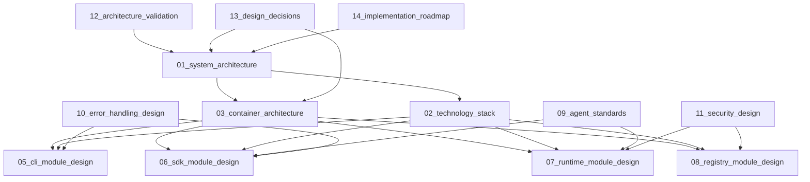

# Agent Hub Architecture Design Documentation

**Document Type**: Architecture Index  
**Author**: William  
**Date Created**: 2025-06-28  
**Last Updated**: 2025-06-28  
**Status**: Organized  
**Purpose**: Top-down architecture documentation for Agent Hub MVP  

## 📋 **Documentation Structure**

This directory contains the complete architecture design documentation for Agent Hub MVP, organized in a top-down approach from high-level system design to detailed module specifications.

## 🏗️ **Architecture Documentation Hierarchy**

### **Level 1: System Architecture**
High-level system design, business context, and strategic decisions.

- **[01_system_architecture.md](01_system_architecture.md)** - Complete system overview, business context, and architectural decisions
- **[02_technology_stack.md](02_technology_stack.md)** - Technology choices, rationale, and integration approach

### **Level 2: Container Architecture**  
Major system containers and their interactions.

- **[03_container_architecture.md](03_container_architecture.md)** - Container-level architecture and communication patterns
- **[04_data_architecture.md](04_data_architecture.md)** - Data flow, storage, and management design

### **Level 3: Module Design**
Detailed design for individual modules and components.

- **[05_cli_module_design.md](05_cli_module_design.md)** - Command-line interface module design
- **[06_sdk_module_design.md](06_sdk_module_design.md)** - Python SDK module design  
- **[07_runtime_module_design.md](07_runtime_module_design.md)** - Agent runtime and process management
- **[08_registry_module_design.md](08_registry_module_design.md)** - GitHub-based registry client design

### **Level 4: Supporting Documentation**
Standards, specifications, and cross-cutting concerns.

- **[09_agent_standards.md](09_agent_standards.md)** - Agent interface standards and specifications
- **[10_error_handling_design.md](10_error_handling_design.md)** - Error handling strategy and implementation
- **[11_security_design.md](11_security_design.md)** - Security architecture and considerations

### **Level 5: Analysis and Validation**
Design validation, trade-offs, and recommendations.

- **[12_architecture_validation.md](12_architecture_validation.md)** - Architecture validation against requirements
- **[13_design_decisions.md](13_design_decisions.md)** - Architecture Decision Records (ADRs)
- **[14_implementation_roadmap.md](14_implementation_roadmap.md)** - Implementation plan and timeline

## 🎯 **Quick Navigation**

### **For Business Stakeholders**
Start with:
1. [System Architecture](01_system_architecture.md) - Business context and value proposition
2. [Architecture Validation](12_architecture_validation.md) - Requirements validation
3. [Implementation Roadmap](14_implementation_roadmap.md) - Timeline and milestones

### **For Technical Architects**
Start with:
1. [System Architecture](01_system_architecture.md) - Overall system design
2. [Container Architecture](03_container_architecture.md) - System decomposition
3. [Design Decisions](13_design_decisions.md) - Technical trade-offs and rationale

### **For Developers**
Start with:
1. [Technology Stack](02_technology_stack.md) - Tools and frameworks
2. [Module Design Documents](05_cli_module_design.md) - Implementation details
3. [Agent Standards](09_agent_standards.md) - Development guidelines

### **For DevOps/Infrastructure**
Start with:
1. [Container Architecture](03_container_architecture.md) - Deployment architecture
2. [Data Architecture](04_data_architecture.md) - Storage and caching
3. [Security Design](11_security_design.md) - Security requirements

## 📊 **Architecture Summary**

### **System Overview**
Agent Hub is a CLI-based platform for discovering, installing, and managing AI agents with one-line integration. The architecture uses:

- **Process-based isolation** for agent execution
- **GitHub-based registry** for zero-maintenance operations
- **UV package manager** for fast dependency management
- **Local execution** for development speed and privacy

### **Key Design Principles**
1. **Simplicity First** - Use proven, simple technologies
2. **Developer Experience** - Optimize for fast iteration and ease of use
3. **Zero Maintenance** - Minimize operational overhead
4. **Extensibility** - Clear path for future enhancements

### **Success Metrics**
- **Agent installation**: < 10 seconds
- **Integration time**: < 5 minutes from discovery to usage
- **Developer adoption**: Low barrier to entry with templates
- **System reliability**: 99.9% uptime (leveraging GitHub infrastructure)

## 🔄 **Document Relationships**

## 🚀 **Getting Started**

1. **Read [System Architecture](01_system_architecture.md)** to understand the overall design
2. **Review [Design Decisions](13_design_decisions.md)** to understand key trade-offs
3. **Check [Implementation Roadmap](14_implementation_roadmap.md)** for development timeline
4. **Dive into module designs** based on your implementation focus

## 📝 **Document Standards**

Each document follows a consistent structure:
- **Document metadata** (type, author, status)
- **Business justification** for technical decisions
- **Interface definitions** and specifications
- **Implementation examples** and patterns
- **Trade-offs and alternatives** considered

## 🔍 **Cross-References**

- **Requirements Analysis**: See `docs/.requirement_analysis/` for business requirements
- **MVP Architecture**: See `docs/.architecture_design/mvp/` for MVP-specific implementation details
- **Implementation Design**: See `docs/.implementation_design/` for code-level specifications
- **Project Management**: See `docs/.project_management/` for development planning

This documentation provides the complete architectural foundation for implementing the Agent Hub MVP while maintaining clarity, consistency, and practical guidance for all stakeholders.
