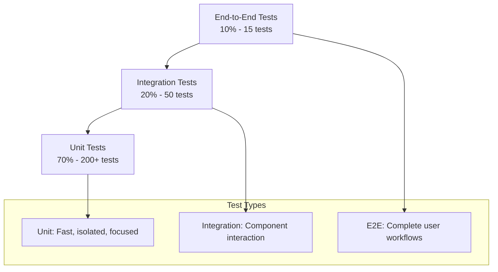

# Agent Hub MVP Testing Strategy

**Document Type**: MVP Testing Strategy
**Author**: William
**Date Created**: 2025-06-28
**Last Updated**: 2025-06-28
**Status**: Final
**Level**: L5 - MVP Testing Level
**Audience**: Development Team, QA Team, DevOps Team

## 🎯 **MVP Testing Overview**

Agent Hub MVP requires **comprehensive testing** to ensure the core value proposition of one-line agent integration works reliably. The testing strategy focuses on **validation of core functionality** while maintaining **fast development cycles** and **high quality standards**.

### **MVP Testing Goals**
- **Quality Assurance**: Ensure MVP meets all functional requirements
- **User Experience**: Validate intuitive CLI and SDK interfaces
- **Performance**: Meet MVP performance requirements
- **Reliability**: Achieve 99%+ success rate for core operations
- **Cross-Platform**: Ensure compatibility across Windows, macOS, and Linux

### **MVP Testing Success Criteria**
- ✅ **Code Coverage**: > 90% overall coverage
- ✅ **Test Pass Rate**: 100% for all test suites
- ✅ **Performance**: Meet all MVP performance requirements
- ✅ **Cross-Platform**: All tests pass on target platforms
- ✅ **User Experience**: Positive feedback from user testing

## 🧪 **Testing Pyramid Strategy**

### **Testing Distribution**


### **Testing Principles**
1. **Fast Feedback**: Unit tests run in < 1 second
2. **Reliable**: Tests are deterministic and repeatable
3. **Maintainable**: Tests are easy to understand and modify
4. **Comprehensive**: Cover all critical code paths
5. **User-Focused**: Validate real user workflows

## 🔧 **Testing Tools & Framework**

### **Primary Testing Stack**
```bash
# Core testing framework
pytest==7.4.0              # Test runner and framework
pytest-cov==4.1.0          # Coverage reporting
pytest-mock==3.11.1        # Mocking and patching
pytest-xdist==3.3.1        # Parallel test execution

# Code quality tools
black==23.7.0               # Code formatting
flake8==6.0.0               # Linting
mypy==1.5.1                 # Type checking
bandit==1.7.5               # Security linting

# Test utilities
factory-boy==3.3.0          # Test data factories
faker==19.3.1               # Fake data generation
responses==0.23.3           # HTTP mocking
freezegun==1.2.2            # Time mocking
```

### **Testing Configuration**
```ini
# pytest.ini
[tool:pytest]
testpaths = tests
python_files = test_*.py
python_classes = Test*
python_functions = test_*
addopts =
    --strict-markers
    --strict-config
    --verbose
    --tb=short
    --cov=agenthub
    --cov-report=term-missing
    --cov-report=html
    --cov-report=xml
markers =
    unit: Unit tests
    integration: Integration tests
    e2e: End-to-end tests
    slow: Slow running tests
    platform: Platform-specific tests
```

## 📋 **Test Categories & Coverage**

### **1. Unit Tests (70% - 200+ tests)**

#### **Core Runtime Tests**
```python
# tests/runtime/test_process_manager.py
import pytest
from agenthub.runtime.process_manager import ProcessManager

class TestProcessManager:
    def test_create_subprocess(self):
        """Test subprocess creation."""
        manager = ProcessManager()
        result = manager.execute_agent("test-agent", "test_method", {})
        assert result["status"] == "success"

    def test_subprocess_timeout(self):
        """Test subprocess timeout handling."""
        manager = ProcessManager()
        with pytest.raises(TimeoutError):
            manager.execute_agent("slow-agent", "slow_method", {}, timeout=1)

    def test_subprocess_error_handling(self):
        """Test subprocess error handling."""
        manager = ProcessManager()
        result = manager.execute_agent("error-agent", "error_method", {})
        assert result["status"] == "error"
        assert "error_message" in result
```

**Coverage Targets**:
- **Process Manager**: 95% coverage
- **Environment Manager**: 95% coverage
- **Agent Runtime**: 90% coverage

#### **Tool Management Tests**
```python
# tests/core/test_tool_infrastructure.py
import pytest
from pathlib import Path
from agenthub.core.tool_infrastructure import ToolInfrastructure

class TestToolInfrastructure:
    def test_agent_tools_discovery(self):
        """Test agent's built-in tools are discovered."""
        manager = ToolInfrastructure(agent_dir=Path("/tmp/test-agent"))
        available_tools = manager.list_available_tools()

        assert "agent_builtin" in available_tools
        assert "code_generator" in available_tools["agent_builtin"]
        assert "code_analyzer" in available_tools["agent_builtin"]

    def test_custom_tool_override(self):
        """Test custom tools can override agent's built-in tools."""
        manager = ToolInfrastructure(agent_dir=Path("/tmp/test-agent"))

        def custom_code_generator(prompt: str) -> str:
            """Custom code generation implementation."""
            return f"Custom code for '{prompt}'"

        # Custom tool should override agent's built-in tool
        manager.register_custom_tool("code_generator", custom_code_generator)
        tool_function = manager.get_tool("code_generator")

        result = tool_function("Create a function")
        assert "Custom code for 'Create a function'" in result

    def test_tool_priority_system(self):
        """Test tool priority: custom > agent's built-in."""
        manager = ToolInfrastructure(agent_dir=Path("/tmp/test-agent"))

        def custom_analyzer(code: str) -> dict:
            """Custom code analysis implementation."""
            return {"custom_complexity": len(code)}

        manager.register_custom_tool("code_analyzer", custom_analyzer)

        # Should get custom tool, not agent's built-in tool
        tool_function = manager.get_tool("code_analyzer")
        result = tool_function("def test(): pass")
        assert "custom_complexity" in result
        assert result["custom_complexity"] == 20
```

**Coverage Targets**:
- **Tool Infrastructure**: 95% coverage
- **Tool Priority**: 95% coverage
- **Custom Tool Override**: 90% coverage

#### **Tool Discovery Tests**
```python
# tests/core/test_tool_discovery.py
import pytest
from pathlib import Path
from agenthub.core.tool_discovery import ToolDiscovery

class TestToolDiscovery:
    def test_agent_manifest_parsing(self):
        """Test parsing agent manifest for tool declarations."""
        discovery = ToolDiscovery(agent_dir=Path("/tmp/test-agent"))
        tools = discovery.discover_agent_tools()

        assert "code_generator" in tools
        assert "code_analyzer" in tools
        assert tools["code_generator"]["description"] == "Generate code from natural language"

    def test_tool_metadata_extraction(self):
        """Test extraction of tool metadata and usage information."""
        discovery = ToolDiscovery(agent_dir=Path("/tmp/test-agent"))
        tool_info = discovery.get_tool_info("code_generator")

        assert "description" in tool_info
        assert "parameters" in tool_info
        assert "return_type" in tool_info

    def test_tool_validation(self):
        """Test tool safety and compatibility validation."""
        discovery = ToolDiscovery(agent_dir=Path("/tmp/test-agent"))
        is_valid = discovery.validate_tool("code_generator")

        assert is_valid == True

    def test_tool_conflict_detection(self):
        """Test detection of tool conflicts between agents."""
        discovery = ToolDiscovery(agent_dir=Path("/tmp/test-agent"))
        conflicts = discovery.check_tool_conflicts(["agent1", "agent2"])

        assert isinstance(conflicts, list)

**Coverage Targets**:
- **Tool Discovery**: 95% coverage
- **Tool Metadata**: 95% coverage
- **Tool Validation**: 90% coverage
- **Conflict Detection**: 90% coverage

#### **Tool Validation Tests**
```python
# tests/validation/test_tool_validator.py
import pytest
from agenthub.validation.tool_validator import ToolValidator, ValidationResult

class TestToolValidator:
    def test_security_validation(self):
        """Test security validation for dangerous code patterns."""
        validator = ToolValidator(security_level="medium")

        def dangerous_tool():
            eval("os.system('rm -rf /')")  # Dangerous operation

        result = validator.validate_tool("dangerous_tool", dangerous_tool)
        assert not result.is_valid()
        assert any("dangerous operations" in error.lower() for error in result.errors)

    def test_compatibility_validation(self):
        """Test tool compatibility validation."""
        validator = ToolValidator(security_level="medium")

        def complex_tool(a, b, c, d, e, f, g, h, i, j, k):  # Too many parameters
            return a + b + c + d + e + f + g + h + i + j + k

        result = validator.validate_tool("complex_tool", complex_tool)
        assert result.is_valid()  # Should pass but with warnings
        assert any("many parameters" in warning.lower() for warning in result.warnings)

    def test_performance_validation(self):
        """Test tool performance validation."""
        validator = ToolValidator(security_level="medium")

        def simple_tool():
            return "simple"

        result = validator.validate_tool("simple_tool", simple_tool)
        assert result.is_valid()
        assert len(result.warnings) == 0

    def test_security_levels(self):
        """Test different security level configurations."""
        # Test low security level
        low_validator = ToolValidator(security_level="low")
        assert low_validator.resource_limits["memory_mb"] == 100

        # Test high security level
        high_validator = ToolValidator(security_level="high")
        assert high_validator.resource_limits["memory_mb"] == 1000

**Coverage Targets**:
- **Security Validation**: 95% coverage
- **Compatibility Validation**: 90% coverage
- **Performance Validation**: 90% coverage
- **Security Levels**: 95% coverage
```

**Coverage Targets**:
- **RAG Tool**: 95% coverage
- **Metrics Tool**: 95% coverage
- **File Tool**: 90% coverage
- **HTTP Tool**: 90% coverage

#### **CLI Tests**
```python
# tests/cli/test_main.py
import pytest
from click.testing import CliRunner
from agenthub.cli.main import cli

class TestCLI:
    def test_install_command(self):
        """Test install command."""
        runner = CliRunner()
        result = runner.invoke(cli, ['install', 'meta/coding-agent'])
        assert result.exit_code == 0
        assert "Agent installed successfully" in result.output

    def test_list_command(self):
        """Test list command."""
        runner = CliRunner()
        result = runner.invoke(cli, ['list'])
        assert result.exit_code == 0
        assert "Available agents" in result.output

    def test_invalid_agent_path(self):
        """Test invalid agent path handling."""
        runner = CliRunner()
        result = runner.invoke(cli, ['install', 'invalid/path'])
        assert result.exit_code == 1
        assert "Invalid agent path" in result.output
```

**Coverage Targets**:
- **Command Parsing**: 95% coverage
- **Error Handling**: 90% coverage
- **Output Formatting**: 85% coverage

#### **SDK Tests**
```python
# tests/sdk/test_agent_wrapper.py
import pytest
from agenthub.sdk.agent_wrapper import AgentWrapper

class TestAgentWrapper:
    def test_agent_loading(self):
        """Test agent loading."""
        agent = AgentWrapper("meta/coding-agent")
        assert agent.name == "coding-agent"
        assert hasattr(agent, "generate_code")

    def test_method_dispatching(self):
        """Test method dispatching."""
        agent = AgentWrapper("meta/coding-agent")
        result = agent.generate_code("neural network")
        assert isinstance(result, str)
        assert "neural network" in result.lower()

    def test_invalid_method(self):
        """Test invalid method handling."""
        agent = AgentWrapper("meta/coding-agent")
        with pytest.raises(AttributeError):
            agent.invalid_method()
```

**Coverage Targets**:
- **Agent Loading**: 95% coverage
- **Method Dispatching**: 90% coverage
- **Error Handling**: 85% coverage

### **2. Integration Tests (20% - 50 tests)**

#### **Component Interaction Tests**
```python
# tests/integration/test_agent_workflow.py
import pytest
from agenthub.cli.main import cli
from agenthub.sdk import load_agent
from click.testing import CliRunner

class TestAgentWorkflow:
    def test_complete_agent_workflow(self):
        """Test complete agent installation and usage workflow."""
        runner = CliRunner()

        # Install agent
        result = runner.invoke(cli, ['install', 'meta/coding-agent'])
        assert result.exit_code == 0

        # Use agent via SDK
        agent = load_agent("meta/coding-agent")
        result = agent.generate_code("hello world")
        assert isinstance(result, str)
        assert len(result) > 0

    def test_registry_integration(self):
        """Test registry integration with CLI."""
        runner = CliRunner()
        result = runner.invoke(cli, ['list'])
        assert result.exit_code == 0
        assert "meta/coding-agent" in result.output

    def test_storage_integration(self):
        """Test storage integration with runtime."""
        # Test that installed agents are properly stored
        # Test that metadata is correctly saved
        # Test that virtual environments are created
        pass
```

**Coverage Targets**:
- **CLI-Runtime Integration**: 90% coverage
- **SDK-Runtime Integration**: 90% coverage
- **Registry-Storage Integration**: 85% coverage

### **3. End-to-End Tests (10% - 15 tests)**

#### **User Workflow Tests**
```python
# tests/e2e/test_user_experience.py
import pytest
import subprocess
import tempfile
import os

class TestUserExperience:
    def test_first_time_user_workflow(self):
        """Test complete first-time user experience."""
        with tempfile.TemporaryDirectory() as temp_dir:
            # Simulate fresh installation
            os.chdir(temp_dir)

            # Install Agent Hub
            result = subprocess.run([
                "pip", "install", "agenthub"
            ], capture_output=True, text=True)
            assert result.returncode == 0

            # Install first agent
            result = subprocess.run([
                "agenthub", "install", "meta/coding-agent"
            ], capture_output=True, text=True)
            assert result.returncode == 0

            # Use agent
            result = subprocess.run([
                "python", "-c",
                "import agenthub as amg; agent = amg.load('meta/coding-agent'); print(agent.generate_code('hello'))"
            ], capture_output=True, text=True)
            assert result.returncode == 0
            assert len(result.stdout.strip()) > 0

    def test_error_recovery_workflow(self):
        """Test user error recovery experience."""
        # Test invalid agent path
        # Test network failure recovery
        # Test dependency conflict resolution
        pass
```

**Coverage Targets**:
- **User Workflows**: 100% coverage of critical paths
- **Error Scenarios**: 90% coverage of error handling
- **Cross-Platform**: 100% coverage of platform compatibility

## 🚀 **Performance Testing**

### **Performance Requirements**
```python
# tests/performance/test_performance.py
import pytest
import time
from agenthub.sdk import load_agent

class TestPerformance:
    def test_agent_installation_performance(self):
        """Test agent installation meets performance requirements."""
        start_time = time.time()

        # Install agent
        agent = load_agent("meta/coding-agent")

        installation_time = time.time() - start_time
        assert installation_time < 10.0, f"Installation took {installation_time:.2f}s, expected < 10s"

    def test_agent_execution_performance(self):
        """Test agent execution meets performance requirements."""
        agent = load_agent("meta/coding-agent")

        start_time = time.time()
        result = agent.generate_code("simple function")
        execution_time = time.time() - start_time

        assert execution_time < 1.0, f"Execution took {execution_time:.2f}s, expected < 1s"
        assert isinstance(result, str)

    def test_memory_usage(self):
        """Test memory usage meets requirements."""
        import psutil
        import os

        process = psutil.Process(os.getpid())
        initial_memory = process.memory_info().rss / 1024 / 1024  # MB

        # Load and use agent
        agent = load_agent("meta/coding-agent")
        result = agent.generate_code("test")

        final_memory = process.memory_info().rss / 1024 / 1024  # MB
        memory_increase = final_memory - initial_memory

        assert memory_increase < 100, f"Memory increase: {memory_increase:.2f}MB, expected < 100MB"
```

### **Performance Benchmarks**
- **Agent Installation**: < 10 seconds
- **Agent Loading**: < 500ms
- **Method Execution**: < 1 second overhead
- **Memory Usage**: < 100MB increase
- **Startup Time**: < 2 seconds

## 🔒 **Security Testing**

### **Security Test Categories**
```python
# tests/security/test_security.py
import pytest
import os
import tempfile
from pathlib import Path

class TestSecurity:
    def test_process_isolation(self):
        """Test that agents run in isolated processes."""
        # Test that agents cannot access host environment
        # Test that agents cannot access host file system
        # Test that agents cannot access host network
        pass

    def test_input_validation(self):
        """Test input validation and sanitization."""
        # Test parameter validation
        # Test file path validation
        # Test manifest validation
        pass

    def test_dependency_isolation(self):
        """Test dependency isolation in virtual environments."""
        # Test that agent dependencies don't conflict
        # Test that system Python is not affected
        # Test that different agents can use different versions
        pass

    def test_file_access_control(self):
        """Test file access control and permissions."""
        # Test that agents can only access their directories
        # Test that agents cannot traverse outside their scope
        # Test that sensitive files are protected
        pass
```

### **Security Requirements**
- **Process Isolation**: Complete subprocess separation
- **File System Access**: Limited to agent directories
- **Environment Isolation**: No access to host environment
- **Input Validation**: All inputs validated and sanitized
- **Dependency Isolation**: Virtual environment separation

## 🌐 **Cross-Platform Testing**

### **Platform Coverage**
```python
# tests/platform/test_cross_platform.py
import pytest
import platform
import sys

class TestCrossPlatform:
    @pytest.mark.platform
    def test_windows_compatibility(self):
        """Test Windows compatibility."""
        if platform.system() == "Windows":
            # Test Windows-specific functionality
            # Test path handling
            # Test process management
            pass

    @pytest.mark.platform
    def test_macos_compatibility(self):
        """Test macOS compatibility."""
        if platform.system() == "Darwin":
            # Test macOS-specific functionality
            # Test path handling
            # Test process management
            pass

    @pytest.mark.platform
    def test_linux_compatibility(self):
        """Test Linux compatibility."""
        if platform.system() == "Linux":
            # Test Linux-specific functionality
            # Test path handling
            # Test process management
            pass
```

### **Platform-Specific Tests**
- **Windows**: Path handling, process management, virtual environments
- **macOS**: Path handling, process management, virtual environments
- **Linux**: Path handling, process management, virtual environments

## 🧹 **Test Data Management**

### **Test Data Strategy**
```python
# tests/conftest.py
import pytest
import tempfile
import shutil
from pathlib import Path

@pytest.fixture
def temp_agenthub_dir():
    """Create temporary Agent Hub directory for testing."""
    temp_dir = tempfile.mkdtemp()
    agenthub_dir = Path(temp_dir) / ".agenthub"
    agenthub_dir.mkdir()

    # Create standard directory structure
    (agenthub_dir / "agents").mkdir()
    (agenthub_dir / "cache").mkdir()
    (agenthub_dir / "config").mkdir()
    (agenthub_dir / "logs").mkdir()

    yield agenthub_dir

    # Cleanup
    shutil.rmtree(temp_dir)

@pytest.fixture
def sample_agent_manifest():
    """Sample agent manifest for testing."""
    return {
        "name": "test-agent",
        "version": "1.0.0",
        "description": "Test agent for testing",
        "author": "test",
        "license": "MIT",
        "interface": {
            "methods": {
                "test_method": {
                    "description": "Test method",
                    "parameters": {
                        "input": {"type": "string", "required": True}
                    },
                    "returns": {"type": "string", "description": "Test result"}
                }
            }
        },
        "dependencies": {
            "python": ">=3.12",
            "runtime": []
        }
    }

@pytest.fixture
def mock_github_registry():
    """Mock GitHub registry for testing."""
    return {
        "version": "1.0.0",
        "updated_at": "2025-06-28T10:00:00Z",
        "agents": {
            "test/test-agent": {
                "name": "test-agent",
                "version": "1.0.0",
                "author": "test",
                "description": "Test agent",
                "download_url": "https://example.com/test-agent.tar.gz"
            }
        }
    }
```

### **Test Data Cleanup**
- **Automatic Cleanup**: Fixtures handle cleanup automatically
- **Isolated Testing**: Each test uses isolated data
- **No Side Effects**: Tests don't affect system state
- **Reproducible**: Tests produce same results consistently

## 📊 **Test Execution & Reporting**

### **Test Execution Commands**
```bash
# Run all tests
pytest

# Run specific test categories
pytest -m unit              # Unit tests only
pytest -m integration       # Integration tests only
pytest -m e2e              # End-to-end tests only

# Run with coverage
pytest --cov=agenthub --cov-report=html

# Run in parallel
pytest -n auto

# Run specific test file
pytest tests/runtime/test_process_manager.py

# Run specific test function
pytest tests/runtime/test_process_manager.py::TestProcessManager::test_create_subprocess

# Run with verbose output
pytest -v

# Run with stop on first failure
pytest -x
```

### **Coverage Reporting**
```bash
# Generate coverage reports
pytest --cov=agenthub --cov-report=html --cov-report=xml --cov-report=term-missing

# Coverage targets
# Overall: > 90%
# Core runtime: > 95%
# CLI: > 90%
# SDK: > 90%
# Registry: > 85%
# Storage: > 85%
```

### **Test Results Dashboard**
```html
<!-- HTML coverage report -->
<!-- Generated in htmlcov/index.html -->
<!-- Shows line-by-line coverage -->
<!-- Identifies uncovered code -->
<!-- Provides coverage trends -->
```

## 🔄 **Continuous Integration Testing**

### **CI Pipeline Stages**
```yaml
# .github/workflows/test.yml
name: MVP Testing Pipeline

on: [push, pull_request]

jobs:
  test:
    runs-on: ${{ matrix.os }}
    strategy:
      matrix:
        os: [ubuntu-latest, windows-latest, macos-latest]
        python-version: [3.12]

    steps:
    - uses: actions/checkout@v3

    - name: Set up Python ${{ matrix.python-version }}
      uses: actions/setup-python@v4
      with:
        python-version: ${{ matrix.python-version }}

    - name: Install dependencies
      run: |
        python -m pip install --upgrade pip
        pip install -r requirements.txt
        pip install -r requirements-dev.txt

    - name: Run tests
      run: |
        pytest --cov=agenthub --cov-report=xml

    - name: Upload coverage
      uses: codecov/codecov-action@v3
      with:
        file: ./coverage.xml
```

### **CI Quality Gates**
- **Test Pass Rate**: 100% of tests must pass
- **Code Coverage**: > 90% overall coverage
- **Performance**: All performance tests must pass
- **Security**: All security tests must pass
- **Cross-Platform**: Tests must pass on all platforms

## 🎯 **Testing Priorities & Timeline**

### **Phase 1: Foundation Testing (Weeks 1-2)**
- **Unit Tests**: Core runtime components
- **Integration Tests**: Basic component interaction
- **Performance Tests**: Core performance requirements

### **Phase 2: CLI Testing (Week 3)**
- **Unit Tests**: CLI commands and utilities
- **Integration Tests**: CLI with runtime integration
- **User Experience Tests**: CLI usability and error handling

### **Phase 3: Registry Testing (Week 4)**
- **Unit Tests**: Registry client and caching
- **Integration Tests**: Registry with storage integration
- **Network Tests**: GitHub API integration and error handling

### **Phase 4: SDK Testing (Weeks 5-6)**
- **Unit Tests**: SDK components and method dispatching
- **Integration Tests**: Complete SDK workflow
- **End-to-End Tests**: Full user experience validation

## 🚨 **Testing Risks & Mitigation**

### **Testing Risks**
| Risk | Probability | Impact | Mitigation |
|------|-------------|---------|------------|
| Insufficient coverage | Medium | High | Automated coverage reporting |
| Slow test execution | Medium | Medium | Parallel execution, test optimization |
| Flaky tests | Low | Medium | Deterministic test design |
| Platform compatibility | Low | High | Multi-platform CI testing |

### **Risk Mitigation Strategies**
- **Coverage Monitoring**: Automated coverage reporting and alerts
- **Test Optimization**: Parallel execution and test isolation
- **Test Stability**: Deterministic test design and proper mocking
- **Platform Testing**: Comprehensive multi-platform CI pipeline

## 🎯 **MVP Testing Summary**

### **Testing Strategy Benefits**
- ✅ **Quality Assurance**: Comprehensive coverage of all functionality
- ✅ **Fast Feedback**: Unit tests provide immediate validation
- ✅ **User Validation**: End-to-end tests validate real workflows
- ✅ **Performance Validation**: Performance tests ensure requirements are met
- ✅ **Cross-Platform**: Multi-platform testing ensures compatibility

### **Key Testing Principles**
1. **Test-Driven Development**: Write tests before implementation
2. **Comprehensive Coverage**: > 90% code coverage target
3. **Fast Execution**: Unit tests run in < 1 second
4. **User-Focused**: Validate real user workflows
5. **Continuous Integration**: Automated testing on every change

### **Expected Testing Outcomes**
- **Quality**: Production-ready MVP with comprehensive testing
- **Reliability**: 99%+ success rate for core operations
- **Performance**: All performance requirements met
- **User Experience**: Positive feedback from user testing
- **Maintainability**: Well-tested, maintainable codebase

This testing strategy ensures that the Agent Hub MVP meets all quality, performance, and user experience requirements while providing a solid foundation for future development and enhancement.
