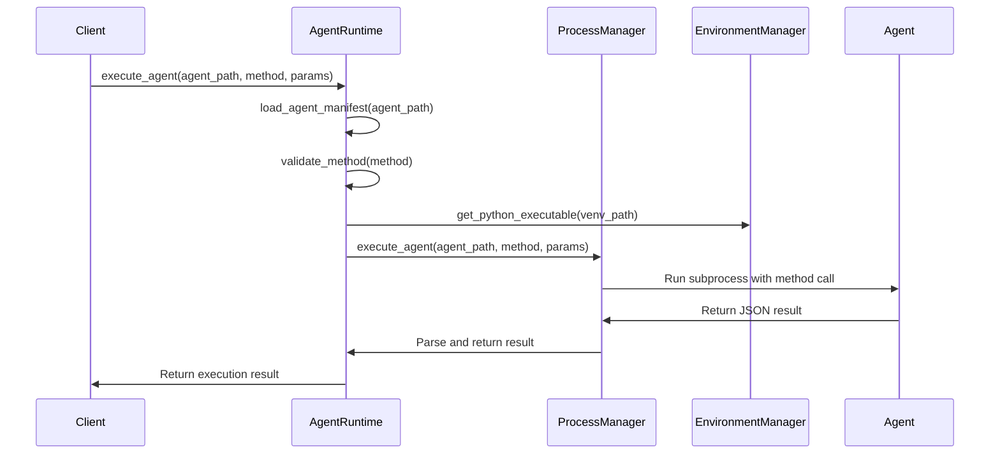
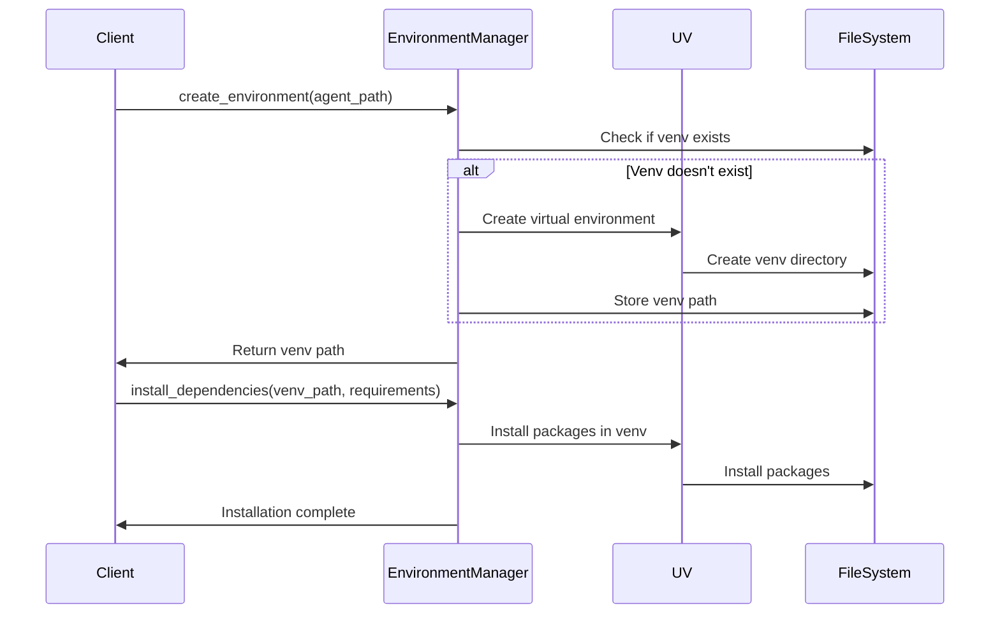

# Phase 1: Runtime Module - Interface Design

**Document Type**: Runtime Module Interface Design
**Phase**: 1 - Foundation
**Author**: William
**Date Created**: 2025-06-28
**Last Updated**: 2025-06-28
**Status**: Active
**Purpose**: Define public interfaces and APIs for the runtime module

## 🎯 **Interface Design Overview**

This document defines the **public interfaces** for the Runtime Module in Phase 1. These interfaces define how other modules interact with the runtime system to execute `agentplug` agents.

### **Design Principles**
- **Simple and Clear**: Easy to understand and use
- **Error Handling**: Graceful error handling with clear messages
- **Isolation**: Complete process and environment isolation
- **Performance**: Minimal overhead for agent execution

## 🏗️ **Module Interfaces**

### **1. Process Manager Interface**

#### **Class: ProcessManager**
```python
class ProcessManager:
    """Manages agent subprocess execution with isolation."""

    def __init__(self):
        """Initialize the process manager."""
        pass

    def execute_agent(self, agent_path: str, method: str, parameters: dict) -> dict:
        """
        Execute an agent method in an isolated subprocess.

        Args:
            agent_path: Path to the agent directory
            method: Name of the method to execute
            parameters: Dictionary of method parameters

        Returns:
            dict: Execution result with 'result' or 'error' key

        Raises:
            ValueError: If agent_path or method is invalid
            RuntimeError: If subprocess creation fails
        """
        pass

    def cleanup_processes(self):
        """Clean up any orphaned subprocesses."""
        pass

    def is_process_running(self, process_id: int) -> bool:
        """Check if a process is still running."""
        pass
```

#### **Usage Example**
```python
from agenthub.runtime.process_manager import ProcessManager

# Create process manager
pm = ProcessManager()

# Execute agent method
result = pm.execute_agent(
    agent_path="~/.agenthub/agents/agentplug/coding-agent",
    method="generate_code",
    parameters={"prompt": "Create a hello world function"}
)

if "result" in result:
    print(f"Generated code: {result['result']}")
else:
    print(f"Error: {result['error']}")

# Cleanup
pm.cleanup_processes()
```

### **2. Environment Manager Interface**

#### **Class: EnvironmentManager**
```python
class EnvironmentManager:
    """Manages isolated virtual environments for agents."""

    def __init__(self):
        """Initialize the environment manager."""
        pass

    def create_environment(self, agent_path: str) -> str:
        """
        Create a virtual environment for an agent.

        Args:
            agent_path: Path to the agent directory (e.g., "~/.agenthub/agents/agentplug/coding-agent")

        Returns:
            str: Path to the created virtual environment (e.g., "~/.agenthub/agents/agentplug/coding-agent/venv")

        Raises:
            RuntimeError: If environment creation fails
        """
        pass

    def install_dependencies(self, venv_path: str, requirements: list):
        """
        Install dependencies in a virtual environment.

        Args:
            venv_path: Path to the virtual environment
            requirements: List of package requirements

        Raises:
            RuntimeError: If dependency installation fails
        """
        pass

    def get_python_executable(self, venv_path: str) -> str:
        """
        Get the Python executable path for a virtual environment.

        Args:
            venv_path: Path to the virtual environment

        Returns:
            str: Path to the Python executable
        """
        pass

    def activate_environment(self, venv_path: str) -> dict:
        """
        Get environment variables for an activated virtual environment.

        Args:
            venv_path: Path to the virtual environment

        Returns:
            dict: Environment variables for the virtual environment
        """
        pass
```

#### **Usage Example**
```python
from agenthub.runtime.environment_manager import EnvironmentManager

# Create environment manager
em = EnvironmentManager()

# Create virtual environment
venv_path = em.create_environment("~/.agenthub/agents/agentplug/coding-agent")
# venv_path now contains: "~/.agenthub/agents/agentplug/coding-agent/venv"

# Install dependencies
em.install_dependencies(venv_path, ["requests>=2.31.0", "numpy>=1.24.0"])

# Get Python executable
python_path = em.get_python_executable(venv_path)
# python_path now contains: "~/.agenthub/agents/agentplug/coding-agent/venv/bin/python"

# Get environment variables
env_vars = em.activate_environment(venv_path)
```

### **3. Agent Runtime Interface**

#### **Class: AgentRuntime**
```python
class AgentRuntime:
    """Coordinates agent execution and provides unified interface."""

    def __init__(self):
        """Initialize the agent runtime."""
        self.process_manager = ProcessManager()
        self.environment_manager = EnvironmentManager()

    def load_agent_manifest(self, agent_path: str) -> dict:
        """
        Load and parse an agent manifest.

        Args:
            agent_path: Path to the agent directory

        Returns:
            dict: Parsed agent manifest

        Raises:
            ValueError: If manifest is invalid or missing
            FileNotFoundError: If agent directory doesn't exist
        """
        pass

    def execute_agent(self, agent_path: str, method: str, parameters: dict) -> dict:
        """
        Execute an agent method with full runtime coordination.

        Args:
            agent_path: Path to the agent directory
            method: Name of the method to execute
            parameters: Dictionary of method parameters

        Returns:
            dict: Execution result with 'result' or 'error' key

        Raises:
            ValueError: If method doesn't exist in agent interface
            RuntimeError: If execution fails
        """
        pass

    def validate_method(self, agent_path: str, method: str) -> bool:
        """
        Validate that a method exists in an agent's interface.

        Args:
            agent_path: Path to the agent directory
            method: Name of the method to validate

        Returns:
            bool: True if method exists and is valid
        """
        pass

    def get_agent_info(self, agent_path: str) -> dict:
        """
        Get information about an agent.

        Args:
            agent_path: Path to the agent directory

        Returns:
            dict: Agent information including interface and metadata
        """
        pass
```

#### **Usage Example**
```python
from agenthub.runtime.agent_runtime import AgentRuntime

# Create agent runtime
ar = AgentRuntime()

# Load agent manifest
manifest = ar.load_agent_manifest("~/.agenthub/agents/agentplug/coding-agent")

# Validate method
if ar.validate_method("~/.agenthub/agents/agentplug/coding-agent", "generate_code"):
    # Execute agent method
    result = ar.execute_agent(
        agent_path="~/.agenthub/agents/agentplug/coding-agent",
        method="generate_code",
        parameters={"prompt": "Create a neural network class"}
    )

    if "result" in result:
        print(f"Generated code: {result['result']}")
    else:
        print(f"Execution error: {result['error']}")

# Get agent info
info = ar.get_agent_info("~/.agenthub/agents/agentplug/coding-agent")
print(f"Agent: {info['name']}, Version: {info['version']}")
```

## 🔄 **Data Flow Interfaces**

### **1. Agent Execution Flow**


### **2. Environment Setup Flow**


## 🚨 **Error Handling Interfaces**

### **1. Error Types**
```python
class AgentRuntimeError(Exception):
    """Base exception for agent runtime errors."""
    pass

class AgentNotFoundError(AgentRuntimeError):
    """Raised when agent directory doesn't exist."""
    pass

class InvalidManifestError(AgentRuntimeError):
    """Raised when agent manifest is invalid."""
    pass

class MethodNotFoundError(AgentRuntimeError):
    """Raised when method doesn't exist in agent interface."""
    pass

class ExecutionError(AgentRuntimeError):
    """Raised when agent execution fails."""
    pass

class EnvironmentError(AgentRuntimeError):
    """Raised when environment setup fails."""
    pass
```

### **2. Error Response Format**
```python
# Success Response
{
    "result": "Generated Python code...",
    "execution_time": 0.5,
    "memory_usage": "50MB"
}

# Error Response
{
    "error": "Method 'nonexistent_method' not found",
    "error_type": "MethodNotFoundError",
    "suggestion": "Available methods: generate_code, explain_code",
    "execution_time": 0.1
}
```

## 🔧 **Configuration Interfaces**

### **1. Runtime Configuration**
```python
class RuntimeConfig:
    """Configuration for the runtime module."""

    def __init__(self):
        self.max_execution_time = 30  # seconds
        self.max_memory_usage = 1024  # MB
        self.subprocess_timeout = 5   # seconds
        self.cleanup_interval = 60    # seconds
        self.log_level = "INFO"
        self.use_uv = True  # Fallback to pip if False
```

### **2. Environment Configuration**
```python
class EnvironmentConfig:
    """Configuration for environment management."""

    def __init__(self):
        self.python_version = "3.12"
        self.venv_location = "venv"
        self.dependency_cache = True
        self.auto_cleanup = True
        self.max_venv_size = 500  # MB
```

## 🧪 **Testing Interfaces**

### **1. Mock Interfaces for Testing**
```python
class MockProcessManager(ProcessManager):
    """Mock process manager for testing."""

    def execute_agent(self, agent_path: str, method: str, parameters: dict) -> dict:
        """Mock agent execution for testing."""
        return {"result": f"Mock result for {method} with {parameters}"}

class MockEnvironmentManager(EnvironmentManager):
    """Mock environment manager for testing."""

    def create_environment(self, agent_path: str) -> str:
        """Mock environment creation for testing."""
        return f"/tmp/mock_venv_{hash(agent_path)}"
```

### **2. Testing Utilities**
```python
def create_test_agent(agent_path: str, manifest: dict, agent_code: str):
    """Create a test agent for testing."""
    pass

def cleanup_test_agent(agent_path: str):
    """Clean up a test agent."""
    pass

def validate_runtime_interface(runtime: AgentRuntime):
    """Validate that runtime implements required interface."""
    pass
```

## 🎯 **Interface Success Criteria**

### **Functionality Success**
- ✅ All public methods are callable and return expected types
- ✅ Error handling provides clear, actionable messages
- ✅ Process isolation works correctly
- ✅ Environment management works correctly

### **Integration Success**
- ✅ CLI module can use runtime interfaces
- ✅ Core module can use runtime interfaces
- ✅ Storage module can coordinate with runtime
- ✅ Error handling integrates with calling modules

### **Performance Success**
- ✅ Subprocess creation overhead < 100ms
- ✅ Virtual environment creation < 5 seconds
- ✅ Agent execution overhead < 500ms
- ✅ Memory usage < 100MB for runtime

### **User Experience Success**
- ✅ Clear error messages for common failures
- ✅ Helpful suggestions for error resolution
- ✅ Consistent interface behavior
- ✅ Easy to understand and use

## 🔄 **Interface Evolution**

### **Phase 1 (Current)**
- Basic subprocess execution interface
- Simple environment management interface
- Basic error handling interface
- JSON-based communication

### **Phase 2 (Future)**
- Enhanced with installation support
- Better dependency management interface
- Improved error handling interface
- Registry integration interface

### **Phase 3 (Future)**
- Enhanced with method dispatching
- Better performance monitoring interface
- Advanced error recovery interface
- SDK integration interface

### **Phase 4 (Future)**
- Performance optimization interface
- Advanced monitoring interface
- Production-ready error handling interface
- User experience enhancement interface

These interfaces provide the **foundation** for agent execution in Phase 1 and enable **progressive enhancement** through subsequent phases.
