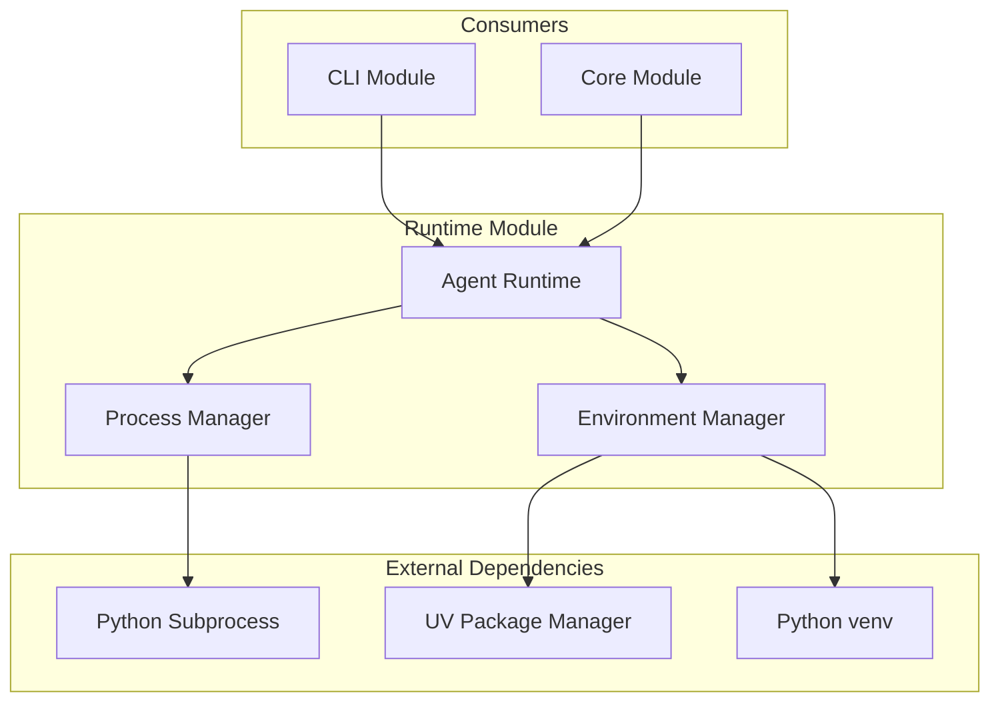

# Phase 1: Runtime Module

**Document Type**: Runtime Module Overview  
**Phase**: 1 - Foundation  
**Author**: William  
**Date Created**: 2025-06-28  
**Last Updated**: 2025-06-28  
**Status**: Active  
**Purpose**: Core runtime system for executing agentplug agents in isolated environments  

## 🎯 **Runtime Module Overview**

The Runtime Module is the **core execution engine** for Phase 1. It provides process isolation, environment management, and agent execution capabilities that enable the MVP to run pre-created `agentplug` agents.

### **Module Purpose**
- **Process Isolation**: Execute agents in separate subprocesses
- **Environment Management**: Create and manage isolated virtual environments
- **Agent Execution**: Coordinate agent method calls and result handling
- **Error Management**: Handle execution errors and timeouts

### **Phase 1 Scope**
- Basic subprocess execution with JSON IPC
- Virtual environment creation using UV
- Simple agent manifest parsing
- Basic error handling and timeouts

## 🏗️ **Module Architecture**

## 📋 **Module Components**

### **1. Process Manager**
- **Purpose**: Execute agents in isolated subprocesses
- **Responsibilities**: Process creation, monitoring, cleanup, IPC
- **Technology**: Python subprocess module with JSON communication

### **2. Environment Manager**
- **Purpose**: Create and manage isolated virtual environments
- **Responsibilities**: Venv creation, dependency installation, Python path management
- **Technology**: UV package manager with fallback to pip

### **3. Agent Runtime**
- **Purpose**: Coordinate agent execution and provide unified interface
- **Responsibilities**: Manifest loading, method validation, execution coordination
- **Technology**: YAML parsing, method dispatching, error handling

## 🔗 **Module Dependencies**

### **External Dependencies**
- **UV Package Manager**: For fast virtual environment creation
- **Python 3.12+**: For subprocess and venv support
- **PyYAML**: For agent manifest parsing

### **Internal Dependencies**
- **Storage Module**: For agent file access and metadata
- **Core Module**: For agent loading and interface management

## 📁 **Documentation Structure**

### **Core Documents**
- **[README.md](README.md)** - This overview (you are here)
- **[01_interface_design.md](01_interface_design.md)** - Public interfaces and APIs
- **[02_implementation_details.md](02_implementation_details.md)** - Internal implementation
- **[03_testing_strategy.md](03_testing_strategy.md)** - Testing approach and examples
- **[04_success_criteria.md](04_success_criteria.md)** - Success metrics and validation

## 🚀 **Getting Started**

### **For Developers**
1. **Read Interface Design**: Understand how to use the runtime module
2. **Review Implementation**: See how the module works internally
3. **Follow Testing Strategy**: Use provided tests to validate functionality
4. **Check Success Criteria**: Ensure your implementation meets requirements

### **For Integration**
1. **Understand Dependencies**: Know what the runtime module needs
2. **Review Interfaces**: See how to interact with the runtime
3. **Plan Testing**: Use the testing strategy for validation
4. **Validate Success**: Ensure integration meets success criteria

## 🎯 **Phase 1 Success Criteria**

### **Process Manager Success**
- ✅ Can create isolated subprocesses for agents
- ✅ Can communicate with agents via JSON IPC
- ✅ Can handle process timeouts and errors
- ✅ Can clean up orphaned processes

### **Environment Manager Success**
- ✅ Can create virtual environments using UV
- ✅ Can install agent dependencies in isolated environments
- ✅ Can handle dependency conflicts gracefully
- ✅ Can fallback to pip if UV unavailable

### **Agent Runtime Success**
- ✅ Can load and parse agent manifests
- ✅ Can validate agent methods before execution
- ✅ Can coordinate execution between components
- ✅ Can handle execution errors gracefully

### **Integration Success**
- ✅ Can execute `agentplug/coding-agent` successfully
- ✅ Can execute `agentplug/analysis-agent` successfully
- ✅ Can handle agent execution errors gracefully
- ✅ Can manage multiple concurrent agent executions

## 🔄 **Module Evolution**

### **Phase 1 (Current)**
- Basic subprocess execution
- Simple virtual environment management
- Basic error handling
- JSON-based IPC

### **Phase 2 (Future)**
- Enhanced with installation support
- Better dependency management
- Improved error handling

### **Phase 3 (Future)**
- Enhanced with method dispatching
- Better performance monitoring
- Advanced error recovery

### **Phase 4 (Future)**
- Performance optimization
- Advanced monitoring
- Production-ready error handling

## 🧪 **Testing Strategy**

### **Unit Testing**
- Test each component individually
- Mock external dependencies
- Validate error conditions
- Test edge cases

### **Integration Testing**
- Test components working together
- Test with real agentplug agents
- Validate complete execution flow
- Test error scenarios

### **Performance Testing**
- Validate subprocess overhead
- Test virtual environment creation time
- Measure memory usage
- Test concurrent execution

## 📊 **Progress Tracking**

### **Current Status**: 🚧 In Progress
- [ ] Process Manager implementation
- [ ] Environment Manager implementation
- [ ] Agent Runtime implementation
- [ ] Module integration testing
- [ ] Phase 1 validation

### **Next Steps**
1. **Complete Process Manager**: Implement subprocess execution
2. **Complete Environment Manager**: Implement venv management
3. **Complete Agent Runtime**: Implement execution coordination
4. **Integration Testing**: Test with real agentplug agents
5. **Phase 1 Validation**: Ensure all success criteria met

The Runtime Module is the **foundation** for the entire MVP. Success here enables all subsequent phases and ensures reliable agent execution throughout the system.
