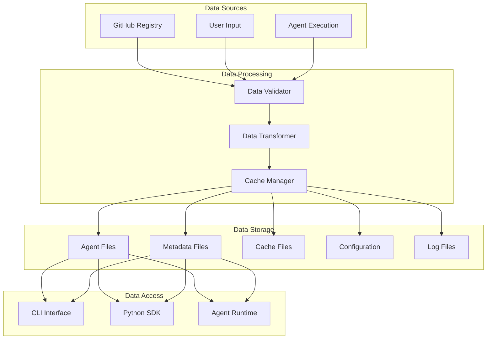
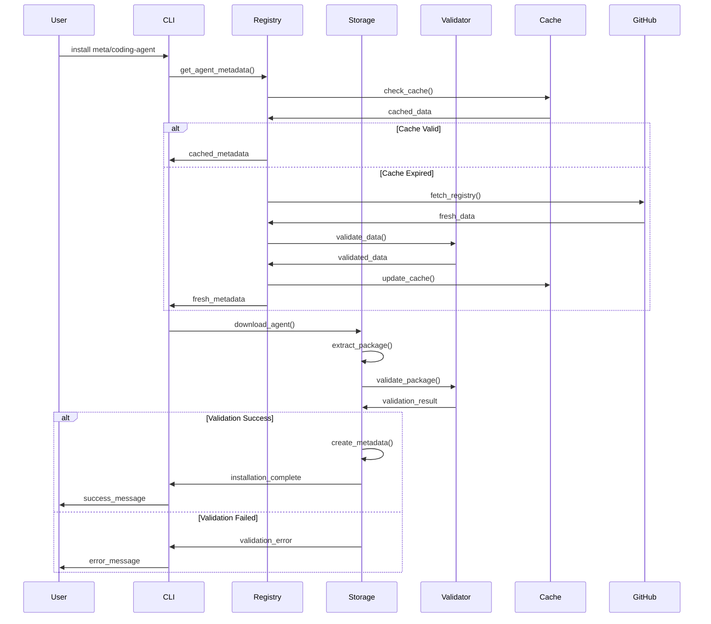
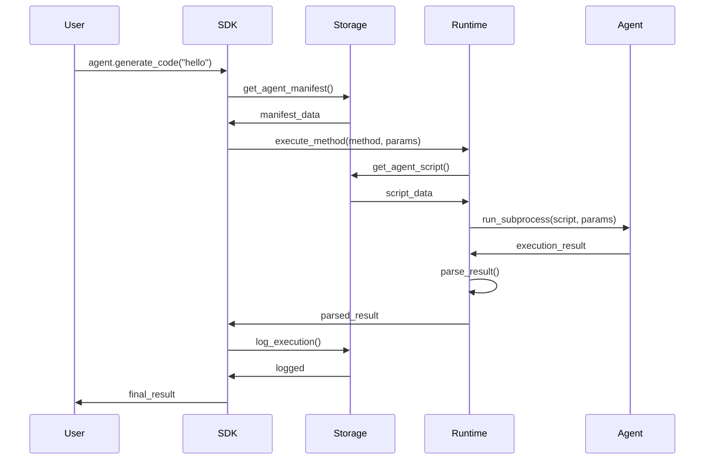

# Agent Hub MVP Data Architecture

**Document Type**: MVP Data Architecture
**Author**: William
**Date Created**: 2025-06-28
**Last Updated**: 2025-06-28
**Status**: Final
**Level**: L2 - MVP Data Level
**Audience**: Technical Architects, Developers, Data Engineers

## 🎯 **MVP Data Architecture Overview**

Agent Hub MVP uses a **simple, file-based data architecture** optimized for local execution and minimal complexity. The MVP focuses on **efficient data storage** and **fast access** without external database dependencies.

### **MVP Data Principles**
1. **Local Storage**: All data stored on user's machine
2. **File-Based**: Simple, reliable file system storage
3. **Structured Data**: Consistent data formats (YAML, JSON)
4. **Fast Access**: Optimized for local read/write operations
5. **MVP Focus**: Only essential data structures for core functionality

## 🏗️ **MVP Data Architecture Overview**



## 📁 **Data Storage Structure**

### **Local File System Organization**
```
~/.agenthub/
├── agents/                          # Installed agents
│   ├── meta/
│   │   └── coding-agent/
│   │       ├── agent.yaml           # Agent manifest
│   │       ├── agent.py             # Main agent script
│   │       ├── venv/                # Virtual environment
│   │       ├── .metadata.json       # Installation metadata
│   │       └── requirements.txt     # Dependencies (optional)
│   └── other-org/
│       └── another-agent/
│           ├── agent.yaml
│           ├── agent.py
│           ├── venv/
│           └── .metadata.json
├── cache/                           # Cached data
│   ├── registry.json               # Registry cache
│   ├── cache_metadata.json         # Cache metadata
│   └── packages/                   # Downloaded packages
│       ├── meta-coding-agent-v1.0.0.tar.gz
│       └── other-org-another-agent-v2.0.0.tar.gz
├── config/                          # Configuration
│   ├── settings.yaml               # User settings
│   └── templates/                  # Configuration templates
├── logs/                            # Execution logs
│   ├── install.log                 # Installation logs
│   ├── execution.log               # Execution logs
│   └── error.log                   # Error logs
└── temp/                            # Temporary files
    ├── downloads/                   # Download cache
    └── builds/                      # Build artifacts
```

### **Data Directory Permissions**
```bash
# Directory permissions for security
chmod 755 ~/.agenthub              # Base directory
chmod 755 ~/.agenthub/agents       # Agents directory
chmod 755 ~/.agenthub/cache        # Cache directory
chmod 700 ~/.agenthub/config       # Config directory (private)
chmod 755 ~/.agenthub/logs         # Logs directory
chmod 777 ~/.agenthub/temp         # Temp directory (writable)

# Agent-specific permissions
chmod 755 ~/.agenthub/agents/*     # Agent directories
chmod 644 ~/.agenthub/agents/*/agent.yaml  # Agent manifests
chmod 755 ~/.agenthub/agents/*/agent.py    # Agent scripts
chmod 700 ~/.agenthub/agents/*/venv        # Virtual environments
```

## 📊 **Data Formats & Schemas**

### **1. Agent Manifest (agent.yaml)**

#### **Schema Definition**
```yaml
# agent.yaml - Agent manifest schema
name: string                    # Required: Agent name
version: string                 # Required: Semantic version
description: string             # Required: Agent description
author: string                  # Required: Author name
license: string                 # Required: License type

interface:                      # Required: Agent interface
  methods:                      # Required: Available methods
    method_name:                # Method identifier
      description: string       # Method description
      parameters:               # Method parameters
        param_name:             # Parameter identifier
          type: string          # Parameter type
          required: boolean     # Required flag
          default: any          # Default value (optional)
          description: string   # Parameter description (optional)
      returns:                  # Return value
        type: string            # Return type
        description: string     # Return description

dependencies:                   # Optional: Dependencies
  python: string               # Python version requirement
  runtime: [string]            # Runtime dependencies
  system: [string]             # System dependencies (optional)

tags: [string]                 # Optional: Search tags
categories: [string]           # Optional: Categories
homepage: string               # Optional: Homepage URL
repository: string             # Optional: Repository URL
```

#### **Example Manifest**
```yaml
# meta/coding-agent/agent.yaml
name: "coding-agent"
version: "1.0.0"
description: "AI coding assistant for Python development"
author: "meta"
license: "MIT"

interface:
  methods:
    generate_code:
      description: "Generate Python code from description"
      parameters:
        prompt:
          type: "string"
          required: true
          description: "Code generation prompt"
        style:
          type: "string"
          required: false
          default: "clean"
          description: "Code style preference"
        language:
          type: "string"
          required: false
          default: "python"
          description: "Programming language"
      returns:
        type: "string"
        description: "Generated code"

    explain_code:
      description: "Explain existing code"
      parameters:
        code:
          type: "string"
          required: true
          description: "Code to explain"
      returns:
        type: "string"
        description: "Code explanation"

dependencies:
  python: ">=3.12"
  runtime: ["openai>=1.0.0", "tiktoken>=0.5.0"]

tags: ["coding", "ai", "python", "development"]
categories: ["development", "productivity"]
```

### **2. Installation Metadata (.metadata.json)**

#### **Schema Definition**
```json
{
  "agent_path": "string",           // Required: Agent identifier
  "version": "string",              // Required: Installed version
  "installed_at": "string",         // Required: ISO timestamp
  "install_path": "string",         // Required: Installation path
  "venv_path": "string",            // Required: Virtual environment path
  "status": "string",               // Required: Installation status
  "dependencies_installed": "boolean", // Required: Dependencies status
  "last_used": "string",            // Optional: Last usage timestamp
  "usage_count": "integer",         // Optional: Usage counter
  "install_size_mb": "number",      // Optional: Installation size
  "checksum": "string",             // Optional: Package checksum
  "source_url": "string",           // Optional: Source URL
  "installer_version": "string"     // Optional: Installer version
}
```

#### **Example Metadata**
```json
{
  "agent_path": "meta/coding-agent",
  "version": "1.0.0",
  "installed_at": "2025-06-28T10:30:00Z",
  "install_path": "/Users/user/.agenthub/agents/meta/coding-agent",
  "venv_path": "/Users/user/.agenthub/agents/meta/coding-agent/venv",
  "status": "installed",
  "dependencies_installed": true,
  "last_used": "2025-06-28T11:00:00Z",
  "usage_count": 15,
  "install_size_mb": 125.5,
  "checksum": "sha256:abc123...",
  "source_url": "https://github.com/meta/coding-agent/archive/v1.0.0.tar.gz",
  "installer_version": "1.0.0"
}
```

### **3. Registry Cache (registry.json)**

#### **Schema Definition**
```json
{
  "version": "string",              // Required: Registry version
  "updated_at": "string",           // Required: Last update timestamp
  "cached_at": "string",            // Required: Cache timestamp
  "expires_at": "string",           // Required: Cache expiration
  "total_agents": "integer",        // Required: Total agent count
  "agents": {                       // Required: Agent collection
    "agent_path": {                 // Agent identifier
      "name": "string",             // Required: Agent name
      "version": "string",          // Required: Agent version
      "author": "string",           // Required: Author name
      "description": "string",      // Required: Description
      "download_url": "string",     // Required: Download URL
      "checksum": "string",         // Optional: Package checksum
      "size_mb": "number",          // Optional: Package size
      "tags": ["string"],           // Optional: Tags
      "categories": ["string"],     // Optional: Categories
      "last_updated": "string",     // Optional: Last update
      "downloads": "integer"        // Optional: Download count
    }
  }
}
```

#### **Example Registry**
```json
{
  "version": "1.0.0",
  "updated_at": "2025-06-28T10:00:00Z",
  "cached_at": "2025-06-28T10:00:00Z",
  "expires_at": "2025-06-28T11:00:00Z",
  "total_agents": 25,
  "agents": {
    "meta/coding-agent": {
      "name": "coding-agent",
      "version": "1.0.0",
      "author": "meta",
      "description": "AI coding assistant for Python development",
      "download_url": "https://github.com/meta/coding-agent/archive/v1.0.0.tar.gz",
      "checksum": "sha256:abc123...",
      "size_mb": 125.5,
      "tags": ["coding", "ai", "python"],
      "categories": ["development", "productivity"],
      "last_updated": "2025-06-28T09:00:00Z",
      "downloads": 150
    },
    "ai/chat-agent": {
      "name": "chat-agent",
      "version": "2.1.0",
      "author": "ai",
      "description": "Conversational AI agent",
      "download_url": "https://github.com/ai/chat-agent/archive/v2.1.0.tar.gz",
      "checksum": "sha256:def456...",
      "size_mb": 89.2,
      "tags": ["chat", "ai", "conversation"],
      "categories": ["communication", "productivity"],
      "last_updated": "2025-06-27T15:00:00Z",
      "downloads": 89
    }
  }
}
```

### **4. Configuration (settings.yaml)**

#### **Schema Definition**
```yaml
# settings.yaml - Configuration schema
registry:
  github_token: string              # Optional: GitHub token
  cache_ttl: integer               # Required: Cache TTL in seconds
  max_retries: integer             # Required: Maximum retries
  user_agent: string               # Required: User agent string

storage:
  base_path: string                 # Required: Base storage path
  max_cache_size: string            # Required: Maximum cache size
  cleanup_interval: integer         # Required: Cleanup interval
  backup_enabled: boolean           # Required: Backup flag

logging:
  level: string                     # Required: Log level
  file: string                      # Required: Log file path
  max_size: string                  # Required: Maximum log size
  backup_count: integer             # Required: Backup count

performance:
  max_concurrent_agents: integer    # Required: Concurrent limit
  timeout: integer                  # Required: Default timeout
  memory_limit: string              # Required: Memory limit
  cpu_limit: integer                # Required: CPU limit

security:
  process_isolation: boolean        # Required: Process isolation
  file_access_control: boolean      # Required: File access control
  dependency_isolation: boolean     # Required: Dependency isolation
  max_file_size: string             # Required: Maximum file size
```

#### **Example Configuration**
```yaml
# ~/.agenthub/config/settings.yaml
registry:
  github_token: ""                  # Set your GitHub token here
  cache_ttl: 3600                  # 1 hour cache TTL
  max_retries: 3                   # Maximum 3 retries
  user_agent: "Agent-Hub/1.0.0"    # User agent string

storage:
  base_path: "~/.agenthub"         # Base storage path
  max_cache_size: "500MB"          # Maximum cache size
  cleanup_interval: 86400          # 24 hour cleanup
  backup_enabled: true             # Enable backups

logging:
  level: "INFO"                     # Log level
  file: "~/.agenthub/logs/agenthub.log"  # Log file
  max_size: "10MB"                 # Maximum log size
  backup_count: 5                  # Number of backups

performance:
  max_concurrent_agents: 5         # Maximum 5 concurrent
  timeout: 300                     # 5 minute timeout
  memory_limit: "1GB"              # 1GB memory limit
  cpu_limit: 100                   # 100% CPU limit

security:
  process_isolation: true           # Enable process isolation
  file_access_control: true        # Enable file access control
  dependency_isolation: true       # Enable dependency isolation
  max_file_size: "100MB"           # Maximum file size
```

## 🔄 **Data Flow & Processing**

### **1. Agent Installation Data Flow**



### **2. Agent Execution Data Flow**



### **3. Registry Update Data Flow**

```mermaid
sequenceDiagram
    participant CLI
    participant Registry
    participant GitHub
    participant Validator
    participant Cache

    CLI->>Registry: refresh_registry()
    Registry->>GitHub: GET registry.json
    GitHub->>Registry: registry_data

    Registry->>Validator: validate_registry()
    Validator->>Registry: validation_result

    alt Validation Success
        Registry->>Cache: update_cache()
        Cache->>Registry: cache_updated
        Registry->>CLI: refresh_success
    else Validation Failed

### **4. Dual Tool Source Data Flow**

```mermaid
sequenceDiagram
    participant User
    participant SDK
    participant ToolSupport
    participant Validator
    participant Storage
    participant Runtime

    User->>SDK: load("agent", custom_tools={...})
    SDK->>ToolSupport: discover_agent_tools(agent_path)

    ToolSupport->>Storage: get_agent_manifest(agent_path)
    Storage->>ToolSupport: agent_manifest

    alt Custom Tools Provided
        SDK->>ToolSupport: inject_custom_tools(agent_path, custom_tools)
        ToolSupport->>ToolSupport: validate_custom_tools()
        ToolSupport->>Storage: store_custom_tool_metadata()
        Storage->>ToolSupport: custom_tools_registered
    end

    ToolSupport->>Validator: validate_agent_tools(agent_path, all_tools)
    Validator->>Validator: validate_tool_access_and_safety()

    alt Validation Failed
        Validator->>ToolSupport: validation_errors
        ToolSupport->>SDK: tool_validation_failed
        SDK->>User: tool_validation_failed
    else Validation Passed
        Validator->>ToolSupport: validation_passed
        ToolSupport->>Storage: register_agent_tools(agent_path, all_tools)
        Storage->>ToolSupport: tools_registered
    end

    ToolSupport->>SDK: agent_tools_ready
    SDK->>User: agent_with_builtin_and_custom_tools

    Note over User,SDK: Agent built-in tools + user custom tools ready for use

    User->>SDK: agent.execute_method("analyze", data)
    SDK->>Runtime: execute_agent(method, params)
    Runtime->>Agent: run_with_tool_access()
    Agent->>Runtime: result_using_its_tools
    Runtime->>SDK: parsed_result
    SDK->>User: result generated by agent
```
        Registry->>CLI: validation_error
    end
```

## 🔒 **Data Security & Validation**

### **1. Input Validation**

#### **Agent Manifest Validation**
```python
# agenthub/validation/manifest_validator.py
from pydantic import BaseModel, Field, validator
from typing import List, Optional, Dict, Any

class MethodParameter(BaseModel):
    type: str = Field(..., description="Parameter type")
    required: bool = Field(..., description="Required flag")
    default: Optional[Any] = Field(None, description="Default value")
    description: Optional[str] = Field(None, description="Parameter description")

class MethodDefinition(BaseModel):
    description: str = Field(..., min_length=10, max_length=1000)
    parameters: Dict[str, MethodParameter] = Field(..., description="Method parameters")
    returns: Dict[str, str] = Field(..., description="Return value definition")

class AgentManifest(BaseModel):
    name: str = Field(..., min_length=1, max_length=100, regex=r'^[a-zA-Z0-9_-]+$')
    version: str = Field(..., regex=r'^\d+\.\d+\.\d+$')
    description: str = Field(..., min_length=10, max_length=1000)
    author: str = Field(..., min_length=1, max_length=100)
    license: str = Field(..., min_length=1, max_length=50)

    interface: Dict[str, MethodDefinition] = Field(..., description="Agent interface")
    dependencies: Optional[Dict[str, Any]] = Field(None, description="Dependencies")
    tags: Optional[List[str]] = Field(default_factory=list, max_items=20)

    @validator('name')
    def validate_name(cls, v):
        if not v.replace('-', '').replace('_', '').isalnum():
            raise ValueError('Name must contain only alphanumeric characters, hyphens, and underscores')
        return v

    @validator('version')
    def validate_version(cls, v):
        parts = v.split('.')
        if len(parts) != 3:
            raise ValueError('Version must be in format X.Y.Z')
        try:
            [int(x) for x in parts]
        except ValueError:
            raise ValueError('Version parts must be integers')
        return v
```

#### **Parameter Validation**
```python
# agenthub/validation/parameter_validator.py
from typing import Any, Dict, List
import json

class ParameterValidator:
    def __init__(self):
        self.type_validators = {
            'string': self._validate_string,
            'integer': self._validate_integer,
            'number': self._validate_number,
            'boolean': self._validate_boolean,
            'array': self._validate_array,
            'object': self._validate_object
        }

    def validate_parameters(self, method_params: Dict[str, Any],
                          provided_params: Dict[str, Any]) -> Dict[str, Any]:
        """Validate method parameters against provided values."""
        validated_params = {}

        for param_name, param_def in method_params.items():
            if param_name not in provided_params:
                if param_def.get('required', False):
                    raise ValueError(f"Required parameter '{param_name}' not provided")
                if 'default' in param_def:
                    validated_params[param_name] = param_def['default']
                continue

            param_value = provided_params[param_name]
            param_type = param_def.get('type', 'string')

            if param_type in self.type_validators:
                validated_params[param_name] = self.type_validators[param_type](
                    param_value, param_def
                )
            else:
                validated_params[param_name] = param_value

        return validated_params

    def _validate_string(self, value: Any, param_def: Dict[str, Any]) -> str:
        if not isinstance(value, str):
            raise ValueError(f"Parameter must be a string, got {type(value)}")

        min_length = param_def.get('min_length')
        max_length = param_def.get('max_length')

        if min_length and len(value) < min_length:
            raise ValueError(f"String too short, minimum {min_length} characters")

        if max_length and len(value) > max_length:
            raise ValueError(f"String too long, maximum {max_length} characters")

        return value

    def _validate_integer(self, value: Any, param_def: Dict[str, Any]) -> int:
        try:
            int_value = int(value)
        except (ValueError, TypeError):
            raise ValueError(f"Parameter must be an integer, got {type(value)}")

        min_value = param_def.get('min_value')
        max_value = param_def.get('max_value')

        if min_value is not None and int_value < min_value:
            raise ValueError(f"Value too small, minimum {min_value}")

        if max_value is not None and int_value > max_value:
            raise ValueError(f"Value too large, maximum {max_value}")

        return int_value
```

### **2. Data Integrity**

#### **Checksum Validation**
```python
# agenthub/security/checksum_validator.py
import hashlib
from pathlib import Path
from typing import Optional

class ChecksumValidator:
    def __init__(self):
        self.hash_algorithms = {
            'md5': hashlib.md5,
            'sha1': hashlib.sha1,
            'sha256': hashlib.sha256,
            'sha512': hashlib.sha512
        }

    def calculate_checksum(self, file_path: Path, algorithm: str = 'sha256') -> str:
        """Calculate checksum for a file."""
        if algorithm not in self.hash_algorithms:
            raise ValueError(f"Unsupported hash algorithm: {algorithm}")

        hash_obj = self.hash_algorithms[algorithm]()

        with open(file_path, 'rb') as f:
            for chunk in iter(lambda: f.read(4096), b""):
                hash_obj.update(chunk)

        return hash_obj.hexdigest()

    def verify_checksum(self, file_path: Path, expected_checksum: str,
                        algorithm: str = 'sha256') -> bool:
        """Verify file checksum against expected value."""
        actual_checksum = self.calculate_checksum(file_path, algorithm)
        return actual_checksum == expected_checksum

    def validate_package(self, package_path: Path, manifest: Dict[str, Any]) -> bool:
        """Validate package integrity using manifest checksum."""
        if 'checksum' not in manifest:
            return True  # No checksum provided, skip validation

        checksum_info = manifest['checksum']
        if ':' in checksum_info:
            algorithm, expected_checksum = checksum_info.split(':', 1)
        else:
            algorithm = 'sha256'
            expected_checksum = checksum_info

        return self.verify_checksum(package_path, expected_checksum, algorithm)
```

## 🚀 **Data Performance & Optimization**

### **1. Caching Strategy**

#### **Cache Manager Implementation**
```python
# agenthub/cache/cache_manager.py
import json
import time
import shutil
from pathlib import Path
from typing import Any, Optional, Dict
import logging

class CacheManager:
    def __init__(self, cache_dir: Path, max_size: str = "500MB"):
        self.cache_dir = cache_dir
        self.max_size_bytes = self._parse_size(max_size)
        self.cache_dir.mkdir(parents=True, exist_ok=True)

        # Initialize cache metadata
        self.metadata_file = cache_dir / "cache_metadata.json"
        self.metadata = self._load_metadata()

    def get(self, key: str, ttl: int = 3600) -> Optional[Any]:
        """Get cached value if not expired."""
        cache_file = self.cache_dir / f"{key}.json"

        if not cache_file.exists():
            return None

        try:
            with open(cache_file, 'r') as f:
                data = json.load(f)

            # Check TTL
            if time.time() - data['cached_at'] > ttl:
                self._remove_cache_file(key)
                return None

            # Update access time
            data['last_accessed'] = time.time()
            with open(cache_file, 'w') as f:
                json.dump(data, f)

            return data['value']

        except (json.JSONDecodeError, KeyError):
            self._remove_cache_file(key)
            return None

    def set(self, key: str, value: Any, ttl: int = 3600):
        """Cache a value with timestamp."""
        cache_file = self.cache_dir / f"{key}.json"

        data = {
            'value': value,
            'cached_at': time.time(),
            'expires_at': time.time() + ttl,
            'last_accessed': time.time(),
            'size_bytes': len(json.dumps(value))
        }

        # Check cache size before adding
        if self._would_exceed_limit(data['size_bytes']):
            self._cleanup_cache()

        with open(cache_file, 'w') as f:
            json.dump(data, f)

        # Update metadata
        self.metadata['entries'][key] = {
            'size_bytes': data['size_bytes'],
            'cached_at': data['cached_at'],
            'expires_at': data['expires_at']
        }
        self._save_metadata()

    def cleanup(self, force: bool = False):
        """Clean up expired and old cache entries."""
        current_time = time.time()
        removed_count = 0

        for key, entry in list(self.metadata['entries'].items()):
            cache_file = self.cache_dir / f"{key}.json"

            # Remove expired entries
            if current_time > entry['expires_at']:
                self._remove_cache_file(key)
                removed_count += 1
                continue

            # Remove old entries if force cleanup
            if force and current_time - entry['cached_at'] > 86400:  # 24 hours
                self._remove_cache_file(key)
                removed_count += 1

        if removed_count > 0:
            logging.info(f"Cleaned up {removed_count} cache entries")

    def _parse_size(self, size_str: str) -> int:
        """Parse size string to bytes."""
        size_str = size_str.upper()
        if size_str.endswith('KB'):
            return int(float(size_str[:-2]) * 1024)
        elif size_str.endswith('MB'):
            return int(float(size_str[:-2]) * 1024 * 1024)
        elif size_str.endswith('GB'):
            return int(float(size_str[:-2]) * 1024 * 1024 * 1024)
        else:
            return int(size_str)

    def _would_exceed_limit(self, additional_bytes: int) -> bool:
        """Check if adding data would exceed cache limit."""
        current_size = sum(entry['size_bytes'] for entry in self.metadata['entries'].values())
        return (current_size + additional_bytes) > self.max_size_bytes

    def _cleanup_cache(self):
        """Remove oldest cache entries to make space."""
        # Sort by last accessed time, remove oldest
        sorted_entries = sorted(
            self.metadata['entries'].items(),
            key=lambda x: x[1]['last_accessed']
        )

        for key, _ in sorted_entries:
            if not self._would_exceed_limit(0):
                break
            self._remove_cache_file(key)
```

### **2. Data Compression**

#### **Package Compression**
```python
# agenthub/storage/compression.py
import gzip
import tarfile
import zipfile
from pathlib import Path
from typing import Union, BinaryIO

class CompressionManager:
    def __init__(self):
        self.supported_formats = ['.tar.gz', '.tar.bz2', '.zip', '.tar']

    def compress_directory(self, source_dir: Path, output_path: Path,
                          format: str = '.tar.gz') -> Path:
        """Compress a directory into an archive."""
        if format not in self.supported_formats:
            raise ValueError(f"Unsupported format: {format}")

        if format == '.tar.gz':
            return self._create_targz(source_dir, output_path)
        elif format == '.tar.bz2':
            return self._create_tarbz2(source_dir, output_path)
        elif format == '.zip':
            return self._create_zip(source_dir, output_path)
        elif format == '.tar':
            return self._create_tar(source_dir, output_path)

    def extract_archive(self, archive_path: Path, extract_to: Path) -> Path:
        """Extract an archive to a directory."""
        suffix = archive_path.suffix

        if suffix == '.gz' and archive_path.suffixes[-2] == '.tar':
            return self._extract_targz(archive_path, extract_to)
        elif suffix == '.bz2' and archive_path.suffixes[-2] == '.tar':
            return self._extract_tarbz2(archive_path, extract_to)
        elif suffix == '.zip':
            return self._extract_zip(archive_path, extract_to)
        elif suffix == '.tar':
            return self._extract_tar(archive_path, extract_to)
        else:
            raise ValueError(f"Unsupported archive format: {suffix}")

    def _create_targz(self, source_dir: Path, output_path: Path) -> Path:
        """Create a tar.gz archive."""
        with tarfile.open(output_path, 'w:gz') as tar:
            tar.add(source_dir, arcname=source_dir.name)
        return output_path

    def _extract_targz(self, archive_path: Path, extract_to: Path) -> Path:
        """Extract a tar.gz archive."""
        with tarfile.open(archive_path, 'r:gz') as tar:
            tar.extractall(extract_to)
        return extract_to
```

## 📈 **Data Analytics & Monitoring**

### **1. Usage Analytics**

#### **Analytics Collector**
```python
# agenthub/analytics/usage_collector.py
import json
import time
from pathlib import Path
from typing import Dict, Any, Optional
from datetime import datetime

class UsageCollector:
    def __init__(self, analytics_dir: Path):
        self.analytics_dir = analytics_dir
        self.analytics_dir.mkdir(parents=True, exist_ok=True)

        self.usage_file = analytics_dir / "usage.json"
        self.usage_data = self._load_usage_data()

    def record_agent_usage(self, agent_path: str, method: str,
                          execution_time: float, success: bool):
        """Record agent method usage."""
        timestamp = datetime.now().isoformat()

        if agent_path not in self.usage_data:
            self.usage_data[agent_path] = {
                'total_usage': 0,
                'methods': {},
                'first_used': timestamp,
                'last_used': timestamp
            }

        agent_data = self.usage_data[agent_path]
        agent_data['total_usage'] += 1
        agent_data['last_used'] = timestamp

        if method not in agent_data['methods']:
            agent_data['methods'][method] = {
                'total_calls': 0,
                'successful_calls': 0,
                'failed_calls': 0,
                'total_execution_time': 0.0,
                'average_execution_time': 0.0
            }

        method_data = agent_data['methods'][method]
        method_data['total_calls'] += 1

        if success:
            method_data['successful_calls'] += 1
        else:
            method_data['failed_calls'] += 1

        method_data['total_execution_time'] += execution_time
        method_data['average_execution_time'] = (
            method_data['total_execution_time'] / method_data['total_calls']
        )

        self._save_usage_data()

    def get_usage_statistics(self) -> Dict[str, Any]:
        """Get comprehensive usage statistics."""
        stats = {
            'total_agents': len(self.usage_data),
            'total_usage': sum(agent['total_usage'] for agent in self.usage_data.values()),
            'most_used_agents': [],
            'recent_usage': [],
            'method_statistics': {}
        }

        # Most used agents
        sorted_agents = sorted(
            self.usage_data.items(),
            key=lambda x: x[1]['total_usage'],
            reverse=True
        )
        stats['most_used_agents'] = sorted_agents[:10]

        # Recent usage
        current_time = datetime.now()
        for agent_path, agent_data in self.usage_data.items():
            last_used = datetime.fromisoformat(agent_data['last_used'])
            if (current_time - last_used).days <= 7:
                stats['recent_usage'].append({
                    'agent_path': agent_path,
                    'last_used': agent_data['last_used'],
                    'usage_count': agent_data['total_usage']
                })

        # Method statistics
        for agent_data in self.usage_data.values():
            for method, method_data in agent_data['methods'].items():
                if method not in stats['method_statistics']:
                    stats['method_statistics'][method] = {
                        'total_calls': 0,
                        'success_rate': 0.0
                    }

                stats['method_statistics'][method]['total_calls'] += method_data['total_calls']

                if method_data['total_calls'] > 0:
                    success_rate = method_data['successful_calls'] / method_data['total_calls']
                    stats['method_statistics'][method]['success_rate'] = success_rate

        return stats

    def _load_usage_data(self) -> Dict[str, Any]:
        """Load usage data from file."""
        if self.usage_file.exists():
            try:
                with open(self.usage_file, 'r') as f:
                    return json.load(f)
            except (json.JSONDecodeError, IOError):
                return {}
        return {}

    def _save_usage_data(self):
        """Save usage data to file."""
        try:
            with open(self.usage_file, 'w') as f:
                json.dump(self.usage_data, f, indent=2)
        except IOError as e:
            logging.error(f"Failed to save usage data: {e}")
```

## 🎯 **MVP Data Architecture Summary**

### **Data Architecture Benefits**
- ✅ **Simple Storage**: File-based storage with no external dependencies
- ✅ **Fast Access**: Local file system provides optimal performance
- ✅ **Data Integrity**: Checksum validation and structured schemas
- ✅ **Security**: Input validation and access control
- ✅ **Performance**: Caching and compression optimization

### **Key Data Components**
1. **Agent Manifests**: YAML-based agent interface definitions
2. **Installation Metadata**: JSON-based installation tracking
3. **Registry Cache**: Cached agent discovery data
4. **Configuration**: YAML-based user settings
5. **Usage Analytics**: JSON-based usage tracking

### **Data Design Decisions**
- **Local Storage**: All data stored on user's machine
- **Structured Formats**: Consistent YAML and JSON schemas
- **Validation**: Comprehensive input and data validation
- **Caching**: Intelligent caching with TTL and size limits
- **Security**: Process isolation and file access control

This data architecture provides a **solid, performant foundation** for the Agent Hub MVP while maintaining simplicity and reliability for local execution.
