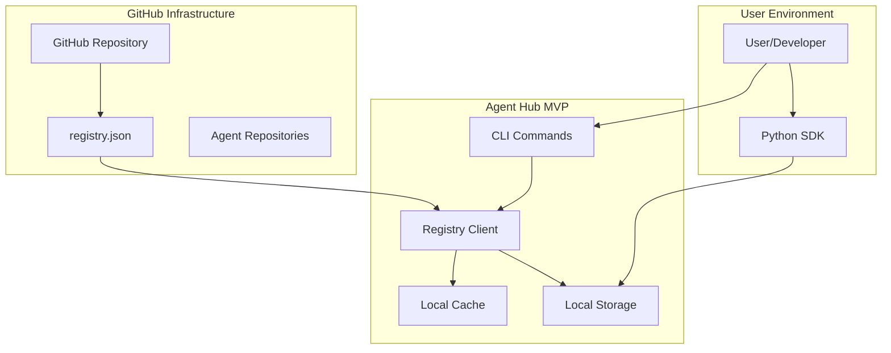

# Agent Hub MVP Registry Design

**Document Type**: MVP Registry Design
**Author**: William
**Date Created**: 2025-06-28
**Last Updated**: 2025-06-28
**Status**: Final
**Level**: L3 - MVP Module Level
**Audience**: Technical Architects, Developers

## 🎯 **MVP Registry Overview**

Agent Hub MVP uses a **simple, GitHub-based registry** designed for MVP validation rather than production scale. The registry focuses on **basic agent discovery** without the complexity of search, filtering, or advanced discovery features.

### **MVP Registry Goals**
- **Simple Discovery**: List available agents for users who know what they want
- **Zero Maintenance**: Leverage GitHub infrastructure
- **Fast Access**: Local caching for offline operation
- **MVP Focus**: Support 100-500 agents for validation

### **MVP Registry Limitations**
- **No Search**: Users must know agent names in advance
- **Limited Scale**: Maximum ~500 agents in single registry
- **Manual Updates**: Registry updates via GitHub PRs
- **Basic Metadata**: Essential information only

## 🏗️ **MVP Registry Architecture**



## 🚨 **MVP Registry Scalability Limitations**

### **Current Design Constraints**
The MVP registry design has **intentional scalability limitations** to focus on core functionality:

#### **1. Registry Size Limits**
- **Maximum Agents**: ~100-500 agents (MVP validation scale)
- **Registry File Size**: < 1MB JSON file
- **Update Frequency**: Manual updates via GitHub PRs
- **Concurrent Users**: Support for 100+ users (MVP scale)

#### **2. GitHub API Limitations**
- **Rate Limits**: 60 requests/hour (unauthenticated), 5000/hour (authenticated)
- **File Size**: GitHub API has 100MB file size limits
- **Update Process**: Manual registry updates via pull requests
- **Single Point of Failure**: GitHub dependency for registry access

#### **3. Functional Limitations**
- **No Search**: Users must know agent names in advance
- **No Filtering**: No category or tag-based filtering
- **No Pagination**: All agents loaded at once
- **No Real-time Updates**: Registry updates require manual refresh

### **Why These Limitations Are Acceptable for MVP**

#### **1. MVP Focus on Integration**
- **Primary Goal**: Validate one-line agent integration
- **Secondary Goal**: Basic agent discovery (not comprehensive search)
- **Success Metric**: Integration success rate, not discovery efficiency

#### **2. MVP Scale Requirements**
- **Agent Count**: 100-500 agents sufficient for MVP validation
- **User Count**: 100+ users sufficient for MVP feedback
- **Performance**: Simple registry meets MVP performance requirements

#### **3. Architecture Simplicity**
- **No Infrastructure**: Leverage existing GitHub infrastructure
- **No Maintenance**: Zero operational overhead
- **No Complexity**: Simple JSON-based registry
- **Fast Development**: Focus on core functionality

## 🛠️ **Tool Infrastructure for Agents**

### **Enhanced Agent Manifest**
Agents can declare tool requirements and capabilities in their manifest:

```yaml
name: "openai/analysis-agent"
version: "1.0.0"
description: "Multi-purpose analysis agent with tool infrastructure support"
author: "openai"
license: "MIT"

interface:
  methods:
    analyze_data:
      description: "Analyze data using available tools"
      parameters:
        data:
          type: "array"
          description: "Data to analyze"
          required: true
        analysis_type:
          type: "string"
          description: "Type of analysis to perform"
          required: false
      returns:
        type: "object"
        properties:
          result:
            type: "string"
            description: "Analysis result"
          metrics:
            type: "object"
            description: "Calculated metrics"

dependencies:
  python: ">=3.12"
  runtime: ["openai>=1.0.0"]

            # Tool requirements and capabilities
            tools:
              builtin:
                required:
                  - "rag_query"
                  - "calculate_metrics"
                optional:
                  - "file_operations"
                  - "http_requests"
                  - "data_validation"
              custom:
                optional:
                  - "domain_specific_analysis"
                  - "enhanced_metrics"
                  - "custom_validation"
                security_level: "medium"  # Default security level
              capabilities:
                - "statistical_analysis"
                - "data_processing"
                - "document_analysis"
                - "file_operations"
                - "api_integration"
                - "secure_tool_execution"
                - "resource_monitoring"

### **Benefits of Enhanced Tool Infrastructure**
- **Stability**: Agent's built-in tools provide reliable, tested functionality
- **Flexibility**: Custom tools enable domain-specific capabilities
- **Tool Override**: Users can replace agent's built-in tools when needed
- **Security**: Automatic validation of custom tools for safety
- **Resource Management**: Configurable limits and monitoring
- **Consistent Interface**: All tools follow the same calling pattern
- **Easy Extension**: Simple Python function injection with validation
- **Best of Both Worlds**: Combines reliability with customization and security
```

### **Tool Infrastructure Benefits**
- **Stability**: Agent's built-in tools provide reliable, tested functionality
- **Flexibility**: Custom tools enable domain-specific capabilities
- **Tool Override**: Custom tools can replace agent's built-in tools when needed
- **Best of Both**: Stability from agent's built-in tools, flexibility from custom tools

## 🔧 **MVP Registry Implementation**

### **1. Registry Structure**

#### **Registry File (registry.json)**
```json
{
  "version": "1.0.0",
  "updated_at": "2025-06-28T10:00:00Z",
  "total_agents": 25,
  "agents": {
    "meta/coding-agent": {
      "name": "coding-agent",
      "version": "1.0.0",
      "author": "meta",
      "description": "AI coding assistant for Python development",
      "download_url": "https://github.com/meta/coding-agent/archive/v1.0.0.tar.gz",
      "checksum": "sha256:abc123...",
      "size_mb": 125.5,
      "tags": ["coding", "ai", "python"],
      "categories": ["development", "productivity"],
      "last_updated": "2025-06-28T09:00:00Z",
      "downloads": 150
    }
  }
}
```

#### **Registry Metadata**
- **Version**: Registry format version
- **Updated At**: Last registry update timestamp
- **Total Agents**: Count of available agents
- **Agent Entries**: Individual agent metadata

### **2. Registry Client Implementation**

#### **GitHub Registry Client**
```python
# agenthub/registry/github_client.py
import requests
import json
import base64
import logging
from typing import Dict, Optional
from pathlib import Path

class GitHubRegistryClient:
    def __init__(self, github_token: Optional[str] = None):
        self.session = requests.Session()
        self.github_token = github_token

        # Set up headers
        headers = {
            'User-Agent': 'Agent-Hub/1.0.0',
            'Accept': 'application/vnd.github.v3+json'
        }

        if github_token:
            headers['Authorization'] = f'token {github_token}'
            self.rate_limit = 5000  # Authenticated rate limit
        else:
            self.rate_limit = 60    # Unauthenticated rate limit

        self.session.headers.update(headers)

    def get_registry(self) -> Dict:
        """Fetch registry from GitHub."""
        url = "https://api.github.com/repos/agentplug/agent-registry/contents/registry.json"

        try:
            response = self.session.get(url)
            response.raise_for_status()

            # Decode GitHub API response
            content_data = response.json()
            content = base64.b64decode(content_data["content"]).decode('utf-8')

            return json.loads(content)

        except requests.exceptions.RequestException as e:
            logging.error(f"Failed to fetch registry: {e}")
            raise RegistryFetchError(f"Failed to fetch registry: {e}")

        except (json.JSONDecodeError, KeyError) as e:
            logging.error(f"Failed to parse registry: {e}")
            raise RegistryParseError(f"Failed to parse registry: {e}")

    def get_agent_metadata(self, agent_path: str) -> Optional[Dict]:
        """Get specific agent metadata from registry."""
        registry = self.get_registry()
        return registry.get('agents', {}).get(agent_path)

    def check_rate_limit(self) -> Dict:
        """Check current GitHub API rate limit status."""
        try:
            response = self.session.get("https://api.github.com/rate_limit")
            response.raise_for_status()
            return response.json()
        except requests.exceptions.RequestException:
            return {"rate": {"remaining": 0, "limit": self.rate_limit}}
```

### **3. Caching Strategy**

#### **Local Cache Implementation**
```python
# agenthub/cache/registry_cache.py
import json
import time
from pathlib import Path
from typing import Optional

class RegistryCache:
    def __init__(self, cache_dir: Path, ttl: int = 3600):
        self.cache_dir = cache_dir
        self.ttl = ttl
        self.cache_file = cache_dir / "registry.json"
        self.cache_dir.mkdir(parents=True, exist_ok=True)

    def get_cached_registry(self) -> Optional[Dict]:
        """Get cached registry if not expired."""
        if not self.cache_file.exists():
            return None

        try:
            # Simple TTL check using file modification time
            if time.time() - self.cache_file.stat().st_mtime > self.ttl:
                return None  # Cache expired

            # Load cached registry
            with open(self.cache_file, 'r') as f:
                return json.load(f)

        except (json.JSONDecodeError, IOError):
            return None

        return None

    def update_cache(self, registry_data: Dict):
        """Update cache with fresh registry data."""
        try:
            with open(self.cache_file, 'w') as f:
                json.dump(registry_data, f, indent=2)
        except IOError as e:
            logging.error(f"Failed to update cache: {e}")

    def clear_cache(self):
        """Clear cached registry data."""
        try:
            if self.cache_file.exists():
                self.cache_file.unlink()
        except IOError as e:
            logging.error(f"Failed to clear cache: {e}")
```

## 🚀 **Registry Performance & Optimization**

### **1. Caching Strategy**
- **TTL**: 1 hour cache expiration
- **Offline Operation**: Use cached data when GitHub unavailable
- **Incremental Updates**: Only fetch when cache expires
- **Local Storage**: Cache stored in user's home directory

### **2. Rate Limiting**
- **Unauthenticated**: 60 requests/hour (default)
- **Authenticated**: 5000 requests/hour (with GitHub token)
- **Smart Caching**: Minimize API calls through effective caching
- **Fallback Strategy**: Use cached data when rate limited

### **3. Error Handling**
- **Network Failures**: Graceful fallback to cached data
- **API Errors**: Clear error messages with solutions
- **Rate Limiting**: Informative messages about limits
- **Cache Corruption**: Automatic cache clearing and refresh

## 🔒 **Registry Security & Validation**

### **1. Data Validation**
- **Schema Validation**: Validate registry JSON structure
- **Content Validation**: Verify agent metadata integrity
- **URL Validation**: Ensure download URLs are safe
- **Checksum Verification**: Validate agent package integrity

### **2. Access Control**
- **Public Registry**: Read-only access for all users
- **GitHub Authentication**: Optional token for higher rate limits
- **No Write Access**: Users cannot modify registry directly
- **Pull Request Workflow**: Registry updates through GitHub PRs

### **3. Package Security**
- **Checksum Verification**: SHA256 checksums for all packages
- **Size Limits**: Maximum package size limits
- **Source Validation**: Only GitHub-hosted packages allowed
- **Content Scanning**: Basic security scanning (post-MVP)

## 📊 **Registry Monitoring & Analytics**

### **1. Usage Metrics**
- **Download Counts**: Track agent download frequency
- **Cache Hit Rates**: Monitor cache effectiveness
- **API Usage**: Track GitHub API consumption
- **Error Rates**: Monitor registry access failures

### **2. Performance Monitoring**
- **Response Times**: Registry fetch performance
- **Cache Performance**: Local cache hit rates
- **Network Performance**: GitHub API response times
- **User Experience**: Time to registry access

### **3. Health Checks**
- **Registry Availability**: Monitor GitHub repository access
- **Cache Health**: Validate cached data integrity
- **Rate Limit Status**: Monitor API usage limits
- **Error Tracking**: Track and analyze failures

## 🎯 **MVP Registry Success Criteria**

### **1. Functional Requirements**
- ✅ **Registry Access**: Can fetch registry from GitHub
- ✅ **Agent Discovery**: Can list available agents
- ✅ **Metadata Access**: Can retrieve agent information
- ✅ **Offline Operation**: Can use cached data when offline

### **2. Performance Requirements**
- ✅ **Fetch Time**: < 2 seconds for registry fetch
- ✅ **Cache Performance**: < 100ms for cached access
- ✅ **Rate Limiting**: Handle GitHub API limits gracefully
- ✅ **Error Recovery**: Recover from network failures

### **3. User Experience Requirements**
- ✅ **Simple Discovery**: Users can find known agents
- ✅ **Clear Information**: Agent metadata is clear and useful
- ✅ **Error Handling**: Clear error messages with solutions
- ✅ **Offline Support**: Works without internet connection

## 🔮 **Post-MVP Registry Enhancements**

### **1. Scalability Improvements**
- **Database Backend**: Replace JSON with scalable database
- **Pagination**: Support for large numbers of agents
- **Incremental Updates**: Delta-based registry updates
- **CDN Integration**: Global content delivery network

### **2. Advanced Discovery**
- **Full-Text Search**: Comprehensive agent search
- **Filtering**: Category and tag-based filtering
- **Recommendations**: AI-powered agent suggestions
- **Trending**: Popular and trending agents

### **3. Enhanced Metadata**
- **Rich Descriptions**: Detailed agent documentation
- **Screenshots**: Visual agent previews
- **Demo Videos**: Interactive demonstrations
- **User Reviews**: Community feedback and ratings

### **4. Automation**
- **Webhook Updates**: Automatic registry updates
- **CI/CD Integration**: Automated testing and validation
- **Quality Gates**: Automated quality checks
- **Monitoring**: Comprehensive health monitoring

## 🎯 **MVP Registry Summary**

### **Registry Benefits**
- ✅ **Simple Architecture**: GitHub-based with minimal complexity
- ✅ **Zero Maintenance**: Leverages existing infrastructure
- ✅ **Fast Development**: Focus on core functionality
- ✅ **MVP Validation**: Supports MVP scale requirements

### **Registry Limitations**
- ❌ **Limited Scale**: Maximum ~500 agents
- ❌ **No Search**: Basic listing only
- ❌ **Manual Updates**: GitHub PR workflow
- ❌ **GitHub Dependency**: Single point of failure

### **Key Design Decisions**
1. **MVP Focus**: Registry designed for validation, not production scale
2. **GitHub Leverage**: Use existing infrastructure instead of building new
3. **Simple Caching**: Local file-based caching for offline operation
4. **Graceful Degradation**: Fallback to cached data when GitHub unavailable

The MVP registry provides **sufficient functionality for MVP validation** while maintaining architectural simplicity and zero operational overhead. Post-MVP enhancements will address scalability and advanced discovery features.
