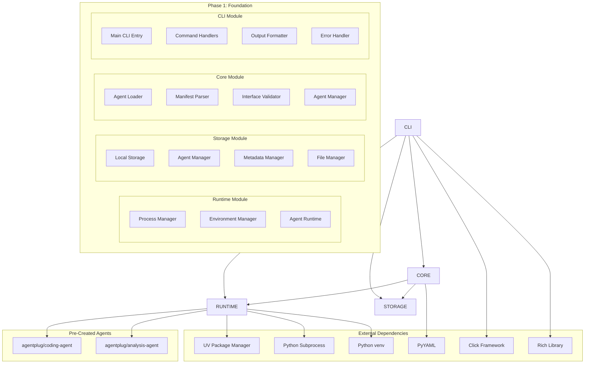

# Phase 1: Foundation

**Document Type**: Phase 1 Implementation Overview
**Phase**: 1 - Foundation
**Author**: William
**Date Created**: 2025-06-28
**Last Updated**: 2025-06-28
**Status**: Active
**Purpose**: Build core runtime system that can execute pre-created agentplug agents

## 🎯 **Phase 1 Overview**

Phase 1 is the **foundation phase** that builds the core runtime system capable of loading and executing pre-created `agentplug` agents. This phase establishes the fundamental architecture that all subsequent phases build upon.

### **Simple Usage Example**
```python
import agenthub

# Load a pre-created agent
coding_agent = agenthub.load_agent("agentplug/coding-agent")

# Execute agent methods directly
result = coding_agent.generate_code("Create a hello world function")
print(result)

# Load another agent
analysis_agent = agenthub.load_agent("agentplug/analysis-agent")

# Use different agent methods
insights = analysis_agent.analyze_data("Sample data: 1, 2, 3, 4, 5")
print(insights)
```

**That's it!** Simple, clean, and intuitive. No complex installation, no registry lookups - just load and use.

### **Phase Goal**
Build a working system where developers can:
1. **Load** pre-created `agentplug` agents with `agenthub.load_agent()`
2. **Execute** agent methods directly on loaded agent objects
3. **Test** agent functionality through CLI
4. **Build** foundation for Phase 2 auto-installation

### **Success Criteria**
- ✅ Can load `agentplug/coding-agent` with `agenthub.load_agent()`
- ✅ Can load `agentplug/analysis-agent` with `agenthub.load_agent()`
- ✅ Can execute agent methods directly on loaded objects
- ✅ Basic agent runtime working
- ✅ Local storage system working
- ✅ Foundation ready for Phase 2

## 🏗️ **Phase 1 Architecture**



## 📋 **Module Responsibilities**

### **Runtime Module** 🚀
- **Process Isolation**: Execute agents in isolated subprocesses
- **Environment Management**: Create and manage independent virtual environments for each agent
- **Agent Execution**: Coordinate agent method calls and results using agent-specific Python environments
- **Error Management**: Handle execution errors and timeouts

### **Storage Module** 💾
- **Agent Storage**: Store and organize agentplug agents locally
- **Metadata Management**: Track agent information and installation details
- **File Organization**: Maintain organized directory structure
- **Data Persistence**: Ensure agent data survives system restarts

### **Core Module** 🧠
- **Agent Loading**: Load and validate agentplug agents from storage
- **Manifest Parsing**: Parse and validate agent manifests (agent.yaml)
- **Interface Management**: Provide consistent agent interface access
- **Validation**: Ensure agents meet Phase 1 requirements

### **CLI Module** 💻
- **Testing Interface**: Provide commands to test agent functionality
- **Agent Management**: List, inspect, and manage installed agents
- **Development Tools**: Help developers test and validate agents
- **User Feedback**: Provide clear output and error messages

## 🔗 **Module Dependencies**

### **Dependency Flow**
```
CLI Module → Core Module → Storage Module
     ↓           ↓           ↓
Runtime Module ← Core Module → Storage Module
```

### **External Dependencies**
- **UV Package Manager**: For fast virtual environment creation
- **Python 3.12+**: For subprocess and venv support
- **PyYAML**: For agent manifest parsing
- **Click**: For CLI framework
- **Rich**: For beautiful terminal output

## 📁 **Project Implementation Structure**

### **Phase 1 Directory Tree**
```
agenthub/
├── agenthub/                          # Main Python package
│   ├── __init__.py
│   ├── runtime/                           # Runtime Module
│   │   ├── __init__.py
│   │   ├── process_manager.py             # Subprocess management
│   │   ├── environment_manager.py         # Virtual environment management
│   │   └── agent_runtime.py               # Agent execution coordination
│   ├── storage/                           # Storage Module
│   │   ├── __init__.py
│   │   ├── local_storage.py               # Local file system operations
│   │   ├── agent_manager.py               # Agent installation/removal
│   │   ├── metadata_manager.py            # Manifest and metadata handling
│   │   └── file_manager.py                # File operations and validation
│   ├── core/                              # Core Module
│   │   ├── __init__.py
│   │   ├── agent_loader.py                # Agent loading and validation
│   │   ├── manifest_parser.py             # YAML manifest parsing
│   │   ├── interface_validator.py         # Agent interface validation
│   │   ├── agent_manager.py               # Agent registration and coordination
│   │   └── agent_wrapper.py               # Dynamic method dispatch wrapper
│   └── cli/                               # CLI Module
│       ├── __init__.py
│       ├── main.py                        # Main CLI entry point
│       ├── commands/                      # Command implementations
│       │   ├── __init__.py
│       │   ├── list.py                    # List agents command
│       │   ├── info.py                    # Agent info command
│       │   ├── test.py                    # Test agent command
│       │   ├── install.py                 # Install agent command
│       │   └── remove.py                  # Remove agent command
│       ├── formatters/                    # Output formatting
│       │   ├── __init__.py
│       │   ├── table_formatter.py         # Table output formatting
│       │   └── error_formatter.py         # Error message formatting
│       └── utils/                         # CLI utilities
│           ├── __init__.py
│           └── input_validation.py        # Input validation helpers
├── tests/                                 # Test suite
│   └── phase1_foundation/                # Phase 1 tests
│       ├── __init__.py
│       ├── conftest.py                    # Test configuration and fixtures
│       ├── runtime/                       # Runtime module tests
│       │   ├── __init__.py
│       │   ├── test_process_manager.py
│       │   ├── test_environment_manager.py
│       │   └── test_agent_runtime.py
│       ├── storage/                       # Storage module tests
│       │   ├── __init__.py
│       │   ├── test_local_storage.py
│       │   ├── test_agent_manager.py
│       │   ├── test_metadata_manager.py
│       │   └── test_file_manager.py
│       ├── core/                          # Core module tests
│       │   ├── __init__.py
│       │   ├── test_agent_loader.py
│       │   ├── test_manifest_parser.py
│       │   ├── test_interface_validator.py
│       │   └── test_agent_wrapper.py
│       ├── cli/                           # CLI module tests
│       │   ├── __init__.py
│       │   ├── test_main.py
│       │   ├── test_commands.py
│       │   └── test_formatters.py
│       ├── integration/                   # Integration tests
│       │   ├── __init__.py
│       │   ├── test_runtime_storage.py
│       │   ├── test_core_storage.py
│       │   ├── test_core_runtime.py
│       │   └── test_cli_integration.py
│       └── e2e/                           # End-to-end tests
│           ├── __init__.py
│           ├── test_agent_discovery.py
│           ├── test_agent_installation.py
│           ├── test_agent_testing.py
│           └── test_agent_management.py
├── docs/                                  # Documentation
│   └── .implementation_design/
│       └── phase1_foundation/             # Phase 1 design docs
│           ├── README.md                   # This file
│           ├── runtime/                    # Runtime module design
│           │   ├── README.md
│           │   ├── 01_interface_design.md
│           │   ├── 02_implementation_details.md
│           │   ├── 03_testing_strategy.md
│           │   └── 04_success_criteria.md
│           ├── storage/                    # Storage module design
│           │   ├── README.md
│           │   ├── 01_interface_design.md
│           │   ├── 02_implementation_details.md
│           │   ├── 03_testing_strategy.md
│           │   └── 04_success_criteria.md
│           ├── core/                       # Core module design
│           │   ├── README.md
│           │   ├── 01_interface_design.md
│           │   ├── 02_implementation_details.md
│           │   ├── 03_testing_strategy.md
│           │   └── 04_success_criteria.md
│           ├── cli/                        # CLI module design
│           │   ├── README.md
│           │   ├── 01_interface_design.md
│           │   ├── 02_implementation_details.md
│           │   ├── 03_testing_strategy.md
│           │   └── 04_success_criteria.md
│           └── testing/                    # Testing documentation
│               ├── README.md
│               ├── runtime_testing.md
│               ├── storage_testing.md
│               ├── core_testing.md
│               ├── cli_testing.md
│               ├── integration_testing.md
│               └── e2e_testing.md
├── setup.py                               # Package setup and dependencies
├── requirements.txt                       # Development dependencies
├── requirements-dev.txt                   # Development and testing dependencies
├── pyproject.toml                        # Modern Python project configuration
├── .env.example                          # Environment variables template
├── .gitignore                            # Git ignore patterns
└── README.md                             # Project overview
```

### **Agent Storage Directory Structure**
```
~/.agenthub/agents/agentplug/
├── coding-agent/
│   ├── agent.yaml           # Agent manifest (required)
│   ├── agent.py             # Main agent script (required)
│   ├── requirements.txt     # Dependencies (optional)
│   ├── README.md            # Documentation (optional)
│   └── .venv/               # Independent virtual environment (required)
│       ├── bin/             # Python executable and scripts
│       ├── lib/             # Installed packages
│       └── pyvenv.cfg       # Virtual environment config
└── analysis-agent/
    ├── agent.yaml           # Agent manifest (required)
    ├── agent.py             # Main agent script (required)
    ├── requirements.txt     # Dependencies (optional)
    ├── README.md            # Documentation (optional)
    └── .venv/               # Independent virtual environment (required)
        ├── bin/             # Python executable and scripts
        ├── lib/             # Installed packages
        └── pyvenv.cfg       # Virtual environment config
```

### **Key Implementation Files**

#### **Core Package Files**
- **`agenthub/__init__.py`**: Main package initialization and public API
- **`setup.py`**: Package installation and dependency management
- **`pyproject.toml`**: Modern Python project configuration
- **`requirements.txt`**: Production dependencies

#### **Module Implementation Files**
- **Runtime**: `process_manager.py`, `environment_manager.py`, `agent_runtime.py`
- **Storage**: `local_storage.py`, `agent_manager.py`, `metadata_manager.py`, `file_manager.py`
- **Core**: `agent_loader.py`, `manifest_parser.py`, `interface_validator.py`, `agent_wrapper.py`
- **CLI**: `main.py`, command implementations, formatters, utilities

#### **Test Organization**
- **Unit Tests**: Individual module functionality testing
- **Integration Tests**: Cross-module coordination testing
- **E2E Tests**: Complete user workflow testing
- **Test Fixtures**: Shared test data and configuration

#### **Documentation Structure**
- **Module Design**: Detailed design for each module
- **Testing Plans**: Comprehensive testing strategies and examples
- **Interface Design**: Public APIs and usage examples
- **Implementation Details**: Internal architecture and design decisions

## 🚀 **Implementation Approach**

### **0. Create Seed Agents (Prerequisite)**
- Create `agentplug/coding-agent` with working functionality
- Create `agentplug/analysis-agent` with working functionality
- Ensure agents have proper `agent.yaml` manifests
- Test agents work independently before integration

### **1. Start with Storage Module**
- Create `~/.agenthub/` directory structure
- Implement basic file operations
- Set up agent directory organization with independent virtual environments
- Test with seed agents

### **2. Build Runtime Module**
- Implement process management
- Create environment management
- Build agent execution coordination
- Test with seed agentplug agents

### **3. Develop Core Module**
- Implement agent loading
- Create manifest parsing
- Build interface validation
- Coordinate between modules

### **4. Create CLI Module**
- Build command structure
- Implement agent testing commands
- Create output formatting
- Test complete user workflow

## 🌱 **Seed Agent Creation**

### **Why Seed Agents Are Critical**
Phase 1 cannot succeed without working seed agents to test with. These agents serve as:
- **Test Data**: Real agents to validate the system
- **Reference Implementation**: Examples of proper agent structure
- **Validation Tools**: Working functionality to test against
- **Success Metrics**: Concrete examples of what "working" means

### **Required Seed Agents**

#### **1. agentplug/coding-agent**
- **Purpose**: Generate Python code based on prompts
- **Methods**: `generate_code(prompt)`, `explain_code(code)`
- **Dependencies**: Minimal (just standard library)
- **Functionality**: Actually generates working Python code

#### **2. agentplug/analysis-agent**
- **Purpose**: Analyze text and provide insights
- **Methods**: `analyze_text(text)`, `summarize_content(content)`
- **Dependencies**: Minimal (just standard library)
- **Functionality**: Actually provides meaningful analysis

### **Seed Agent Requirements**
- ✅ **Working Code**: Agents must function independently
- ✅ **Proper Manifests**: Valid `agent.yaml` files
- ✅ **Independent Virtual Environments**: Each agent has its own `.venv/` directory
- ✅ **Simple Dependencies**: Minimal external packages installed in agent-specific environments
- ✅ **Testable Methods**: Clear input/output contracts
- ✅ **Error Handling**: Graceful failure modes

## 🧪 **Testing Strategy**

### **Phase 1 Testing Goals**
1. **Seed Agent Validation**: Test agents work independently
2. **Unit Testing**: Test each module individually
3. **Integration Testing**: Test modules working together
4. **End-to-End Testing**: Test complete agent execution flow
5. **User Experience Testing**: Test CLI usability

### **Testing with Seed Agents**
- **coding-agent**: Test code generation functionality
- **analysis-agent**: Test analysis functionality
- **Error Scenarios**: Test error handling and recovery
- **Performance**: Test execution time and resource usage

## 📊 **Progress Tracking**

### **Current Status**: 🚧 In Progress
- [ ] Seed agents created and tested
- [ ] Storage Module complete
- [ ] Runtime Module complete
- [ ] Core Module complete
- [ ] CLI Module complete
- [ ] Module integration complete
- [ ] Phase 1 testing complete
- [ ] Phase 1 validation complete

### **Next Milestones**
1. **Week 0**: Create and test seed agents (agentplug/coding-agent, agentplug/analysis-agent)
2. **Week 1**: Complete Storage and Runtime modules
3. **Week 2**: Complete Core and CLI modules
4. **Week 2**: Integration testing and validation
5. **Week 2**: Phase 1 completion and Phase 2 preparation

## 🎯 **Phase 1 Deliverables**

### **Working System**
- ✅ Runtime system that can execute agentplug agents
- ✅ Storage system that organizes agent files
- ✅ Core system that loads and validates agents
- ✅ CLI system that provides testing interface

### **Testable Functionality**
- ✅ Can load agents with `agenthub.load_agent()`
- ✅ Can execute `agentplug/coding-agent` methods
- ✅ Can execute `agentplug/analysis-agent` methods
- ✅ Can list and inspect installed agents
- ✅ Can test agent functionality through CLI

### **Foundation for Phase 2**
- ✅ Runtime system ready for installation support
- ✅ Storage system ready for registry integration
- ✅ Core system ready for enhanced validation
- ✅ CLI system ready for installation commands

## 🔄 **Phase Evolution**

### **Phase 1 (Current)**
- Basic runtime execution
- Local storage management
- Simple agent loading
- Basic CLI interface

### **Phase 2 (Next)**
- Enhanced with auto-installation
- Registry integration
- Better dependency management
- Installation tracking

### **Phase 3 (Future)**
- Enhanced with SDK integration
- Method dispatching
- Performance optimization
- Advanced features

### **Phase 4 (Future)**
- Production-ready MVP
- Performance optimization
- Enhanced user experience
- Comprehensive testing

## 🚨 **Key Risks and Mitigation**

### **Risk 1: Runtime Complexity**
- **Risk**: Runtime module becomes too complex
- **Mitigation**: Start simple, add features incrementally
- **Fallback**: Use basic subprocess execution if needed

### **Risk 2: Storage Performance**
- **Risk**: Storage operations become slow
- **Mitigation**: Optimize file operations, use caching
- **Fallback**: Basic file system operations

### **Risk 3: Integration Issues**
- **Risk**: Modules don't work together properly
- **Mitigation**: Test integration early and often
- **Fallback**: Simplify interfaces if needed

### **Risk 4: agentplug Agent Issues**
- **Risk**: Pre-created agents don't work properly
- **Mitigation**: Create simple, working test agents
- **Fallback**: Use mock agents for testing

## 🎉 **Phase 1 Success Celebration**

### **What Success Looks Like**
- Developers can load agentplug agents with simple `agenthub.load_agent()` calls
- Agent methods execute directly on loaded objects
- CLI provides intuitive testing interface
- All modules work together seamlessly
- Foundation is solid for Phase 2

### **Success Metrics**
- ✅ 100% of agentplug agents load successfully with `agenthub.load_agent()`
- ✅ 100% of agent methods execute successfully on loaded objects
- ✅ CLI commands work without errors
- ✅ Module integration is seamless
- ✅ Performance meets Phase 1 requirements

### **Next Steps After Success**
- Document Phase 1 learnings
- Plan Phase 2 implementation
- Prepare for auto-installation features
- Begin registry integration planning

Phase 1 establishes the **solid foundation** that enables the MVP vision. Success here means we have a working system that can execute agentplug agents reliably, setting the stage for the auto-installation capabilities in Phase 2.
