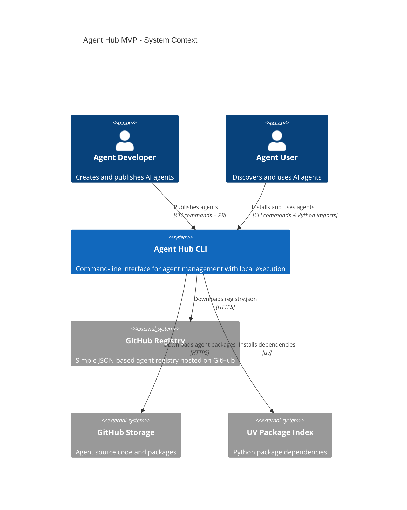
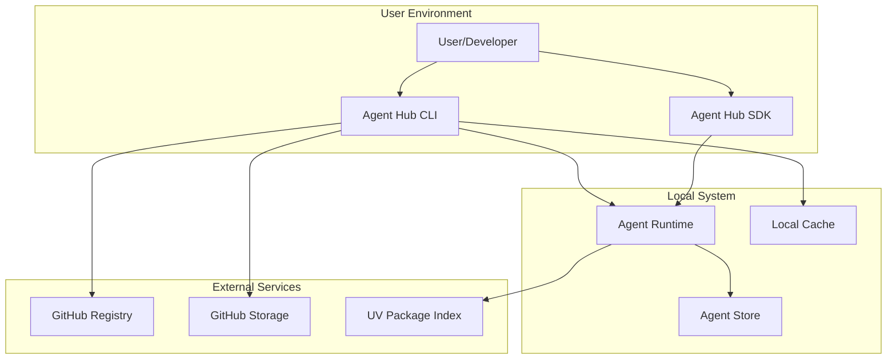
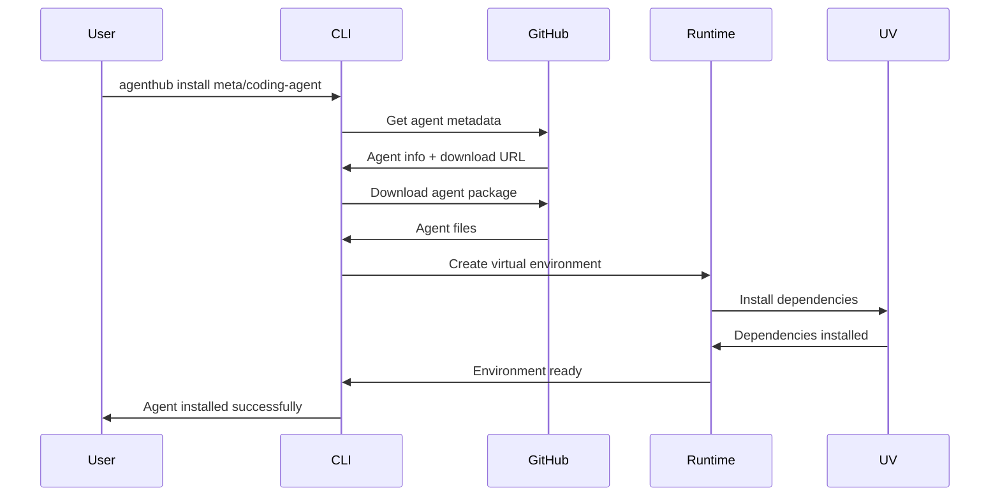
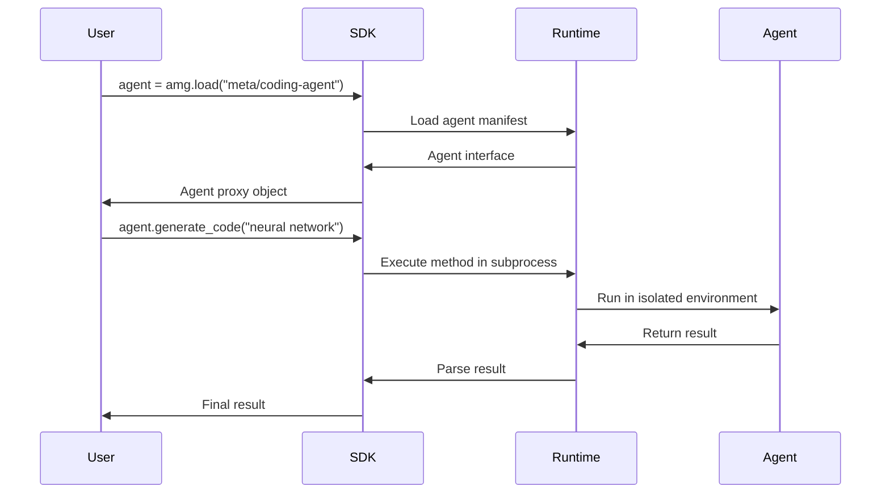

# Agent Hub System Architecture

**Document Type**: System Architecture
**Author**: William
**Date Created**: 2025-06-28
**Last Updated**: 2025-06-28
**Status**: Final
**Level**: L1 - System Level
**Audience**: Business Stakeholders, Technical Architects, Product Team

## 🎯 **Executive Summary**

Agent Hub is a CLI-based platform that transforms AI agent discovery and integration from a complex, weeks-long process into a simple, one-line experience. The system enables developers to use agents like Python packages: `import agenthub as amg; agent = amg.load("meta/coding-agent")`.

### **Business Value**
- **For Developers**: Eliminate 60-80% of agent integration overhead
- **For Users**: Reduce integration time from weeks to minutes
- **For Ecosystem**: Enable standardized agent sharing and composition

### **Technical Approach**
- **Process-based isolation** prevents dependency conflicts
- **GitHub-based registry** eliminates infrastructure maintenance
- **UV package manager** provides 10x faster installations
- **Local execution** optimizes for development workflows

## 🏗️ **System Context**

## 🎯 **Business Architecture**

### **Value Proposition**
Agent Hub addresses the critical problem of agent integration complexity in the AI ecosystem. Currently, integrating AI agents requires weeks of custom development, custom APIs, and complex dependency management. Agent Hub standardizes this into a one-line experience.

### **Market Positioning**
- **"App Store for AI Agents"** - Centralized marketplace for agent discovery
- **"npm for AI Agents"** - Standardized packaging and installation
- **"Docker for AI Agents"** - Isolated execution environments

### **Success Metrics**
- **Agent Discovery Rate**: Users find suitable agents within 1 week
- **Integration Success Rate**: 90%+ successful installations
- **Developer Adoption**: Active agent developers on platform
- **Time to Integration**: < 5 minutes from discovery to usage

### **Stakeholder Value**

#### **Agent Developers**
- **Elimination of Distribution Infrastructure**: No need to build custom APIs
- **Broader Market Reach**: Access to all Agent Hub users
- **Standardized Development**: Clear templates and validation tools
- **Community Feedback**: Ratings, reviews, and usage analytics

#### **Agent Users**
- **One-Line Integration**: `agent = amg.load("meta/coding-agent")`
- **Dependency Isolation**: No conflicts between different agents
- **Quality Assurance**: Community-validated agents with ratings
- **Rich Discovery**: Search, trending, recommendations

#### **System Integrators**
- **Standardized Interfaces**: Consistent API across all agents
- **Composition Support**: Combine multiple agents easily
- **Enterprise Features**: Governance, compliance, monitoring
- **Operational Simplicity**: Local execution, minimal infrastructure

## 🏛️ **System Architecture Overview**

### **Architectural Principles**
1. **Simplicity First**: Use proven, simple technologies over complex solutions
2. **Developer Experience**: Optimize for fast iteration and ease of use
3. **Zero Maintenance**: Minimize operational overhead and infrastructure
4. **Local Execution**: Prioritize speed and privacy over cloud scaling
5. **Extensibility**: Design for future enhancements without breaking changes

### **System Components**

### **Component Responsibilities**

#### **Agent Hub CLI**
- **Purpose**: Primary user interface for agent management
- **Responsibilities**: Install, search, list, remove, validate agents
- **Technology**: Python Click framework
- **Interfaces**: Command-line commands, GitHub API

#### **Agent Hub SDK**
- **Purpose**: Python library for agent loading and execution
- **Responsibilities**: One-line agent loading, method dispatching
- **Technology**: Python library with dynamic method creation
- **Interfaces**: Python imports, subprocess execution

#### **Agent Runtime**
- **Purpose**: Isolated execution environment for agents
- **Responsibilities**: Process management, dependency isolation, error handling
- **Technology**: Python subprocess with virtual environments
- **Interfaces**: JSON-based IPC, virtual environment management

#### **GitHub Registry**
- **Purpose**: Zero-maintenance agent discovery and metadata
- **Responsibilities**: Agent catalog, search index, version management
- **Technology**: GitHub repository with JSON files
- **Interfaces**: GitHub API, HTTPS downloads

## 🔄 **System Interactions**

### **Agent Installation Flow**

### **Agent Execution Flow**

## 🎛️ **Quality Attributes**

### **Performance Requirements**
- **Agent Installation**: < 10 seconds for typical agent
- **Agent Loading**: < 500ms for cached agent
- **Method Execution**: < 1 second overhead for subprocess call
- **Memory Usage**: < 100MB for Agent Hub runtime

### **Reliability Requirements**
- **System Availability**: 99.9% (leveraging GitHub infrastructure)
- **Installation Success Rate**: 95%+ successful installations
- **Error Recovery**: Graceful handling of network and dependency issues
- **Data Integrity**: Consistent agent metadata and package versions

### **Scalability Requirements**
- **Local Storage**: Support 100+ installed agents
- **Concurrent Execution**: Multiple agents running simultaneously
- **Registry Scale**: Handle 1000+ agents in registry
- **User Scale**: Support 10,000+ users (via GitHub infrastructure)

### **Security Requirements**
- **Process Isolation**: Agents run in separate processes
- **Dependency Isolation**: Virtual environment separation
- **Input Validation**: Parameter validation before execution
- **Package Integrity**: Verify package checksums and signatures

### **Usability Requirements**
- **Learning Curve**: < 30 minutes to first successful agent usage
- **Error Messages**: Clear, actionable error messages with solutions
- **Documentation**: Comprehensive guides and examples
- **Discoverability**: Easy agent search and recommendations

## 🛡️ **Risk Assessment**

### **Technical Risks**
| Risk | Probability | Impact | Mitigation |
|------|-------------|---------|------------|
| Subprocess reliability | Medium | Medium | Comprehensive error handling, timeouts |
| GitHub API limits | Low | Medium | Caching, rate limit handling |
| Dependency conflicts | Low | High | Virtual environment isolation |
| Platform compatibility | Medium | Low | Multi-platform testing |

### **Business Risks**
| Risk | Probability | Impact | Mitigation |
|------|-------------|---------|------------|
| Low user adoption | Medium | High | Focus on developer experience |
| GitHub dependency | Low | Medium | Design for registry migration |
| Competitive response | Medium | Medium | First-mover advantage, community |
| Agent quality issues | Medium | Medium | Validation tools, community reviews |

### **Operational Risks**
| Risk | Probability | Impact | Mitigation |
|------|-------------|---------|------------|
| GitHub outages | Low | Low | Local caching, offline mode |
| Support burden | Medium | Medium | Self-service tools, documentation |
| Scaling challenges | Low | Medium | GitHub infrastructure handles scale |

## 🚀 **Implementation Strategy**

### **Development Phases**

#### **Phase 1: Core Foundation (Week 1-2)**
- **Goal**: Basic agent loading and execution
- **Deliverables**: Process manager, environment manager, basic CLI
- **Success Criteria**: Can install and execute simple agents locally

#### **Phase 2: CLI Interface (Week 3)**
- **Goal**: Complete command-line interface
- **Deliverables**: All CLI commands, error handling, local storage
- **Success Criteria**: Full agent lifecycle management via CLI

#### **Phase 3: GitHub Integration (Week 4)**
- **Goal**: Registry integration and discovery
- **Deliverables**: Registry client, search, recommendations
- **Success Criteria**: Can discover and install agents from GitHub registry

#### **Phase 4: Developer Experience (Week 5-6)**
- **Goal**: Agent development tools
- **Deliverables**: Templates, validation, publishing workflow
- **Success Criteria**: Developers can create and publish agents easily

### **Technology Choices**

#### **Core Technologies**
- **Python 3.8+**: Main implementation language
- **UV**: Fast package installer and virtual environment management
- **Click**: CLI framework for command interface
- **subprocess**: Process isolation and execution
- **PyYAML**: Configuration and manifest parsing
- **requests**: HTTP client for GitHub integration

#### **External Dependencies**
- **GitHub**: Registry hosting and storage
- **GitHub API**: Metadata and download management
- **UV Package Index**: Python package dependencies

### **Deployment Architecture**
- **Distribution**: PyPI package (`pip install agenthub`)
- **Local Installation**: `~/.agenthub/` directory structure
- **Configuration**: YAML-based configuration files
- **Logging**: Structured logging for debugging and analytics

## 📈 **Success Criteria**

### **Technical Success**
- ✅ **One-line integration**: `agent = amg.load("meta/coding-agent")`
- ✅ **Dependency isolation**: No conflicts between agents
- ✅ **Fast execution**: < 1 second overhead for agent calls
- ✅ **Cross-platform**: Works on Windows, macOS, Linux

### **Business Success**
- ✅ **Developer adoption**: 10+ agents published in first month
- ✅ **User adoption**: 50+ installations in first month
- ✅ **Integration success**: 90%+ successful agent installations
- ✅ **Performance**: Average agent execution < 2 seconds

### **User Experience Success**
- ✅ **Time to first agent**: < 5 minutes from install to usage
- ✅ **Discovery effectiveness**: Users find relevant agents easily
- ✅ **Error recovery**: Clear guidance when things go wrong
- ✅ **Developer productivity**: 10x faster agent development

## 🔮 **Future Vision**

### **Post-MVP Enhancements**
1. **Web Interface**: Browser-based agent management
2. **Containerized Execution**: Enhanced security via Docker
3. **Enterprise Features**: Governance, compliance, SSO
4. **Monetization Platform**: Paid agents and subscriptions
5. **Agent Composition**: Visual workflow builder
6. **Cloud Execution**: Optional remote agent execution
7. **Advanced Analytics**: Usage tracking and optimization

### **Architectural Evolution**
- **Registry**: Migrate to custom registry when needed
- **Execution**: Add containerized execution option
- **Storage**: Implement shared dependency optimization
- **Security**: Enhanced sandboxing and validation
- **Monitoring**: Real-time performance and usage analytics

This system architecture provides a solid foundation for the Agent Hub MVP while maintaining clear paths for future enhancement and scaling. The design optimizes for rapid development, minimal operational overhead, and excellent developer experience while solving the core problem of agent integration complexity.
