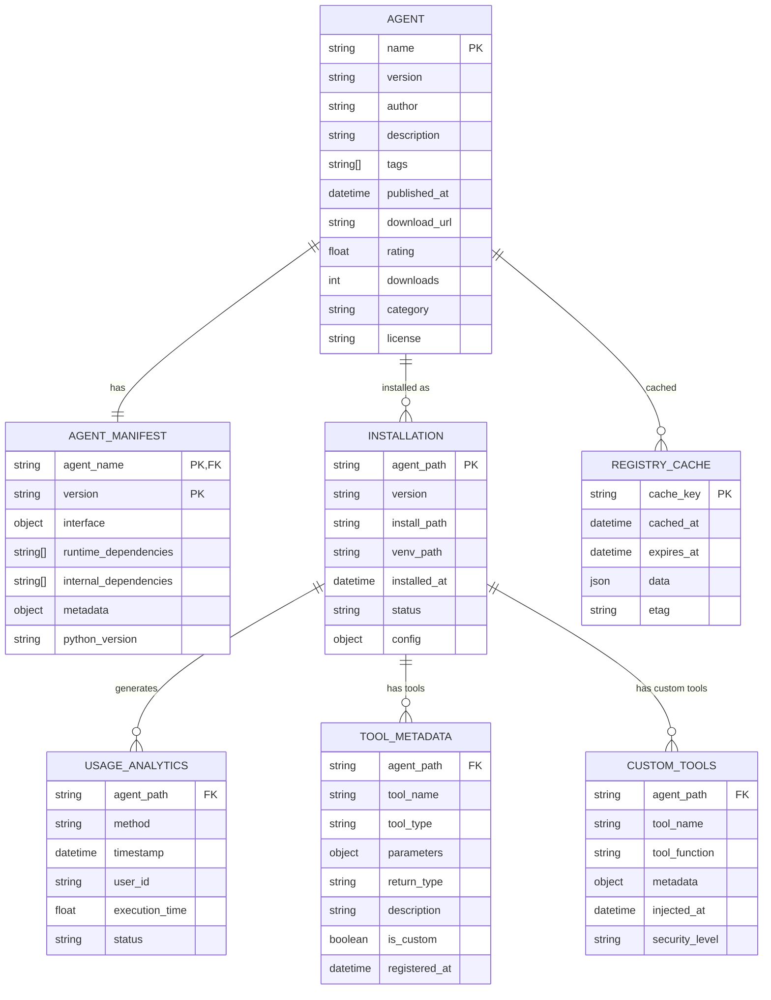
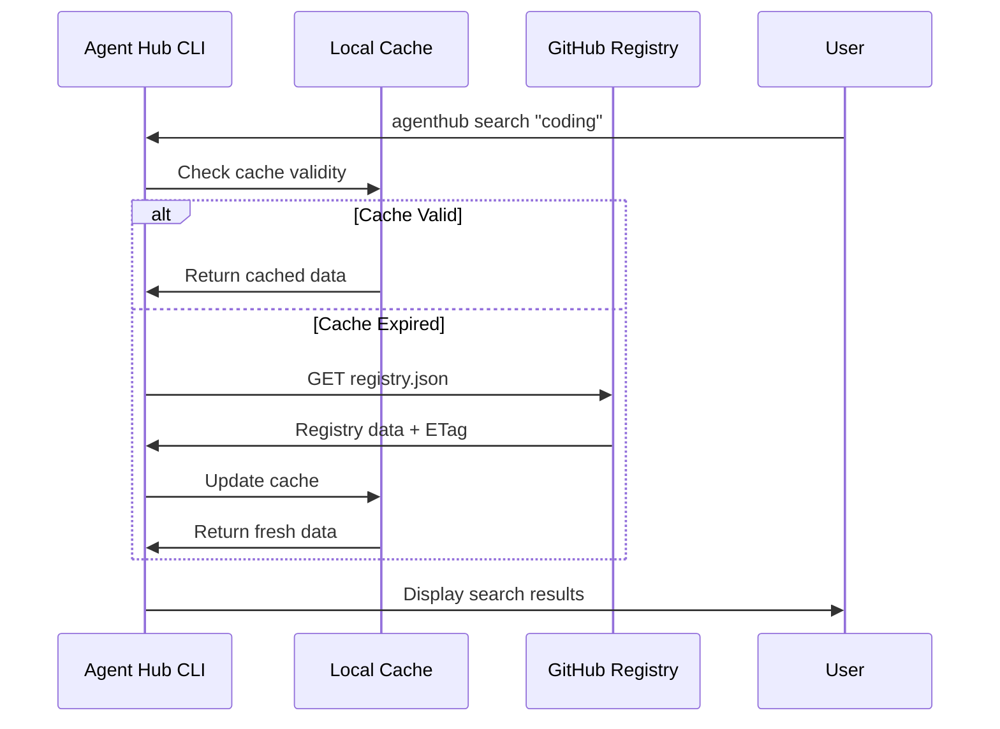
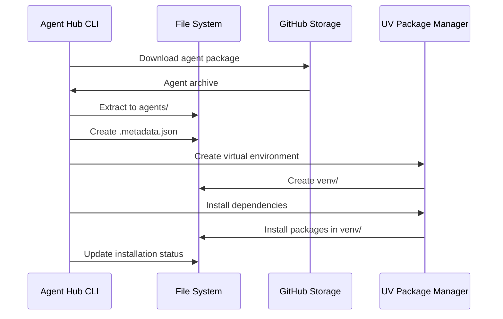
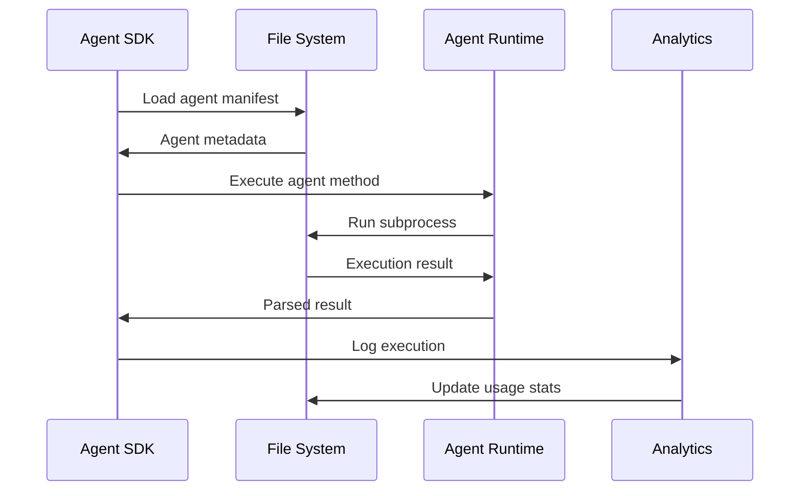
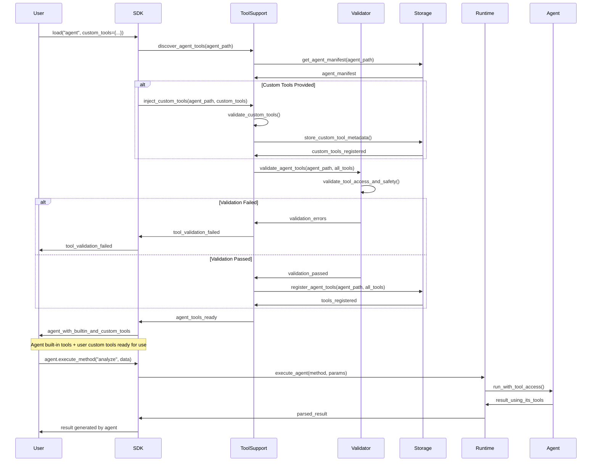

# Agent Hub Data Architecture

**Document Type**: Data Architecture  
**Author**: William  
**Date Created**: 2025-06-28  
**Last Updated**: 2025-06-28  
**Status**: Final  
**Level**: L2 - Container Level  
**Audience**: Technical Architects, Developers, Data Engineers  

## 🎯 **Data Architecture Overview**

Agent Hub uses a simple, file-based data architecture optimized for local execution and minimal operational overhead. The system avoids complex databases in favor of structured files, JSON configurations, and GitHub-hosted registry data.

## 📊 **Data Model**

### **Core Entities**



## 🗄️ **Data Storage Strategy**

### **Local File System Structure**

```
~/.agenthub/
├── agents/                          # Installed agents
│   ├── meta/
│   │   └── coding-agent/
│   │       ├── agent.yaml          # Agent manifest
│   │       ├── agent.py            # Main agent script
│   │       ├── venv/               # Virtual environment
│   │       ├── src/                # Agent source code
│   │       └── .metadata.json     # Installation metadata
│   └── openai/
│       └── data-analyzer/
│           ├── agent.yaml
│           ├── agent.py
│           ├── venv/
│           └── .metadata.json
├── cache/                          # Cached data
│   ├── registry.json              # Cached registry
│   ├── downloads/                  # Downloaded packages
│   │   ├── meta-coding-agent-1.0.0.tar.gz
│   │   └── openai-data-analyzer-2.1.0.tar.gz
│   └── metadata/                   # Cached agent metadata
│       ├── meta-coding-agent.json
│       └── openai-data-analyzer.json
├── config/                         # Configuration
│   ├── settings.yaml              # Global settings
│   ├── registry_cache.json        # Registry cache metadata
│   └── user_preferences.yaml      # User preferences
├── logs/                          # Execution logs
│   ├── agent_hub.log              # Main application log
│   ├── installation.log           # Installation activities
│   ├── execution.log              # Agent execution log
│   └── analytics.log              # Usage analytics
└── analytics/                     # Usage data
    ├── usage_stats.json           # Local usage statistics
    └── performance_metrics.json   # Performance data
```

### **Data Formats**

#### **Agent Manifest (agent.yaml)**
```yaml
name: "coding-agent"
version: "1.0.0"
description: "AI coding assistant for Python development"
author: "meta"
license: "MIT"
homepage: "https://github.com/meta/coding-agent"

interface:
  methods:
    generate_code:
      description: "Generate Python code from description"
      parameters:
        prompt: {type: "string", required: true}
        style: {type: "string", required: false, default: "clean"}
      returns: {type: "string", description: "Generated Python code"}

dependencies:
  python: ">=3.8"
  runtime: ["openai>=1.0.0", "tiktoken>=0.5.0"]

tags: ["coding", "python", "ai", "development"]
category: "development"
published_at: "2025-06-28T10:00:00Z"
```

#### **Installation Metadata (.metadata.json)**
```json
{
  "agent_path": "meta/coding-agent",
  "version": "1.0.0",
  "installed_at": "2025-06-28T10:30:00Z",
  "install_path": "/Users/user/.agenthub/agents/meta/coding-agent",
  "venv_path": "/Users/user/.agenthub/agents/meta/coding-agent/venv",
  "status": "installed",
  "dependencies_installed": true,
  "last_used": "2025-06-28T11:00:00Z",
  "usage_count": 15,
  "install_size_mb": 125.5,
  "config": {
    "auto_update": true,
    "execution_timeout": 30
  }
}
```

#### **Registry Cache (registry.json)**
```json
{
  "version": "1.0.0",
  "updated_at": "2025-06-28T10:00:00Z",
  "total_agents": 156,
  "cache_metadata": {
    "cached_at": "2025-06-28T10:00:00Z",
    "expires_at": "2025-06-28T11:00:00Z",
    "etag": "W/\"abc123\""
  },
  "categories": ["development", "data-science", "automation"],
  "featured_agents": ["meta/coding-agent", "openai/data-analyzer"],
  "trending_agents": ["user/automation-helper", "meta/code-reviewer"],
  "agents": {
    "meta/coding-agent": {
      "name": "coding-agent",
      "version": "1.0.0",
      "author": "meta",
      "description": "AI coding assistant for Python development",
      "category": "development",
      "tags": ["coding", "python", "ai"],
      "download_url": "https://github.com/meta/coding-agent/archive/v1.0.0.tar.gz",
      "published_at": "2025-06-28T10:00:00Z",
      "downloads": 1250,
      "rating": 4.8,
      "size_mb": 2.5,
      "verified": true
    }
  }
}
```

#### **Usage Analytics (usage_stats.json)**
```json
{
  "user_id": "anonymous_user_abc123",
  "created_at": "2025-06-28T10:00:00Z",
  "stats": {
    "total_agents_installed": 5,
    "total_executions": 147,
    "favorite_categories": ["development", "data-science"],
    "most_used_agents": [
      {"agent": "meta/coding-agent", "usage_count": 89},
      {"agent": "openai/data-analyzer", "usage_count": 34}
    ]
  },
  "recent_activity": [
    {
      "timestamp": "2025-06-28T11:00:00Z",
      "action": "execute_agent",
      "agent": "meta/coding-agent",
      "method": "generate_code",
      "execution_time_ms": 1250,
      "status": "success"
    }
  ]
}
```

## 🛠️ **Tool Data Formats**

### **Tool Metadata (tool_metadata.json)**
```json
{
  "agent_path": "meta/coding-agent",
  "tools": {
    "code_generator": {
      "name": "code_generator",
      "type": "builtin",
      "parameters": {
        "prompt": {"type": "string", "required": true},
        "language": {"type": "string", "required": false}
      },
      "return_type": "string",
      "description": "Generate code from natural language description",
      "is_custom": false,
      "registered_at": "2025-06-28T10:30:00Z"
    }
  }
}
```

### **Custom Tools (custom_tools.json)**
```json
{
  "agent_path": "meta/coding-agent",
  "custom_tools": {
    "domain_specific_analysis": {
      "name": "domain_specific_analysis",
      "function": "custom_domain_analysis",
      "metadata": {
        "parameters": {
          "data": {"type": "array", "required": true},
          "domain": {"type": "string", "required": true}
        },
        "return_type": "string",
        "description": "Domain-specific analysis tool"
      },
      "injected_at": "2025-06-28T11:00:00Z",
      "security_level": "medium"
    }
  }
}
```

## 🚀 **Data Flow Architecture**

### **Registry Data Flow**



### **Agent Installation Data Flow**



### **Agent Execution Data Flow**



### **Tool Support Data Flow**



## 💾 **Caching Strategy**

### **Registry Caching**

#### **Cache Invalidation**
```python
class RegistryCache:
    def __init__(self):
        self.cache_file = "~/.agenthub/cache/registry.json"
        self.cache_ttl = 3600  # 1 hour
    
    def is_cache_valid(self) -> bool:
        """Check if cache is still valid."""
        if not os.path.exists(self.cache_file):
            return False
        
        cache_data = self.load_cache()
        expires_at = datetime.fromisoformat(cache_data["cache_metadata"]["expires_at"])
        return datetime.now() < expires_at
    
    def update_cache(self, data: dict, etag: str):
        """Update cache with fresh data."""
        cache_data = {
            **data,
            "cache_metadata": {
                "cached_at": datetime.now().isoformat(),
                "expires_at": (datetime.now() + timedelta(seconds=self.cache_ttl)).isoformat(),
                "etag": etag
            }
        }
        with open(self.cache_file, 'w') as f:
            json.dump(cache_data, f)
```

### **Download Caching**

#### **Package Cache Management**
```python
class DownloadCache:
    def __init__(self):
        self.cache_dir = "~/.agenthub/cache/downloads"
    
    def get_cached_package(self, agent_path: str, version: str) -> Optional[str]:
        """Get cached package if available."""
        cache_file = f"{agent_path.replace('/', '-')}-{version}.tar.gz"
        cache_path = os.path.join(self.cache_dir, cache_file)
        
        if os.path.exists(cache_path):
            return cache_path
        return None
    
    def cache_package(self, agent_path: str, version: str, package_path: str):
        """Cache downloaded package."""
        cache_file = f"{agent_path.replace('/', '-')}-{version}.tar.gz"
        cache_path = os.path.join(self.cache_dir, cache_file)
        shutil.copy2(package_path, cache_path)
```

## 📈 **Analytics and Monitoring**

### **Usage Analytics Collection**

#### **Privacy-Preserving Analytics**
```python
class AnalyticsCollector:
    def __init__(self):
        self.analytics_file = "~/.agenthub/analytics/usage_stats.json"
        self.user_id = self.get_anonymous_user_id()
    
    def track_agent_execution(
        self, 
        agent_path: str, 
        method: str, 
        execution_time: float,
        status: str
    ):
        """Track agent execution for insights."""
        event = {
            "timestamp": datetime.now().isoformat(),
            "agent": agent_path,
            "method": method,
            "execution_time_ms": execution_time * 1000,
            "status": status
        }
        
        self.append_event(event)
        self.update_usage_stats(agent_path)
    
    def get_anonymous_user_id(self) -> str:
        """Generate anonymous user ID for analytics."""
        # Create stable anonymous ID based on machine characteristics
        import hashlib
        machine_id = f"{platform.node()}{os.path.expanduser('~')}"
        return hashlib.sha256(machine_id.encode()).hexdigest()[:16]
```

### **Performance Monitoring**

#### **Performance Metrics**
```python
class PerformanceMonitor:
    def __init__(self):
        self.metrics_file = "~/.agenthub/analytics/performance_metrics.json"
    
    def track_installation_performance(
        self, 
        agent_path: str, 
        install_time: float,
        download_size: int
    ):
        """Track installation performance."""
        metrics = {
            "timestamp": datetime.now().isoformat(),
            "agent": agent_path,
            "install_time_seconds": install_time,
            "download_size_mb": download_size / (1024 * 1024),
            "install_speed_mbps": (download_size / (1024 * 1024)) / install_time
        }
        
        self.append_metrics(metrics)
```

## 🔒 **Data Security and Privacy**

### **Privacy Protection**
- **Anonymous User IDs**: No personally identifiable information
- **Local Storage**: All data stored locally on user's machine
- **Opt-in Analytics**: Users can disable analytics collection
- **Data Retention**: Configurable data retention policies

### **Data Integrity**
- **Package Verification**: Checksum validation for downloaded packages
- **Atomic Operations**: Ensure data consistency during updates
- **Backup Strategy**: Local cache can be regenerated from source
- **Corruption Recovery**: Graceful handling of corrupted files

### **Access Control**
- **File Permissions**: Appropriate file system permissions
- **Process Isolation**: Agents can't access other agent data
- **Configuration Protection**: Secure storage of sensitive configuration

## 📊 **Data Migration and Backup**

### **Version Migration**
```python
class DataMigration:
    def migrate_data_format(self, from_version: str, to_version: str):
        """Migrate data between versions."""
        if from_version == "1.0.0" and to_version == "1.1.0":
            self.migrate_1_0_to_1_1()
    
    def migrate_1_0_to_1_1(self):
        """Example migration from v1.0 to v1.1."""
        # Update metadata format
        # Migrate configuration files
        # Update cache structure
```

### **Backup and Restore**
```python
class BackupManager:
    def backup_user_data(self, backup_path: str):
        """Backup user configuration and installed agents."""
        shutil.copytree("~/.agenthub/config", f"{backup_path}/config")
        shutil.copytree("~/.agenthub/agents", f"{backup_path}/agents")
    
    def restore_user_data(self, backup_path: str):
        """Restore user data from backup."""
        # Restore configuration
        # Reinstall agents
        # Rebuild cache
```

## 🎯 **Data Architecture Benefits**

### **Simplicity**
- **No Database**: Avoids database setup and maintenance
- **File-Based**: Easy to understand and debug
- **JSON/YAML**: Human-readable data formats
- **Standard Tools**: Uses standard file system operations

### **Performance**
- **Local Access**: No network latency for cached data
- **Efficient Caching**: Smart cache invalidation strategies
- **Parallel Operations**: Multiple agents can access data simultaneously
- **Minimal Overhead**: Low memory and storage requirements

### **Reliability**
- **No Single Point of Failure**: Distributed across file system
- **Self-Healing**: Can regenerate cache from source
- **Atomic Updates**: Consistent data state
- **Graceful Degradation**: Works even with cache failures

This data architecture provides a robust, simple, and efficient foundation for Agent Hub while maintaining excellent performance characteristics and minimal operational overhead.
