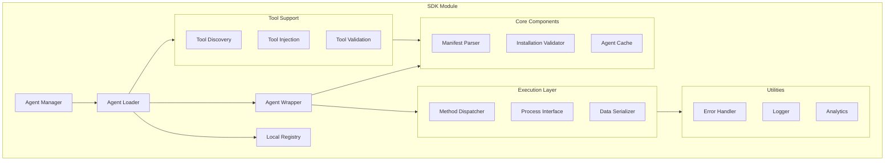

# Agent Hub SDK Module Design

**Document Type**: Module Design
**Author**: William
**Date Created**: 2025-06-28
**Last Updated**: 2025-06-28
**Status**: Final
**Level**: L3 - Module Level
**Audience**: Developers, Implementation Team

## 🎯 **Module Overview**

The SDK Module provides the Python library interface for Agent Hub, enabling the core "one-line integration" experience: `agent = amg.load("meta/coding-agent")`. This module handles agent loading, method dispatching, and execution orchestration while maintaining a clean, Pythonic API.

### **Business Justification**
- **Problem**: Users need simple, Pythonic interface for agent usage
- **User Outcome**: Developers can use agents with minimal integration code
- **Business Value**: Maximizes ease of use and developer productivity

## 🏗️ **Module Architecture**



## 🔧 **Core Components**

### **Tool Support System**

The SDK provides infrastructure for agents to access their built-in tools and for users to inject custom tools:

```python
# agenthub/tools/tool_support.py
class ToolSupport:
    """Provides infrastructure for agent tool access and custom tool injection."""

    def __init__(self):
        self.tool_discovery = ToolDiscovery()
        self.tool_injection = ToolInjection()
        self.tool_validation = ToolValidation()

    def discover_agent_tools(self, agent_path: str) -> Dict[str, ToolInfo]:
        """Discover agent's built-in tools from manifest."""
        return self.tool_discovery.discover_tools(agent_path)

    def inject_custom_tools(self, agent_path: str, custom_tools: Dict[str, Callable]) -> None:
        """Inject user's custom tools to an agent."""
        # Validate custom tools
        validation_result = self.tool_validation.validate_tools(custom_tools)
        if not validation_result.is_valid:
            raise ToolValidationError(f"Custom tools validation failed: {validation_result.errors}")

        # Inject tools
        self.tool_injection.inject_tools(agent_path, custom_tools)

    def get_available_tools(self, agent_path: str) -> Dict[str, ToolInfo]:
        """Get all available tools: built-in + custom."""
        builtin_tools = self.discover_agent_tools(agent_path)
        custom_tools = self.tool_injection.get_custom_tools(agent_path)

        return {
            "builtin": builtin_tools,
            "custom": custom_tools,
            "all": {**builtin_tools, **custom_tools}
        }
```

**Tool Discovery**: Automatically discovers agent's built-in tools from manifest
**Tool Injection**: Safely injects user-provided custom tools
**Tool Validation**: Validates tool safety and compatibility
**Tool Metadata**: Tracks tool information for discovery and usage

### **Public API Interface**

```python
# agenthub/__init__.py
"""Agent Hub SDK - One-line agent integration."""

__version__ = "1.0.0"

from .core import AgentManager
from .exceptions import AgentHubError, AgentNotFoundError, AgentExecutionError

# Global agent manager instance
_manager = AgentManager()

# Public API
def load(agent_path: str, custom_tools: Optional[Dict[str, Callable]] = None) -> 'AgentWrapper':
    """Load an agent for use with optional custom tools.

    Args:
        agent_path: Agent identifier (e.g., "meta/coding-agent")
        custom_tools: Optional dictionary of custom tools to inject

    Returns:
        AgentWrapper: Configured agent ready for use

    Example:
        >>> import agenthub as amg
        >>> agent = amg.load("meta/coding-agent")
        >>> code = agent.generate_code("neural network class")

        # With custom tools
        >>> def custom_analysis(data):
        ...     return f"Custom analysis: {len(data)} items"
        >>> agent = amg.load("meta/coding-agent",
        ...                  custom_tools={"custom_analysis": custom_analysis})
    """
    return _manager.load(agent_path, custom_tools)

def install(agent_path: str, version: str = None) -> None:
    """Install an agent programmatically.

    Args:
        agent_path: Agent identifier
        version: Specific version to install (optional)
    """
    return _manager.install(agent_path, version)

def list_installed() -> List[str]:
    """List all installed agents.

    Returns:
        List of installed agent paths
    """
    return _manager.list_installed()

def remove(agent_path: str) -> None:
    """Remove an installed agent.

    Args:
        agent_path: Agent identifier to remove
    """
    return _manager.remove(agent_path)

# Convenience exports
__all__ = ['load', 'install', 'list_installed', 'remove', 'AgentHubError']
```

### **Agent Manager**

```python
# agenthub/core/manager.py
import os
from typing import Dict, List, Optional
from .loader import AgentLoader
from .registry import LocalRegistry
from .wrapper import AgentWrapper
from ..utils import Logger, Analytics

class AgentManager:
    """Central manager for agent operations."""

    def __init__(self):
        self.loader = AgentLoader()
        self.registry = LocalRegistry()
        self.analytics = Analytics()
        self.logger = Logger(__name__)
        self._loaded_agents: Dict[str, AgentWrapper] = {}

    def load(self, agent_path: str) -> AgentWrapper:
        """Load an agent for use.

        Args:
            agent_path: Agent identifier (e.g., "meta/coding-agent")

        Returns:
            AgentWrapper: Ready-to-use agent

        Raises:
            AgentNotFoundError: If agent is not installed
            AgentLoadError: If agent fails to load
        """
        # Check cache first
        if agent_path in self._loaded_agents:
            self.logger.debug(f"Returning cached agent: {agent_path}")
            return self._loaded_agents[agent_path]

        # Verify agent is installed
        if not self.registry.is_installed(agent_path):
            raise AgentNotFoundError(f"Agent '{agent_path}' is not installed. Run: agenthub install {agent_path}")

        # Load agent
        self.logger.info(f"Loading agent: {agent_path}")
        agent_wrapper = self.loader.load_agent(agent_path)

        # Cache for future use
        self._loaded_agents[agent_path] = agent_wrapper

        # Track analytics
        self.analytics.track_agent_load(agent_path)

        return agent_wrapper

    def install(self, agent_path: str, version: str = None) -> None:
        """Install an agent programmatically."""
        from ..cli.services import InstallerService

        installer = InstallerService()
        installer.install_agent(agent_path, version)

        # Clear cache to force reload
        if agent_path in self._loaded_agents:
            del self._loaded_agents[agent_path]

    def list_installed(self) -> List[str]:
        """List all installed agents."""
        return self.registry.list_installed()

    def remove(self, agent_path: str) -> None:
        """Remove an installed agent."""
        self.registry.remove_agent(agent_path)

        # Clear from cache
        if agent_path in self._loaded_agents:
            del self._loaded_agents[agent_path]

    def reload(self, agent_path: str) -> AgentWrapper:
        """Force reload an agent (clear cache and reload)."""
        if agent_path in self._loaded_agents:
            del self._loaded_agents[agent_path]
        return self.load(agent_path)
```

### **Agent Loader**

```python
# agenthub/core/loader.py
import os
import yaml
from pathlib import Path
from typing import Dict, Any
from .wrapper import AgentWrapper
from .manifest import ManifestParser
from .validator import InstallationValidator
from ..utils import Logger
from ..exceptions import AgentLoadError

class AgentLoader:
    """Loads agents from local installations."""

    def __init__(self):
        self.manifest_parser = ManifestParser()
        self.validator = InstallationValidator()
        self.logger = Logger(__name__)
        self.agents_dir = Path.home() / ".agenthub" / "agents"

    def load_agent(self, agent_path: str) -> AgentWrapper:
        """Load an agent from local installation.

        Args:
            agent_path: Agent identifier (e.g., "meta/coding-agent")

        Returns:
            AgentWrapper: Configured agent wrapper

        Raises:
            AgentLoadError: If agent cannot be loaded
        """
        try:
            # Get agent directory
            agent_dir = self.agents_dir / agent_path
            if not agent_dir.exists():
                raise AgentLoadError(f"Agent directory not found: {agent_dir}")

            # Load and validate manifest
            manifest_path = agent_dir / "agent.yaml"
            if not manifest_path.exists():
                raise AgentLoadError(f"Agent manifest not found: {manifest_path}")

            manifest = self.manifest_parser.load_manifest(manifest_path)
            self.manifest_parser.validate_manifest(manifest)

            # Validate installation
            self.validator.validate_installation(agent_dir, manifest)

            # Create agent wrapper
            agent_wrapper = AgentWrapper(
                agent_path=agent_path,
                agent_dir=agent_dir,
                manifest=manifest
            )

            self.logger.info(f"Successfully loaded agent: {agent_path}")
            return agent_wrapper

        except Exception as e:
            self.logger.error(f"Failed to load agent {agent_path}: {e}")
            raise AgentLoadError(f"Failed to load agent '{agent_path}': {e}")

    def get_agent_info(self, agent_path: str) -> Dict[str, Any]:
        """Get agent information without loading it."""
        agent_dir = self.agents_dir / agent_path
        manifest_path = agent_dir / "agent.yaml"

        if not manifest_path.exists():
            return {}

        manifest = self.manifest_parser.load_manifest(manifest_path)
        return {
            "name": manifest.get("name"),
            "version": manifest.get("version"),
            "description": manifest.get("description"),
            "author": manifest.get("author"),
            "tags": manifest.get("tags", []),
            "methods": list(manifest.get("interface", {}).get("methods", {}).keys())
        }
```

### **Agent Wrapper**

```python
# agenthub/core/wrapper.py
import json
import time
from pathlib import Path
from typing import Dict, Any, Callable
from ..runtime import ProcessManager
from ..utils import Logger, Analytics
from ..exceptions import AgentExecutionError

class AgentWrapper:
    """Dynamic wrapper for agent methods with subprocess execution."""

    def __init__(self, agent_path: str, agent_dir: Path, manifest: Dict[str, Any]):
        self.agent_path = agent_path
        self.agent_dir = agent_dir
        self.manifest = manifest
        self.process_manager = ProcessManager()
        self.logger = Logger(__name__)
        self.analytics = Analytics()

        # Extract interface information
        self.interface = manifest.get("interface", {})
        self.methods = self.interface.get("methods", {})

        # Create dynamic methods
        self._create_dynamic_methods()

    def _create_dynamic_methods(self):
        """Create dynamic methods based on agent manifest."""
        for method_name, method_def in self.methods.items():
            # Create bound method
            method = self._create_method(method_name, method_def)
            setattr(self, method_name, method)

    def _create_method(self, method_name: str, method_def: Dict) -> Callable:
        """Create a callable method from manifest definition."""
        def dynamic_method(**kwargs):
            return self._execute_method(method_name, method_def, kwargs)

        # Set method metadata
        dynamic_method.__name__ = method_name
        dynamic_method.__doc__ = method_def.get("description", f"Execute {method_name}")

        return dynamic_method

    def _execute_method(self, method_name: str, method_def: Dict, parameters: Dict) -> Any:
        """Execute agent method via process manager."""
        start_time = time.time()

        try:
            # Validate parameters
            self._validate_parameters(method_def, parameters)

            # Execute via process manager
            self.logger.debug(f"Executing {self.agent_path}.{method_name}")
            result = self.process_manager.execute_agent(
                agent_dir=self.agent_dir,
                method=method_name,
                parameters=parameters
            )

            execution_time = time.time() - start_time

            # Track analytics
            self.analytics.track_method_execution(
                agent_path=self.agent_path,
                method=method_name,
                execution_time=execution_time,
                status="success"
            )

            # Return the result
            return result.get("result")

        except Exception as e:
            execution_time = time.time() - start_time

            # Track failed execution
            self.analytics.track_method_execution(
                agent_path=self.agent_path,
                method=method_name,
                execution_time=execution_time,
                status="error"
            )

            raise AgentExecutionError(
                f"Failed to execute {self.agent_path}.{method_name}: {e}"
            )

    def _validate_parameters(self, method_def: Dict, parameters: Dict):
        """Validate method parameters against definition."""
        expected_params = method_def.get("parameters", {})

        # Check required parameters
        for param_name, param_def in expected_params.items():
            if param_def.get("required", False) and param_name not in parameters:
                raise ValueError(f"Missing required parameter: {param_name}")

        # Check parameter types (basic validation)
        for param_name, value in parameters.items():
            if param_name in expected_params:
                expected_type = expected_params[param_name].get("type")
                if expected_type == "string" and not isinstance(value, str):
                    raise ValueError(f"Parameter {param_name} must be a string")
                elif expected_type == "number" and not isinstance(value, (int, float)):
                    raise ValueError(f"Parameter {param_name} must be a number")
                elif expected_type == "boolean" and not isinstance(value, bool):
                    raise ValueError(f"Parameter {param_name} must be a boolean")

    def get_interface(self) -> Dict[str, Any]:
        """Get agent interface definition."""
        return self.interface

    def get_methods(self) -> Dict[str, Dict]:
        """Get available methods and their definitions."""
        return self.methods

    def __repr__(self) -> str:
        """String representation of agent wrapper."""
        methods = list(self.methods.keys())
        return f"AgentWrapper('{self.agent_path}', methods={methods})"

    def __dir__(self):
        """Support for IDE autocompletion."""
        # Include both standard attributes and dynamic methods
        standard_attrs = ['get_interface', 'get_methods', 'agent_path', 'manifest']
        dynamic_methods = list(self.methods.keys())
        return standard_attrs + dynamic_methods
```

### **Manifest Parser**

```python
# agenthub/core/manifest.py
import yaml
from pathlib import Path
from typing import Dict, Any
from ..exceptions import ManifestError

class ManifestParser:
    """Parser and validator for agent manifests."""

    REQUIRED_FIELDS = ["name", "version", "description", "interface"]

    def load_manifest(self, manifest_path: Path) -> Dict[str, Any]:
        """Load agent manifest from YAML file."""
        try:
            with open(manifest_path, 'r') as f:
                manifest = yaml.safe_load(f)
            return manifest
        except yaml.YAMLError as e:
            raise ManifestError(f"Invalid YAML in manifest: {e}")
        except Exception as e:
            raise ManifestError(f"Failed to load manifest: {e}")

    def validate_manifest(self, manifest: Dict[str, Any]):
        """Validate agent manifest structure."""
        # Check required fields
        for field in self.REQUIRED_FIELDS:
            if field not in manifest:
                raise ManifestError(f"Missing required field in manifest: {field}")

        # Validate interface structure
        interface = manifest.get("interface", {})
        if "methods" not in interface:
            raise ManifestError("Manifest interface must define methods")

        methods = interface["methods"]
        if not isinstance(methods, dict) or not methods:
            raise ManifestError("Manifest must define at least one method")

        # Validate each method
        for method_name, method_def in methods.items():
            self._validate_method_definition(method_name, method_def)

    def _validate_method_definition(self, method_name: str, method_def: Dict):
        """Validate individual method definition."""
        if not isinstance(method_def, dict):
            raise ManifestError(f"Method {method_name} definition must be a dictionary")

        # Check for description
        if "description" not in method_def:
            raise ManifestError(f"Method {method_name} must have a description")

        # Validate parameters if present
        if "parameters" in method_def:
            parameters = method_def["parameters"]
            if not isinstance(parameters, dict):
                raise ManifestError(f"Method {method_name} parameters must be a dictionary")

            for param_name, param_def in parameters.items():
                if not isinstance(param_def, dict):
                    raise ManifestError(f"Parameter {param_name} definition must be a dictionary")

                if "type" not in param_def:
                    raise ManifestError(f"Parameter {param_name} must specify a type")
```

## 🔄 **Process Integration**

### **Process Manager Interface**

```python
# agenthub/runtime/process_interface.py
from pathlib import Path
from typing import Dict, Any
from .process_manager import ProcessManager as CoreProcessManager

class ProcessManager:
    """Interface to the core process management system."""

    def __init__(self):
        self.core_manager = CoreProcessManager()

    def execute_agent(
        self,
        agent_dir: Path,
        method: str,
        parameters: Dict[str, Any]
    ) -> Dict[str, Any]:
        """Execute agent method in isolated process.

        Args:
            agent_dir: Agent installation directory
            method: Method name to execute
            parameters: Method parameters

        Returns:
            Dict containing execution result
        """
        return self.core_manager.execute_agent(
            agent_path=str(agent_dir),
            method=method,
            parameters=parameters
        )
```

## 🧪 **Usage Examples**

### **Basic Usage**

```python
# Basic agent loading and usage
import agenthub as amg

# Load an agent
coding_agent = amg.load("meta/coding-agent")

# Use the agent
code = coding_agent.generate_code("Create a Python class for neural network")
print(code)

# Debug existing code
fixed_code = coding_agent.debug_code("def broken_function():\n    return x + y")
print(fixed_code["fixed_code"])
print(fixed_code["explanation"])
```

### **Advanced Usage**

```python
# Advanced usage with error handling
import agenthub as amg
from agenthub import AgentHubError

try:
    # Load multiple agents
    coding_agent = amg.load("meta/coding-agent")
    data_agent = amg.load("openai/data-analyzer")

    # Use agents with parameters
    code = coding_agent.generate_code(
        prompt="Neural network class",
        style="verbose"
    )

    analysis = data_agent.analyze_data(
        data_path="sales_data.csv",
        chart_type="bar"
    )

    # Introspect agent capabilities
    methods = coding_agent.get_methods()
    print(f"Available methods: {list(methods.keys())}")

except AgentHubError as e:
    print(f"Agent Hub error: {e}")
except Exception as e:
    print(f"Unexpected error: {e}")
```

### **Agent Information**

```python
# Get agent information
import agenthub as amg

# Load agent
agent = amg.load("meta/coding-agent")

# Get interface information
interface = agent.get_interface()
print(f"Agent: {interface}")

# Get available methods
methods = agent.get_methods()
for method_name, method_def in methods.items():
    print(f"{method_name}: {method_def['description']}")

    # Show parameters
    parameters = method_def.get('parameters', {})
    for param_name, param_def in parameters.items():
        required = "required" if param_def.get('required') else "optional"
        print(f"  - {param_name} ({param_def['type']}, {required})")
```

## 🧪 **Testing Strategy**

### **Unit Tests**

```python
# tests/sdk/test_agent_manager.py
import pytest
from unittest.mock import Mock, patch
from agenthub.core import AgentManager
from agenthub.exceptions import AgentNotFoundError

class TestAgentManager:
    def test_load_installed_agent(self, mock_registry, mock_loader):
        """Test loading an installed agent."""
        manager = AgentManager()
        mock_registry.is_installed.return_value = True
        mock_wrapper = Mock()
        mock_loader.load_agent.return_value = mock_wrapper

        result = manager.load("test/agent")

        assert result == mock_wrapper
        mock_loader.load_agent.assert_called_once_with("test/agent")

    def test_load_nonexistent_agent(self, mock_registry):
        """Test loading non-existent agent raises error."""
        manager = AgentManager()
        mock_registry.is_installed.return_value = False

        with pytest.raises(AgentNotFoundError):
            manager.load("nonexistent/agent")

    def test_load_caching(self, mock_registry, mock_loader):
        """Test that loaded agents are cached."""
        manager = AgentManager()
        mock_registry.is_installed.return_value = True
        mock_wrapper = Mock()
        mock_loader.load_agent.return_value = mock_wrapper

        # Load twice
        result1 = manager.load("test/agent")
        result2 = manager.load("test/agent")

        # Should only call loader once
        assert result1 == result2
        mock_loader.load_agent.assert_called_once()
```

### **Integration Tests**

```python
# tests/sdk/test_integration.py
import tempfile
import os
from pathlib import Path
import agenthub as amg

class TestSDKIntegration:
    def test_full_agent_usage_flow(self, sample_agent_dir):
        """Test complete agent usage flow."""
        # Set up test environment
        with tempfile.TemporaryDirectory() as temp_dir:
            os.environ['AGENTHUB_HOME'] = temp_dir

            # Install test agent
            amg.install("test/simple-agent")

            # Load agent
            agent = amg.load("test/simple-agent")

            # Use agent
            result = agent.test_method(input="test")
            assert result is not None

            # Check methods
            methods = agent.get_methods()
            assert "test_method" in methods
```

## 📊 **Performance Considerations**

### **Lazy Loading**
- **Agent Caching**: Cache loaded agents to avoid repeated initialization
- **Manifest Parsing**: Parse manifests only when needed
- **Method Creation**: Create dynamic methods on first access

### **Memory Management**
- **Weak References**: Use weak references for caches where appropriate
- **Cleanup**: Proper cleanup of subprocess resources
- **Memory Profiling**: Monitor memory usage in long-running applications

### **Execution Optimization**
- **Process Reuse**: Reuse subprocess instances where safe
- **Serialization**: Efficient JSON serialization for IPC
- **Timeout Management**: Configurable timeouts for agent execution

## 🔒 **Security Considerations**

### **Input Validation**
- **Parameter Validation**: Validate all method parameters
- **Path Validation**: Ensure agent paths are safe
- **JSON Safety**: Safe JSON serialization/deserialization

### **Process Security**
- **Subprocess Isolation**: Each agent runs in isolated process
- **Resource Limits**: Implement timeouts and memory limits
- **Error Handling**: Don't leak sensitive information in errors

### **Data Protection**
- **Parameter Sanitization**: Clean sensitive data from logs
- **Secure Communication**: Secure IPC between processes
- **Access Control**: Validate agent access permissions

This SDK module design provides a clean, Pythonic interface that makes AI agent integration as simple as importing a Python library while maintaining robust execution, error handling, and security features.
