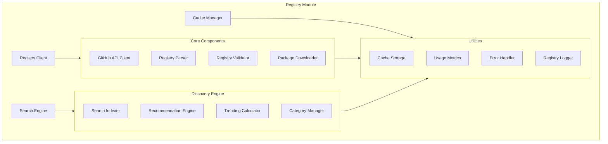

# Agent Hub Registry Module Design

**Document Type**: Module Design
**Author**: William
**Date Created**: 2025-06-28
**Last Updated**: 2025-06-28
**Status**: Final
**Level**: L3 - Module Level
**Audience**: Developers, Implementation Team

## 🎯 **Module Overview**

The Registry Module provides agent discovery, metadata management, and download coordination through GitHub-based registry integration. This module enables the "App Store for AI Agents" experience by connecting users to a curated catalog of available agents while maintaining zero operational overhead.

### **Business Justification**
- **Problem**: Users need an easy way to discover and install quality agents
- **User Outcome**: Developers can find and install agents like browsing an app store
- **Business Value**: Drives agent ecosystem growth and user engagement

## 🏗️ **Module Architecture**



## 🔧 **Core Components**

### **Registry Client**

```python
# agenthub/registry/client.py
import requests
import json
import base64
import time
from typing import Dict, List, Optional, Any
from pathlib import Path
from .cache import CacheManager
from .search import SearchEngine
from ..utils import Logger, RateLimiter

class RegistryClient:
    """Main interface for GitHub-based agent registry."""

    def __init__(self):
        self.base_url = "https://api.github.com"
        self.registry_repo = "agentplug/agent-registry"
        self.cache = CacheManager()
        self.search = SearchEngine()
        self.logger = Logger(__name__)
        self.rate_limiter = RateLimiter(requests_per_hour=4000)

        # GitHub token for higher rate limits (optional)
        self.github_token = os.getenv('GITHUB_TOKEN')
        self.session = self._create_session()

    def _create_session(self) -> requests.Session:
        """Create configured requests session."""
        session = requests.Session()
        session.headers.update({
            'User-Agent': 'Agent-Hub/1.0.0',
            'Accept': 'application/vnd.github.v3+json'
        })

        if self.github_token:
            session.headers['Authorization'] = f'token {self.github_token}'

        return session

    def get_registry(self, force_refresh: bool = False) -> Dict[str, Any]:
        """Get complete agent registry.

        Args:
            force_refresh: Skip cache and fetch fresh data

        Returns:
            Complete registry data
        """
        # Check cache first
        if not force_refresh:
            cached_registry = self.cache.get_registry()
            if cached_registry:
                self.logger.debug("Using cached registry data")
                return cached_registry

        # Fetch from GitHub
        self.logger.info("Fetching registry from GitHub")

        try:
            # Rate limiting
            self.rate_limiter.wait_if_needed()

            # Get registry file
            url = f"{self.base_url}/repos/{self.registry_repo}/contents/registry.json"
            response = self.session.get(url)
            response.raise_for_status()

            # Decode content
            content_data = response.json()
            content = base64.b64decode(content_data["content"]).decode('utf-8')
            registry = json.loads(content)

            # Cache the result
            self.cache.set_registry(registry, etag=response.headers.get('ETag'))

            self.logger.info(f"Fetched registry with {len(registry.get('agents', {}))} agents")
            return registry

        except requests.RequestException as e:
            self.logger.error(f"Failed to fetch registry: {e}")
            # Fall back to cache if available
            cached_registry = self.cache.get_registry(ignore_expiry=True)
            if cached_registry:
                self.logger.warning("Using expired cache due to network error")
                return cached_registry
            raise RegistryError(f"Failed to fetch registry and no cache available: {e}")

    def search_agents(
        self,
        query: str = None,
        category: str = None,
        tags: List[str] = None,
        limit: int = 20,
        sort: str = 'relevance'
    ) -> List[Dict[str, Any]]:
        """Search for agents in registry.

        Args:
            query: Search query string
            category: Filter by category
            tags: Filter by tags
            limit: Maximum results
            sort: Sort order (relevance, downloads, rating, recent)

        Returns:
            List of matching agents
        """
        registry = self.get_registry()
        return self.search.search_agents(
            registry=registry,
            query=query,
            category=category,
            tags=tags,
            limit=limit,
            sort=sort
        )

    def get_agent_metadata(self, agent_path: str) -> Optional[Dict[str, Any]]:
        """Get detailed metadata for specific agent.

        Args:
            agent_path: Agent identifier (e.g., "meta/coding-agent")

        Returns:
            Agent metadata or None if not found
        """
        registry = self.get_registry()
        agents = registry.get('agents', {})
        return agents.get(agent_path)

    def get_trending_agents(
        self,
        period: str = 'week',
        category: str = None,
        limit: int = 10
    ) -> List[Dict[str, Any]]:
        """Get trending agents.

        Args:
            period: Trending period (day, week, month)
            category: Filter by category
            limit: Number of agents to return

        Returns:
            List of trending agents
        """
        registry = self.get_registry()

        # Get trending list from registry
        trending_key = f'trending_{period}'
        trending_paths = registry.get(trending_key, registry.get('trending_agents', []))

        # Build agent list with metadata
        trending_agents = []
        agents = registry.get('agents', {})

        for agent_path in trending_paths[:limit]:
            agent_info = agents.get(agent_path)
            if agent_info and (not category or agent_info.get('category') == category):
                trending_agents.append({
                    **agent_info,
                    'agent_path': agent_path
                })

        return trending_agents

    def get_categories(self) -> List[str]:
        """Get all available categories.

        Returns:
            List of category names
        """
        registry = self.get_registry()
        return registry.get('categories', [])

    def get_featured_agents(self, limit: int = 5) -> List[Dict[str, Any]]:
        """Get featured agents.

        Args:
            limit: Number of featured agents to return

        Returns:
            List of featured agents
        """
        registry = self.get_registry()
        featured_paths = registry.get('featured_agents', [])

        featured_agents = []
        agents = registry.get('agents', {})

        for agent_path in featured_paths[:limit]:
            agent_info = agents.get(agent_path)
            if agent_info:
                featured_agents.append({
                    **agent_info,
                    'agent_path': agent_path
                })

        return featured_agents

    def download_agent(self, agent_path: str, version: str = None) -> Path:
        """Download agent package.

        Args:
            agent_path: Agent identifier
            version: Specific version (optional)

        Returns:
            Path to downloaded package
        """
        # Get agent metadata
        agent_info = self.get_agent_metadata(agent_path)
        if not agent_info:
            raise AgentNotFoundError(f"Agent not found: {agent_path}")

        # Determine download URL
        download_url = agent_info.get('download_url')
        if not download_url:
            raise RegistryError(f"No download URL for agent: {agent_path}")

        # Check cache first
        cache_key = f"{agent_path}_{version or 'latest'}"
        cached_package = self.cache.get_package(cache_key)
        if cached_package and cached_package.exists():
            self.logger.debug(f"Using cached package: {cached_package}")
            return cached_package

        # Download package
        self.logger.info(f"Downloading agent package: {agent_path}")

        try:
            self.rate_limiter.wait_if_needed()

            response = self.session.get(download_url, stream=True)
            response.raise_for_status()

            # Save to cache
            package_path = self.cache.save_package(cache_key, response)

            self.logger.info(f"Downloaded agent package: {package_path}")
            return package_path

        except requests.RequestException as e:
            raise RegistryError(f"Failed to download agent package: {e}")

    def validate_registry(self) -> bool:
        """Validate registry structure and content.

        Returns:
            True if registry is valid
        """
        try:
            registry = self.get_registry()

            # Check required fields
            required_fields = ['version', 'updated_at', 'agents']
            for field in required_fields:
                if field not in registry:
                    self.logger.error(f"Registry missing required field: {field}")
                    return False

            # Validate agents
            agents = registry.get('agents', {})
            for agent_path, agent_info in agents.items():
                if not self._validate_agent_info(agent_path, agent_info):
                    return False

            return True

        except Exception as e:
            self.logger.error(f"Registry validation failed: {e}")
            return False

    def _validate_agent_info(self, agent_path: str, agent_info: Dict[str, Any]) -> bool:
        """Validate individual agent information."""
        required_fields = ['name', 'version', 'description', 'download_url']

        for field in required_fields:
            if field not in agent_info:
                self.logger.error(f"Agent {agent_path} missing field: {field}")
                return False

        return True
```

### **Search Engine**

```python
# agenthub/registry/search.py
import re
from typing import Dict, List, Optional, Any, Set
from ..utils import Logger

class SearchEngine:
    """Provides search and filtering capabilities for agent registry."""

    def __init__(self):
        self.logger = Logger(__name__)

    def search_agents(
        self,
        registry: Dict[str, Any],
        query: str = None,
        category: str = None,
        tags: List[str] = None,
        limit: int = 20,
        sort: str = 'relevance'
    ) -> List[Dict[str, Any]]:
        """Search agents with multiple filters and sorting.

        Args:
            registry: Registry data
            query: Text search query
            category: Category filter
            tags: Tag filters
            limit: Maximum results
            sort: Sort method

        Returns:
            Filtered and sorted agent list
        """
        agents = registry.get('agents', {})
        results = []

        # Convert to list with agent_path
        for agent_path, agent_info in agents.items():
            agent_with_path = {
                **agent_info,
                'agent_path': agent_path
            }
            results.append(agent_with_path)

        # Apply filters
        if category:
            results = self._filter_by_category(results, category)

        if tags:
            results = self._filter_by_tags(results, tags)

        if query:
            results = self._filter_by_query(results, query)

        # Sort results
        results = self._sort_agents(results, sort, query)

        return results[:limit]

    def _filter_by_category(
        self,
        agents: List[Dict[str, Any]],
        category: str
    ) -> List[Dict[str, Any]]:
        """Filter agents by category."""
        return [
            agent for agent in agents
            if agent.get('category', '').lower() == category.lower()
        ]

    def _filter_by_tags(
        self,
        agents: List[Dict[str, Any]],
        tags: List[str]
    ) -> List[Dict[str, Any]]:
        """Filter agents by tags (OR logic)."""
        tag_set = {tag.lower() for tag in tags}

        filtered_agents = []
        for agent in agents:
            agent_tags = {tag.lower() for tag in agent.get('tags', [])}
            if tag_set.intersection(agent_tags):
                filtered_agents.append(agent)

        return filtered_agents

    def _filter_by_query(
        self,
        agents: List[Dict[str, Any]],
        query: str
    ) -> List[Dict[str, Any]]:
        """Filter agents by text query."""
        query_lower = query.lower()
        query_words = set(re.findall(r'\w+', query_lower))

        scored_agents = []

        for agent in agents:
            score = self._calculate_relevance_score(agent, query_lower, query_words)
            if score > 0:
                agent['_search_score'] = score
                scored_agents.append(agent)

        return scored_agents

    def _calculate_relevance_score(
        self,
        agent: Dict[str, Any],
        query: str,
        query_words: Set[str]
    ) -> float:
        """Calculate relevance score for search query."""
        score = 0.0

        # Exact name match (highest priority)
        name = agent.get('name', '').lower()
        if query in name:
            score += 10.0

        # Word matches in name
        name_words = set(re.findall(r'\w+', name))
        name_matches = len(query_words.intersection(name_words))
        score += name_matches * 5.0

        # Description matches
        description = agent.get('description', '').lower()
        if query in description:
            score += 3.0

        desc_words = set(re.findall(r'\w+', description))
        desc_matches = len(query_words.intersection(desc_words))
        score += desc_matches * 1.0

        # Tag matches
        tags = [tag.lower() for tag in agent.get('tags', [])]
        for tag in tags:
            if query in tag:
                score += 4.0
            tag_words = set(re.findall(r'\w+', tag))
            tag_matches = len(query_words.intersection(tag_words))
            score += tag_matches * 2.0

        # Author matches
        author = agent.get('author', '').lower()
        if query in author:
            score += 2.0

        return score

    def _sort_agents(
        self,
        agents: List[Dict[str, Any]],
        sort: str,
        query: str = None
    ) -> List[Dict[str, Any]]:
        """Sort agents by specified criteria."""

        if sort == 'relevance' and query:
            # Sort by search score (descending)
            return sorted(agents, key=lambda x: x.get('_search_score', 0), reverse=True)

        elif sort == 'downloads':
            # Sort by download count (descending)
            return sorted(agents, key=lambda x: x.get('downloads', 0), reverse=True)

        elif sort == 'rating':
            # Sort by rating (descending)
            return sorted(agents, key=lambda x: x.get('rating', 0), reverse=True)

        elif sort == 'recent':
            # Sort by published date (most recent first)
            return sorted(
                agents,
                key=lambda x: x.get('published_at', ''),
                reverse=True
            )

        elif sort == 'name':
            # Sort by name (alphabetical)
            return sorted(agents, key=lambda x: x.get('name', '').lower())

        else:
            # Default: downloads
            return sorted(agents, key=lambda x: x.get('downloads', 0), reverse=True)

    def get_suggestions(self, partial_query: str, limit: int = 5) -> List[str]:
        """Get search suggestions for partial query.

        Args:
            partial_query: Partial search string
            limit: Maximum suggestions

        Returns:
            List of suggested queries
        """
        # This would typically use a more sophisticated suggestion algorithm
        # For MVP, return simple word completions

        suggestions = []
        query_lower = partial_query.lower()

        # Common agent-related terms
        common_terms = [
            "coding", "data-science", "automation", "content", "analysis",
            "python", "javascript", "machine-learning", "nlp", "api",
            "testing", "deployment", "monitoring", "security", "documentation"
        ]

        for term in common_terms:
            if term.startswith(query_lower) and term != query_lower:
                suggestions.append(term)
                if len(suggestions) >= limit:
                    break

        return suggestions
```

### **Cache Manager**

```python
# agenthub/registry/cache.py
import json
import time
import shutil
from typing import Dict, Optional, Any
from pathlib import Path
from ..utils import Logger

class CacheManager:
    """Manages registry and package caching."""

    def __init__(self):
        self.logger = Logger(__name__)
        self.cache_dir = Path.home() / ".agenthub" / "cache"
        self.registry_file = self.cache_dir / "registry.json"
        self.packages_dir = self.cache_dir / "downloads"
        self.metadata_file = self.cache_dir / "cache_metadata.json"

        # Cache settings
        self.registry_ttl = 3600  # 1 hour
        self.package_ttl = 86400 * 7  # 1 week

        # Ensure directories exist
        self.cache_dir.mkdir(parents=True, exist_ok=True)
        self.packages_dir.mkdir(exist_ok=True)

    def get_registry(self, ignore_expiry: bool = False) -> Optional[Dict[str, Any]]:
        """Get cached registry data.

        Args:
            ignore_expiry: Return expired cache if available

        Returns:
            Cached registry data or None
        """
        if not self.registry_file.exists():
            return None

        try:
            # Load registry
            with open(self.registry_file, 'r') as f:
                registry = json.load(f)

            # Check expiry
            if not ignore_expiry:
                cache_metadata = registry.get('cache_metadata', {})
                expires_at = cache_metadata.get('expires_at', 0)

                if time.time() > expires_at:
                    self.logger.debug("Registry cache expired")
                    return None

            self.logger.debug("Using cached registry")
            return registry

        except (json.JSONDecodeError, IOError) as e:
            self.logger.warning(f"Failed to load cached registry: {e}")
            return None

    def set_registry(self, registry: Dict[str, Any], etag: str = None):
        """Cache registry data.

        Args:
            registry: Registry data to cache
            etag: ETag from HTTP response
        """
        try:
            # Add cache metadata
            registry['cache_metadata'] = {
                'cached_at': time.time(),
                'expires_at': time.time() + self.registry_ttl,
                'etag': etag
            }

            # Save to file
            with open(self.registry_file, 'w') as f:
                json.dump(registry, f, indent=2)

            self.logger.debug("Registry cached successfully")

        except IOError as e:
            self.logger.warning(f"Failed to cache registry: {e}")

    def get_package(self, cache_key: str) -> Optional[Path]:
        """Get cached package.

        Args:
            cache_key: Package cache key

        Returns:
            Path to cached package or None
        """
        package_path = self.packages_dir / f"{cache_key}.tar.gz"

        if not package_path.exists():
            return None

        # Check expiry
        try:
            stat = package_path.stat()
            age = time.time() - stat.st_mtime

            if age > self.package_ttl:
                self.logger.debug(f"Package cache expired: {cache_key}")
                package_path.unlink()
                return None

            return package_path

        except OSError:
            return None

    def save_package(self, cache_key: str, response: 'requests.Response') -> Path:
        """Save package to cache.

        Args:
            cache_key: Package cache key
            response: HTTP response with package data

        Returns:
            Path to cached package
        """
        package_path = self.packages_dir / f"{cache_key}.tar.gz"

        try:
            with open(package_path, 'wb') as f:
                for chunk in response.iter_content(chunk_size=8192):
                    f.write(chunk)

            self.logger.debug(f"Package cached: {cache_key}")
            return package_path

        except IOError as e:
            self.logger.warning(f"Failed to cache package: {e}")
            raise

    def clear_cache(self, packages_only: bool = False):
        """Clear cache data.

        Args:
            packages_only: Only clear package cache, keep registry
        """
        try:
            # Clear packages
            if self.packages_dir.exists():
                shutil.rmtree(self.packages_dir)
                self.packages_dir.mkdir(exist_ok=True)

            # Clear registry if requested
            if not packages_only and self.registry_file.exists():
                self.registry_file.unlink()

            self.logger.info("Cache cleared successfully")

        except Exception as e:
            self.logger.error(f"Failed to clear cache: {e}")

    def get_cache_stats(self) -> Dict[str, Any]:
        """Get cache statistics.

        Returns:
            Dictionary with cache stats
        """
        stats = {
            'registry_cached': self.registry_file.exists(),
            'registry_age_hours': 0,
            'packages_count': 0,
            'packages_size_mb': 0,
            'cache_dir_size_mb': 0
        }

        try:
            # Registry stats
            if self.registry_file.exists():
                registry_age = time.time() - self.registry_file.stat().st_mtime
                stats['registry_age_hours'] = round(registry_age / 3600, 2)

            # Package stats
            if self.packages_dir.exists():
                packages = list(self.packages_dir.glob('*.tar.gz'))
                stats['packages_count'] = len(packages)

                total_size = sum(p.stat().st_size for p in packages)
                stats['packages_size_mb'] = round(total_size / (1024 * 1024), 2)

            # Total cache size
            if self.cache_dir.exists():
                total_cache_size = sum(
                    f.stat().st_size for f in self.cache_dir.rglob('*') if f.is_file()
                )
                stats['cache_dir_size_mb'] = round(total_cache_size / (1024 * 1024), 2)

        except Exception as e:
            self.logger.warning(f"Failed to calculate cache stats: {e}")

        return stats
```

## 🧪 **Testing Strategy**

### **Unit Tests**

```python
# tests/registry/test_client.py
import pytest
from unittest.mock import Mock, patch
from agenthub.registry import RegistryClient

class TestRegistryClient:
    def test_get_registry_success(self, mock_requests):
        """Test successful registry fetch."""
        mock_response = Mock()
        mock_response.json.return_value = {
            "content": base64.b64encode(b'{"agents": {}}').decode()
        }
        mock_requests.get.return_value = mock_response

        client = RegistryClient()
        registry = client.get_registry()

        assert "agents" in registry

    def test_search_agents(self, sample_registry):
        """Test agent search functionality."""
        client = RegistryClient()

        with patch.object(client, 'get_registry', return_value=sample_registry):
            results = client.search_agents(query="coding", limit=5)

            assert len(results) <= 5
            assert all("coding" in str(agent).lower() for agent in results)
```

### **Integration Tests**

```python
# tests/registry/test_integration.py
import pytest
from agenthub.registry import RegistryClient

class TestRegistryIntegration:
    def test_full_discovery_flow(self, live_registry):
        """Test complete agent discovery flow."""
        client = RegistryClient()

        # Get registry
        registry = client.get_registry()
        assert registry

        # Search for agents
        results = client.search_agents(query="test")
        assert isinstance(results, list)

        # Get trending
        trending = client.get_trending_agents()
        assert isinstance(trending, list)

        # Download agent (if test agent available)
        if results:
            agent_path = results[0]['agent_path']
            package_path = client.download_agent(agent_path)
            assert package_path.exists()
```

## 📊 **Performance Considerations**

### **Caching Strategy**
- **Registry TTL**: 1 hour cache for registry data
- **Package Cache**: 1 week cache for downloaded packages
- **ETag Support**: Conditional requests to GitHub API
- **Offline Mode**: Graceful degradation when network unavailable

### **Rate Limiting**
- **GitHub API Limits**: 5,000 requests/hour for authenticated users
- **Request Batching**: Minimize API calls through caching
- **Exponential Backoff**: Handle rate limit errors gracefully

### **Search Performance**
- **In-Memory Search**: Fast client-side search and filtering
- **Fuzzy Matching**: Typo-tolerant search with scoring
- **Result Ranking**: Relevance-based result ordering

## 🔒 **Security Considerations**

### **GitHub Integration**
- **HTTPS Only**: All communication over HTTPS
- **Token Security**: Optional GitHub tokens for higher limits
- **Content Validation**: Validate all downloaded content
- **Rate Limiting**: Respect GitHub API limits

### **Package Security**
- **Checksum Validation**: Verify package integrity
- **Safe Downloads**: Validate download URLs
- **Cache Security**: Secure cache file permissions
- **Malware Detection**: Basic validation of package contents

This Registry Module design provides a robust, scalable foundation for agent discovery while leveraging GitHub's infrastructure to minimize operational overhead and maximize reliability.
