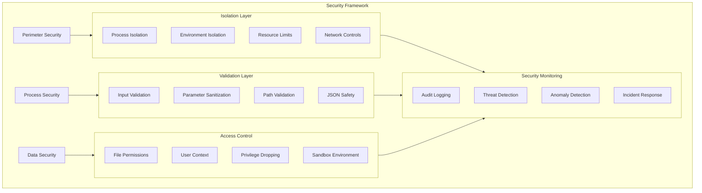

# Agent Hub Security Design

**Document Type**: Security Architecture
**Author**: William
**Date Created**: 2025-06-28
**Last Updated**: 2025-06-28
**Status**: Final
**Level**: L4 - Cross-cutting Design
**Audience**: Security Team, Developers, DevOps Team

## 🎯 **Security Overview**

Agent Hub implements a comprehensive security framework that protects against common threats while maintaining usability and performance. The design follows defense-in-depth principles with multiple layers of security controls across process isolation, input validation, access control, and secure communication.

### **Business Justification**
- **Problem**: AI agents can pose security risks through code execution and data access
- **User Outcome**: Developers can safely use agents without compromising system security
- **Business Value**: Enables enterprise adoption through strong security posture

## 🏗️ **Security Architecture**



## 🛡️ **Process Isolation Security**

### **Subprocess Sandboxing**

```python
# agenthub/security/process_sandbox.py
import os
import resource
import subprocess
import tempfile
from pathlib import Path
from typing import Dict, List, Optional
from ..utils import Logger

class ProcessSandbox:
    """Provides secure sandboxing for agent processes."""

    def __init__(self):
        self.logger = Logger(__name__)

        # Resource limits
        self.max_memory_mb = 1024
        self.max_cpu_time = 300  # 5 minutes
        self.max_file_size_mb = 100
        self.max_processes = 10
        self.max_open_files = 100

        # Network restrictions
        self.allow_network = True  # Configurable
        self.allowed_domains = []  # Whitelist

        # File system restrictions
        self.read_only_paths = ['/usr', '/bin', '/lib']
        self.forbidden_paths = ['/etc/passwd', '/etc/shadow']

    def create_secure_environment(self, agent_dir: Path) -> Dict[str, str]:
        """Create secure environment for agent execution.

        Args:
            agent_dir: Agent installation directory

        Returns:
            Dictionary of environment variables
        """
        # Minimal environment to reduce attack surface
        secure_env = {
            # Essential paths
            'PATH': '/usr/local/bin:/usr/bin:/bin',
            'HOME': str(agent_dir),
            'USER': 'agent',
            'SHELL': '/bin/sh',

            # Locale settings
            'LANG': 'en_US.UTF-8',
            'LC_ALL': 'en_US.UTF-8',

            # Python settings
            'PYTHONPATH': str(agent_dir / 'src'),
            'PYTHONUNBUFFERED': '1',
            'PYTHONDONTWRITEBYTECODE': '1',
            'PYTHONHASHSEED': '0',  # Deterministic hash

            # Security settings
            'TMPDIR': str(agent_dir / 'tmp'),
            'TEMP': str(agent_dir / 'tmp'),
            'TMP': str(agent_dir / 'tmp'),
        }

        # Remove potentially dangerous variables
        dangerous_vars = [
            'LD_PRELOAD', 'LD_LIBRARY_PATH', 'DYLD_LIBRARY_PATH',
            'PYTHONSTARTUP', 'PYTHON_STARTUP',
            'SSH_AUTH_SOCK', 'SSH_AGENT_PID'
        ]

        for var in dangerous_vars:
            secure_env.pop(var, None)

        return secure_env

    def setup_resource_limits(self):
        """Configure resource limits for subprocess."""
        try:
            # Memory limit (virtual memory)
            memory_bytes = self.max_memory_mb * 1024 * 1024
            resource.setrlimit(resource.RLIMIT_AS, (memory_bytes, memory_bytes))

            # CPU time limit
            resource.setrlimit(resource.RLIMIT_CPU, (self.max_cpu_time, self.max_cpu_time))

            # File size limit
            file_size_bytes = self.max_file_size_mb * 1024 * 1024
            resource.setrlimit(resource.RLIMIT_FSIZE, (file_size_bytes, file_size_bytes))

            # Process limit
            resource.setrlimit(resource.RLIMIT_NPROC, (self.max_processes, self.max_processes))

            # Open files limit
            resource.setrlimit(resource.RLIMIT_NOFILE, (self.max_open_files, self.max_open_files))

            # Core dump disabled
            resource.setrlimit(resource.RLIMIT_CORE, (0, 0))

            self.logger.debug("Resource limits configured successfully")

        except Exception as e:
            self.logger.warning(f"Failed to set resource limits: {e}")
            # Continue execution but log the failure

    def validate_agent_path(self, agent_path: Path) -> bool:
        """Validate agent path for security.

        Args:
            agent_path: Path to validate

        Returns:
            True if path is safe
        """
        try:
            # Resolve path to prevent directory traversal
            resolved_path = agent_path.resolve()

            # Check if path is within allowed directories
            agenthub_dir = Path.home() / '.agenthub'
            if not str(resolved_path).startswith(str(agenthub_dir.resolve())):
                self.logger.warning(f"Agent path outside allowed directory: {resolved_path}")
                return False

            # Check for suspicious path components
            suspicious_components = ['..', '.ssh', '.aws', '.env']
            for component in resolved_path.parts:
                if component in suspicious_components:
                    self.logger.warning(f"Suspicious path component: {component}")
                    return False

            return True

        except Exception as e:
            self.logger.error(f"Path validation failed: {e}")
            return False

    def create_temp_directory(self, agent_dir: Path) -> Path:
        """Create secure temporary directory for agent.

        Args:
            agent_dir: Agent base directory

        Returns:
            Path to temporary directory
        """
        temp_dir = agent_dir / 'tmp'
        temp_dir.mkdir(mode=0o700, exist_ok=True)  # Owner only

        # Set secure permissions
        os.chmod(temp_dir, 0o700)

        return temp_dir
```

### **Network Security Controls**

```python
# agenthub/security/network_controls.py
import socket
import urllib.parse
from typing import List, Set, Optional
from ..utils import Logger

class NetworkSecurityControls:
    """Controls network access for agent processes."""

    def __init__(self):
        self.logger = Logger(__name__)

        # Default blocked domains and IPs
        self.blocked_domains = {
            'localhost', '127.0.0.1', '0.0.0.0',
            '10.0.0.0/8', '172.16.0.0/12', '192.168.0.0/16',  # Private networks
            '169.254.0.0/16',  # Link-local
            '224.0.0.0/4',     # Multicast
        }

        # Allowed domains (whitelist mode)
        self.allowed_domains: Set[str] = set()

        # Allowed protocols
        self.allowed_protocols = {'http', 'https'}

        # Network policy
        self.network_policy = 'restricted'  # 'open', 'restricted', 'blocked'

    def validate_url(self, url: str) -> bool:
        """Validate URL for security.

        Args:
            url: URL to validate

        Returns:
            True if URL is allowed
        """
        try:
            parsed = urllib.parse.urlparse(url)

            # Check protocol
            if parsed.scheme not in self.allowed_protocols:
                self.logger.warning(f"Blocked protocol: {parsed.scheme}")
                return False

            # Check domain
            if not self._is_domain_allowed(parsed.hostname):
                self.logger.warning(f"Blocked domain: {parsed.hostname}")
                return False

            # Check for suspicious patterns
            if self._contains_suspicious_patterns(url):
                self.logger.warning(f"Suspicious URL pattern: {url}")
                return False

            return True

        except Exception as e:
            self.logger.error(f"URL validation failed: {e}")
            return False

    def _is_domain_allowed(self, domain: Optional[str]) -> bool:
        """Check if domain is allowed."""
        if not domain:
            return False

        domain_lower = domain.lower()

        # Check blocked domains
        if domain_lower in self.blocked_domains:
            return False

        # Check if it's a private IP
        if self._is_private_ip(domain_lower):
            return False

        # If whitelist mode, check allowed domains
        if self.allowed_domains and domain_lower not in self.allowed_domains:
            return False

        return True

    def _is_private_ip(self, address: str) -> bool:
        """Check if address is a private IP."""
        try:
            import ipaddress
            ip = ipaddress.ip_address(address)
            return ip.is_private or ip.is_loopback or ip.is_link_local
        except ValueError:
            return False

    def _contains_suspicious_patterns(self, url: str) -> bool:
        """Check for suspicious URL patterns."""
        suspicious_patterns = [
            'file://', 'ftp://', 'data:', 'javascript:',
            '../', '..\\', '%2e%2e', '%252e%252e',
            'localhost', '127.0.0.1', '0.0.0.0'
        ]

        url_lower = url.lower()
        return any(pattern in url_lower for pattern in suspicious_patterns)
```

## 🔒 **Input Validation and Sanitization**

### **Parameter Validation**

```python
# agenthub/security/input_validator.py
import json
import re
from typing import Any, Dict, List, Optional, Union
from ..exceptions import ValidationError
from ..utils import Logger

class InputValidator:
    """Validates and sanitizes input parameters for agent execution."""

    def __init__(self):
        self.logger = Logger(__name__)

        # Size limits
        self.max_string_length = 10000
        self.max_list_length = 1000
        self.max_dict_size = 100
        self.max_json_size = 100000  # 100KB

        # Pattern blacklists
        self.dangerous_patterns = [
            r'<script\b[^<]*(?:(?!<\/script>)<[^<]*)*<\/script>',  # Script tags
            r'javascript:',  # JavaScript URLs
            r'data:.*base64',  # Data URLs with base64
            r'eval\s*\(',  # eval() calls
            r'exec\s*\(',  # exec() calls
            r'import\s+os|import\s+subprocess|import\s+sys',  # Dangerous imports
            r'__.*__',  # Python dunder methods
            r'\.\./',  # Directory traversal
            r'[;&|`$]',  # Shell injection characters
        ]

        self.compiled_patterns = [re.compile(pattern, re.IGNORECASE) for pattern in self.dangerous_patterns]

    def validate_parameters(
        self,
        parameters: Dict[str, Any],
        method_def: Dict[str, Any]
    ) -> Dict[str, Any]:
        """Validate method parameters against definition.

        Args:
            parameters: Input parameters
            method_def: Method definition from manifest

        Returns:
            Validated and sanitized parameters

        Raises:
            ValidationError: If validation fails
        """
        if not isinstance(parameters, dict):
            raise ValidationError("parameters", "must be a dictionary")

        # Check parameter count
        if len(parameters) > self.max_dict_size:
            raise ValidationError("parameters", f"too many parameters (max {self.max_dict_size})")

        expected_params = method_def.get('parameters', {})
        validated_params = {}

        # Validate each parameter
        for param_name, param_value in parameters.items():
            # Check parameter name
            if not self._is_valid_parameter_name(param_name):
                raise ValidationError("parameter name", f"invalid name: {param_name}")

            # Get parameter definition
            param_def = expected_params.get(param_name)
            if not param_def:
                raise ValidationError("parameter", f"unexpected parameter: {param_name}")

            # Validate and sanitize value
            validated_value = self._validate_parameter_value(
                param_name, param_value, param_def
            )
            validated_params[param_name] = validated_value

        # Check required parameters
        for param_name, param_def in expected_params.items():
            if param_def.get('required', False) and param_name not in validated_params:
                raise ValidationError("parameter", f"missing required parameter: {param_name}")

        return validated_params

    def _validate_parameter_value(
        self,
        param_name: str,
        value: Any,
        param_def: Dict[str, Any]
    ) -> Any:
        """Validate individual parameter value."""

        # Type validation
        expected_type = param_def.get('type', 'string')
        validated_value = self._validate_type(param_name, value, expected_type)

        # Content validation
        validated_value = self._sanitize_content(param_name, validated_value)

        # Range/length validation
        self._validate_constraints(param_name, validated_value, param_def)

        return validated_value

    def _validate_type(self, param_name: str, value: Any, expected_type: str) -> Any:
        """Validate parameter type."""

        if expected_type == 'string':
            if not isinstance(value, str):
                raise ValidationError(param_name, f"must be string, got {type(value).__name__}")
            return value

        elif expected_type == 'number':
            if not isinstance(value, (int, float)):
                raise ValidationError(param_name, f"must be number, got {type(value).__name__}")
            return value

        elif expected_type == 'integer':
            if not isinstance(value, int):
                raise ValidationError(param_name, f"must be integer, got {type(value).__name__}")
            return value

        elif expected_type == 'boolean':
            if not isinstance(value, bool):
                raise ValidationError(param_name, f"must be boolean, got {type(value).__name__}")
            return value

        elif expected_type == 'array':
            if not isinstance(value, list):
                raise ValidationError(param_name, f"must be array, got {type(value).__name__}")
            return value

        elif expected_type == 'object':
            if not isinstance(value, dict):
                raise ValidationError(param_name, f"must be object, got {type(value).__name__}")
            return value

        else:
            # Unknown type, treat as string
            return str(value)

    def _sanitize_content(self, param_name: str, value: Any) -> Any:
        """Sanitize parameter content."""

        if isinstance(value, str):
            # Check string length
            if len(value) > self.max_string_length:
                raise ValidationError(param_name, f"string too long (max {self.max_string_length})")

            # Check for dangerous patterns
            for pattern in self.compiled_patterns:
                if pattern.search(value):
                    raise ValidationError(param_name, "contains potentially dangerous content")

            # Remove null bytes and control characters
            value = value.replace('\x00', '').replace('\r', '').replace('\b', '')

            return value

        elif isinstance(value, list):
            if len(value) > self.max_list_length:
                raise ValidationError(param_name, f"array too long (max {self.max_list_length})")

            # Recursively sanitize list items
            return [self._sanitize_content(f"{param_name}[{i}]", item) for i, item in enumerate(value)]

        elif isinstance(value, dict):
            if len(value) > self.max_dict_size:
                raise ValidationError(param_name, f"object too large (max {self.max_dict_size})")

            # Recursively sanitize dict values
            sanitized_dict = {}
            for key, val in value.items():
                if not self._is_valid_parameter_name(str(key)):
                    raise ValidationError(param_name, f"invalid key name: {key}")
                sanitized_dict[str(key)] = self._sanitize_content(f"{param_name}.{key}", val)

            return sanitized_dict

        else:
            return value

    def _validate_constraints(self, param_name: str, value: Any, param_def: Dict[str, Any]):
        """Validate parameter constraints."""

        # Minimum/maximum for numbers
        if isinstance(value, (int, float)):
            min_val = param_def.get('minimum')
            max_val = param_def.get('maximum')

            if min_val is not None and value < min_val:
                raise ValidationError(param_name, f"below minimum value {min_val}")

            if max_val is not None and value > max_val:
                raise ValidationError(param_name, f"above maximum value {max_val}")

        # Length constraints for strings and arrays
        if isinstance(value, (str, list)):
            min_length = param_def.get('min_length')
            max_length = param_def.get('max_length')

            if min_length is not None and len(value) < min_length:
                raise ValidationError(param_name, f"below minimum length {min_length}")

            if max_length is not None and len(value) > max_length:
                raise ValidationError(param_name, f"above maximum length {max_length}")

        # Pattern matching for strings
        if isinstance(value, str):
            pattern = param_def.get('pattern')
            if pattern:
                if not re.match(pattern, value):
                    raise ValidationError(param_name, f"does not match required pattern")

    def _is_valid_parameter_name(self, name: str) -> bool:
        """Check if parameter name is valid."""
        if not isinstance(name, str):
            return False

        # Must be alphanumeric with underscores, start with letter
        if not re.match(r'^[a-zA-Z][a-zA-Z0-9_]*$', name):
            return False

        # No Python keywords or builtins
        python_keywords = {
            'False', 'None', 'True', 'and', 'as', 'assert', 'break', 'class',
            'continue', 'def', 'del', 'elif', 'else', 'except', 'finally',
            'for', 'from', 'global', 'if', 'import', 'in', 'is', 'lambda',
            'nonlocal', 'not', 'or', 'pass', 'raise', 'return', 'try',
            'while', 'with', 'yield', 'exec', 'eval'
        }

        if name in python_keywords:
            return False

        return True

    def validate_json_size(self, data: Any) -> bool:
        """Validate JSON data size."""
        try:
            json_str = json.dumps(data)
            if len(json_str.encode('utf-8')) > self.max_json_size:
                raise ValidationError("json_data", f"JSON too large (max {self.max_json_size} bytes)")
            return True
        except Exception as e:
            raise ValidationError("json_data", f"JSON serialization failed: {e}")
```

## 🔐 **Access Control and Permissions**

### **File System Security**

```python
# agenthub/security/filesystem_security.py
import os
import stat
from pathlib import Path
from typing import Set, List
from ..utils import Logger

class FileSystemSecurity:
    """Manages file system access controls for agents."""

    def __init__(self):
        self.logger = Logger(__name__)

        # Allowed directories for agent access
        self.allowed_base_dirs = {
            Path.home() / '.agenthub',
            Path('/tmp'),
            Path('/var/tmp')
        }

        # Forbidden directories
        self.forbidden_dirs = {
            Path('/etc'),
            Path('/var/log'),
            Path('/sys'),
            Path('/proc'),
            Path('/dev'),
            Path.home() / '.ssh',
            Path.home() / '.aws',
            Path.home() / '.kube'
        }

    def setup_agent_permissions(self, agent_dir: Path) -> bool:
        """Set up secure permissions for agent directory.

        Args:
            agent_dir: Agent installation directory

        Returns:
            True if permissions set successfully
        """
        try:
            # Set directory permissions (owner read/write/execute only)
            os.chmod(agent_dir, stat.S_IRWXU)  # 0o700

            # Set file permissions for agent files
            for file_path in agent_dir.rglob('*'):
                if file_path.is_file():
                    if file_path.suffix == '.py':
                        # Python files: owner read/write
                        os.chmod(file_path, stat.S_IRUSR | stat.S_IWUSR)  # 0o600
                    elif file_path.name in ['agent.yaml', 'requirements.txt']:
                        # Config files: owner read/write
                        os.chmod(file_path, stat.S_IRUSR | stat.S_IWUSR)  # 0o600
                    else:
                        # Other files: owner read only
                        os.chmod(file_path, stat.S_IRUSR)  # 0o400
                elif file_path.is_dir():
                    # Subdirectories: owner read/write/execute
                    os.chmod(file_path, stat.S_IRWXU)  # 0o700

            self.logger.debug(f"Set secure permissions for {agent_dir}")
            return True

        except Exception as e:
            self.logger.error(f"Failed to set permissions: {e}")
            return False

    def validate_file_access(self, file_path: Path, operation: str) -> bool:
        """Validate file access request.

        Args:
            file_path: Path to file
            operation: Type of operation (read, write, execute)

        Returns:
            True if access is allowed
        """
        try:
            resolved_path = file_path.resolve()

            # Check if path is within allowed directories
            if not self._is_path_allowed(resolved_path):
                self.logger.warning(f"File access denied: {resolved_path}")
                return False

            # Check if path is explicitly forbidden
            if self._is_path_forbidden(resolved_path):
                self.logger.warning(f"Access to forbidden path: {resolved_path}")
                return False

            # Check operation-specific permissions
            if operation == 'write' and not self._is_write_allowed(resolved_path):
                self.logger.warning(f"Write access denied: {resolved_path}")
                return False

            return True

        except Exception as e:
            self.logger.error(f"File access validation failed: {e}")
            return False

    def _is_path_allowed(self, path: Path) -> bool:
        """Check if path is within allowed directories."""
        for allowed_dir in self.allowed_base_dirs:
            try:
                path.relative_to(allowed_dir.resolve())
                return True
            except ValueError:
                continue
        return False

    def _is_path_forbidden(self, path: Path) -> bool:
        """Check if path is explicitly forbidden."""
        for forbidden_dir in self.forbidden_dirs:
            try:
                path.relative_to(forbidden_dir.resolve())
                return True
            except ValueError:
                continue
        return False

    def _is_write_allowed(self, path: Path) -> bool:
        """Check if write operations are allowed for path."""
        # Only allow writes within agent directories and temp directories
        agent_dirs = Path.home() / '.agenthub' / 'agents'
        temp_dirs = [Path('/tmp'), Path('/var/tmp')]

        # Check agent directories
        try:
            path.relative_to(agent_dirs.resolve())
            return True
        except ValueError:
            pass

        # Check temp directories
        for temp_dir in temp_dirs:
            try:
                path.relative_to(temp_dir.resolve())
                return True
            except ValueError:
                continue

        return False
```

## 📊 **Security Monitoring and Auditing**

### **Security Event Logging**

```python
# agenthub/security/audit_logger.py
import json
import time
from pathlib import Path
from typing import Dict, Any, Optional
from ..utils import Logger

class SecurityAuditLogger:
    """Logs security events for monitoring and compliance."""

    def __init__(self):
        self.logger = Logger(__name__)
        self.audit_file = Path.home() / '.agenthub' / 'logs' / 'security_audit.log'
        self.audit_file.parent.mkdir(parents=True, exist_ok=True)

    def log_agent_execution(
        self,
        agent_path: str,
        method: str,
        user: str = None,
        success: bool = True,
        details: Dict[str, Any] = None
    ):
        """Log agent execution event."""
        event = {
            'event_type': 'agent_execution',
            'timestamp': time.time(),
            'agent_path': agent_path,
            'method': method,
            'user': user or os.getenv('USER', 'unknown'),
            'success': success,
            'details': details or {}
        }
        self._write_audit_event(event)

    def log_security_violation(
        self,
        violation_type: str,
        description: str,
        severity: str = 'medium',
        context: Dict[str, Any] = None
    ):
        """Log security violation."""
        event = {
            'event_type': 'security_violation',
            'timestamp': time.time(),
            'violation_type': violation_type,
            'description': description,
            'severity': severity,
            'context': context or {}
        }
        self._write_audit_event(event)

        # Also log to main logger for immediate attention
        self.logger.warning(f"Security violation [{violation_type}]: {description}")

    def log_file_access(
        self,
        file_path: str,
        operation: str,
        allowed: bool,
        agent_path: str = None
    ):
        """Log file access attempt."""
        event = {
            'event_type': 'file_access',
            'timestamp': time.time(),
            'file_path': file_path,
            'operation': operation,
            'allowed': allowed,
            'agent_path': agent_path
        }
        self._write_audit_event(event)

    def log_network_access(
        self,
        url: str,
        allowed: bool,
        agent_path: str = None,
        reason: str = None
    ):
        """Log network access attempt."""
        event = {
            'event_type': 'network_access',
            'timestamp': time.time(),
            'url': url,
            'allowed': allowed,
            'agent_path': agent_path,
            'reason': reason
        }
        self._write_audit_event(event)

    def _write_audit_event(self, event: Dict[str, Any]):
        """Write audit event to log file."""
        try:
            with open(self.audit_file, 'a') as f:
                f.write(json.dumps(event) + '\n')
        except Exception as e:
            self.logger.error(f"Failed to write audit event: {e}")
```

## 🧪 **Security Testing**

### **Security Test Framework**

```python
# tests/security/test_security.py
import pytest
import tempfile
from pathlib import Path
from agenthub.security import ProcessSandbox, InputValidator, FileSystemSecurity

class TestProcessSecurity:
    def test_resource_limits(self):
        """Test resource limit enforcement."""
        sandbox = ProcessSandbox()

        # Test memory limit
        sandbox.max_memory_mb = 100
        sandbox.setup_resource_limits()

        # Would need to test actual process execution
        assert sandbox.max_memory_mb == 100

    def test_environment_sanitization(self):
        """Test environment variable sanitization."""
        sandbox = ProcessSandbox()

        with tempfile.TemporaryDirectory() as temp_dir:
            agent_dir = Path(temp_dir) / 'test_agent'
            agent_dir.mkdir()

            env = sandbox.create_secure_environment(agent_dir)

            # Check dangerous variables are removed
            assert 'LD_PRELOAD' not in env
            assert 'SSH_AUTH_SOCK' not in env

            # Check secure variables are set
            assert env['PYTHONHASHSEED'] == '0'
            assert env['HOME'] == str(agent_dir)

class TestInputValidation:
    def test_parameter_validation(self):
        """Test parameter validation."""
        validator = InputValidator()

        method_def = {
            'parameters': {
                'text': {'type': 'string', 'required': True, 'max_length': 100},
                'count': {'type': 'integer', 'minimum': 1, 'maximum': 10}
            }
        }

        # Valid parameters
        params = {'text': 'hello world', 'count': 5}
        validated = validator.validate_parameters(params, method_def)
        assert validated == params

        # Invalid parameters
        with pytest.raises(ValidationError):
            validator.validate_parameters({'text': 'x' * 200}, method_def)

    def test_dangerous_content_detection(self):
        """Test detection of dangerous content."""
        validator = InputValidator()

        dangerous_strings = [
            '<script>alert("xss")</script>',
            'javascript:void(0)',
            'import os; os.system("rm -rf /")',
            '../../../etc/passwd',
            'eval("malicious code")'
        ]

        method_def = {'parameters': {'text': {'type': 'string'}}}

        for dangerous in dangerous_strings:
            with pytest.raises(ValidationError):
                validator.validate_parameters({'text': dangerous}, method_def)

class TestFileSystemSecurity:
    def test_path_validation(self):
        """Test file path validation."""
        fs_security = FileSystemSecurity()

        # Allowed paths
        allowed_paths = [
            Path.home() / '.agenthub' / 'agents' / 'test' / 'file.py',
            Path('/tmp') / 'temp_file.txt'
        ]

        for path in allowed_paths:
            assert fs_security.validate_file_access(path, 'read')

        # Forbidden paths
        forbidden_paths = [
            Path('/etc/passwd'),
            Path.home() / '.ssh' / 'id_rsa',
            Path('/sys/kernel')
        ]

        for path in forbidden_paths:
            assert not fs_security.validate_file_access(path, 'read')
```

## 📋 **Security Configuration**

### **Security Policy Configuration**

```yaml
# ~/.agenthub/config/security.yaml
security:
  process_isolation:
    enabled: true
    max_memory_mb: 1024
    max_cpu_time_seconds: 300
    max_file_size_mb: 100
    max_processes: 10

  network_controls:
    policy: "restricted"  # open, restricted, blocked
    allowed_domains:
      - "api.openai.com"
      - "huggingface.co"
    blocked_domains:
      - "localhost"
      - "127.0.0.1"

  input_validation:
    max_string_length: 10000
    max_list_length: 1000
    max_dict_size: 100
    strict_validation: true

  file_access:
    read_only_mode: false
    allowed_paths:
      - "~/.agenthub/"
      - "/tmp/"
    forbidden_paths:
      - "/etc/"
      - "~/.ssh/"
      - "~/.aws/"

  audit_logging:
    enabled: true
    log_file: "~/.agenthub/logs/security_audit.log"
    log_level: "info"
    retention_days: 30
```

## 🎯 **Security Compliance**

### **Security Standards Compliance**

- **OWASP Top 10**: Protection against web application security risks
- **CWE/SANS Top 25**: Mitigation of common software weaknesses
- **NIST Cybersecurity Framework**: Implementation of security controls
- **ISO 27001**: Information security management practices

### **Security Checklist**

- ✅ **Process Isolation**: Agents run in separate processes with resource limits
- ✅ **Input Validation**: All user inputs validated and sanitized
- ✅ **Access Control**: File system and network access restrictions
- ✅ **Audit Logging**: Security events logged for monitoring
- ✅ **Secure Defaults**: Security-first configuration out of the box
- ✅ **Vulnerability Management**: Regular security updates and patches
- ✅ **Incident Response**: Procedures for handling security incidents

This comprehensive security design ensures that Agent Hub provides enterprise-grade security while maintaining usability and performance, enabling safe adoption of AI agents in production environments.
