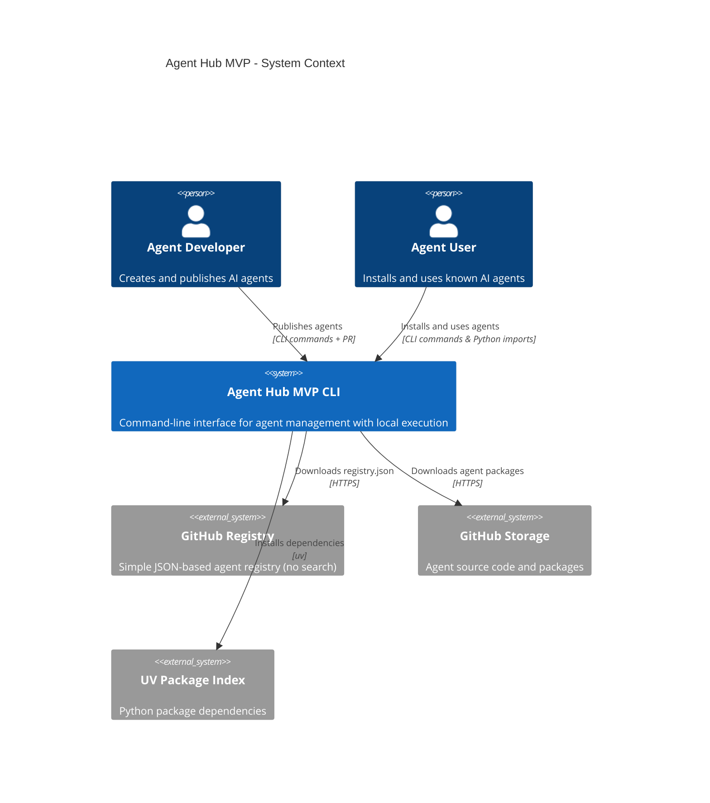
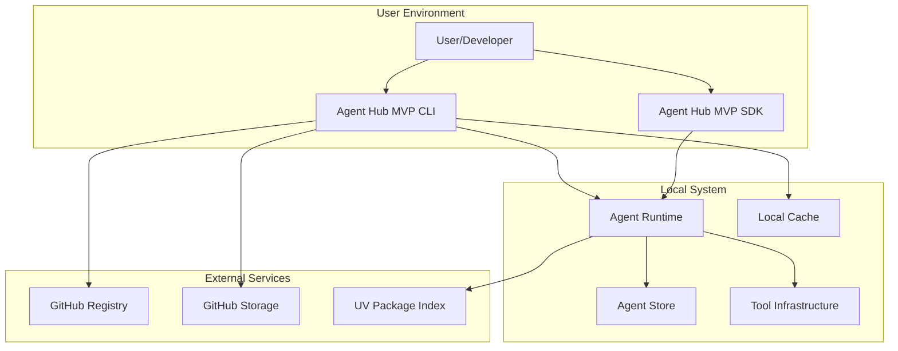
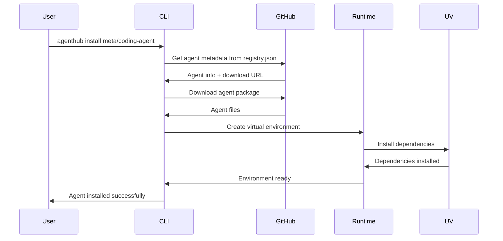
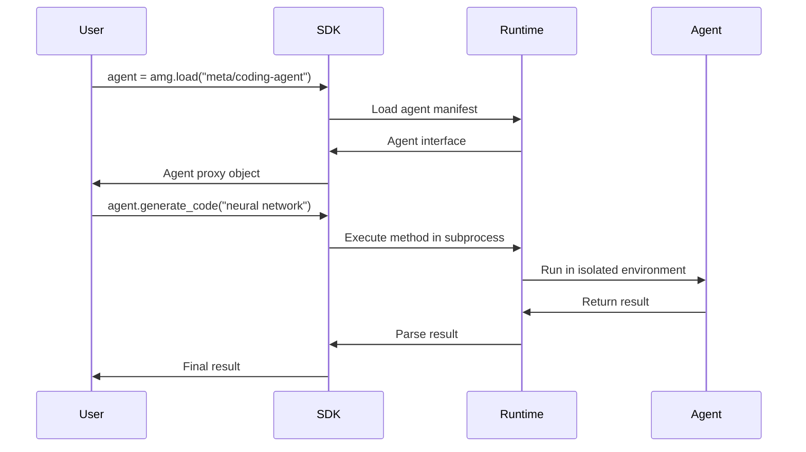

# Agent Hub MVP System Architecture

**Document Type**: MVP System Architecture  
**Author**: William  
**Date Created**: 2025-06-28  
**Last Updated**: 2025-06-28  
**Status**: Final  
**Level**: L1 - MVP System Level  
**Audience**: Business Stakeholders, Technical Architects, Product Team  

## 🎯 **MVP Executive Summary**

Agent Hub MVP is a **CLI-based platform** that validates the core value proposition: transforming AI agent integration from a complex, weeks-long process into a **simple, one-line experience**. The MVP focuses on **integration, not discovery** - users who already know what agents they want can integrate them instantly.

### **MVP Business Value**
- **For Developers**: Eliminate 60-80% of agent integration overhead
- **For Users**: Reduce integration time from weeks to minutes  
- **For MVP Validation**: Prove the core integration experience works

### **MVP Technical Approach**
- **Process-based isolation** prevents dependency conflicts
- **GitHub-based registry** eliminates infrastructure maintenance
- **UV package manager** provides 10x faster installations
- **Local-only execution** - agents run on user's machine, no cloud infrastructure

## 🏗️ **MVP System Context**

## 🎯 **MVP Business Architecture**

### **MVP Value Proposition**
Agent Hub MVP addresses the **critical problem of agent integration complexity** in the AI ecosystem. Currently, integrating AI agents requires weeks of custom development, custom APIs, and complex dependency management. The MVP validates that this can be standardized into a one-line experience.

### **MVP Market Positioning**
- **"npm for AI Agents"** - Standardized packaging and installation
- **"Docker for AI Agents"** - Isolated execution environments
- **"CLI for AI Agents"** - Developer-first command-line experience

### **MVP Success Metrics**
- **Integration Success Rate**: 90%+ successful installations
- **Time to Integration**: < 5 minutes from discovery to usage
- **Developer Adoption**: 10+ agents published in first month
- **Technical Success**: One-line loading, dependency isolation, fast execution

### **MVP Stakeholder Value**

#### **Agent Developers (MVP Focus)**
- **Elimination of Distribution Infrastructure**: No need to build custom APIs
- **Standardized Development**: Clear templates and validation tools
- **Fast Publishing**: Simple CLI workflow for agent distribution

#### **Agent Users (MVP Focus)**
- **One-Line Integration**: `agent = amg.load("meta/coding-agent")`
- **Dependency Isolation**: No conflicts between different agents
- **Fast Installation**: < 10 seconds for typical agent

#### **System Integrators (MVP Focus)**
- **Standardized Interfaces**: Consistent API across all agents
- **Operational Simplicity**: Local execution, minimal infrastructure
- **Fast Development**: Rapid iteration and testing

## 🏛️ **MVP System Architecture Overview**

### **MVP Architectural Principles**
1. **Simplicity First**: Use proven, simple technologies over complex solutions
2. **MVP Validation Focus**: Build only what's needed to validate core value proposition
3. **Developer Experience**: Optimize for fast iteration and ease of use
4. **Zero Maintenance**: Minimize operational overhead and infrastructure
5. **Local-Only Execution**: All agents run locally, no cloud infrastructure needed

### **MVP System Components**

### **MVP Component Responsibilities**

#### **Agent Hub MVP CLI**
- **Purpose**: Primary user interface for agent management
- **Responsibilities**: Install, list, remove, validate agents
- **Technology**: Python Click framework
- **Interfaces**: Command-line commands, GitHub API

#### **Agent Hub MVP SDK**
- **Purpose**: Python library for agent loading and execution
- **Responsibilities**: One-line agent loading, method dispatching
- **Technology**: Python library with dynamic method creation
- **Interfaces**: Python imports, subprocess execution

#### **Agent Runtime**
- **Purpose**: Isolated execution environment for agents
- **Responsibilities**: Process management, dependency isolation, error handling
- **Technology**: Python subprocess with virtual environments
- **Interfaces**: JSON-based IPC, virtual environment management

#### **GitHub Registry**
- **Purpose**: Zero-maintenance agent discovery (listing only)
- **Responsibilities**: Agent catalog, basic metadata, version management
- **Technology**: GitHub repository with JSON files
- **Interfaces**: GitHub API, HTTPS downloads

## 🔄 **MVP System Interactions**

### **MVP Agent Installation Flow**

### **MVP Agent Execution Flow**

## 🎛️ **MVP Quality Attributes**

### **MVP Performance Requirements**
- **Agent Installation**: < 10 seconds for typical agent
- **Agent Loading**: < 500ms for cached agent
- **Method Execution**: < 1 second overhead for subprocess call
- **Memory Usage**: < 100MB for Agent Hub runtime

### **MVP Reliability Requirements**
- **System Availability**: 99.9% (leveraging GitHub infrastructure)
- **Installation Success Rate**: 95%+ successful installations
- **Error Recovery**: Graceful handling of network and dependency issues
- **Data Integrity**: Consistent agent metadata and package versions

### **MVP Scalability Requirements**
- **Local Storage**: Support 50+ installed agents (MVP scale)
- **Concurrent Execution**: Multiple agents running simultaneously
- **Registry Scale**: Handle 100+ agents in registry (MVP scale)
- **User Scale**: Support 100+ users (MVP validation)

### **MVP Security Requirements**
- **Process Isolation**: Agents run in separate processes
- **Dependency Isolation**: Virtual environment separation
- **Input Validation**: Parameter validation before execution
- **Package Integrity**: Verify package checksums and signatures

### **MVP Usability Requirements**
- **Learning Curve**: < 30 minutes to first successful agent usage
- **Error Messages**: Clear, actionable error messages with solutions
- **Documentation**: Basic guides and examples
- **CLI Experience**: Intuitive command-line interface

## 🛡️ **MVP Risk Assessment**

### **MVP Technical Risks**
| Risk | Probability | Impact | Mitigation |
|------|-------------|---------|------------|
| Subprocess reliability | Medium | Medium | Comprehensive error handling, timeouts |
| GitHub API limits | Low | Medium | Caching, rate limit handling |
| Dependency conflicts | Low | High | Virtual environment isolation |
| Platform compatibility | Medium | Low | Multi-platform testing |

### **MVP Business Risks**
| Risk | Probability | Impact | Mitigation |
|------|-------------|---------|------------|
| Low user adoption | Medium | High | Focus on developer experience |
| GitHub dependency | Low | Medium | Design for registry migration |
| Limited MVP scope | Low | Low | Clear scope definition |
| Integration complexity | Medium | Medium | Extensive testing and validation |

### **MVP Operational Risks**
| Risk | Probability | Impact | Mitigation |
|------|-------------|---------|------------|
| GitHub outages | Low | Low | Local caching, offline mode |
| Support burden | Medium | Medium | Self-service tools, documentation |
| Scaling challenges | Low | Low | MVP scale is manageable |

## 🚀 **MVP Implementation Strategy**

### **MVP Development Phases**

#### **Phase 1: Core Foundation (Weeks 1-2)**
- **Goal**: Basic agent loading and execution
- **Deliverables**: Process manager, environment manager, basic CLI
- **Success Criteria**: Can install and execute simple agents locally

#### **Phase 2: CLI Interface (Week 3)**
- **Goal**: Complete command-line interface
- **Deliverables**: All CLI commands, error handling, local storage
- **Success Criteria**: Full agent lifecycle management via CLI

#### **Phase 3: GitHub Integration (Week 4)**
- **Goal**: Registry integration and basic discovery
- **Deliverables**: Registry client, agent listing, caching
- **Success Criteria**: Can discover and install agents from GitHub registry

#### **Phase 4: SDK & Polish (Weeks 5-6)**
- **Goal**: Python SDK and user experience
- **Deliverables**: SDK interface, method dispatching, documentation
- **Success Criteria**: One-line integration working reliably

## 🎯 **MVP Scope Boundaries**

### **✅ MVP Includes**
- **Core Runtime**: Process isolation, virtual environments, dependency management
- **CLI Interface**: Install, list, remove, basic info commands
- **GitHub Registry**: Simple agent listing and metadata
- **Python SDK**: One-line agent loading and execution
- **Basic Error Handling**: Clear error messages with solutions
- **Local Storage**: Agent installation and management
- **Cross-Platform**: Windows, macOS, Linux support

### **❌ MVP Excludes**
- **Agent Search**: No search functionality, only listing
- **Community Features**: No ratings, reviews, or social features
- **Web Interface**: CLI-only for MVP
- **Advanced Analytics**: Basic logging only
- **Enterprise Features**: No governance or compliance features
- **Monetization**: No payment processing in MVP
- **Agent Composition**: No cross-agent communication

### **🟡 MVP Considerations**
- **Agent Validation**: Basic validation during publishing
- **Error Recovery**: Graceful handling of common failures
- **Performance**: Optimized for MVP scale (100+ agents)
- **Documentation**: Essential user guides and examples

## 📊 **MVP Success Validation**

### **MVP Technical Validation**
- ✅ **One-line Integration**: `agent = amg.load("meta/coding-agent")` works
- ✅ **Dependency Isolation**: No conflicts between agents
- ✅ **Fast Execution**: < 1 second overhead for agent calls
- ✅ **Cross-Platform**: Works on Windows, macOS, Linux

### **MVP Business Validation**
- ✅ **Integration Success**: 90%+ successful installations
- ✅ **Time to Value**: < 5 minutes from discovery to usage
- ✅ **Developer Adoption**: 10+ agents published in first month
- ✅ **User Satisfaction**: Positive feedback on integration experience

### **MVP User Experience Validation**
- ✅ **Learning Curve**: Users can integrate agents in < 30 minutes
- ✅ **Error Handling**: Users can resolve issues without support
- ✅ **CLI Experience**: Intuitive command-line interface
- ✅ **Documentation**: Clear guides and examples

## 🔮 **Post-MVP Considerations**

### **Phase 2: Enhanced Discovery**
- **Agent Search**: Full-text search and filtering
- **Recommendations**: AI-powered agent suggestions
- **Trending**: Popular and trending agents
- **Categories**: Organized agent browsing

### **Phase 3: Community Features**
- **Ratings & Reviews**: Community feedback system
- **Social Features**: Developer profiles and collaboration
- **Analytics**: Usage statistics and insights
- **Gamification**: Developer achievements and badges

### **Phase 4: Enterprise Features**
- **Governance**: Agent approval and compliance
- **Security**: Advanced security scanning and validation
- **Monitoring**: Performance monitoring and alerting
- **Integration**: Enterprise system integration

## 🎯 **MVP Summary**

Agent Hub MVP is a **focused, validation-driven platform** that proves the core value proposition of one-line agent integration. By focusing on **integration over discovery**, the MVP can validate the technical feasibility and user experience without the complexity of search and community features.

**Key MVP Benefits:**
- **Faster Time to Market**: 6 weeks vs. 6+ months
- **Focused Validation**: Core integration experience proven
- **Lower Risk**: Simpler architecture, fewer failure points
- **User Feedback**: Real user input for post-MVP features

**MVP Success Criteria:**
- **Technical**: One-line integration working reliably
- **Business**: Integration success rate > 90%
- **User**: Time to integration < 5 minutes
- **Developer**: 10+ agents published in first month

The MVP provides a solid foundation for the full Agent Hub vision while validating the core value proposition with minimal complexity and maximum focus on user experience. 