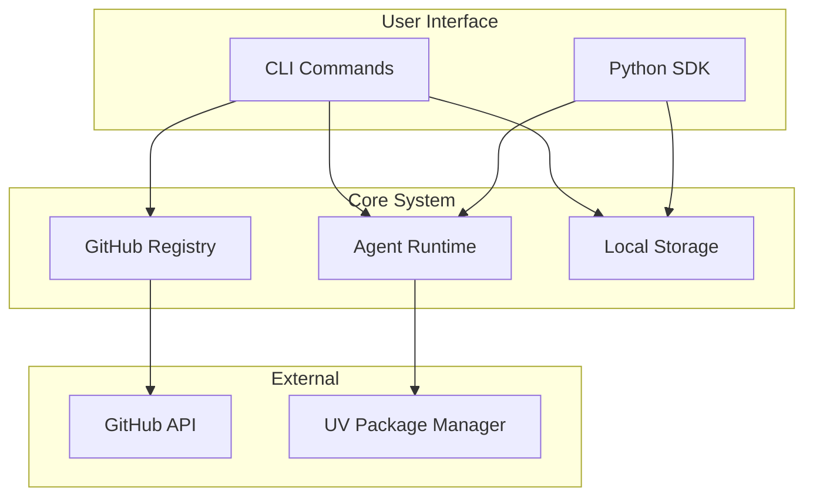

# Agent Hub MVP Quick Start Guide

**Document Type**: MVP Quick Start Guide
**Author**: William
**Date Created**: 2025-06-28
**Last Updated**: 2025-06-28
**Status**: Final
**Level**: L0 - MVP Overview Level
**Audience**: All Users, Quick Reference

## 🚀 **Agent Hub MVP in 60 Seconds**

Agent Hub MVP is a **CLI-based platform** that transforms AI agent integration from weeks of custom development into a **simple, one-line experience**:

```bash
# Install an agent
agenthub install meta/coding-agent

# Use the agent in Python
import agenthub as amg
agent = amg.load("meta/coding-agent")
result = agent.generate_code("neural network")
```

**MVP Goal**: Validate that one-line agent integration is technically feasible and provides excellent user experience.

## 📋 **MVP Documentation Map**

### **🎯 Start Here (Business & Strategy)**
- **[README.md](README.md)** - Complete MVP overview and navigation
- **[01_mvp_system_architecture.md](01_mvp_system_architecture.md)** - Business context and MVP scope

### **🏗️ Architecture & Design**
- **[02_mvp_technology_stack.md](02_mvp_technology_stack.md)** - Technology choices and rationale
- **[03_mvp_container_architecture.md](03_mvp_container_architecture.md)** - System components and interactions
- **[04_mvp_data_architecture.md](04_mvp_data_architecture.md)** - Data flow and storage design

### **🚀 Implementation & Delivery**
- **[09_mvp_implementation_plan.md](09_mvp_implementation_plan.md)** - 6-week development timeline
- **[10_mvp_testing_strategy.md](10_mvp_testing_strategy.md)** - Testing approach and criteria
- **[11_mvp_deployment_guide.md](11_mvp_deployment_guide.md)** - Setup and deployment instructions

## 🎯 **MVP Scope at a Glance**

### **✅ MVP Includes**
- **Core Runtime**: Process isolation, virtual environments, dependency management
- **CLI Interface**: Install, list, remove, basic info commands
- **GitHub Registry**: Simple agent listing (no search)
- **Python SDK**: One-line agent loading and execution
- **Local Storage**: Agent installation and management

### **❌ MVP Excludes**
- **Agent Search**: No search functionality, only listing
- **Community Features**: No ratings, reviews, or social features
- **Web Interface**: CLI-only for MVP
- **Agent Composition**: No cross-agent communication

## 🏠 **Infrastructure Clarification**

### **What Agent Hub Provides (Local Infrastructure)**
- **Agent Registry**: Store agent metadata and download links
- **Agent Discovery**: Help users find available agents
- **Agent Distribution**: Host agent packages for download
- **Local Storage**: Store downloaded agents on user's machine

### **What Agent Hub Does NOT Provide (Execution Infrastructure)**
- **❌ Runtime Environment**: No server-side execution
- **❌ Agent Hosting**: No running agents in the cloud
- **❌ Execution Infrastructure**: No compute resources
- **❌ Agent Management**: No monitoring or scaling

### **Execution Model: Download → Local Run**
```
User's Local Machine:
├── Agent Hub CLI/SDK (local)
├── Downloaded Agents (local)
├── Virtual Environments (local)
└── Agent Execution (local subprocess)
```

## 🏗️ **MVP Architecture Overview**



## 📅 **MVP Implementation Timeline**

### **Phase 1: Foundation (Weeks 1-2)**
- Process manager for subprocess execution
- Virtual environment management with UV
- Basic agent loading and execution

### **Phase 2: CLI Interface (Week 3)**
- Install, list, remove commands
- Local agent storage and management
- Error handling and logging

### **Phase 3: GitHub Integration (Week 4)**
- Simple GitHub-based registry client
- Basic agent discovery (listing only)
- Registry caching

### **Phase 4: SDK & Polish (Weeks 5-6)**
- Python SDK with one-line loading
- Method dispatching and execution
- Documentation and examples

## 🎯 **Quick Navigation by Role**

### **For Business Stakeholders**
1. **[README.md](README.md)** - Executive summary and business value
2. **[01_mvp_system_architecture.md](01_mvp_system_architecture.md)** - Business context and success metrics
3. **[09_mvp_implementation_plan.md](09_mvp_implementation_plan.md)** - Timeline and milestones

### **For Technical Architects**
1. **[01_mvp_system_architecture.md](01_mvp_system_architecture.md)** - Overall MVP design
2. **[03_mvp_container_architecture.md](03_mvp_container_architecture.md)** - System decomposition
3. **[02_mvp_technology_stack.md](02_mvp_technology_stack.md)** - Technology choices

### **For Developers**
1. **[02_mvp_technology_stack.md](02_mvp_technology_stack.md)** - Tools and frameworks
2. **[09_mvp_implementation_plan.md](09_mvp_implementation_plan.md)** - Development timeline
3. **[11_mvp_deployment_guide.md](11_mvp_deployment_guide.md)** - Setup instructions

### **For DevOps/QA**
1. **[10_mvp_testing_strategy.md](10_mvp_testing_strategy.md)** - Testing approach
2. **[11_mvp_deployment_guide.md](11_mvp_deployment_guide.md)** - Deployment instructions
3. **[04_mvp_data_architecture.md](04_mvp_data_architecture.md)** - Data management

## 🔑 **Key MVP Concepts**

### **1. One-Line Integration**
```python
# The MVP's core value proposition
import agenthub as amg
agent = amg.load("meta/coding-agent")  # One line to load
result = agent.generate_code("hello")   # One line to use
```

### **2. Process-Based Isolation**
- Each agent runs in its own subprocess
- Virtual environment isolation prevents dependency conflicts
- Secure execution with resource limits

### **3. GitHub-Based Registry**
- Simple JSON registry hosted on GitHub
- Zero infrastructure maintenance
- Basic agent listing (no search in MVP)

### **4. Local-Only Execution**
- All agents run on user's machine (no cloud infrastructure)
- Fast iteration and development
- Privacy and security (no data sent to cloud)
- Zero infrastructure maintenance

### **5. Dual Tool Source System**
- **Agent's Built-in Tools**: Tools that come with the agent (developer's responsibility)
- **User's Custom Tools**: Optional tools that users can inject to agents
- **Tool Override**: Users can override agent's built-in tools when needed
- **Tool Validation**: Automatic validation of tool access and safety
- **Tool Discovery**: Agent Hub helps agents find and access their tools
- **Best of Both**: Agent's built-in tools + user's custom tools

## 📊 **MVP Success Metrics**

### **Technical Success**
- ✅ **One-line Integration**: `agent = amg.load("meta/coding-agent")` works
- ✅ **Dependency Isolation**: No conflicts between agents
- ✅ **Fast Execution**: < 1 second overhead for agent calls

### **Business Success**
- ✅ **Integration Success Rate**: 90%+ successful installations
- ✅ **Time to Value**: < 5 minutes from discovery to usage
- ✅ **Developer Adoption**: 10+ agents published in first month

### **User Experience Success**
- ✅ **Learning Curve**: Users can integrate agents in < 30 minutes
- ✅ **Error Handling**: Users can resolve issues without support
- ✅ **CLI Experience**: Intuitive command-line interface

## 🚨 **MVP Limitations & Considerations**

### **Current Limitations**
- **No Search**: Users must know agent names in advance
- **No Community**: No ratings, reviews, or social features
- **CLI Only**: No web interface or GUI
- **Local Only**: No cloud execution or sharing

### **Post-MVP Enhancements**
- **Agent Search**: Full-text search and discovery
- **Community Features**: Ratings, reviews, and collaboration
- **Web Interface**: Browser-based management
- **Agent Composition**: Cross-agent communication

## 🛠️ **Quick Setup Commands**

### **Installation**
```bash
# Install Agent Hub MVP
pip install agenthub

# Verify installation
agenthub --version
agenthub --help
```

### **First Agent**
```bash
# Install your first agent
agenthub install meta/coding-agent

# Use the agent
python -c "
import agenthub as amg
agent = amg.load('meta/coding-agent')
print(agent.generate_code('hello world'))
"
```

### **Agent with Built-in + Custom Tools**
```bash
# Install a general-purpose agent
agenthub install openai/analysis-agent

# Use with agent's built-in tools + user's custom tools
python -c "
import agenthub as amg

# Define custom tools
def domain_specific_analysis(data, domain):
    return f'Domain-specific analysis for {domain}: {len(data)} items'

def enhanced_metrics(data):
    return {'enhanced_mean': sum(data)/len(data), 'variance': 0.5}

# Load agent with custom tools (can override agent's built-in tools)
agent = amg.load('openai/analysis-agent',
    custom_tools={
        'domain_specific_analysis': domain_specific_analysis,
        'calculate_metrics': enhanced_metrics  # Overrides agent's built-in metrics tool
    }
)

# Agent's built-in tools available
agent_result = agent.analyze_data([1, 2, 3, 4, 5])

# Custom tools available
domain_result = agent.domain_specific_analysis([1, 2, 3], 'finance')
enhanced_result = agent.calculate_metrics([1, 2, 3, 4, 5])

print(f'Native RAG: {native_rag}')
print(f'File Info: {file_info}')
print(f'Domain Analysis: {domain_result}')
print(f'Enhanced Metrics: {enhanced_result}')
"

# Advanced: Tool override and validation
python -c "
import agenthub as amg

def custom_data_processor(data):
    # This tool will be validated for safety
    return {'processed': len(data), 'status': 'custom'}

# Load agent with custom tool that overrides built-in tool
agent = amg.load('openai/secure-agent',
    custom_tools={'data_processor': custom_data_processor}
)

# Tool validation happens automatically
result = agent.data_processor([1, 2, 3, 4, 5])
print(f'Custom processing result: {result}')
"
```

### **Development Setup**
```bash
# Clone and setup for development
git clone https://github.com/your-org/agent-hub.git
cd agent-hub
python -m venv venv
source venv/bin/activate  # On Windows: venv\Scripts\activate
pip install -r requirements.txt
pip install -r requirements-dev.txt
```

## 🔍 **Common Questions**

### **Q: Why no search in MVP?**
**A**: MVP focuses on **integration, not discovery**. Users who already know what agents they want can integrate them instantly. Search adds complexity without validating the core value proposition.

### **Q: Why process-based isolation?**
**A**: Process isolation provides security, prevents dependency conflicts, and is simpler than containerization for MVP. It's proven technology that works reliably across platforms.

### **Q: Why GitHub-based registry?**
**A**: GitHub provides zero-maintenance infrastructure, familiar workflows for developers, and eliminates the need to build and maintain a custom registry service.

### **Q: When will search be added?**
**A**: Search and discovery features are planned for Phase 2 (Month 2) after MVP validation. The current focus is proving that one-line integration works reliably.

## 📚 **Additional Resources**

### **Related Documentation**
- **Full Architecture**: See `docs/.architecture_design/` for complete system design
- **Requirements**: See `docs/.requirement_analysis/` for business requirements
- **Implementation**: See `docs/.implementation_design/` for code-level specifications

### **External Resources**
- **GitHub Repository**: [your-org/agent-hub](https://github.com/your-org/agent-hub)
- **Issue Tracker**: [GitHub Issues](https://github.com/your-org/agent-hub/issues)
- **Discussions**: [GitHub Discussions](https://github.com/your-org/agent-hub/discussions)

## 🎯 **Next Steps**

### **For Users**
1. **Install Agent Hub**: `pip install agenthub`
2. **Try First Agent**: `agenthub install meta/coding-agent`
3. **Explore Commands**: `agenthub --help`

### **For Developers**
1. **Review Architecture**: Start with [03_mvp_container_architecture.md](03_mvp_container_architecture.md)
2. **Check Technology**: Review [02_mvp_technology_stack.md](02_mvp_technology_stack.md)
3. **Plan Implementation**: Follow [09_mvp_implementation_plan.md](09_mvp_implementation_plan.md)

### **For Contributors**
1. **Setup Development**: Follow [11_mvp_deployment_guide.md](11_mvp_deployment_guide.md)
2. **Run Tests**: Use [10_mvp_testing_strategy.md](10_mvp_testing_strategy.md)
3. **Submit PRs**: Follow contribution guidelines in main repository

---

**Agent Hub MVP**: Transforming AI agent integration from weeks to minutes through one-line simplicity.

**Status**: Ready for implementation
**Timeline**: 6 weeks to MVP completion
**Goal**: Validate core integration experience
**Success**: One-line agent loading working reliably
