# AgentHub Phase 2: Auto-Install Implementation Design

**Document Type**: Phase 2 Implementation Overview
**Phase**: 2 - Auto-Install
**Author**: William
**Date Created**: 2025-06-28
**Last Updated**: 2025-06-28
**Status**: Active
**Purpose**: Comprehensive overview of Phase 2 auto-installation system architecture and implementation

## 🎯 **Phase 2 Overview**

**Phase 2: Auto-Install** transforms Agent Hub from a system that can only execute pre-created agents into a system that can automatically discover and install new agents from GitHub repositories. This phase eliminates the need for manual agent setup and enables seamless agent discovery and installation.

### **Key Transformation**
- **Before Phase 2**: Agents must be manually created and placed in specific directories
- **After Phase 2**: Agents can be auto-installed using `developer/agent-name` format from GitHub
- **Result**: Seamless agent discovery and installation with minimal user intervention

### **Success Criteria**
- ✅ Can auto-install agents from GitHub using `developer/agent-name` format
- ✅ Environment setup is automatic and reliable
- ✅ Installation tracking provides clear status information
- ✅ Foundation ready for Phase 3 SDK integration

## 🏗️ **System Architecture**

```mermaid
graph TB
    subgraph "User Interface Layer"
        CLI[Enhanced CLI Commands]
        API[Programmatic API - load_agent()]
    end

    subgraph "Core Coordination Layer"
        AI[Auto-Installer - NEW]
        AL[Enhanced Agent Loader - Existing + Auto-Install]
        AW[Agent Wrapper - Existing]
        IV[Interface Validator - Existing]
        MP[Manifest Parser - Existing]
    end

    subgraph "Service Modules - NEW"
        GH[GitHub Integration]
        ENV[Environment Management]
        STOR[Storage Enhancement - Extends LocalStorage]
    end

    subgraph "Existing Phase 1 Components"
        LS[LocalStorage - Existing]
        AR[Agent Runtime - Existing]
        RT[Runtime Manager - Existing]
    end

    subgraph "External Systems"
        GITHUB[GitHub Repositories]
        PYPI[Python Package Index]
        LOCAL[Local File System - ~/.agenthub/agents/]
    end

    CLI --> AI
    API --> AI
    AI --> GH
    AI --> ENV
    AI --> STOR
    STOR --> LS
    GH --> GITHUB
    ENV --> PYPI
    AL --> AI
    AL --> LS
    AW --> AR
```

## 🏗️ **UV-Based Isolated Environments**

### **Environment Isolation Strategy**
AgentHub Phase 2 implements **UV-based isolated environments** to ensure each agent runs in its own isolated context, preventing dependency conflicts and enabling scalable agent management.

#### **Directory Structure**
```
~/.agenthub/agents/
├── dev_name1/
│   ├── repo_name1/
│   │   ├── .venv/           # UV virtual environment
│   │   ├── agent.py         # Agent logic
│   │   ├── agent.yaml       # Interface + UV config
│   │   ├── requirements.txt # UV-compatible dependencies
│   │   └── README.md        # Documentation
│   └── repo_name2/
│       ├── .venv/           # Separate isolated environment
│       └── ...
└── dev_name2/
    └── repo_name3/
        ├── .venv/           # Another isolated environment
        └── ...
```

#### **UV Environment Benefits**
- **Complete Isolation**: Each agent has its own Python environment
- **Dependency Management**: UV handles Python versions and package conflicts
- **Scalability**: Can manage hundreds of agents without conflicts
- **Clean Execution**: Fresh environment for each agent execution
- **Easy Cleanup**: Remove environments when agents are uninstalled

#### **Environment Setup Flow**
1. **Clone Repository**: AgentHub clones to `~/.agenthub/agents/dev_name/repo_name/`
2. **Parse Configuration**: Extract UV settings from `agent.yaml`
3. **Create UV Project**: Initialize UV project with specified Python version
4. **Install Dependencies**: Install packages from `requirements.txt`
5. **Validate Environment**: Ensure environment is ready for execution
6. **Ready for Use**: Agent can now execute in isolated context

#### **Progress Tracking & User Experience Requirements**
- **Real-time progress updates**: Phase and step-level progress tracking
- **Visual progress indicators**: Progress bars, percentages, and status icons
- **Time estimates**: Completion time and remaining time calculations
- **Interactive controls**: Pause, resume, and cancel capabilities
- **Background execution**: Installations continue in background
- **Multiple installation tracking**: Concurrent setup monitoring
- **Detailed error reporting**: Specific failure reasons and solutions
- **Recovery options**: Rollback, retry, and conflict resolution
- **User feedback**: Clear status messages and actionable recommendations

#### **UV Environment Requirements**

##### **System Prerequisites**
- **UV Package Manager**: Must be installed and available in system PATH
- **Python Versions**: Support for Python 3.11+ with automatic version management
- **System Resources**: Minimum 500MB disk space, 1GB RAM per agent environment
- **Network Access**: Internet connectivity for package downloads and dependency resolution

##### **Agent Repository Requirements**
- **agent.yaml**: Must include UV configuration section with Python version and resource limits
- **requirements.txt**: UV-compatible dependencies with no version conflicts
- **pyproject.toml**: UV project configuration (optional but recommended)
- **Structure**: Standard Python package structure for UV project initialization

##### **Resource Management**
- **Memory Limits**: Configurable per agent (default: 2GB)
- **Timeout Settings**: Execution time limits (default: 300 seconds)
- **CPU Constraints**: Optional CPU usage limits
- **Disk Quotas**: Environment size monitoring and limits

##### **Benefits of UV Integration**
- **Complete Isolation**: No dependency conflicts between agents
- **Fast Installation**: UV's optimized dependency resolution
- **Reproducible Builds**: Lock file ensures consistent environments
- **Resource Control**: Built-in resource limit enforcement
- **Easy Cleanup**: Simple environment removal and cleanup

## 📋 **Module Architecture & Responsibilities**

### **1. GitHub Integration Module** (`github/`)
- **Primary Responsibility**: Repository discovery, cloning, and validation
- **Key Components**: Repository Cloner, Repository Validator, GitHub Client
- **Input**: `developer/agent-name` format
- **Output**: Local repository path with validated structure

### **2. Environment Management Module** (`environment/`)
- **Primary Responsibility**: UV-based isolated environment creation and dependency management
- **Key Components**: UV Environment Setup, UV Project Creator, UV Dependency Manager, Environment Validator
- **Input**: Agent path, requirements.txt, and UV configuration from agent.yaml
- **Output**: Isolated UV virtual environment with all dependencies installed and validated
- **Isolation**: Each agent runs in its own `.venv/` directory to prevent dependency conflicts
- **UV Integration**: Full UV project lifecycle with pyproject.toml, uv.lock, and resource limits

### **3. Storage Enhancement Module** (`storage/`)
- **Primary Responsibility**: Installation tracking and metadata management
- **Key Components**: Installation Tracker (NEW), Metadata Manager (NEW), Directory Organizer (NEW)
- **Input**: Installation events and agent metadata
- **Output**: Organized storage structure with installation history
- **Integration**: Extends existing `LocalStorage` class with installation tracking capabilities

### **4. Core Enhancement Module** (`core/`)
- **Primary Responsibility**: Auto-installation coordination and enhanced agent loading
- **Key Components**: Auto-Installer (NEW), Enhanced Agent Loader (extends existing), Agent Wrapper (existing)
- **Input**: Agent requests and installation triggers
- **Output**: Ready-to-use agents with seamless loading experience
- **Integration**: Extends existing `AgentLoader`, `AgentWrapper`, `InterfaceValidator`, and `ManifestParser`

### **5. CLI Enhancement Module** (`cli/`)
- **Primary Responsibility**: Enhanced user interface and installation commands
- **Key Components**: Install Command (NEW), Update Command (NEW), Enhanced List Command (extends existing)
- **Input**: User commands and preferences
- **Output**: User-friendly feedback and agent management
- **Integration**: Extends existing CLI structure with new installation commands

### **6. Testing Module** (`testing/`)
- **Primary Responsibility**: Comprehensive testing strategy and validation
- **Key Components**: Test Suites, Test Data, Integration Tests
- **Input**: Module implementations and integration points
- **Output**: Validated functionality and performance metrics

## 🔄 **Auto-Installation Flow with Progress Tracking**

### **Auto-Installation Flow**

```mermaid
sequenceDiagram
    participant User
    participant CLI
    participant AutoInstaller
    participant GitHub
    participant Environment
    participant Storage
    participant Core

    User->>CLI: Install "dev/awesome-agent"
    CLI->>AutoInstaller: Trigger installation

    Note over AutoInstaller: Progress Tracking Started

    AutoInstaller->>Storage: Check if already installed
    Storage-->>AutoInstaller: Not found
    AutoInstaller-->>CLI: 🔍 Discovery: 10% [✓]

    AutoInstaller->>GitHub: Clone repository
    GitHub-->>AutoInstaller: Local repository path
    AutoInstaller-->>CLI: 📥 Cloning: 25% [✓]

    AutoInstaller->>GitHub: Validate repository
    GitHub-->>AutoInstaller: Validation results
    AutoInstaller-->>CLI: 📋 Validation: 35% [✓]

    AutoInstaller->>Environment: Create UV environment
    Environment-->>AutoInstaller: Environment ready
    AutoInstaller-->>CLI: 🐍 UV Setup: 50% [✓]

    AutoInstaller->>Environment: Execute setup commands from agent.yaml
    Note over Environment: 1. source .venv/bin/activate && uv sync
    Note over Environment: 2. source .venv/bin/activate && uv pip install -e .
    Note over Environment: 3. source .venv/bin/activate && uv pip install -r requirements.txt
    Environment-->>AutoInstaller: Dependencies installed
    AutoInstaller-->>CLI: 📦 Dependencies: 85% [✓]

    AutoInstaller->>Environment: Run validation commands from agent.yaml
    Note over Environment: python -c 'import core.rag_system'
    Note over Environment: python -c 'import core.llamaindex_store'
    Note over Environment: python -c 'import aisuite'
    Environment-->>AutoInstaller: Validation passed
    AutoInstaller-->>CLI: ✅ Validation: 90% [✓]

    AutoInstaller->>Storage: Track installation
    Storage-->>AutoInstaller: Installation recorded
    AutoInstaller-->>CLI: 💾 Storage: 95% [✓]

    AutoInstaller->>Core: Register agent
    Core-->>AutoInstaller: Agent ready
    AutoInstaller-->>CLI: 🎉 Ready: 100% [✓]

    AutoInstaller-->>CLI: Installation complete
    CLI-->>User: Success message with agent details
```



### **📊 Progress Tracking Features**

#### **Real-Time Progress Updates**
- **Phase-based tracking**: Discovery → Cloning → Validation → UV Setup → Dependencies → Storage → Ready
- **Step-level progress**: Detailed progress within each phase
- **Time estimates**: Estimated completion time and remaining time
- **Visual indicators**: Progress bars, percentages, and status icons

#### **Interactive Controls**
- **Pause/Resume**: Users can pause long installations
- **Progress queries**: Check status of ongoing installations
- **Background execution**: Installations continue in background
- **Multiple installations**: Track multiple concurrent setups

#### **Error Handling & Recovery**
- **Detailed error reporting**: Specific package failures with reasons
- **Conflict resolution**: Automatic dependency conflict detection
- **Rollback capability**: Clean recovery from failed installations
- **Retry mechanisms**: Automatic retry for transient failures

### **🚨 Enhanced Error Handling & User Feedback**

#### **Dependency Installation Failures**
When dependencies fail to install, AgentHub provides detailed feedback:

```bash
❌ Dependency installation failed for "agentplug/scientific-paper-analyzer"

Failed packages:
  • llama-index>=0.10.0
    Error: Version conflict with existing numpy==1.21.0
    Solution: Update numpy to >=1.24.0 or use compatible llama-index version

  • openai>=1.0.0
    Error: Network timeout during download
    Solution: Check internet connection and retry

Conflicting packages detected:
  • numpy==1.21.0 (incompatible with llama-index>=0.10.0)
  • requests==2.25.0 (outdated, may cause security issues)

Recommended actions:
  1. Update requirements.txt with compatible versions
  2. Check network connectivity
  3. Verify Python version compatibility (3.11+ required)

Rollback available: Yes
Retry available: Yes (for network errors)
```

#### **User Recovery Options**
- **Automatic rollback**: Clean removal of failed installation
- **Manual retry**: Retry specific failed packages
- **Conflict resolution**: Automatic version compatibility suggestions
- **Alternative versions**: Suggest compatible package versions
- **Expert mode**: Detailed debugging information for developers

#### **Progress Monitoring Commands**
```bash
# Check installation progress
agenthub progress "agentplug/scientific-paper-analyzer"

# Pause ongoing installation
agenthub pause "agentplug/scientific-paper-analyzer"

# Resume paused installation
agenthub resume "agentplug/scientific-paper-analyzer"

# View detailed logs
agenthub logs "agentplug/scientific-paper-analyzer"

# Cancel and rollback
agenthub cancel "agentplug/scientific-paper-analyzer"
```

## 🚀 **Implementation Roadmap with End-to-End Testing**

### **Phase 2A: Foundation & GitHub Integration (Week 1)**

#### **Step 1: Project Structure & Basic Setup (Days 1-2)**
**Goal**: Establish foundation with basic project structure

**Implementation**:
```bash
# Create new module directories (existing: core, cli, runtime, storage)
mkdir -p agenthub/github
mkdir -p agenthub/environment

# Create basic __init__.py files
touch agenthub/github/__init__.py
touch agenthub/environment/__init__.py

# Verify existing modules still work
python -c "from agenthub.core.agent_loader import AgentLoader; print('✅ Existing core module works')"
```

**End-to-End Test**:
```bash
# Test basic import of new modules
python -c "import agenthub.github; import agenthub.environment; print('✅ New modules import successfully')"

# Test existing functionality still works
python -c "from agenthub import load_agent; print('✅ Existing API still works')"
```

**Success Criteria**: ✅ Can import new modules without breaking existing functionality

---

#### **Step 2: Basic GitHub Module - URL Parser (Days 2-3)**
**Goal**: Implement basic agent name parsing and GitHub URL construction

**Implementation**:
```python
# agenthub/github/url_parser.py
class URLParser:
    def is_valid_agent_name(self, agent_name: str) -> bool:
        # Basic validation: developer/agent-name format
        pass

    def build_github_url(self, agent_name: str) -> str:
        # Convert to https://github.com/developer/agent-name.git
        pass
```

**End-to-End Test**:
```python
# test_url_parser.py
parser = URLParser()
assert parser.is_valid_agent_name("user/agent") == True
assert parser.is_valid_agent_name("invalid") == False
assert parser.build_github_url("user/agent") == "https://github.com/user/agent.git"
print("✅ URL Parser works correctly")
```

**Success Criteria**: ✅ Can parse valid agent names and build GitHub URLs

---

#### **Step 3: Basic Repository Cloner (Days 3-4)**
**Goal**: Implement basic repository cloning functionality

**Implementation**:
```python
# agenthub/github/repository_cloner.py
class RepositoryCloner:
    def clone_agent(self, agent_name: str) -> str:
        # Basic git clone implementation
        pass
```

**End-to-End Test**:
```bash
# Test with a real, simple repository
python -c "
from agenthub.github.repository_cloner import RepositoryCloner
cloner = RepositoryCloner()
path = cloner.clone_agent('test-user/simple-test-agent')
print(f'✅ Cloned to: {path}')
"
```

**Success Criteria**: ✅ Can clone a simple test repository from GitHub

---

#### **Step 4: Basic Repository Validation (Days 4-5)**
**Goal**: Implement basic file existence validation

**Implementation**:
```python
# agenthub/github/repository_validator.py
class RepositoryValidator:
    def validate_repository(self, local_path: str) -> bool:
        # Check for required files: agent.yaml, agent.py, requirements.txt, README.md
        pass
```

**End-to-End Test**:
```python
# Test validation with cloned repository
validator = RepositoryValidator()
is_valid = validator.validate_repository(cloned_path)
print(f"✅ Repository validation: {'PASS' if is_valid else 'FAIL'}")
```

**Success Criteria**: ✅ Can validate repository structure and identify missing files

---

#### **Step 5: Basic Auto-Installation Flow (Days 5-7)**
**Goal**: Connect GitHub module components for basic auto-installation

**Implementation**:
```python
# agenthub/core/auto_installer.py (NEW FILE)
class AutoInstaller:
    def __init__(self, storage=None):
        self.storage = storage or LocalStorage()
        self.github_cloner = RepositoryCloner()
        self.validator = RepositoryValidator()

    def install_agent(self, agent_name: str) -> bool:
        # Basic flow: clone → validate → return success
        try:
            # Parse agent name (existing logic from load_agent)
            if "/" not in agent_name:
                raise ValueError(f"Agent name must be in format 'developer/agent', got: {agent_name}")
            developer, agent = agent_name.split("/", 1)

            # Clone repository
            local_path = self.github_cloner.clone_agent(agent_name)

            # Validate repository
            is_valid = self.validator.validate_repository(local_path)

            return is_valid
        except Exception as e:
            logger.error(f"Auto-installation failed: {e}")
            return False
```

**End-to-End Test**:
```bash
# Test complete basic flow
python -c "
from agenthub.core.auto_installer import AutoInstaller
installer = AutoInstaller()
success = installer.install_agent('test-user/simple-test-agent')
print(f'✅ Auto-installation: {\"SUCCESS\" if success else \"FAILED\"}')
"

# Test existing functionality still works
python -c "
from agenthub import load_agent
try:
    # This should still work for existing agents
    agent = load_agent('agentplug/coding-agent')
    print('✅ Existing load_agent still works')
except Exception as e:
    print(f'⚠️ Existing functionality affected: {e}')
"
```

**Success Criteria**: ✅ Can complete basic auto-installation flow end-to-end without breaking existing functionality

---

### **Phase 2B: Environment Management & Storage (Week 2)**

#### **Step 6: Basic Virtual Environment Creation (Days 8-9)**
**Goal**: Implement basic virtual environment creation

**Implementation**:
```python
# agenthub/environment/virtual_environment.py
class VirtualEnvironmentCreator:
    def create_environment(self, target_path: str) -> str:
        # Basic venv creation
        pass
```

**End-to-End Test**:
```python
# Test environment creation
creator = VirtualEnvironmentCreator()
env_path = creator.create_environment("/tmp/test_env")
print(f"✅ Environment created: {env_path}")
```

**Success Criteria**: ✅ Can create virtual environment and verify it exists

---

#### **Step 7: Basic Dependency Installation (Days 9-10)**
**Goal**: Implement basic requirements.txt parsing and package installation

**Implementation**:
```python
# agenthub/environment/dependency_manager.py
class DependencyManager:
    def install_dependencies(self, env_path: str, requirements_path: str) -> bool:
        # Basic pip install from requirements.txt
        pass
```

**End-to-End Test**:
```python
# Test with simple requirements.txt
dep_manager = DependencyManager()
success = dep_manager.install_dependencies(env_path, "requirements.txt")
print(f"✅ Dependencies installed: {'SUCCESS' if success else 'FAILED'}")
```

**Success Criteria**: ✅ Can install packages from requirements.txt in virtual environment

---

#### **Step 8: Environment Setup Integration (Days 10-12)**
**Goal**: Connect environment components for complete environment setup

**Implementation**:
```python
# agenthub/environment/environment_setup.py
class EnvironmentSetup:
    def setup_environment(self, agent_path: str, requirements_path: str) -> bool:
        # Coordinate: create env → install deps → validate
        pass
```

**End-to-End Test**:
```python
# Test complete environment setup
env_setup = EnvironmentSetup()
success = env_setup.setup_environment(agent_path, "requirements.txt")
print(f"✅ Environment setup: {'SUCCESS' if success else 'FAILED'}")
```

**Success Criteria**: ✅ Can complete environment setup end-to-end

---

#### **Step 9: Basic Storage & Metadata (Days 12-14)**
**Goal**: Implement basic installation tracking

**Implementation**:
```python
# agenthub/storage/installation_tracker.py (NEW FILE)
class InstallationTracker:
    def __init__(self, storage=None):
        self.storage = storage or LocalStorage()

    def track_installation(self, agent_name: str, details: dict):
        # Basic installation metadata storage
        try:
            # Parse agent name (existing logic)
            if "/" not in agent_name:
                raise ValueError(f"Invalid agent name format: {agent_name}")
            developer, agent = agent_name.split("/", 1)

            # Store installation metadata in existing storage structure
            metadata = {
                "installed_at": datetime.now().isoformat(),
                "status": "installed",
                "source": "github",
                **details
            }

            # Use existing storage methods
            self.storage._store_installation_metadata(developer, agent, metadata)
            return True
        except Exception as e:
            logger.error(f"Failed to track installation: {e}")
            return False

# Extend existing LocalStorage class
class LocalStorage(LocalStorage):  # Inherit from existing
    def _store_installation_metadata(self, developer: str, agent: str, metadata: dict):
        # Store in existing ~/.agenthub/agents/ structure
        metadata_file = self._agents_dir / developer / agent / ".installation_metadata.json"
        metadata_file.parent.mkdir(parents=True, exist_ok=True)

        with open(metadata_file, 'w') as f:
            json.dump(metadata, f, indent=2)
```

**End-to-End Test**:
```python
# Test installation tracking
from agenthub.storage.installation_tracker import InstallationTracker
from agenthub.storage.local_storage import LocalStorage

storage = LocalStorage()
tracker = InstallationTracker(storage)
success = tracker.track_installation("test-user/agent", {"status": "installed"})
print(f"✅ Installation tracking: {'SUCCESS' if success else 'FAILED'}")

# Verify existing storage still works
agents = storage.discover_agents()
print(f"✅ Existing storage discovery: {len(agents)} agents found")
```

**Success Criteria**: ✅ Can track and retrieve installation metadata without breaking existing storage functionality

---

### **Phase 2C: Core Integration & CLI (Week 3)**

#### **Step 10: Enhanced Auto-Installation (Days 15-16)**
**Goal**: Integrate all modules for complete auto-installation

**Implementation**:
```python
# agenthub/core/auto_installer.py (enhanced)
class AutoInstaller:
    def install_agent(self, agent_name: str) -> InstallationResult:
        # Complete flow: clone → validate → setup env → track
        pass
```

**End-to-End Test**:
```python
# Test complete enhanced flow
installer = AutoInstaller()
result = installer.install_agent("test-user/complete-test-agent")
print(f"✅ Enhanced auto-installation: {result.success}")
```

**Success Criteria**: ✅ Can complete full auto-installation with environment setup

---

#### **Step 11: Basic CLI Commands (Days 16-18)**
**Goal**: Implement basic CLI installation command

**Implementation**:
```python
# agenthub/cli/commands/install.py (NEW FILE)
import click
from agenthub.core.auto_installer import AutoInstaller

@click.command()
@click.argument('agent_name')
def install(agent_name):
    """Install an agent from GitHub repository."""
    try:
        installer = AutoInstaller()
        success = installer.install_agent(agent_name)

        if success:
            click.echo(f"✅ Successfully installed agent: {agent_name}")
        else:
            click.echo(f"❌ Failed to install agent: {agent_name}")
            sys.exit(1)
    except Exception as e:
        click.echo(f"❌ Installation error: {e}")
        sys.exit(1)

# Update existing main.py to include new command
# In agenthub/cli/main.py, add:
# from agenthub.cli.commands.install import install
# cli.add_command(install)
```

**End-to-End Test**:
```bash
# Test CLI command
python -m agenthub.cli.main install test-user/test-agent
# Should show installation progress and result

# Test existing CLI commands still work
python -m agenthub.cli.main list
python -m agenthub.cli.main --help
```

**Success Criteria**: ✅ Can install agents via CLI command without breaking existing CLI functionality

---

#### **Step 12: End-to-End Integration Testing (Days 18-21)**
**Goal**: Comprehensive testing of complete system

**Implementation**: Create comprehensive test suite

**End-to-End Test**:
```bash
# Run full test suite
pytest tests/phase2_foundation/ -v

# Test with real repositories
python -m agenthub.cli.main install test-user/real-test-agent
python -m agenthub.cli.main list
python -m agenthub.cli.main info test-user/real-test-agent
```

**Success Criteria**: ✅ All tests pass, can install and manage real agents

---

## 🧪 **Testing Strategy for Each Step**

### **Integration with Existing Test Structure**
```
tests/
├── phase1_foundation/             # EXISTING: Phase 1 tests
│   ├── core/                      # Core module tests
│   ├── cli/                       # CLI tests
│   ├── runtime/                   # Runtime tests
│   ├── storage/                   # Storage tests
│   ├── integration/               # Integration tests
│   └── e2e/                      # End-to-end tests
└── phase2_foundation/             # NEW: Phase 2 tests
    ├── github/                    # GitHub module tests
    ├── environment/               # Environment module tests
    ├── core/                      # Enhanced core tests
    ├── cli/                       # Enhanced CLI tests
    ├── storage/                   # Enhanced storage tests
    ├── integration/               # Phase 2 integration tests
    └── e2e/                      # Phase 2 end-to-end tests
```

### **Unit Tests (Immediate)**
- Write tests for each component as you implement it
- Ensure 90%+ coverage for each step
- Run tests immediately after implementation
- **Regression Testing**: Ensure existing Phase 1 tests still pass

### **Integration Tests (After Each Phase)**
- Test module interactions
- Verify data flow between components
- Test error propagation
- **Backward Compatibility**: Test new features with existing components

### **End-to-End Tests (After Each Major Step)**
- Test complete workflows
- Use real GitHub repositories
- Validate user experience
- **Existing Functionality**: Verify Phase 1 functionality still works

### **Test Configuration Integration**
- **pytest.ini**: Extends existing test configuration
- **conftest.py**: Shared fixtures for both phases
- **Coverage**: Combined coverage for Phase 1 + Phase 2
- **CI/CD**: Integrates with existing test pipeline

## 📊 **Success Metrics for Each Step**

### **Functional Metrics**
- ✅ Component works as designed
- ✅ Integrates with other components
- ✅ Handles error cases gracefully

### **Performance Metrics**
- ✅ Meets response time targets
- ✅ Resource usage within limits
- ✅ Scalability requirements met

### **Quality Metrics**
- ✅ Tests pass with 90%+ coverage
- ✅ Error handling works correctly
- ✅ User experience is smooth

## 🎯 **Key Benefits of This Approach**

1. **Incremental Progress**: Each step builds on the previous one
2. **Immediate Testing**: End-to-end testing after each step
3. **Early Validation**: Catch issues early in development
4. **User Feedback**: Get working functionality quickly
5. **Confidence Building**: Each step validates the overall approach

## 🚨 **Risk Mitigation**

- **Start Simple**: Begin with basic functionality, enhance later
- **Mock External Dependencies**: Use mocks for GitHub API during development
- **Test Data**: Create test repositories for consistent testing
- **Fallback Mechanisms**: Implement graceful degradation for failures

## 🔄 **Backward Compatibility & Integration**

### **Existing Phase 1 Components to Preserve**
- **`agenthub.load_agent()`**: Main API function must continue working
- **`AgentLoader`**: Core agent loading functionality
- **`AgentWrapper`**: Agent execution wrapper
- **`LocalStorage`**: Storage management and agent discovery
- **`CLI Commands`**: Existing list, info, and other commands
- **`Agent Runtime`**: Agent execution environment

### **Integration Strategy**
- **Extend, Don't Replace**: Add new functionality without removing existing
- **Inheritance Pattern**: Extend existing classes with new capabilities
- **Dependency Injection**: Use existing components in new implementations
- **Graceful Fallback**: Fall back to existing behavior when new features fail

### **Testing Backward Compatibility**
- **Regression Testing**: Ensure existing functionality still works
- **Integration Testing**: Test new and old components together
- **API Compatibility**: Verify existing API contracts are maintained
- **Performance Testing**: Ensure new features don't degrade performance

## 📁 **Project Structure & Integration**

### **Current Phase 1 Structure**
```
agenthub/
├── __init__.py                    # Main API: load_agent()
├── core/                          # Core functionality
│   ├── __init__.py
│   ├── agent_loader.py            # Agent loading (EXISTING)
│   ├── agent_wrapper.py           # Agent wrapper (EXISTING)
│   ├── interface_validator.py     # Interface validation (EXISTING)
│   └── manifest_parser.py         # Manifest parsing (EXISTING)
├── cli/                           # Command line interface
│   ├── __init__.py
│   ├── main.py                    # CLI entry point (EXISTING)
│   ├── commands/                  # CLI commands (EXISTING)
│   ├── formatters/                # Output formatting (EXISTING)
│   └── utils/                     # CLI utilities (EXISTING)
├── runtime/                        # Runtime management
│   ├── __init__.py
│   ├── agent_runtime.py           # Agent runtime (EXISTING)
│   └── environment_manager.py     # Environment management (EXISTING)
└── storage/                        # Storage management
    ├── __init__.py
    └── local_storage.py           # Local storage (EXISTING)
```

### **Phase 2 Extensions**
```
agenthub/
├── core/
│   └── auto_installer.py          # NEW: Auto-installation coordination
├── github/                         # NEW: GitHub integration
│   ├── __init__.py
│   ├── repository_cloner.py
│   ├── repository_validator.py
│   └── github_client.py
├── environment/                    # NEW: Environment management
│   ├── __init__.py
│   ├── environment_setup.py
│   ├── virtual_environment.py
│   └── dependency_manager.py
├── storage/
│   └── installation_tracker.py    # NEW: Installation tracking
└── cli/
    └── commands/
        └── install.py             # NEW: Install command
```

### **Integration Points**
- **`core/auto_installer.py`**: Extends existing `AgentLoader` functionality
- **`storage/installation_tracker.py`**: Extends existing `LocalStorage` class
- **`cli/commands/install.py`**: Integrates with existing CLI structure
- **`environment/`**: New module for virtual environment management
- **`github/`**: New module for repository integration

## 🔗 **Module Dependencies & Integration**

### **Current Phase 1 Dependencies**
```toml
# From pyproject.toml
dependencies = [
    "pyyaml>=6.0.1",      # For manifest parsing
    "click>=8.1.7",       # For CLI interface
    "rich>=13.7.1",       # For rich CLI output
]
```

### **Phase 2 Additional Dependencies**
```toml
# New dependencies to add
dependencies = [
    # Existing dependencies...
    "requests>=2.31.0",   # For GitHub API calls
    "gitpython>=3.1.0",   # For Git operations (alternative to git CLI)
    "packaging>=23.0",    # For requirements.txt parsing
]
```

### **Dependency Matrix**
| Module | Depends On | Provides To |
|--------|------------|-------------|
| **GitHub** | requests, gitpython | Core, CLI |
| **Environment** | packaging, venv | Core, CLI |
| **Storage** | None | All modules |
| **Core** | GitHub, Environment, Storage | CLI |
| **CLI** | Core | User interface |
| **Testing** | All modules | Quality assurance |

### **Integration with Existing Dependencies**
- **`pyyaml`**: Used by existing `ManifestParser`, extended for new validation
- **`click`**: Used by existing CLI, extended with new commands
- **`rich`**: Used by existing CLI output, extended for installation progress
- **`requests`**: New dependency for GitHub API integration
- **`gitpython`**: New dependency for repository operations
- **`packaging`**: New dependency for dependency management

### **Integration Points**
- **GitHub ↔ Core**: Repository cloning and validation
- **Environment ↔ Core**: Environment setup and dependency management
- **Storage ↔ All**: Installation tracking and metadata
- **Core ↔ CLI**: Auto-installation coordination
- **Testing ↔ All**: Validation and quality assurance

## 🧪 **Testing Strategy**

### **Testing Pyramid**
```
        E2E Tests (10%)
    ┌─────────────────┐
    │ Integration     │
    │ Tests (20%)     │
    └─────────────────┘
    ┌─────────────────┐
    │ Unit Tests      │
    │ (70%)           │
    └─────────────────┘
```

### **Test Coverage Requirements**
- **Unit Tests**: 90%+ coverage for all modules
- **Integration Tests**: All module interaction points
- **End-to-End Tests**: Complete auto-installation flows
- **Performance Tests**: Response time and resource usage

### **Test Data Strategy**
- **Valid Repositories**: Use existing seed agents and new test repositories
- **Invalid Repositories**: Create repositories with missing files or invalid formats
- **Edge Cases**: Test with various repository names, structures, and dependencies

## 📊 **Performance Requirements**

### **Response Time Targets**
- **Repository Cloning**: < 30 seconds for typical agents
- **Environment Setup**: < 2 minutes for typical agents
- **Installation Tracking**: < 1 second
- **Agent Loading**: < 5 seconds for installed agents

### **Resource Usage Targets**
- **Memory**: < 512MB during installation
- **Disk Space**: < 100MB overhead per agent
- **Network**: Efficient use of bandwidth with retry logic

### **Scalability Targets**
- **Concurrent Installations**: Support 5+ simultaneous installations
- **Agent Count**: Support 100+ installed agents
- **Repository Size**: Handle repositories up to 100MB

## 🚨 **Risk Assessment & Mitigation**

### **High Risk Items**
1. **Git CLI Dependencies**
   - **Risk**: Git CLI not available or incompatible version
   - **Mitigation**: Check git availability, provide clear installation instructions
   - **Fallback**: Use GitHub API for basic repository access

2. **Environment Setup Complexity**
   - **Risk**: Virtual environment setup becomes unreliable
   - **Mitigation**: Use UV package manager for reliability
   - **Fallback**: Fall back to standard venv if UV fails

### **Medium Risk Items**
1. **Repository Validation**
   - **Risk**: Validation becomes too strict, blocking valid agents
   - **Mitigation**: Start with basic validation, enhance based on feedback
   - **Fallback**: Allow manual override for edge cases

2. **Dependency Conflicts**
   - **Risk**: Complex dependency conflicts block installation
   - **Mitigation**: Implement conflict resolution strategies
   - **Fallback**: Install minimal dependencies, provide user guidance

### **Low Risk Items**
1. **GitHub API Rate Limiting**
   - **Risk**: Hit GitHub API rate limits during development/testing
   - **Mitigation**: Implement rate limit handling, use authentication when possible
   - **Fallback**: Rely on git clone for basic operations

## 🎯 **Success Validation**

### **Functional Validation**
- [ ] Can auto-install agents from GitHub using `developer/agent-name` format
- [ ] Environment setup is automatic and reliable
- [ ] Installation tracking provides clear status information
- [ ] Foundation ready for Phase 3 SDK integration

### **Performance Validation**
- [ ] Repository cloning completes in under 30 seconds
- [ ] Environment setup completes in under 2 minutes
- [ ] Installation tracking completes in under 1 second
- [ ] Minimal disk space overhead

### **Quality Validation**
- [ ] 95%+ success rate for valid repositories
- [ ] Clear error messages for common failures
- [ ] Comprehensive logging for debugging
- [ ] Graceful degradation when external services fail

## 🔄 **Phase 2 to Phase 3 Transition**

### **What Phase 2 Delivers**
- Complete auto-installation system
- Reliable environment management
- Enhanced user experience
- Foundation for SDK integration

### **What Phase 3 Will Build On**
- Agent SDK for easier agent development
- Enhanced agent discovery mechanisms
- Advanced agent management features
- Integration with external agent marketplaces

## 📦 **Agent Repository Requirements**

### **Standard Repository Structure**
Each agent repository must provide the following structure for AgentHub to successfully auto-install and manage:

```
agent-repo/
├── agent.py          # Main agent logic with JSON interface
├── agent.yaml        # Interface definition + UV configuration
├── requirements.txt  # UV-compatible dependencies
├── pyproject.toml    # Optional: UV project configuration
├── README.md         # Documentation and usage examples
└── .gitignore        # Git ignore file
```

### **Required Files & Standards**

#### **1. agent.py - Main Agent Implementation**
- **Purpose**: Core agent logic and functionality
- **Interface**: Must support JSON input/output via command line
- **Format**: `python agent.py '{"method": "method_name", "parameters": {...}}'`
- **Output**: Valid JSON response to stdout
- **Error Handling**: Proper error responses with exit codes (0 for success, 1 for errors)
- **Methods**: Must implement all methods defined in agent.yaml

#### **2. agent.yaml - Interface Definition & UV Configuration**
- **Purpose**: Define agent interface, metadata, and UV configuration
- **Required Fields**: name, version, description, interface, dependencies, uv_config
- **UV Config**: Python version, isolation settings, resource limits
- **Interface**: Method definitions with parameters, types, and return values
- **Example**:
```yaml
name: "agent-name"
version: "1.0.0"
description: "Agent description"
python_version: "3.11+"

uv_config:
  python_version: "3.11"
  isolated: true
  resources:
    memory_limit: "2GB"
    timeout: 300
    cpu_limit: "2"
    disk_limit: "1GB"

interface:
  methods:
    method_name:
      description: "Method description"
      parameters:
        param_name:
          type: "string|integer|boolean|array|object"
          description: "Parameter description"
          required: true|false
          default: "default_value"  # if not required
      returns:
        type: "string|integer|boolean|array|object"
        description: "Return value description"

dependencies:
  - "package>=1.0.0"
  - "another-package>=2.0.0"
```

#### **3. requirements.txt - UV-Compatible Dependencies**
- **Purpose**: Define all Python package dependencies
- **Format**: Standard pip requirements format
- **Requirements**: No version conflicts, clean dependency tree
- **Best Practices**: Use >= for minimum versions, avoid conflicting packages
- **Example**:
```txt
# Core dependencies
llama-index>=0.10.0
openai>=1.0.0
chromadb>=0.4.0

# Utility packages
python-dotenv>=1.0.0
requests>=2.28.0

# Avoid conflicts - use compatible versions
numpy>=1.21.0
pandas>=1.3.0
```

#### **4. pyproject.toml - UV Project Configuration**
- **Purpose**: Configure UV project settings and metadata
- **Required**: Project name, version, Python requirements, dependencies
- **Optional**: Build system, development dependencies
- **Example**:
```toml
[project]
name = "agent-name"
version = "1.0.0"
description = "Agent description"
requires-python = ">=3.11"
dependencies = [
    "package>=1.0.0",
    "another-package>=2.0.0",
]

[build-system]
requires = ["hatchling"]
build-backend = "hatchling.build"

[tool.uv]
dev-dependencies = []
```

#### **5. README.md - Comprehensive Documentation**
- **Purpose**: Provide complete usage and setup instructions
- **Required Sections**: Overview, Installation, Usage, Configuration, Examples
- **Optional**: Performance, Troubleshooting, Contributing
- **Structure**:
```markdown
# Agent Name

## Overview
Clear description of what the agent does

## Installation
- AgentHub auto-installation instructions
- Manual installation for development

## Usage
- Basic usage examples
- Method descriptions
- Parameter explanations

## Configuration
- Configuration options
- Environment variables
- Dependencies

## Examples
- Code examples
- Use case scenarios
- API reference
```

### **Agent Interface Standards**

#### **JSON Input/Output Format**
- **Input**: `{"method": "method_name", "parameters": {...}}`
- **Output**: `{"result": {...}}` or `{"error": "error_message"}`
- **Exit Codes**: 0 for success, 1 for errors

#### **Method Requirements**
- **Discovery**: Must support method discovery and validation
- **Parameters**: Clear parameter types and validation
- **Returns**: Consistent return format
- **Error Handling**: Graceful error handling with meaningful messages

#### **Performance Standards**
- **Response Time**: Methods should complete within reasonable timeouts
- **Memory Usage**: Respect memory limits specified in uv_config
- **Resource Management**: Clean up resources after execution

### **UV Environment Compatibility**

#### **Python Version Support**
- **Minimum**: Python 3.11+
- **Recommended**: Python 3.11 or 3.12
- **Specification**: Must be clearly defined in agent.yaml

#### **Dependency Management**
- **Isolation**: Dependencies must not conflict with other agents
- **Clean Installation**: All dependencies must install without conflicts
- **Version Pinning**: Use appropriate version constraints

#### **Resource Constraints**
- **Memory Limits**: Define reasonable memory usage limits
- **Timeout Settings**: Set appropriate execution timeouts
- **Cleanup**: Ensure proper resource cleanup

### **Quality Standards**

#### **Code Quality**
- **Modular Design**: Clean separation of concerns
- **Error Handling**: Comprehensive error handling
- **Documentation**: Clear code comments and docstrings
- **Testing**: Include basic tests if possible

#### **Documentation Quality**
- **Completeness**: All methods and parameters documented
- **Examples**: Practical usage examples provided
- **Troubleshooting**: Common issues and solutions documented
- **API Reference**: Clear method signatures and return types

#### **Security Considerations**
- **Input Validation**: Validate all input parameters
- **Error Messages**: Don't expose sensitive information in errors
- **Resource Limits**: Respect system resource constraints
- **Isolation**: Maintain proper environment isolation

### **Compliance Checklist**
Before submitting your agent for AgentHub installation, ensure it meets all requirements:

- [ ] **Repository Structure**: All required files exist and follow standards
- [ ] **Interface Compliance**: JSON interface implemented correctly
- [ ] **UV Environment Ready**: Dependencies and configuration validated
- [ ] **Documentation Quality**: Complete and clear documentation provided
- [ ] **Testing**: Basic functionality tested locally

## 🔧 **Correct Setup Process & Commands**

### **Setup Commands in agent.yaml**
The `setup.commands` section in your `agent.yaml` defines the exact commands AgentHub will execute to set up your agent:

```yaml
setup:
  commands:
    - "source .venv/bin/activate && uv sync"                                    # Step 1: Activate + sync
    - "source .venv/bin/activate && uv pip install -e ."                        # Step 2: Install project
    - "source .venv/bin/activate && uv pip install -r requirements.txt"         # Step 3: Install deps
  validation:
    - "python -c 'import core.rag_system'"         # Verify core modules
    - "python -c 'import core.llamaindex_store'"   # Verify LlamaIndex integration
    - "python -c 'import aisuite'"                 # Verify aisuite integration
```

### **Why This Approach Works**
1. **Virtual Environment Activation**: `source .venv/bin/activate` ensures all subsequent commands run in the isolated environment
2. **Command Chaining**: Using `&&` ensures each command only runs if the previous succeeds
3. **Proper Isolation**: All packages install in `.venv/lib/python3.11/site-packages/`
4. **Standard UV Commands**: Uses standard UV commands that users expect

### **Alternative Setup Approaches (Not Recommended)**
❌ **Don't use these approaches**:
```yaml
# ❌ BAD: No virtual environment activation
setup:
  commands:
    - "uv pip install -r requirements.txt"  # Installs in system Python

# ❌ BAD: Complex Python path specification
setup:
  commands:
    - "uv pip install --python .venv/bin/python -r requirements.txt"  # Verbose and error-prone

# ❌ BAD: Missing activation
setup:
  commands:
    - "uv sync"  # May not use virtual environment
```

✅ **Use this approach**:
```yaml
# ✅ GOOD: Clean virtual environment activation
setup:
  commands:
    - "source .venv/bin/activate && uv sync"
    - "source .venv/bin/activate && uv pip install -e ."
    - "source .venv/bin/activate && uv pip install -r requirements.txt"
```

### **Setup Process Flow**
1. **Environment Creation**: AgentHub creates `.venv/` using `uv venv --python 3.11`
2. **Command Execution**: AgentHub executes each command from `setup.commands`
3. **Virtual Environment Activation**: Each command activates the environment first
4. **Package Installation**: Packages install in the isolated environment
5. **Validation**: AgentHub runs validation commands to verify setup
6. **Registration**: Agent is registered and ready for use

### **Benefits of This Setup Process**
- **🎯 Reliability**: Virtual environment activation ensures proper isolation
- **🔧 Simplicity**: Standard UV commands that users understand
- **📊 Progress Tracking**: Each step can be monitored and reported
- **🔄 Consistency**: Same process works for all agents
- **🐛 Debugging**: Easy to reproduce setup manually for troubleshooting

## 📚 **Module Documentation**

Each module has comprehensive design documentation:

- **[GitHub Module](github/README.md)** - Repository cloning and validation
- **[Environment Module](environment/README.md)** - Virtual environment and dependency management
- **[Storage Module](storage/README.md)** - Installation tracking and metadata
- **[Core Module](core/README.md)** - Auto-installation coordination
- **[CLI Module](cli/README.md)** - Enhanced user interface
- **[Testing Module](testing/README.md)** - Testing strategy and validation

## 🎉 **Current Status**

**Phase 2 Implementation Design**: ✅ **COMPLETE**
**Module Designs**: ✅ **COMPLETE** (all 6 modules)
**Implementation Ready**: ✅ **YES**
**Next Action**: Begin implementation with GitHub Integration Module

---

**Note**: This document provides the comprehensive overview of Phase 2. All module designs are complete and ready for development team implementation. The system architecture is designed for reliability, performance, and seamless user experience.
