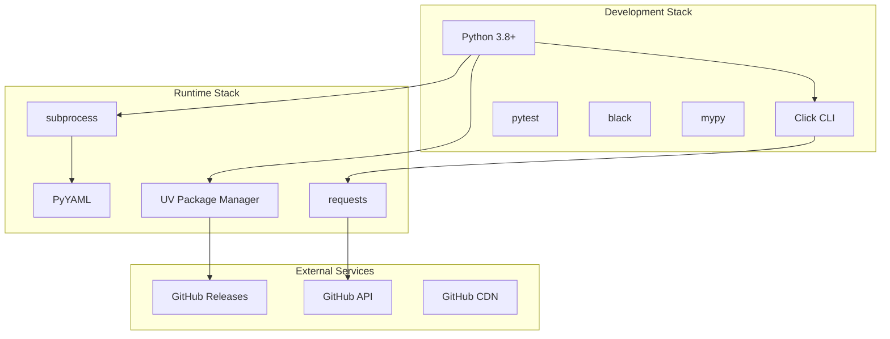
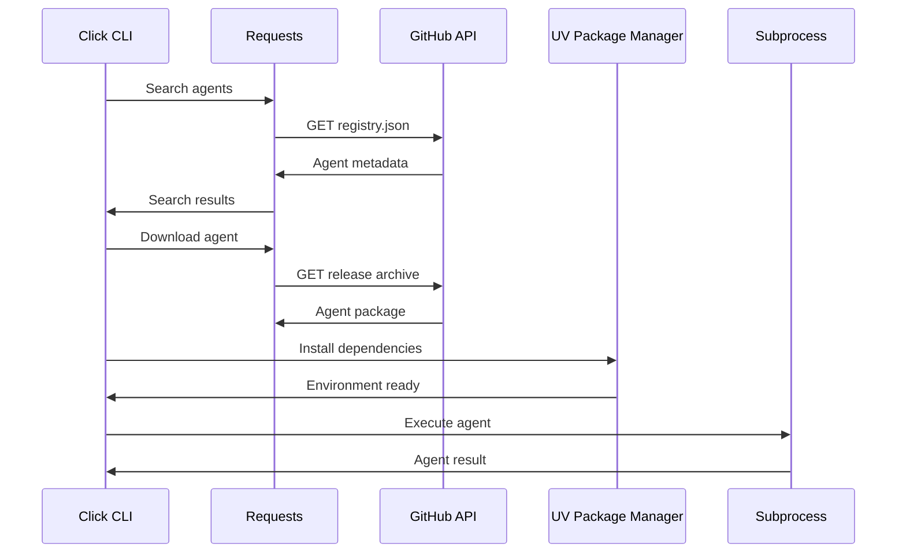

# Agent Hub Technology Stack

**Document Type**: Technology Architecture
**Author**: William
**Date Created**: 2025-06-28
**Last Updated**: 2025-06-28
**Status**: Final
**Level**: L1 - System Level
**Audience**: Technical Architects, Developers, DevOps Team

## 🎯 **Technology Stack Overview**

Agent Hub MVP uses a carefully selected technology stack optimized for rapid development, minimal operational overhead, and excellent developer experience. The stack prioritizes proven, simple technologies over complex solutions.

## 🏗️ **Core Technology Decisions**

### **Primary Programming Language: Python 3.8+**

#### **Rationale**
- **AI Ecosystem Alignment**: Python is the dominant language for AI/ML development
- **Rich Ecosystem**: Extensive libraries for subprocess management, HTTP clients, CLI frameworks
- **Developer Familiarity**: Target audience (AI developers) are highly familiar with Python
- **Cross-Platform**: Excellent cross-platform support for Windows, macOS, Linux

#### **Usage in Agent Hub**
- **CLI Implementation**: All command-line interface logic
- **SDK Library**: Python package for agent loading and execution
- **Agent Runtime**: Process management and execution orchestration
- **Agent Development**: Standard language for agent implementation

```python
# Example technology usage
import subprocess
import click
import yaml
import requests
from pathlib import Path
```

### **Package Management: UV**

#### **Rationale**
- **Performance**: 10-100x faster than pip for package installation
- **Unified Tool**: Handles both virtual environments and package installation
- **Better Dependency Resolution**: More robust than pip's resolver
- **Future-Proof**: Modern tool with active development

#### **Performance Comparison**
| Operation | pip | UV | Improvement |
|-----------|-----|----|-----------|
| Virtual Environment Creation | 5-10s | 1-2s | 5x faster |
| Package Installation | 30-60s | 3-5s | 10x faster |
| Dependency Resolution | Slow | Fast | 5x faster |

#### **Usage in Agent Hub**
```bash
# Virtual environment creation
uv venv ~/.agenthub/agents/my-agent/venv

# Fast package installation
uv pip install --python ~/.agenthub/agents/my-agent/venv/bin/python openai tiktoken

# Lock file generation
uv pip compile requirements.in --output-file requirements.lock
```

### **CLI Framework: Click**

#### **Rationale**
- **Rich Features**: Comprehensive CLI framework with excellent UX
- **Type Safety**: Strong typing support for command parameters
- **Extensibility**: Easy to add new commands and options
- **Documentation**: Automatic help generation and command documentation

#### **Usage in Agent Hub**
```python
import click

@click.group()
def cli():
    """Agent Hub CLI for managing AI agents."""
    pass

@cli.command()
@click.argument('agent_path')
@click.option('--version', help='Agent version to install')
def install(agent_path: str, version: str = None):
    """Install an agent from the registry."""
    # Implementation here
```

### **Process Isolation: Python subprocess**

#### **Rationale**
- **Built-in Standard Library**: No external dependencies
- **Proven Reliability**: Mature, well-tested subprocess management
- **Cross-Platform**: Consistent behavior across operating systems
- **Security**: Process-level isolation provides security boundaries

#### **Usage in Agent Hub**
```python
import subprocess
import json

def execute_agent(venv_path: str, agent_script: str, input_data: dict):
    """Execute agent in isolated subprocess."""
    result = subprocess.run([
        f"{venv_path}/bin/python",
        agent_script,
        json.dumps(input_data)
    ],
    capture_output=True,
    text=True,
    timeout=30,
    cwd=agent_directory,
    env=isolated_environment
    )
    return json.loads(result.stdout)
```

## 🌐 **External Services**

### **Registry: GitHub**

#### **Technology Components**
- **GitHub API**: RESTful API for repository and file access
- **GitHub Releases**: Version management and package distribution
- **GitHub Pages**: Static file hosting for registry index
- **Git Protocol**: Version control and change tracking

#### **Rationale**
- **Zero Infrastructure Cost**: Free hosting and CDN
- **Zero Maintenance**: GitHub handles all operations
- **Developer Familiarity**: All developers know GitHub workflow
- **Global Performance**: GitHub's worldwide CDN infrastructure

#### **Integration Pattern**
```python
class GitHubRegistryClient:
    def __init__(self):
        self.base_url = "https://api.github.com"
        self.registry_repo = "agentplug/agent-registry"

    def get_registry(self) -> dict:
        """Fetch registry.json from GitHub."""
        url = f"{self.base_url}/repos/{self.registry_repo}/contents/registry.json"
        response = requests.get(url)
        content = base64.b64decode(response.json()["content"])
        return json.loads(content)
```

### **Package Distribution: GitHub Releases**

#### **Rationale**
- **Integrated Versioning**: Semantic versioning with Git tags
- **Asset Management**: Binary and archive distribution
- **API Access**: Programmatic download capabilities
- **Change Tracking**: Release notes and change logs

#### **Distribution Flow**


## 📦 **Development Stack**

### **Configuration Management: PyYAML**

#### **Rationale**
- **Human Readable**: YAML is easy to read and write
- **Rich Data Types**: Supports complex data structures
- **Comments**: Allow documentation within configuration
- **Python Integration**: Excellent Python library support

#### **Usage Examples**
```yaml
# Agent manifest (agent.yaml)
name: "coding-agent"
version: "1.0.0"
interface:
  methods:
    generate_code:
      parameters:
        prompt: {type: "string", required: true}
      returns: {type: "string"}

# System configuration (~/.agenthub/config/settings.yaml)
registry:
  url: "https://api.github.com/repos/agentplug/agent-registry"
  cache_ttl: 3600
execution:
  timeout: 30
  max_memory: "1GB"
```

### **HTTP Client: requests**

#### **Rationale**
- **Simplicity**: Clean, intuitive API for HTTP operations
- **Reliability**: Battle-tested library with excellent error handling
- **Features**: Built-in JSON support, session management, authentication
- **Documentation**: Comprehensive documentation and examples

#### **Usage in Agent Hub**
```python
import requests

class RegistryClient:
    def __init__(self):
        self.session = requests.Session()
        self.session.headers.update({
            'User-Agent': 'Agent-Hub/1.0.0',
            'Accept': 'application/vnd.github.v3+json'
        })

    def download_agent(self, download_url: str, target_path: str):
        """Download agent package with progress tracking."""
        response = self.session.get(download_url, stream=True)
        with open(target_path, 'wb') as f:
            for chunk in response.iter_content(chunk_size=8192):
                f.write(chunk)
```

### **Testing Framework: pytest**

#### **Rationale**
- **Pythonic**: Clean, readable test syntax
- **Rich Fixtures**: Powerful dependency injection system
- **Plugin Ecosystem**: Extensive plugin support
- **Parallel Execution**: Fast test execution

#### **Testing Structure**
```python
# tests/test_agent_runtime.py
import pytest
from agenthub.runtime import ProcessManager

class TestProcessManager:
    @pytest.fixture
    def process_manager(self):
        return ProcessManager()

    def test_agent_execution(self, process_manager):
        """Test basic agent execution."""
        result = process_manager.execute_agent(
            agent_path="test-agent",
            method="test_method",
            parameters={"input": "test"}
        )
        assert result["success"] is True
```

## 🛠️ **Development Tools**

### **Code Quality Stack**

#### **Code Formatting: black**
```bash
# Automatic code formatting
black --line-length 88 src/ tests/
```

#### **Type Checking: mypy**
```python
# Type annotations throughout codebase
def execute_agent(
    agent_path: str,
    method: str,
    parameters: Dict[str, Any]
) -> Dict[str, Any]:
    """Execute agent method with type safety."""
```

#### **Linting: flake8**
```bash
# Code quality checks
flake8 src/ tests/ --max-line-length=88
```

#### **Security: bandit**
```bash
# Security vulnerability scanning
bandit -r src/
```

### **Build and Distribution**

#### **Package Building: build**
```bash
# Build Python package
python -m build
```

#### **Dependency Management: pip-tools**
```bash
# Compile dependencies
pip-compile requirements.in
pip-compile requirements-dev.in
```

## 🏗️ **Architecture Integration**

### **Technology Stack Diagram**


### **Data Flow Through Stack**


## 📊 **Technology Evaluation**

### **Selection Criteria**
1. **Maturity**: Proven in production environments
2. **Simplicity**: Easy to understand and maintain
3. **Performance**: Meets Agent Hub performance requirements
4. **Community**: Active development and support
5. **Ecosystem**: Good integration with other tools

### **Alternative Technologies Considered**

#### **Package Managers**
| Tool | Pros | Cons | Decision |
|------|------|------|----------|
| **UV** ✅ | 10x faster, unified tool | Newer, less ecosystem | **Selected** |
| pip | Mature, universal | Slow, complex setup | Rejected |
| conda | Good for data science | Heavy, complex | Rejected |

#### **CLI Frameworks**
| Tool | Pros | Cons | Decision |
|------|------|------|----------|
| **Click** ✅ | Rich features, type safety | Learning curve | **Selected** |
| argparse | Built-in, simple | Limited features | Rejected |
| typer | Modern, type-first | Less mature | Considered |

#### **Registry Solutions**
| Solution | Pros | Cons | Decision |
|----------|------|------|----------|
| **GitHub** ✅ | Zero cost, zero ops | Limited features | **Selected** |
| Custom API | Full control | High cost, complexity | Future |
| PyPI | Familiar | Not designed for agents | Rejected |

## 🔒 **Security Considerations**

### **Dependency Security**
- **UV**: Provides better dependency resolution than pip
- **Virtual Environments**: Isolate agent dependencies
- **Package Verification**: Check package integrity and signatures
- **Regular Updates**: Keep dependencies current with security patches

### **Process Security**
- **Subprocess Isolation**: Each agent runs in separate process
- **Environment Variables**: Isolated environment for each agent
- **File System Access**: Limited to agent directory
- **Resource Limits**: Timeout and memory constraints

### **Network Security**
- **HTTPS Only**: All external communication over HTTPS
- **API Authentication**: GitHub token for API access
- **Rate Limiting**: Respect API rate limits
- **Input Validation**: Validate all external inputs

## 🚀 **Performance Characteristics**

### **Expected Performance**
- **Package Installation**: 3-5 seconds (UV) vs 30-60 seconds (pip)
- **Agent Loading**: < 500ms for cached agents
- **Method Execution**: < 1 second subprocess overhead
- **Registry Queries**: < 2 seconds with caching

### **Scalability Considerations**
- **Local Storage**: Optimized for 100+ agents
- **Concurrent Execution**: Multiple agents simultaneously
- **Memory Usage**: < 100MB for runtime
- **GitHub Limits**: 5,000 API requests/hour

## 📈 **Monitoring and Observability**

### **Logging Strategy**
```python
import logging

# Structured logging configuration
logging.basicConfig(
    level=logging.INFO,
    format='%(asctime)s - %(name)s - %(levelname)s - %(message)s',
    handlers=[
        logging.FileHandler('~/.agenthub/logs/agent-hub.log'),
        logging.StreamHandler()
    ]
)
```

### **Metrics Collection**
- **Usage Analytics**: Agent installations and executions
- **Performance Metrics**: Installation and execution times
- **Error Tracking**: Failed installations and executions
- **User Behavior**: Search patterns and popular agents

This technology stack provides a solid, performant, and maintainable foundation for the Agent Hub MVP while optimizing for rapid development and minimal operational overhead.
