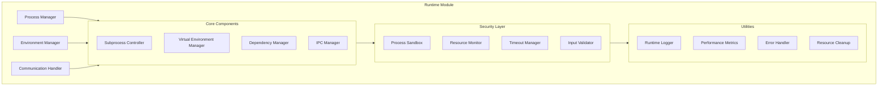

# Agent Hub Runtime Module Design

**Document Type**: Module Design
**Author**: William
**Date Created**: 2025-06-28
**Last Updated**: 2025-06-28
**Status**: Final
**Level**: L3 - Module Level
**Audience**: Developers, Implementation Team

## 🎯 **Module Overview**

The Runtime Module manages agent execution with process-based isolation, providing secure, reliable agent execution while maintaining performance and developer experience. This module is responsible for subprocess management, virtual environment creation, dependency installation, and secure communication between the main process and agent processes.

### **Business Justification**
- **Problem**: Agents need isolated execution to prevent conflicts and security issues
- **User Outcome**: Reliable agent execution without dependency conflicts
- **Business Value**: Enables safe composition of multiple agents from different sources

## 🏗️ **Module Architecture**



## 🔧 **Core Components**

### **Process Manager**

```python
# agenthub/runtime/process_manager.py
import subprocess
import json
import time
import signal
from typing import Dict, Any, Optional
from pathlib import Path
from .communication import IPCManager
from .security import ProcessSandbox
from ..utils import Logger, PerformanceMetrics

class ProcessManager:
    """Manages agent subprocess execution with isolation and monitoring."""

    def __init__(self):
        self.ipc_manager = IPCManager()
        self.sandbox = ProcessSandbox()
        self.logger = Logger(__name__)
        self.metrics = PerformanceMetrics()
        self.active_processes: Dict[str, subprocess.Popen] = {}

    def execute_agent(
        self,
        agent_path: str,
        method: str,
        parameters: Dict[str, Any],
        timeout: int = 30
    ) -> Dict[str, Any]:
        """Execute agent method in isolated subprocess.

        Args:
            agent_path: Path to agent installation
            method: Method name to execute
            parameters: Method parameters
            timeout: Execution timeout in seconds

        Returns:
            Dict containing execution result

        Raises:
            ProcessExecutionError: If execution fails
            ProcessTimeoutError: If execution exceeds timeout
        """
        process_id = f"{agent_path}_{method}_{int(time.time())}"
        start_time = time.time()

        try:
            # Prepare execution environment
            agent_dir = Path(agent_path)
            venv_python = agent_dir / "venv" / "bin" / "python"
            agent_script = agent_dir / "agent.py"

            # Validate inputs
            self._validate_execution_inputs(agent_dir, method, parameters)

            # Create execution payload
            execution_payload = {
                "method": method,
                "parameters": parameters,
                "metadata": {
                    "agent_path": str(agent_path),
                    "execution_id": process_id,
                    "timestamp": time.time()
                }
            }

            # Start subprocess with sandbox
            process = self._start_subprocess(
                venv_python=str(venv_python),
                agent_script=str(agent_script),
                payload=execution_payload,
                process_id=process_id,
                timeout=timeout
            )

            # Monitor and communicate
            result = self._monitor_execution(process, process_id, timeout)

            # Record metrics
            execution_time = time.time() - start_time
            self.metrics.record_execution(
                agent_path=agent_path,
                method=method,
                execution_time=execution_time,
                status="success"
            )

            return result

        except Exception as e:
            execution_time = time.time() - start_time
            self.metrics.record_execution(
                agent_path=agent_path,
                method=method,
                execution_time=execution_time,
                status="error"
            )
            raise e
        finally:
            self._cleanup_process(process_id)

    def _start_subprocess(
        self,
        venv_python: str,
        agent_script: str,
        payload: Dict[str, Any],
        process_id: str,
        timeout: int
    ) -> subprocess.Popen:
        """Start agent subprocess with proper isolation."""

        # Create sandboxed environment
        env = self.sandbox.create_sandbox_environment()

        # Prepare command
        cmd = [
            venv_python,
            str(agent_script),
            "--method", payload["method"],
            "--input", json.dumps(payload)
        ]

        # Start process
        process = subprocess.Popen(
            cmd,
            stdin=subprocess.PIPE,
            stdout=subprocess.PIPE,
            stderr=subprocess.PIPE,
            env=env,
            cwd=Path(agent_script).parent,
            text=True,
            preexec_fn=self.sandbox.setup_process_limits
        )

        # Track active process
        self.active_processes[process_id] = process

        self.logger.info(f"Started subprocess {process.pid} for {process_id}")
        return process

    def _monitor_execution(
        self,
        process: subprocess.Popen,
        process_id: str,
        timeout: int
    ) -> Dict[str, Any]:
        """Monitor subprocess execution with timeout handling."""

        try:
            # Wait for completion with timeout
            stdout, stderr = process.communicate(timeout=timeout)

            # Check return code
            if process.returncode != 0:
                error_msg = f"Agent execution failed with code {process.returncode}"
                if stderr:
                    error_msg += f": {stderr}"
                raise ProcessExecutionError(error_msg)

            # Parse result
            try:
                result = json.loads(stdout)
                return result
            except json.JSONDecodeError as e:
                raise ProcessExecutionError(f"Invalid JSON response from agent: {e}")

        except subprocess.TimeoutExpired:
            # Kill process and raise timeout error
            process.kill()
            process.wait()
            raise ProcessTimeoutError(f"Agent execution exceeded {timeout} seconds")

    def _validate_execution_inputs(
        self,
        agent_dir: Path,
        method: str,
        parameters: Dict[str, Any]
    ):
        """Validate execution inputs for security and correctness."""

        # Check agent directory exists
        if not agent_dir.exists():
            raise ValueError(f"Agent directory not found: {agent_dir}")

        # Check agent script exists
        agent_script = agent_dir / "agent.py"
        if not agent_script.exists():
            raise ValueError(f"Agent script not found: {agent_script}")

        # Check virtual environment
        venv_python = agent_dir / "venv" / "bin" / "python"
        if not venv_python.exists():
            raise ValueError(f"Virtual environment not found: {venv_python}")

        # Validate method name
        if not method or not isinstance(method, str):
            raise ValueError("Method name must be a non-empty string")

        # Validate parameters
        if not isinstance(parameters, dict):
            raise ValueError("Parameters must be a dictionary")

    def _cleanup_process(self, process_id: str):
        """Clean up process resources."""
        if process_id in self.active_processes:
            process = self.active_processes[process_id]
            if process.poll() is None:  # Process still running
                process.terminate()
                try:
                    process.wait(timeout=5)
                except subprocess.TimeoutExpired:
                    process.kill()
                    process.wait()
            del self.active_processes[process_id]

    def shutdown_all_processes(self):
        """Emergency shutdown of all active processes."""
        for process_id in list(self.active_processes.keys()):
            self._cleanup_process(process_id)
```

### **Environment Manager**

```python
# agenthub/runtime/environment_manager.py
import os
import subprocess
import shutil
from pathlib import Path
from typing import List, Dict, Any
from ..utils import Logger, execute_command

class EnvironmentManager:
    """Manages virtual environments and dependencies for agents."""

    def __init__(self):
        self.logger = Logger(__name__)
        self.uv_path = shutil.which("uv")
        if not self.uv_path:
            raise RuntimeError("UV package manager not found. Please install UV.")

    def create_environment(self, agent_dir: Path) -> Path:
        """Create isolated virtual environment for agent.

        Args:
            agent_dir: Agent installation directory

        Returns:
            Path to created virtual environment

        Raises:
            EnvironmentCreationError: If environment creation fails
        """
        venv_path = agent_dir / "venv"

        try:
            # Remove existing environment if present
            if venv_path.exists():
                shutil.rmtree(venv_path)

            # Create new virtual environment
            self.logger.info(f"Creating virtual environment at {venv_path}")

            cmd = [self.uv_path, "venv", str(venv_path)]
            result = execute_command(cmd, cwd=agent_dir)

            if result.returncode != 0:
                raise EnvironmentCreationError(
                    f"Failed to create virtual environment: {result.stderr}"
                )

            self.logger.info(f"Successfully created virtual environment: {venv_path}")
            return venv_path

        except Exception as e:
            self.logger.error(f"Environment creation failed: {e}")
            raise EnvironmentCreationError(f"Failed to create environment: {e}")

    def install_dependencies(
        self,
        venv_path: Path,
        dependencies: List[str],
        agent_dir: Path = None
    ) -> bool:
        """Install dependencies in virtual environment.

        Args:
            venv_path: Path to virtual environment
            dependencies: List of package requirements
            agent_dir: Agent directory for context

        Returns:
            True if installation successful

        Raises:
            DependencyInstallationError: If installation fails
        """
        if not dependencies:
            self.logger.info("No dependencies to install")
            return True

        try:
            # Get python executable path
            python_path = venv_path / "bin" / "python"
            if not python_path.exists():
                raise DependencyInstallationError(
                    f"Python executable not found in virtual environment: {python_path}"
                )

            # Install each dependency
            self.logger.info(f"Installing {len(dependencies)} dependencies")

            for dep in dependencies:
                self.logger.debug(f"Installing dependency: {dep}")

                cmd = [
                    self.uv_path, "pip", "install",
                    f"--python={python_path}",
                    dep
                ]

                result = execute_command(cmd, cwd=agent_dir)

                if result.returncode != 0:
                    raise DependencyInstallationError(
                        f"Failed to install {dep}: {result.stderr}"
                    )

            self.logger.info("All dependencies installed successfully")
            return True

        except Exception as e:
            self.logger.error(f"Dependency installation failed: {e}")
            raise DependencyInstallationError(f"Failed to install dependencies: {e}")

    def validate_environment(self, venv_path: Path) -> bool:
        """Validate that virtual environment is properly configured.

        Args:
            venv_path: Path to virtual environment

        Returns:
            True if environment is valid
        """
        try:
            # Check python executable
            python_path = venv_path / "bin" / "python"
            if not python_path.exists():
                return False

            # Test python execution
            cmd = [str(python_path), "-c", "import sys; print(sys.version)"]
            result = execute_command(cmd)

            return result.returncode == 0

        except Exception:
            return False

    def get_environment_info(self, venv_path: Path) -> Dict[str, Any]:
        """Get information about virtual environment.

        Args:
            venv_path: Path to virtual environment

        Returns:
            Dictionary with environment information
        """
        info = {
            "path": str(venv_path),
            "exists": venv_path.exists(),
            "valid": False,
            "python_version": None,
            "installed_packages": [],
            "size_mb": 0
        }

        if not venv_path.exists():
            return info

        try:
            # Check if valid
            info["valid"] = self.validate_environment(venv_path)

            # Get Python version
            if info["valid"]:
                python_path = venv_path / "bin" / "python"
                cmd = [str(python_path), "-c", "import sys; print('.'.join(map(str, sys.version_info[:3])))"]
                result = execute_command(cmd)
                if result.returncode == 0:
                    info["python_version"] = result.stdout.strip()

                # Get installed packages
                cmd = [self.uv_path, "pip", "list", f"--python={python_path}", "--format=json"]
                result = execute_command(cmd)
                if result.returncode == 0:
                    import json
                    packages = json.loads(result.stdout)
                    info["installed_packages"] = [f"{pkg['name']}=={pkg['version']}" for pkg in packages]

            # Calculate size
            total_size = sum(
                f.stat().st_size for f in venv_path.rglob('*') if f.is_file()
            )
            info["size_mb"] = round(total_size / (1024 * 1024), 2)

        except Exception as e:
            self.logger.warning(f"Failed to get environment info: {e}")

        return info

    def remove_environment(self, venv_path: Path) -> bool:
        """Remove virtual environment.

        Args:
            venv_path: Path to virtual environment

        Returns:
            True if removal successful
        """
        try:
            if venv_path.exists():
                shutil.rmtree(venv_path)
                self.logger.info(f"Removed virtual environment: {venv_path}")
            return True
        except Exception as e:
            self.logger.error(f"Failed to remove environment: {e}")
            return False
```

### **Communication Handler**

```python
# agenthub/runtime/communication.py
import json
import select
import threading
import queue
import time
from typing import Dict, Any, Optional, Callable
from ..utils import Logger

class IPCManager:
    """Manages inter-process communication with agent subprocesses."""

    def __init__(self):
        self.logger = Logger(__name__)
        self.message_queue = queue.Queue()
        self.response_handlers: Dict[str, Callable] = {}

    def send_message(
        self,
        process: 'subprocess.Popen',
        message: Dict[str, Any],
        timeout: int = 30
    ) -> Dict[str, Any]:
        """Send message to subprocess and wait for response.

        Args:
            process: Subprocess to communicate with
            message: Message to send
            timeout: Response timeout in seconds

        Returns:
            Response from subprocess

        Raises:
            CommunicationError: If communication fails
        """
        try:
            # Serialize message
            message_json = json.dumps(message) + "\n"

            # Send to subprocess
            process.stdin.write(message_json)
            process.stdin.flush()

            # Wait for response
            response = self._read_response(process, timeout)

            return response

        except Exception as e:
            raise CommunicationError(f"Failed to communicate with subprocess: {e}")

    def _read_response(
        self,
        process: 'subprocess.Popen',
        timeout: int
    ) -> Dict[str, Any]:
        """Read response from subprocess with timeout.

        Args:
            process: Subprocess to read from
            timeout: Read timeout in seconds

        Returns:
            Parsed response from subprocess
        """
        start_time = time.time()
        response_lines = []

        while time.time() - start_time < timeout:
            # Check if process is still alive
            if process.poll() is not None:
                break

            # Use select for non-blocking read
            if select.select([process.stdout], [], [], 0.1)[0]:
                line = process.stdout.readline()
                if line:
                    response_lines.append(line.strip())

                    # Try to parse as complete JSON
                    try:
                        response_text = '\n'.join(response_lines)
                        response = json.loads(response_text)
                        return response
                    except json.JSONDecodeError:
                        # Not complete JSON yet, continue reading
                        continue

        # Timeout or process ended
        if response_lines:
            response_text = '\n'.join(response_lines)
            try:
                return json.loads(response_text)
            except json.JSONDecodeError:
                raise CommunicationError(f"Invalid JSON response: {response_text}")
        else:
            raise CommunicationError("No response received from subprocess")

class MessageProtocol:
    """Defines message protocol for agent communication."""

    @staticmethod
    def create_request(method: str, parameters: Dict[str, Any], request_id: str = None) -> Dict[str, Any]:
        """Create request message."""
        return {
            "type": "request",
            "id": request_id or str(time.time()),
            "method": method,
            "parameters": parameters,
            "timestamp": time.time()
        }

    @staticmethod
    def create_response(request_id: str, result: Any = None, error: str = None) -> Dict[str, Any]:
        """Create response message."""
        response = {
            "type": "response",
            "id": request_id,
            "timestamp": time.time()
        }

        if error:
            response["error"] = error
        else:
            response["result"] = result

        return response

    @staticmethod
    def validate_message(message: Dict[str, Any]) -> bool:
        """Validate message format."""
        required_fields = ["type", "id", "timestamp"]

        if not all(field in message for field in required_fields):
            return False

        if message["type"] == "request":
            return "method" in message and "parameters" in message
        elif message["type"] == "response":
            return "result" in message or "error" in message

        return False
```

## 🛡️ **Security Layer**

### **Process Sandbox**

```python
# agenthub/runtime/security.py
import os
import resource
import signal
from typing import Dict, Any
from ..utils import Logger

class ProcessSandbox:
    """Provides security sandboxing for agent processes."""

    def __init__(self):
        self.logger = Logger(__name__)
        self.max_memory_mb = 1024  # 1GB default
        self.max_cpu_time = 300   # 5 minutes default
        self.max_file_size_mb = 100  # 100MB default

    def create_sandbox_environment(self) -> Dict[str, str]:
        """Create sandboxed environment variables.

        Returns:
            Dictionary of environment variables for subprocess
        """
        # Start with minimal environment
        safe_env = {
            'PATH': '/usr/local/bin:/usr/bin:/bin',
            'PYTHONPATH': '',
            'HOME': '/tmp',
            'USER': 'agent',
            'SHELL': '/bin/sh',
            'LANG': 'en_US.UTF-8',
            'LC_ALL': 'en_US.UTF-8'
        }

        # Add Python-specific variables
        safe_env.update({
            'PYTHONUNBUFFERED': '1',
            'PYTHONDONTWRITEBYTECODE': '1',
            'PYTHONHASHSEED': '0'
        })

        return safe_env

    def setup_process_limits(self):
        """Set up resource limits for subprocess.

        This function is called with preexec_fn in subprocess.Popen
        """
        try:
            # Memory limit
            memory_limit = self.max_memory_mb * 1024 * 1024
            resource.setrlimit(resource.RLIMIT_AS, (memory_limit, memory_limit))

            # CPU time limit
            resource.setrlimit(resource.RLIMIT_CPU, (self.max_cpu_time, self.max_cpu_time))

            # File size limit
            file_size_limit = self.max_file_size_mb * 1024 * 1024
            resource.setrlimit(resource.RLIMIT_FSIZE, (file_size_limit, file_size_limit))

            # Process limit
            resource.setrlimit(resource.RLIMIT_NPROC, (10, 10))

            # Core dump limit (disable)
            resource.setrlimit(resource.RLIMIT_CORE, (0, 0))

            self.logger.debug("Process limits configured successfully")

        except Exception as e:
            self.logger.warning(f"Failed to set process limits: {e}")

class ResourceMonitor:
    """Monitors resource usage of agent processes."""

    def __init__(self):
        self.logger = Logger(__name__)

    def monitor_process(self, process: 'subprocess.Popen', max_memory_mb: int = 1024) -> Dict[str, Any]:
        """Monitor process resource usage.

        Args:
            process: Process to monitor
            max_memory_mb: Maximum memory allowed

        Returns:
            Dictionary with resource usage stats
        """
        try:
            import psutil

            # Get process info
            proc = psutil.Process(process.pid)

            # Memory usage
            memory_info = proc.memory_info()
            memory_mb = memory_info.rss / (1024 * 1024)

            # CPU usage
            cpu_percent = proc.cpu_percent()

            # Check limits
            if memory_mb > max_memory_mb:
                self.logger.warning(f"Process {process.pid} exceeds memory limit: {memory_mb:.1f}MB")
                process.terminate()

            return {
                "pid": process.pid,
                "memory_mb": round(memory_mb, 2),
                "cpu_percent": cpu_percent,
                "status": proc.status(),
                "create_time": proc.create_time()
            }

        except Exception as e:
            self.logger.error(f"Failed to monitor process: {e}")
            return {}
```

## 🧪 **Testing Strategy**

### **Unit Tests**

```python
# tests/runtime/test_process_manager.py
import pytest
import tempfile
from unittest.mock import Mock, patch
from agenthub.runtime import ProcessManager

class TestProcessManager:
    def test_execute_agent_success(self, sample_agent_dir):
        """Test successful agent execution."""
        manager = ProcessManager()

        result = manager.execute_agent(
            agent_path=str(sample_agent_dir),
            method="test_method",
            parameters={"input": "test"}
        )

        assert result["status"] == "success"
        assert "result" in result

    def test_execute_agent_timeout(self, sample_agent_dir):
        """Test agent execution timeout handling."""
        manager = ProcessManager()

        with pytest.raises(ProcessTimeoutError):
            manager.execute_agent(
                agent_path=str(sample_agent_dir),
                method="slow_method",
                parameters={},
                timeout=1  # Very short timeout
            )

    def test_process_cleanup(self, sample_agent_dir):
        """Test proper process cleanup."""
        manager = ProcessManager()

        # Start execution
        manager.execute_agent(
            agent_path=str(sample_agent_dir),
            method="test_method",
            parameters={}
        )

        # Verify no active processes remain
        assert len(manager.active_processes) == 0
```

### **Integration Tests**

```python
# tests/runtime/test_integration.py
import tempfile
from pathlib import Path
from agenthub.runtime import ProcessManager, EnvironmentManager

class TestRuntimeIntegration:
    def test_full_execution_cycle(self, sample_agent_dir):
        """Test complete agent execution cycle."""
        env_manager = EnvironmentManager()
        process_manager = ProcessManager()

        # Create environment
        venv_path = env_manager.create_environment(sample_agent_dir)
        assert venv_path.exists()

        # Install dependencies
        dependencies = ["requests>=2.0.0"]
        success = env_manager.install_dependencies(venv_path, dependencies)
        assert success

        # Execute agent
        result = process_manager.execute_agent(
            agent_path=str(sample_agent_dir),
            method="test_method",
            parameters={"input": "test"}
        )

        assert result["status"] == "success"
```

## 📊 **Performance Considerations**

### **Process Management**
- **Subprocess Pool**: Reuse processes for repeated calls where safe
- **Memory Management**: Monitor and limit memory usage
- **CPU Limits**: Prevent runaway processes
- **Resource Cleanup**: Proper cleanup of all resources

### **Environment Management**
- **UV Performance**: Leverage UV's speed for environment creation
- **Dependency Caching**: Cache downloaded packages
- **Environment Reuse**: Share environments when dependencies match
- **Lazy Loading**: Create environments only when needed

## 🔒 **Security Features**

### **Process Isolation**
- **Separate Process Space**: Each agent runs in isolated process
- **Resource Limits**: Memory, CPU, and file size limits
- **Environment Restrictions**: Minimal environment variables
- **Network Isolation**: Configurable network access controls

### **Input Validation**
- **Parameter Sanitization**: Validate all input parameters
- **Path Validation**: Prevent directory traversal attacks
- **JSON Safety**: Safe JSON parsing and serialization
- **Command Injection Prevention**: No shell execution of user input

This Runtime Module design provides robust, secure, and performant agent execution while maintaining the simplicity and developer experience that makes Agent Hub powerful.
