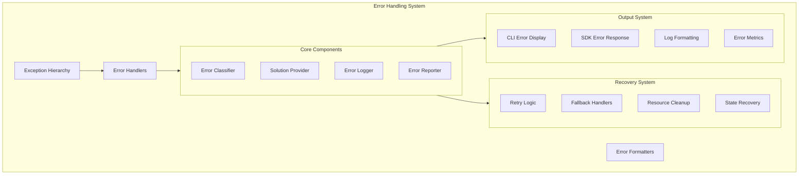

# Agent Hub Error Handling Design

**Document Type**: Error Handling Design
**Author**: William
**Date Created**: 2025-06-28
**Last Updated**: 2025-06-28
**Status**: Final
**Level**: L4 - Cross-cutting Design
**Audience**: Developers, Implementation Team, Support Team

## 🎯 **Error Handling Overview**

Agent Hub implements a comprehensive error handling strategy that provides clear, actionable error messages to users while maintaining system stability and debuggability. The design focuses on user experience, providing helpful solutions and documentation links for common issues.

### **Business Justification**
- **Problem**: Poor error messages create frustration and support burden
- **User Outcome**: Developers get clear guidance when things go wrong
- **Business Value**: Reduces support costs and increases user satisfaction

## 🏗️ **Error Handling Architecture**



## 🔧 **Exception Hierarchy**

### **Base Exception Classes**

```python
# agenthub/exceptions.py
class AgentHubError(Exception):
    """Base exception for all Agent Hub errors."""

    def __init__(
        self,
        message: str,
        solution: str = None,
        docs_link: str = None,
        error_code: str = None,
        context: dict = None
    ):
        """Initialize Agent Hub error.

        Args:
            message: Human-readable error message
            solution: Suggested solution or next steps
            docs_link: Link to relevant documentation
            error_code: Unique error code for tracking
            context: Additional context information
        """
        self.message = message
        self.solution = solution
        self.docs_link = docs_link
        self.error_code = error_code or self._generate_error_code()
        self.context = context or {}
        super().__init__(message)

    def _generate_error_code(self) -> str:
        """Generate unique error code based on exception type."""
        class_name = self.__class__.__name__
        return f"AH_{class_name.upper().replace('ERROR', '')}"

    def to_dict(self) -> dict:
        """Convert error to dictionary for serialization."""
        return {
            "error_type": self.__class__.__name__,
            "error_code": self.error_code,
            "message": self.message,
            "solution": self.solution,
            "docs_link": self.docs_link,
            "context": self.context
        }

class AgentNotFoundError(AgentHubError):
    """Raised when requested agent is not found."""

    def __init__(self, agent_path: str, suggestions: list = None):
        similar_agents = ""
        if suggestions:
            similar_agents = f"\n\nSimilar agents:\n" + "\n".join(f"  • {agent}" for agent in suggestions[:3])

        message = f"Agent '{agent_path}' not found in registry"
        solution = f"Try searching: agenthub search {agent_path.split('/')[-1]}{similar_agents}"

        super().__init__(
            message=message,
            solution=solution,
            docs_link="https://docs.agenthub.ai/troubleshooting#agent-not-found",
            context={"agent_path": agent_path, "suggestions": suggestions}
        )

class AgentInstallationError(AgentHubError):
    """Raised when agent installation fails."""

    def __init__(self, agent_path: str, reason: str, stage: str = None):
        message = f"Failed to install agent '{agent_path}'"
        if stage:
            message += f" during {stage}"
        message += f": {reason}"

        solution = self._get_installation_solution(reason, stage)

        super().__init__(
            message=message,
            solution=solution,
            docs_link="https://docs.agenthub.ai/troubleshooting#installation-errors",
            context={"agent_path": agent_path, "reason": reason, "stage": stage}
        )

    def _get_installation_solution(self, reason: str, stage: str) -> str:
        """Provide specific solution based on failure reason."""
        reason_lower = reason.lower()

        if "network" in reason_lower or "connection" in reason_lower:
            return "Check your internet connection and try again. If behind a proxy, configure proxy settings."
        elif "permission" in reason_lower:
            return "Check file permissions in ~/.agenthub/ directory. You may need to run with appropriate permissions."
        elif "disk" in reason_lower or "space" in reason_lower:
            return "Free up disk space and try again. Agent installations require temporary space for downloads."
        elif "dependency" in reason_lower and stage == "dependencies":
            return "Some Python dependencies failed to install. Try: pip install --upgrade pip setuptools wheel"
        else:
            return "Try installing again with --verbose flag for more details: agenthub install --verbose"

class AgentExecutionError(AgentHubError):
    """Raised when agent execution fails."""

    def __init__(self, agent_path: str, method: str, reason: str, exit_code: int = None):
        message = f"Agent '{agent_path}.{method}' execution failed: {reason}"

        solution = self._get_execution_solution(reason, exit_code)

        super().__init__(
            message=message,
            solution=solution,
            docs_link="https://docs.agenthub.ai/troubleshooting#execution-errors",
            context={
                "agent_path": agent_path,
                "method": method,
                "reason": reason,
                "exit_code": exit_code
            }
        )

    def _get_execution_solution(self, reason: str, exit_code: int) -> str:
        """Provide specific solution based on execution failure."""
        reason_lower = reason.lower()

        if "timeout" in reason_lower:
            return "Agent execution timed out. Try increasing timeout or check if agent is stuck in infinite loop."
        elif "memory" in reason_lower:
            return "Agent ran out of memory. Try with smaller input or increase memory limits."
        elif "import" in reason_lower or "module" in reason_lower:
            return "Agent has missing dependencies. Try reinstalling: agenthub remove <agent> && agenthub install <agent>"
        elif exit_code == 1:
            return "Agent returned error code 1. Check agent logs for specific error details."
        else:
            return "Check agent implementation and input parameters. Run with --verbose for detailed logs."

class RegistryError(AgentHubError):
    """Raised when registry operations fail."""

    def __init__(self, message: str, operation: str = None):
        solution = self._get_registry_solution(message, operation)

        super().__init__(
            message=f"Registry error: {message}",
            solution=solution,
            docs_link="https://docs.agenthub.ai/troubleshooting#registry-errors",
            context={"operation": operation}
        )

    def _get_registry_solution(self, message: str, operation: str) -> str:
        """Provide solution for registry errors."""
        message_lower = message.lower()

        if "network" in message_lower or "connection" in message_lower:
            return "Check internet connection. Registry data will be cached and available offline."
        elif "rate limit" in message_lower:
            return "GitHub API rate limit exceeded. Wait an hour or set GITHUB_TOKEN environment variable."
        elif "not found" in message_lower:
            return "Registry not found. Check if agentplug/agent-registry repository is accessible."
        else:
            return "Try clearing cache: agenthub cache clear && agenthub search --refresh"

class ValidationError(AgentHubError):
    """Raised when validation fails."""

    def __init__(self, item: str, issue: str, field: str = None):
        message = f"Validation failed for {item}"
        if field:
            message += f" field '{field}'"
        message += f": {issue}"

        solution = f"Fix the {field or item} and try again. See documentation for required format."

        super().__init__(
            message=message,
            solution=solution,
            docs_link="https://docs.agenthub.ai/agent-development#validation",
            context={"item": item, "field": field, "issue": issue}
        )

class ConfigurationError(AgentHubError):
    """Raised when configuration is invalid."""

    def __init__(self, config_item: str, issue: str):
        message = f"Configuration error in {config_item}: {issue}"
        solution = f"Check configuration file ~/.agenthub/config/settings.yaml and fix {config_item}."

        super().__init__(
            message=message,
            solution=solution,
            docs_link="https://docs.agenthub.ai/configuration",
            context={"config_item": config_item, "issue": issue}
        )
```

## 🛠️ **Error Handlers**

### **Global Error Handler**

```python
# agenthub/utils/error_handler.py
import sys
import traceback
import logging
from typing import Any, Optional
from ..exceptions import AgentHubError
from .logger import Logger
from .metrics import ErrorMetrics

class ErrorHandler:
    """Global error handler for Agent Hub operations."""

    def __init__(self):
        self.logger = Logger(__name__)
        self.metrics = ErrorMetrics()

        # Error classification patterns
        self.error_patterns = {
            'network': ['connection', 'network', 'timeout', 'unreachable'],
            'permission': ['permission', 'access denied', 'forbidden'],
            'disk_space': ['no space', 'disk full', 'insufficient space'],
            'dependency': ['import error', 'module not found', 'no module named'],
            'memory': ['memory', 'out of memory', 'allocation failed'],
            'timeout': ['timeout', 'timed out', 'time limit exceeded']
        }

    def handle_error(
        self,
        error: Exception,
        context: dict = None,
        verbose: bool = False,
        exit_on_error: bool = True
    ) -> Optional[dict]:
        """Handle any error with appropriate logging and user feedback.

        Args:
            error: The exception that occurred
            context: Additional context information
            verbose: Whether to show detailed error information
            exit_on_error: Whether to exit program after handling

        Returns:
            Error dictionary for programmatic handling
        """
        context = context or {}

        # Record error metrics
        self.metrics.record_error(error, context)

        # Handle Agent Hub errors specially
        if isinstance(error, AgentHubError):
            return self._handle_agenthub_error(error, verbose, exit_on_error)
        else:
            return self._handle_unexpected_error(error, context, verbose, exit_on_error)

    def _handle_agenthub_error(
        self,
        error: AgentHubError,
        verbose: bool,
        exit_on_error: bool
    ) -> dict:
        """Handle known Agent Hub errors."""

        # Log the error
        self.logger.error(f"Agent Hub Error [{error.error_code}]: {error.message}")

        # Display user-friendly error
        print(f"\n❌ Error: {error.message}", file=sys.stderr)

        if error.solution:
            print(f"💡 Solution: {error.solution}", file=sys.stderr)

        if error.docs_link:
            print(f"📖 Help: {error.docs_link}", file=sys.stderr)

        if verbose and error.context:
            print(f"🔍 Context: {error.context}", file=sys.stderr)

        error_dict = error.to_dict()

        if exit_on_error:
            sys.exit(1)

        return error_dict

    def _handle_unexpected_error(
        self,
        error: Exception,
        context: dict,
        verbose: bool,
        exit_on_error: bool
    ) -> dict:
        """Handle unexpected errors."""

        # Classify error
        error_type = self._classify_error(str(error))

        # Log detailed error
        self.logger.error(f"Unexpected error [{error_type}]: {error}")
        if verbose:
            self.logger.error(traceback.format_exc())

        # Display user-friendly message
        print(f"\n❌ Unexpected error: {error}", file=sys.stderr)

        # Provide generic solution based on error type
        solution = self._get_generic_solution(error_type, str(error))
        if solution:
            print(f"💡 Try: {solution}", file=sys.stderr)

        print("📖 Help: https://docs.agenthub.ai/troubleshooting", file=sys.stderr)

        if verbose:
            print(f"\n🔍 Full traceback:\n{traceback.format_exc()}", file=sys.stderr)

        error_dict = {
            "error_type": "UnexpectedError",
            "error_code": f"AH_UNEXPECTED_{error_type.upper()}",
            "message": str(error),
            "solution": solution,
            "context": context
        }

        if exit_on_error:
            sys.exit(1)

        return error_dict

    def _classify_error(self, error_message: str) -> str:
        """Classify error based on message content."""
        error_lower = error_message.lower()

        for error_type, patterns in self.error_patterns.items():
            if any(pattern in error_lower for pattern in patterns):
                return error_type

        return 'unknown'

    def _get_generic_solution(self, error_type: str, error_message: str) -> str:
        """Get generic solution based on error type."""
        solutions = {
            'network': "Check your internet connection and try again",
            'permission': "Check file permissions in ~/.agenthub/ directory",
            'disk_space': "Free up disk space and try again",
            'dependency': "Try reinstalling Agent Hub: pip install --upgrade agenthub",
            'memory': "Close other applications to free up memory",
            'timeout': "Try again or increase timeout settings"
        }

        return solutions.get(error_type, "Run with --verbose flag for more details")

    def setup_global_exception_handler(self):
        """Set up global exception handler for uncaught exceptions."""
        def handle_exception(exc_type, exc_value, exc_traceback):
            if issubclass(exc_type, KeyboardInterrupt):
                # Handle Ctrl+C gracefully
                print("\n\n⚠️  Operation cancelled by user", file=sys.stderr)
                sys.exit(1)
            else:
                # Handle other uncaught exceptions
                self.handle_error(exc_value, verbose=True)

        sys.excepthook = handle_exception
```

### **Context Managers for Error Handling**

```python
# agenthub/utils/error_context.py
import contextlib
from typing import Any, Generator, Type
from .error_handler import ErrorHandler

@contextlib.contextmanager
def error_context(
    operation: str,
    error_class: Type[Exception] = None,
    context: dict = None,
    verbose: bool = False
) -> Generator[ErrorHandler, None, None]:
    """Context manager for handling errors in specific operations.

    Args:
        operation: Description of the operation
        error_class: Specific error class to catch
        context: Additional context for error handling
        verbose: Whether to show verbose error information

    Example:
        with error_context("installing agent", AgentInstallationError):
            install_agent(agent_path)
    """
    handler = ErrorHandler()
    context = context or {}
    context['operation'] = operation

    try:
        yield handler
    except Exception as e:
        if error_class and isinstance(e, error_class):
            raise  # Let specific error bubble up
        else:
            handler.handle_error(e, context=context, verbose=verbose)

@contextlib.contextmanager
def suppress_errors(
    *error_types: Type[Exception],
    log_errors: bool = True,
    default_return: Any = None
) -> Generator[Any, None, None]:
    """Context manager to suppress specific error types.

    Args:
        error_types: Exception types to suppress
        log_errors: Whether to log suppressed errors
        default_return: Value to return if error is suppressed

    Example:
        with suppress_errors(NetworkError, log_errors=True) as result:
            data = fetch_from_network()
        if result.error_occurred:
            print("Network error occurred, using cached data")
    """
    class SuppressResult:
        def __init__(self):
            self.error_occurred = False
            self.error = None
            self.default_return = default_return

    result = SuppressResult()

    try:
        yield result
    except error_types as e:
        result.error_occurred = True
        result.error = e

        if log_errors:
            logger = logging.getLogger(__name__)
            logger.warning(f"Suppressed error: {e}")
```

## 📊 **Error Monitoring and Metrics**

### **Error Metrics Collection**

```python
# agenthub/utils/error_metrics.py
import json
import time
from pathlib import Path
from typing import Dict, Any, List
from collections import defaultdict, deque

class ErrorMetrics:
    """Collects and analyzes error metrics for debugging and improvement."""

    def __init__(self):
        self.metrics_file = Path.home() / ".agenthub" / "analytics" / "error_metrics.json"
        self.metrics_file.parent.mkdir(parents=True, exist_ok=True)

        # In-memory metrics for current session
        self.session_errors = deque(maxlen=100)  # Last 100 errors
        self.error_counts = defaultdict(int)
        self.error_patterns = defaultdict(list)

    def record_error(self, error: Exception, context: dict = None):
        """Record error occurrence with context.

        Args:
            error: The exception that occurred
            context: Additional context information
        """
        error_record = {
            "timestamp": time.time(),
            "error_type": error.__class__.__name__,
            "error_message": str(error),
            "context": context or {},
            "session_id": self._get_session_id()
        }

        # Add to session metrics
        self.session_errors.append(error_record)
        self.error_counts[error.__class__.__name__] += 1

        # Save to file
        self._save_error_record(error_record)

        # Analyze patterns
        self._analyze_error_patterns(error_record)

    def get_error_summary(self, hours: int = 24) -> Dict[str, Any]:
        """Get error summary for specified time period.

        Args:
            hours: Number of hours to look back

        Returns:
            Dictionary with error summary
        """
        cutoff_time = time.time() - (hours * 3600)
        recent_errors = [
            error for error in self.session_errors
            if error["timestamp"] > cutoff_time
        ]

        error_types = defaultdict(int)
        contexts = defaultdict(int)

        for error in recent_errors:
            error_types[error["error_type"]] += 1
            if "operation" in error.get("context", {}):
                contexts[error["context"]["operation"]] += 1

        return {
            "total_errors": len(recent_errors),
            "unique_error_types": len(error_types),
            "most_common_errors": dict(error_types.most_common(5)),
            "most_common_operations": dict(contexts.most_common(5)),
            "time_period_hours": hours
        }

    def get_error_recommendations(self) -> List[str]:
        """Get recommendations based on error patterns.

        Returns:
            List of recommendation strings
        """
        recommendations = []

        # Check for common patterns
        if self.error_counts.get("AgentNotFoundError", 0) > 3:
            recommendations.append(
                "Many 'Agent Not Found' errors. Consider checking agent names and using search feature."
            )

        if self.error_counts.get("RegistryError", 0) > 2:
            recommendations.append(
                "Registry errors detected. Check internet connection or try clearing cache."
            )

        if self.error_counts.get("AgentExecutionError", 0) > 2:
            recommendations.append(
                "Multiple execution errors. Check agent compatibility and input parameters."
            )

        return recommendations

    def _save_error_record(self, error_record: dict):
        """Save error record to persistent storage."""
        try:
            # Load existing metrics
            existing_metrics = []
            if self.metrics_file.exists():
                with open(self.metrics_file, 'r') as f:
                    existing_metrics = json.load(f)

            # Add new record
            existing_metrics.append(error_record)

            # Keep only last 1000 records
            if len(existing_metrics) > 1000:
                existing_metrics = existing_metrics[-1000:]

            # Save back to file
            with open(self.metrics_file, 'w') as f:
                json.dump(existing_metrics, f, indent=2)

        except Exception:
            # Don't let metrics collection break the application
            pass

    def _analyze_error_patterns(self, error_record: dict):
        """Analyze error patterns for insights."""
        error_type = error_record["error_type"]
        message = error_record["error_message"]

        # Look for recurring patterns
        pattern_key = f"{error_type}:{message[:50]}"  # First 50 chars
        self.error_patterns[pattern_key].append(error_record["timestamp"])

        # Check if pattern is recurring
        if len(self.error_patterns[pattern_key]) >= 3:
            # This is a recurring pattern
            times = self.error_patterns[pattern_key]
            if times[-1] - times[0] < 3600:  # Within 1 hour
                # Rapid recurrence - might indicate systematic issue
                pass

    def _get_session_id(self) -> str:
        """Get unique session identifier."""
        # Simple session ID based on process start time
        import os
        return f"session_{os.getpid()}_{int(time.time())}"
```

## 🧪 **Testing Error Handling**

### **Error Testing Framework**

```python
# tests/utils/test_error_handling.py
import pytest
from agenthub.exceptions import *
from agenthub.utils.error_handler import ErrorHandler

class TestErrorHandling:
    def test_agent_not_found_error(self):
        """Test AgentNotFoundError formatting."""
        error = AgentNotFoundError("meta/nonexistent", ["meta/coding-agent", "meta/data-agent"])

        assert "meta/nonexistent" in error.message
        assert "meta/coding-agent" in error.solution
        assert error.error_code == "AH_AGENTNOTFOUND"

    def test_error_handler_agenthub_error(self, capsys):
        """Test error handler with Agent Hub errors."""
        handler = ErrorHandler()
        error = AgentInstallationError("test/agent", "network error", "download")

        result = handler.handle_error(error, exit_on_error=False)

        captured = capsys.readouterr()
        assert "❌ Error:" in captured.err
        assert "💡 Solution:" in captured.err
        assert result["error_type"] == "AgentInstallationError"

    def test_error_context_manager(self):
        """Test error context manager."""
        from agenthub.utils.error_context import error_context

        with pytest.raises(ValueError):
            with error_context("test operation"):
                raise ValueError("test error")

    def test_error_metrics_collection(self):
        """Test error metrics collection."""
        from agenthub.utils.error_metrics import ErrorMetrics

        metrics = ErrorMetrics()
        error = AgentNotFoundError("test/agent")

        metrics.record_error(error, {"operation": "install"})

        summary = metrics.get_error_summary()
        assert summary["total_errors"] == 1
        assert "AgentNotFoundError" in summary["most_common_errors"]
```

## 📋 **Error Documentation**

### **Error Code Reference**

| Error Code | Error Type | Description | Common Solutions |
|------------|------------|-------------|------------------|
| AH_AGENTNOTFOUND | AgentNotFoundError | Agent not in registry | Use search, check spelling |
| AH_AGENTINSTALLATION | AgentInstallationError | Installation failed | Check network, permissions |
| AH_AGENTEXECUTION | AgentExecutionError | Agent execution failed | Check inputs, dependencies |
| AH_REGISTRY | RegistryError | Registry access failed | Check network, clear cache |
| AH_VALIDATION | ValidationError | Validation failed | Fix format, check docs |
| AH_CONFIGURATION | ConfigurationError | Config invalid | Fix config file |

### **Common Error Scenarios**

#### **Network Issues**
```python
# Network error handling example
try:
    registry = client.get_registry()
except RegistryError as e:
    if "network" in str(e).lower():
        print("Using cached data due to network issues")
        registry = client.get_registry(force_cache=True)
```

#### **Installation Failures**
```python
# Installation error recovery
try:
    installer.install_agent(agent_path)
except AgentInstallationError as e:
    if e.context.get("stage") == "dependencies":
        # Try with different dependency resolver
        installer.install_agent(agent_path, use_pip_fallback=True)
```

This comprehensive error handling design ensures that Agent Hub provides excellent user experience even when things go wrong, with clear guidance on how to resolve issues and robust recovery mechanisms.
