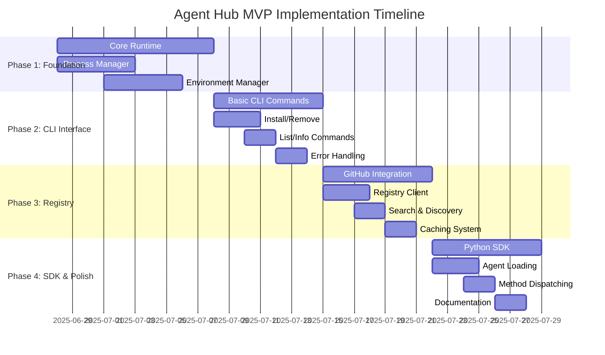

# Agent Hub Implementation Roadmap

**Document Type**: Implementation Plan
**Author**: William
**Date Created**: 2025-06-28
**Last Updated**: 2025-06-28
**Status**: Final
**Level**: L5 - Planning Level
**Audience**: Development Team, Project Managers, Stakeholders

## 🎯 **Implementation Overview**

This roadmap outlines the step-by-step implementation plan for Agent Hub MVP, organized into 4 main phases over 4-6 weeks. Each phase delivers functional value and builds toward the complete vision of one-line agent integration.

## 📅 **Implementation Timeline**



## 🏗️ **Phase 1: Core Foundation (Week 1-2)**

### **Objective**
Build the fundamental runtime system that enables agent execution with process-based isolation.

### **Deliverables**

#### **Process Manager**
```python
# agenthub/runtime/process_manager.py
class ProcessManager:
    def execute_agent(self, agent_path: str, method: str, parameters: dict) -> dict:
        """Execute agent in isolated subprocess."""
        # Implementation: subprocess execution with JSON IPC
```

#### **Environment Manager**
```python
# agenthub/runtime/environment_manager.py
class EnvironmentManager:
    def create_environment(self, agent_path: str) -> str:
        """Create isolated virtual environment using UV."""
        # Implementation: UV venv creation and dependency installation
```

#### **Agent Runtime**
```python
# agenthub/runtime/agent_runtime.py
class AgentRuntime:
    def load_agent_manifest(self, agent_path: str) -> dict:
        """Load and validate agent manifest."""
        # Implementation: YAML parsing and validation
```

### **Success Criteria**
- ✅ Can execute simple agents in isolated processes
- ✅ Virtual environments created and managed correctly
- ✅ Basic agent manifest loading and validation
- ✅ Error handling for subprocess failures

### **Testing**
- Unit tests for each component
- Integration tests for subprocess execution
- Performance tests for environment creation

### **Dependencies**
- UV package manager installation
- Python subprocess and venv modules
- PyYAML for manifest parsing

## 🖥️ **Phase 2: CLI Interface (Week 3)**

### **Objective**
Create complete command-line interface for all agent management operations.

### **Deliverables**

#### **Core CLI Commands**
```bash
# Essential commands
agenthub install <agent-path>     # Install an agent
agenthub list [--installed]       # List agents
agenthub remove <agent-path>      # Remove installed agent
agenthub info <agent-path>        # Show agent details
agenthub search <query>           # Search for agents (local cache)
```

#### **Error Handling System**
```python
# agenthub/cli/utils/error_handler.py
class ErrorHandler:
    def handle_error(self, error: Exception, verbose: bool = False):
        """Display user-friendly error messages with solutions."""
        # Implementation: Contextual error messages with actionable solutions
```

#### **Output Formatting**
```python
# agenthub/cli/utils/output_formatter.py
class OutputFormatter:
    def print_agent_list(self, agents: list, show_details: bool = False):
        """Format and display agent lists."""
        # Implementation: Rich, colorful CLI output
```

### **Success Criteria**
- ✅ All essential CLI commands working
- ✅ Helpful error messages with solutions
- ✅ Consistent, professional CLI output
- ✅ Local agent management without registry

### **Testing**
- CLI integration tests using Click's test runner
- Error scenario testing
- User experience testing

### **Dependencies**
- Click framework for CLI
- Rich or colorama for colored output
- Local file system storage

## 🌐 **Phase 3: GitHub Registry (Week 4)**

### **Objective**
Integrate with GitHub-based registry for agent discovery and installation.

### **Deliverables**

#### **GitHub Registry Client**
```python
# agenthub/registry/github_client.py
class GitHubRegistryClient:
    def get_registry(self) -> dict:
        """Fetch registry.json from GitHub."""
        # Implementation: GitHub API integration with caching

    def search_agents(self, query: str, category: str = None) -> list:
        """Search agents in registry."""
        # Implementation: Client-side search with filtering
```

#### **Enhanced CLI Commands**
```bash
# Enhanced commands with registry integration
agenthub search <query> --category development
agenthub trending                        # Show trending agents
agenthub info <agent-path>              # Show detailed info from registry
```

#### **Caching System**
```python
# agenthub/cache/cache_manager.py
class CacheManager:
    def get_cached_registry(self) -> dict:
        """Get cached registry with TTL validation."""
        # Implementation: File-based caching with expiration
```

### **Success Criteria**
- ✅ Can discover agents from GitHub registry
- ✅ Search and filtering functionality working
- ✅ Registry caching for offline usage
- ✅ Agent download from GitHub releases

### **Testing**
- GitHub API integration tests
- Cache invalidation tests
- Network failure handling tests

### **Dependencies**
- GitHub repository: `agentplug/agent-registry`
- requests library for HTTP
- Registry.json with initial agent catalog

## 🐍 **Phase 4: Python SDK & Polish (Week 5-6)**

### **Objective**
Complete the one-line integration experience with Python SDK and final polish.

### **Deliverables**

#### **Python SDK**
```python
# agenthub/__init__.py
import agenthub as amg

# Core functionality
agent = amg.load("meta/coding-agent")
code = agent.generate_code("neural network class")
```

#### **Agent Wrapper System**
```python
# agenthub/core/wrapper.py
class AgentWrapper:
    def __getattr__(self, method_name: str):
        """Dynamic method creation from agent manifest."""
        # Implementation: Dynamic proxy with subprocess execution
```

#### **Developer Tools**
```bash
# Developer productivity commands
agenthub init <agent-name>      # Create agent template
agenthub validate <agent-path>  # Validate agent
agenthub package <agent-path>   # Package for distribution
```

### **Success Criteria**
- ✅ One-line agent loading: `agent = amg.load("meta/coding-agent")`
- ✅ Dynamic method dispatch working correctly
- ✅ Agent development tools complete
- ✅ Comprehensive documentation and examples

### **Testing**
- End-to-end integration tests
- SDK API tests
- Developer workflow tests
- Performance benchmarks

### **Dependencies**
- Complete runtime and CLI from previous phases
- Agent templates for different categories
- Documentation generation tools

## 🧪 **Testing Strategy**

### **Unit Testing**
```python
# Test structure
tests/
├── runtime/
│   ├── test_process_manager.py
│   ├── test_environment_manager.py
│   └── test_agent_runtime.py
├── cli/
│   ├── test_commands.py
│   ├── test_error_handling.py
│   └── test_output_formatting.py
├── registry/
│   ├── test_github_client.py
│   └── test_cache_manager.py
└── sdk/
    ├── test_agent_manager.py
    ├── test_agent_wrapper.py
    └── test_integration.py
```

### **Integration Testing**
- Full workflow tests: install → load → execute → remove
- GitHub API integration tests
- Cross-platform compatibility tests
- Performance and stress tests

### **User Acceptance Testing**
- Developer workflow validation
- Error scenario handling
- Documentation completeness
- Installation experience

## 📋 **Development Process**

### **Development Workflow**
1. **Feature Branch**: Create branch for each component
2. **TDD Approach**: Write tests first, then implementation
3. **Code Review**: All code reviewed before merge
4. **Continuous Integration**: Automated testing on all platforms
5. **Documentation**: Update docs with each feature

### **Quality Gates**
- ✅ All unit tests pass
- ✅ Integration tests pass
- ✅ Code coverage > 80%
- ✅ No linting errors
- ✅ Documentation updated

### **Release Process**
1. **Alpha Release**: After Phase 2 (CLI working)
2. **Beta Release**: After Phase 3 (Registry integration)
3. **MVP Release**: After Phase 4 (SDK complete)
4. **Post-MVP**: Iterative improvements based on feedback

## 🚀 **Deployment Strategy**

### **Distribution**
```bash
# PyPI package distribution
pip install agenthub

# GitHub repository
git clone https://github.com/agentplug/agenthub.git
```

### **GitHub Registry Setup**
```
agentplug/agent-registry/
├── registry.json          # Main registry index
├── agents/                # Agent metadata
└── README.md              # Registry documentation
```

### **Initial Agent Catalog**
- 5-10 sample agents for testing
- Different categories: development, data-science, content
- Comprehensive examples and documentation

## 📊 **Success Metrics**

### **Phase 1 Metrics**
- Environment creation time: < 10 seconds
- Agent execution overhead: < 1 second
- Subprocess reliability: 99%+ success rate

### **Phase 2 Metrics**
- Command execution time: < 2 seconds
- Error message helpfulness: User feedback
- CLI usability: Developer testing

### **Phase 3 Metrics**
- Registry query time: < 3 seconds
- Cache hit rate: > 80%
- Agent discovery effectiveness: User feedback

### **Phase 4 Metrics**
- One-line integration working: 100%
- SDK API completeness: All features
- Documentation quality: Complete coverage

## 🔄 **Risk Mitigation**

### **Technical Risks**
| Risk | Probability | Impact | Mitigation |
|------|-------------|---------|------------|
| Subprocess reliability | Medium | High | Comprehensive error handling, timeouts |
| GitHub API limits | Low | Medium | Caching, rate limiting |
| Cross-platform issues | Medium | Medium | Multi-platform testing |

### **Schedule Risks**
| Risk | Probability | Impact | Mitigation |
|------|-------------|---------|------------|
| UV integration complexity | Low | Medium | Fallback to pip if needed |
| GitHub registry delays | Low | Low | Local registry as backup |
| Testing overhead | Medium | Low | Parallel testing development |

## 🎯 **Post-MVP Roadmap**

### **Phase 5: Agent Development Tools (Month 2)**
- Advanced agent templates
- Agent testing framework
- Publishing workflow automation
- Community features

### **Phase 6: Enterprise Features (Month 3)**
- Agent governance and policies
- Enterprise authentication
- Advanced monitoring and analytics
- Custom registry support

### **Phase 7: Advanced Capabilities (Month 4+)**
- Agent composition and workflows
- Web interface
- Containerized execution option
- Marketplace and monetization

This implementation roadmap provides a clear, achievable path to delivering the Agent Hub MVP while maintaining quality, testing, and documentation standards throughout the development process.
