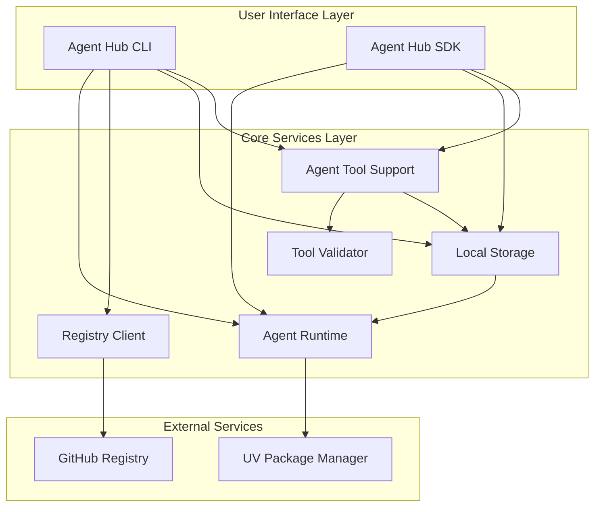
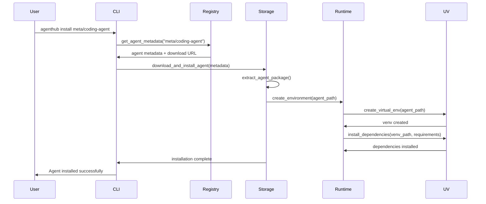
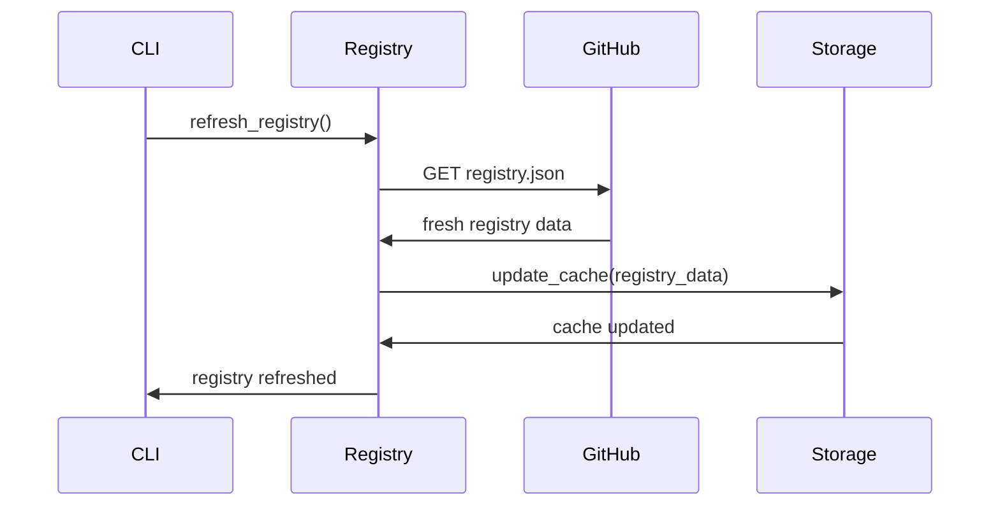

# Agent Hub MVP Container Architecture

**Document Type**: MVP Container Architecture
**Author**: William
**Date Created**: 2025-06-28
**Last Updated**: 2025-06-28
**Status**: Final
**Level**: L2 - MVP Container Level
**Audience**: Technical Architects, Developers, DevOps Team

## 🎯 **MVP Container Architecture Overview**

Agent Hub MVP uses a **modular, container-based architecture** that separates concerns while maintaining simplicity. The MVP focuses on **core integration functionality** without the complexity of search, discovery, or community features.

### **MVP Architecture Principles**
1. **Separation of Concerns**: Clear boundaries between system components
2. **Minimal Dependencies**: Reduce coupling between containers
3. **Local Execution**: All operations happen on the user's machine
4. **Simple Communication**: File-based and direct method calls
5. **MVP Focus**: Only essential containers for core functionality

## 🏗️ **MVP System Containers**



## 🔧 **MVP Container Details**

### **1. Agent Hub CLI Container**

#### **Purpose**
Primary user interface for agent management operations.

#### **Responsibilities**
- **Command Parsing**: Parse and validate CLI arguments
- **User Interaction**: Display results and error messages
- **Workflow Orchestration**: Coordinate between other containers
- **Error Handling**: Provide user-friendly error messages

#### **Interfaces**
```python
# agenthub/cli/main.py
@click.group()
def cli():
    """Agent Hub - One-line AI agent integration."""
    pass

@cli.command()
@click.argument('agent_path')
def install(agent_path):
    """Install an agent from the registry."""
    # Implementation
    pass

@cli.command()
def list():
    """List available or installed agents."""
    # Implementation
    pass
```

#### **Dependencies**
- **Click Framework**: CLI framework
- **Output Formatter**: Display formatting utilities
- **Error Handler**: Error message formatting

#### **MVP Scope**
- ✅ **Install Command**: Install agents from registry
- ✅ **List Command**: Show available/installed agents
- ✅ **Remove Command**: Remove installed agents
- ✅ **Info Command**: Show agent details
- ❌ **Search Command**: Not in MVP scope
- ❌ **Trending Command**: Not in MVP scope

### **2. Agent Hub SDK Container**

#### **Purpose**
Python library for one-line agent integration.

#### **Responsibilities**
- **Agent Loading**: Load agents from local storage
- **Method Dispatching**: Route method calls to agent runtime
- **Result Handling**: Parse and return agent results
- **Error Management**: Handle and propagate errors

#### **Interfaces**
```python
# agenthub/sdk/__init__.py
import agenthub as amg

# One-line agent loading
agent = amg.load("meta/coding-agent")
result = agent.generate_code("neural network")
```

#### **Dependencies**
- **Agent Runtime**: For agent execution
- **Local Storage**: For agent metadata
- **Agent Wrapper**: For dynamic method creation

#### **MVP Scope**
- ✅ **Agent Loading**: `amg.load("agent-path")`
- ✅ **Method Execution**: Dynamic method dispatching
- ✅ **Error Handling**: Clear error messages
- ❌ **Agent Composition**: Not in MVP scope
- ❌ **Advanced Features**: Not in MVP scope

### **3. Agent Runtime Container**

#### **Purpose**
Execute agents in isolated environments with dependency management.

#### **Responsibilities**
- **Process Management**: Create and manage agent subprocesses
- **Environment Management**: Create isolated virtual environments
- **Dependency Resolution**: Install agent dependencies
- **Execution Control**: Monitor and control agent execution

#### **Interfaces**
```python
# agenthub/runtime/process_manager.py
class ProcessManager:
    def execute_agent(self, agent_path: str, method: str, parameters: dict) -> dict:
        """Execute agent method in isolated subprocess."""
        # Implementation
        pass

# agenthub/runtime/environment_manager.py
class EnvironmentManager:
    def create_environment(self, agent_path: str) -> str:
        """Create isolated virtual environment."""
        # Implementation
        pass
```

#### **Dependencies**
- **UV Package Manager**: For dependency management
- **Python Subprocess**: For process isolation
- **Local Storage**: For agent files and metadata

#### **MVP Scope**
- ✅ **Process Isolation**: Subprocess execution
- ✅ **Virtual Environments**: UV-based environment creation
- ✅ **Dependency Management**: UV package installation
- ✅ **Execution Control**: Timeout and resource limits
- ❌ **Container Support**: Not in MVP scope
- ❌ **Cloud Execution**: Not in MVP scope

### **4. Registry Client Container**

#### **Purpose**
Fetch agent metadata from GitHub-based registry.

#### **Responsibilities**
- **Registry Fetching**: Download registry data from GitHub
- **Data Parsing**: Parse registry JSON data
- **Caching**: Cache registry data locally
- **Error Handling**: Handle network and API errors

#### **Interfaces**
```python
# agenthub/registry/github_client.py
class GitHubRegistryClient:
    def get_registry(self) -> dict:
        """Fetch registry from GitHub."""
        # Implementation
        pass

    def get_agent_metadata(self, agent_path: str) -> dict:
        """Get specific agent metadata."""
        # Implementation
        pass
```

#### **Dependencies**
- **GitHub API**: For registry data
- **Requests Library**: For HTTP operations
- **Cache Manager**: For local caching

#### **MVP Scope**
- ✅ **Registry Fetching**: Download from GitHub
- ✅ **Basic Caching**: Local file-based cache
- ✅ **Error Handling**: Network error recovery
- ❌ **Search Functionality**: Not in MVP scope
- ❌ **Advanced Discovery**: Not in MVP scope

### **5. Agent Tool Support Container**

#### **Purpose**
Provides local infrastructure for agents to discover their built-in tools AND allows users to optionally inject custom tools. All execution happens locally on user's machine.

#### **Responsibilities**
- **Local Tool Discovery**: Help agents find and access their own built-in tools locally
- **Local Tool Injection**: Allow users to inject additional tools to agents locally
- **Local Tool Override**: Enable users to override agent's built-in tools locally
- **Local Tool Registry**: Maintain local registry of agent's built-in tools and user custom tools
- **Local Tool Validation**: Validate tool access and compatibility locally
- **Local Tool Isolation**: Ensure tools don't conflict between different agents locally
- **Local Tool Documentation**: Provide tool metadata and usage information locally

#### **Interfaces**
```python
# agenthub/core/agent_tool_support.py
class AgentToolSupport:
    def __init__(self):
        """Initialize agent tool support infrastructure."""
        pass

    def discover_agent_tools(self, agent_path: str) -> Dict[str, ToolInfo]:
        """Discover agent's built-in tools."""
        pass

    def inject_custom_tools(self, agent_path: str, custom_tools: Dict[str, Callable]):
        """Inject user's custom tools to an agent."""
        pass

    def override_builtin_tools(self, agent_path: str, overrides: Dict[str, Callable]):
        """Override agent's built-in tools with user tools."""
        pass

    def get_available_tools(self, agent_path: str) -> Dict[str, ToolInfo]:
        """Get all available tools: built-in + custom + overrides."""
        pass

    def validate_tool_access(self, agent_path: str, tool_name: str) -> bool:
        """Validate that an agent can access a specific tool."""
        pass

    def check_tool_conflicts(self, agent_path: str, other_agents: List[str]) -> List[str]:
        """Check for potential tool conflicts between agents."""
        pass
```

#### **Dependencies**
- **Local Tool Registry**: Local database of available tools in user's environment
- **Local Agent Manifests**: Local information about what tools agents need
- **Local Storage**: For local tool metadata and agent tool requirements
- **Local Environment Scanner**: To discover what tools are available locally

#### **MVP Scope**
- ✅ **Local Built-in Tool Discovery**: Help agents find and access their own tools locally
- ✅ **Local Custom Tool Injection**: Allow users to inject additional tools locally
- ✅ **Local Tool Override**: Enable users to override agent's built-in tools locally
- ✅ **Local Tool Registry**: Maintain local registry of built-in + custom tools
- ✅ **Local Tool Validation**: Validate tool access and compatibility locally
- ✅ **Local Tool Conflict Prevention**: Prevent conflicts between agents locally
- ❌ **Tool Implementation**: No tool building by Agent Hub
- ❌ **Tool Execution**: No direct tool execution by Agent Hub
- ❌ **Remote Execution**: No cloud or server-side execution


### **6. Tool Validation Container**

#### **Purpose**
Validate that agents can safely access the tools they declare in their manifests.

#### **Responsibilities**
- **Tool Access Validation**: Verify agents can access declared tools
- **Tool Safety Validation**: Check if tools are safe for agent use
- **Tool Compatibility**: Ensure tools work with agent runtime
- **Tool Conflict Detection**: Identify potential conflicts between agents
- **Tool Documentation**: Validate tool metadata and usage information

#### **Interfaces**
```python
# agenthub/validation/tool_validator.py
class ToolValidator:
    def __init__(self, security_level: str = "medium"):
        self.security_level = security_level
        self.dangerous_patterns = self._load_dangerous_patterns()
        self.resource_monitor = ResourceMonitor()

    def validate_agent_tools(self, agent_path: str, tool_requirements: List[str]) -> ValidationResult:
        """Validate that an agent can access its declared tools."""
        result = ValidationResult()

        # Tool access validation
        access_result = self._validate_tool_access(agent_path, tool_requirements)
        result.merge(access_result)

        # Tool safety validation
        safety_result = self._validate_tool_safety(tool_requirements)
        result.merge(safety_result)

        # Tool compatibility validation
        compat_result = self._validate_tool_compatibility(agent_path, tool_requirements)
        result.merge(compat_result)

        return result

    def _validate_tool_access(self, agent_path: str, tool_requirements: List[str]) -> ValidationResult:
        """Validate that an agent can access its required tools."""
        result = ValidationResult()

        # Check if tools are available in the environment
        for tool_name in tool_requirements:
            if not self._is_tool_available(tool_name):
                result.add_error(f"Tool '{tool_name}' not available for agent '{agent_path}'")

        return result

    def _validate_tool_safety(self, tool_requirements: List[str]) -> ValidationResult:
        """Check if tools are safe for agent use."""
        result = ValidationResult()

        # Check tool safety based on known safe tools
        for tool_name in tool_requirements:
            if not self._is_tool_safe(tool_name):
                result.add_warning(f"Tool '{tool_name}' may have safety concerns")

        return result

    def _validate_tool_compatibility(self, agent_path: str, tool_requirements: List[str]) -> ValidationResult:
        """Validate tool compatibility with agent runtime."""
        result = ValidationResult()

        # Check if tools are compatible with agent runtime
        for tool_name in tool_requirements:
            if not self._is_tool_compatible(tool_name):
                result.add_warning(f"Tool '{tool_name}' may have compatibility issues")

        return result

class ValidationResult:
    def __init__(self):
        self.errors = []
        self.warnings = []
        self.info = []

    def add_error(self, message: str):
        self.errors.append(message)

    def add_warning(self, message: str):
        self.warnings.append(message)

    def add_info(self, message: str):
        self.info.append(message)

    def merge(self, other: 'ValidationResult'):
        self.errors.extend(other.errors)
        self.warnings.extend(other.warnings)
        self.info.extend(other.info)

    def is_valid(self) -> bool:
        return len(self.errors) == 0
```

#### **Dependencies**
- **Tool Registry**: Database of available tools in the environment
- **Agent Manifests**: Information about what tools agents need
- **Environment Scanner**: To discover what tools are available
- **Safety Database**: Known safe and unsafe tool patterns

#### **MVP Scope**
- ✅ **Tool Access Validation**: Verify agents can access declared tools
- ✅ **Tool Safety Validation**: Check if tools are safe for agent use
- ✅ **Tool Compatibility**: Ensure tools work with agent runtime
- ✅ **Tool Conflict Detection**: Identify potential conflicts between agents
- ❌ **Tool Implementation**: No tool building or implementation
- ❌ **Tool Execution**: No direct tool execution

### **8. Local Storage Container**

#### **Purpose**
Manage local agent installations, metadata, and tool indexes.

#### **Responsibilities**
- **Agent Storage**: Store installed agent files
- **Metadata Management**: Track installation metadata
- **Cache Storage**: Store registry and package caches
- **Document Indexes**: Store processed document indexes for RAG agents
- **Configuration**: Manage user settings and preferences

#### **Interfaces**
```python
# agenthub/storage/local_storage.py
class LocalStorage:
    def install_agent(self, agent_path: str, agent_data: bytes) -> str:
        """Install agent to local storage."""
        # Implementation
        pass

    def get_agent_info(self, agent_path: str) -> dict:
        """Get local agent information."""
        # Implementation
        pass

    def remove_agent(self, agent_path: str) -> bool:
        """Remove agent from local storage."""
        # Implementation
        pass
```

#### **Dependencies**
- **File System**: For local storage
- **JSON/YAML**: For metadata formats
- **Path Management**: For cross-platform paths

#### **MVP Scope**
- ✅ **Agent Installation**: Store agent files locally
- ✅ **Metadata Tracking**: Track installation details
- ✅ **Cache Management**: Store registry cache
- ✅ **Configuration**: User settings storage
- ❌ **Database**: Not in MVP scope
- ❌ **Cloud Sync**: Not in MVP scope

## 🔄 **MVP Container Interactions**

### **Agent Installation Flow**



### **Agent Execution Flow**

```mermaid
sequenceDiagram
    participant User
    participant SDK
    participant Runtime
    participant Storage
    participant Agent

    User->>SDK: agent = amg.load("meta/coding-agent")
    SDK->>Storage: get_agent_info("meta/coding-agent")
    Storage->>SDK: agent metadata and manifest
    SDK->>User: agent wrapper object

    User->>SDK: agent.generate_code("neural network")
    SDK->>Runtime: execute_agent(method, params)
    Runtime->>Agent: run_subprocess(python agent.py)
    Agent->>Runtime: return result
    Runtime->>SDK: parsed result
    SDK->>User: generated code

### **Agent Tool Support Flow**

```mermaid
sequenceDiagram
    participant User
    participant SDK
    participant ToolSupport
    participant Validator
    participant Storage
    participant Runtime
    participant Agent

    User->>SDK: agent = amg.load("agent", custom_tools={...})
    SDK->>ToolSupport: discover_agent_tools(agent_path)

    ToolSupport->>Storage: get_agent_manifest(agent_path)
    Storage->>ToolSupport: agent_manifest

    alt Custom Tools Provided
        SDK->>ToolSupport: inject_custom_tools(agent_path, custom_tools)
        ToolSupport->>ToolSupport: validate_custom_tools()
        ToolSupport->>Storage: store_custom_tool_metadata()
        Storage->>ToolSupport: custom_tools_registered
    end

    ToolSupport->>Validator: validate_agent_tools(agent_path, all_tools)
    Validator->>Validator: validate_tool_access_and_safety()

    alt Validation Failed
        Validator->>ToolSupport: validation_errors
        ToolSupport->>SDK: tool_validation_failed
        SDK->>User: tool_validation_failed
    else Validation Passed
        Validator->>ToolSupport: validation_passed
        ToolSupport->>Storage: register_agent_tools(agent_path, all_tools)
        Storage->>ToolSupport: tools_registered
    end

    ToolSupport->>SDK: agent_tools_ready
    SDK->>User: agent_with_builtin_and_custom_tools

    Note over User,SDK: Agent built-in tools + user custom tools ready for use

    User->>SDK: agent.execute_method("analyze", data)
    SDK->>Runtime: execute_agent(method, params)
    Runtime->>Agent: run_subprocess(with tool access)
    Agent->>Runtime: return result using its own tools
    Runtime->>SDK: parsed result
    SDK->>User: result generated by agent
```

### **Registry Update Flow**



## 📊 **MVP Container Data Flow**

### **Data Storage Strategy**

#### **Local File System Structure**
```
~/.agenthub/
├── agents/                          # Installed agents
│   ├── meta/
│   │   └── coding-agent/
│   │       ├── agent.yaml           # Agent manifest
│   │       ├── agent.py             # Main agent script
│   │       ├── venv/                # Virtual environment
│   │       ├── document_indexes/    # Document indexes for RAG
│   │       │   ├── default_abc123.pkl    # Cached document index
│   │       │   └── default_metadata.json # Index metadata
│   │       └── .metadata.json       # Installation metadata
├── cache/                           # Cached data
│   ├── registry.json               # Registry cache
│   └── cache_metadata.json         # Cache metadata
├── config/                          # Configuration
│   └── settings.yaml               # User settings
└── logs/                            # Execution logs
    ├── install.log
    └── execution.log
```

#### **Data Formats**

**Agent Manifest (agent.yaml)**
```yaml
name: "coding-agent"
version: "1.0.0"
description: "AI coding assistant for Python development"
author: "meta"
license: "MIT"

interface:
  methods:
    generate_code:
      description: "Generate Python code from description"
      parameters:
        prompt: {type: "string", required: true}
      returns: {type: "string", description: "Generated Python code"}

dependencies:
  python: ">=3.12"
  runtime: ["openai>=1.0.0", "tiktoken>=0.5.0"]
```

**Installation Metadata (.metadata.json)**
```json
{
  "agent_path": "meta/coding-agent",
  "version": "1.0.0",
  "installed_at": "2025-06-28T10:30:00Z",
  "install_path": "/Users/user/.agenthub/agents/meta/coding-agent",
  "venv_path": "/Users/user/.agenthub/agents/meta/coding-agent/venv",
  "status": "installed",
  "dependencies_installed": true
}
```

**Registry Cache (registry.json)**
```json
{
  "version": "1.0.0",
  "updated_at": "2025-06-28T10:00:00Z",
  "cached_at": "2025-06-28T10:00:00Z",
  "expires_at": "2025-06-28T11:00:00Z",
  "agents": {
    "meta/coding-agent": {
      "name": "coding-agent",
      "version": "1.0.0",
      "author": "meta",
      "description": "AI coding assistant for Python development",
      "download_url": "https://github.com/meta/coding-agent/archive/v1.0.0.tar.gz"
    }
  }
}
```

**Document Index Metadata (default_metadata.json)**
```json
{
  "index_name": "default",
  "document_paths": [
    "/path/to/research_paper.pdf",
    "/path/to/technical_spec.txt"
  ],
  "chunk_size": 1000,
  "overlap": 200,
  "created_at": "2025-06-28T10:30:00Z",
  "total_documents": 2,
  "total_chunks": 45,
  "index_hash": "abc123"
}
```

## 🔒 **MVP Security Architecture**

### **Process Isolation**
- **Subprocess Execution**: Agents run in separate processes
- **Virtual Environment Isolation**: Dependencies isolated from system
- **File System Access Control**: Limited to agent directories
- **Environment Variable Isolation**: Prevents access to host environment

### **Input Validation**
- **Agent Manifest Validation**: Ensures proper structure and dependencies
- **Parameter Validation**: Validates method parameters before execution
- **File Path Validation**: Prevents directory traversal attacks
- **Content Validation**: Validates downloaded agent packages

### **Resource Limits**
- **Memory Limits**: Maximum 1GB memory usage per agent
- **CPU Limits**: Maximum 100% CPU time per execution
- **File Size Limits**: Maximum 100MB file sizes for uploads
- **Process Limits**: Maximum 5 concurrent agent processes
- **Timeout Limits**: Maximum 300 seconds execution time
- **Disk Limits**: Maximum 500MB disk usage per agent

## 🚀 **MVP Performance Characteristics**

### **Expected Performance**
- **Agent Installation**: < 10 seconds for typical agent
- **Agent Loading**: < 500ms for cached agent
- **Method Execution**: < 1 second overhead for subprocess call
- **Registry Fetching**: < 2 seconds with caching
- **Memory Usage**: < 100MB for Agent Hub runtime

### **Performance Optimization**
- **Local Caching**: Registry data cached for 1 hour
- **Lazy Loading**: Agent data loaded only when needed
- **Parallel Processing**: Multiple agents can run simultaneously
- **Efficient Storage**: Minimal disk space usage

## 🔄 **MVP Container Communication**

### **Communication Patterns**

#### **Direct Method Calls**
```python
# CLI to Runtime communication
class CLI:
    def install_agent(self, agent_path: str):
        runtime = AgentRuntime()
        return runtime.install_agent(agent_path)

# SDK to Runtime communication
class SDK:
    def load_agent(self, agent_path: str):
        runtime = AgentRuntime()
        return runtime.load_agent(agent_path)
```

#### **File-Based Communication**
```python
# Registry to Storage communication
class RegistryClient:
    def update_cache(self, data: dict):
        storage = LocalStorage()
        storage.write_cache("registry", data)

# Runtime to Storage communication
class ProcessManager:
    def get_agent_manifest(self, agent_path: str):
        storage = LocalStorage()
        return storage.read_agent_manifest(agent_path)
```

#### **Event-Based Communication**
```python
# Future enhancement: Event-driven architecture
class EventBus:
    def publish(self, event: str, data: dict):
        # Publish events for other containers
        pass

class AgentRuntime:
    def install_agent(self, agent_path: str):
        # Install agent
        result = self._do_install(agent_path)

        # Publish installation event
        event_bus.publish("agent.installed", {
            "agent_path": agent_path,
            "result": result
        })

        return result
```

## 🎯 **MVP Container Boundaries**

### **Clear Separation of Concerns**

#### **CLI Container**
- **Input**: User commands and arguments
- **Output**: Formatted results and error messages
- **Logic**: Command orchestration and user interaction
- **Data**: Minimal, only for command processing

#### **SDK Container**
- **Input**: Python method calls
- **Output**: Agent results and errors
- **Logic**: Agent loading and method dispatching
- **Data**: Agent metadata and interface definitions

#### **Runtime Container**
- **Input**: Agent execution requests
- **Output**: Execution results and status
- **Logic**: Process management and environment control
- **Data**: Execution metadata and performance metrics

#### **Registry Container**
- **Input**: Registry update requests
- **Output**: Agent metadata and registry data
- **Logic**: GitHub API integration and caching
- **Data**: Registry cache and metadata

#### **Storage Container**
- **Input**: File operations and metadata requests
- **Output**: File data and metadata
- **Logic**: File system operations and metadata management
- **Data**: Agent files, metadata, and configuration

## 🔮 **Post-MVP Container Enhancements**

### **Future Container Additions**

#### **Search Container**
- **Purpose**: Full-text agent search and discovery
- **Technology**: Elasticsearch or similar
- **Integration**: Enhanced registry client

#### **Analytics Container**
- **Purpose**: Usage analytics and performance metrics
- **Technology**: Time-series database
- **Integration**: Runtime and CLI containers

#### **Security Container**
- **Purpose**: Advanced security scanning and validation
- **Technology**: Security analysis tools
- **Integration**: Runtime and storage containers

#### **Composition Container**
- **Purpose**: Agent composition and orchestration
- **Technology**: Workflow engine
- **Integration**: Runtime and SDK containers

## 🎯 **MVP Container Summary**

### **Container Benefits**
- ✅ **Clear Separation**: Well-defined boundaries and responsibilities
- ✅ **Maintainability**: Easy to modify individual components
- ✅ **Testability**: Components can be tested independently
- ✅ **Scalability**: Foundation for future enhancements

### **MVP Container Architecture**
1. **CLI Container**: User interface and command orchestration
2. **SDK Container**: Python library for agent integration
3. **Runtime Container**: Agent execution and environment management
4. **Registry Container**: GitHub-based agent discovery
5. **Storage Container**: Local file and metadata management

### **Key Design Decisions**
- **Local Execution**: All operations happen on user's machine
- **File-Based Storage**: Simple, reliable data persistence
- **Direct Communication**: Simple method calls between containers
- **MVP Focus**: Only essential containers for core functionality

This container architecture provides a **solid, maintainable foundation** for the Agent Hub MVP while enabling future enhancements through additional containers and improved communication patterns.
