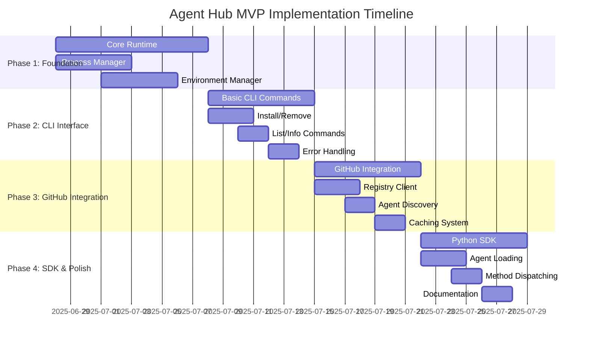

# Agent Hub MVP Implementation Plan

**Document Type**: MVP Implementation Plan
**Author**: William
**Date Created**: 2025-06-28
**Last Updated**: 2025-06-28
**Status**: Final
**Level**: L5 - MVP Planning Level
**Audience**: Development Team, Project Managers, Stakeholders

## 🎯 **MVP Implementation Overview**

This document outlines the **6-week implementation plan** for Agent Hub MVP, organized into 4 main phases. Each phase delivers functional value and builds toward the complete MVP vision of one-line agent integration.

### **MVP Implementation Goals**
- **Time to Market**: 6 weeks from start to MVP completion
- **Core Value**: Validate one-line agent integration experience
- **Quality**: Production-ready MVP with comprehensive testing
- **User Experience**: Intuitive CLI interface with clear error handling

### **MVP Success Criteria**
- ✅ **Technical**: One-line integration working reliably
- ✅ **Business**: Integration success rate > 90%
- ✅ **User**: Time to integration < 5 minutes
- ✅ **Developer**: 10+ agents published in first month

## 📅 **MVP Implementation Timeline**



## 🏗️ **Phase 1: Core Foundation (Weeks 1-2)**

### **Objective**
Build the fundamental runtime system that enables agent execution with process-based isolation.

### **Deliverables**

#### **Process Manager**
```python
# agenthub/runtime/process_manager.py
class ProcessManager:
    def execute_agent(self, agent_path: str, method: str, parameters: dict) -> dict:
        """Execute agent in isolated subprocess."""
        # Implementation: subprocess execution with JSON IPC
```

**Success Criteria**:
- ✅ Can execute simple agents in isolated processes
- ✅ Handles subprocess lifecycle (start, monitor, cleanup)
- ✅ Provides JSON-based IPC for agent communication
- ✅ Implements timeout and error handling

**Testing**:
- Unit tests for process creation and management
- Integration tests for subprocess execution
- Performance tests for subprocess overhead

#### **Environment Manager**
```python
# agenthub/runtime/environment_manager.py
class EnvironmentManager:
    def create_environment(self, agent_path: str) -> str:
        """Create isolated virtual environment using UV."""
        # Implementation: UV venv creation and dependency installation
```

**Success Criteria**:
- ✅ Creates virtual environments using UV
- ✅ Installs agent dependencies in isolated environments
- ✅ Handles dependency conflicts gracefully
- ✅ Supports Python version requirements

**Testing**:
- Unit tests for environment creation

#### **Tool Infrastructure**
```python
# agenthub/core/tool_infrastructure.py
class ToolInfrastructure:
    def __init__(self, agent_dir: Path, security_level: str = "medium"):
        """Initialize tool infrastructure for agent."""
        # Implementation: tool discovery, injection, and validation framework
```

**Success Criteria**:
- ✅ Discovers agent's built-in tools from manifest and code
- ✅ Can register custom Python functions as tools
- ✅ Implements tool priority system (custom > agent's built-in)
- ✅ Extracts tool metadata and provides injection
- ✅ Implements security validation and resource limits
- ✅ Configurable security levels (low, medium, high)

**Testing**:
- Unit tests for native tool functionality
- Integration tests for tool priority and override
- Performance tests for tool metadata extraction
- Security tests for tool validation
- Resource limit tests for tool execution
- Integration tests with UV package manager
- Cross-platform compatibility testing

#### **Tool Discovery and Injection**
```python
# agenthub/core/tool_discovery.py
class ToolDiscovery:
    def __init__(self, agent_dir: Path):
        """Initialize tool discovery for agent."""
        self.agent_dir = agent_dir

    def discover_agent_tools(self) -> Dict[str, ToolInfo]:
        """Discover tools that an agent has implemented."""
        # Read agent's manifest.json and find tool implementations
        pass
```

**Success Criteria**:
- ✅ Discovers agent's built-in tools from manifest and code
- ✅ Provides tool metadata and usage information
- ✅ Supports custom tool injection and override
- ✅ Validates tool safety and compatibility

**Testing**:
- Unit tests for tool discovery
- Integration tests for tool injection
- Performance tests for tool metadata extraction

#### **Tool Validation System**
```python
# agenthub/validation/tool_validator.py
class ToolValidator:
    def __init__(self, security_level: str = "medium"):
        """Initialize tool validator with security configuration."""
        # Implementation: security patterns, resource monitoring
```

**Success Criteria**:
- ✅ Security validation for dangerous code patterns
- ✅ Compatibility validation for agent runtime
- ✅ Performance validation for tool complexity
- ✅ Resource monitoring and limits enforcement
- ✅ Configurable security levels (low, medium, high)

**Testing**:
- Unit tests for security pattern detection
- Integration tests for validation workflow
- Performance tests for validation efficiency
- Security tests for dangerous code detection

#### **Agent Runtime**
```python
# agenthub/runtime/agent_runtime.py
class AgentRuntime:
    def load_agent_manifest(self, agent_path: str) -> dict:
        """Load and validate agent manifest."""
        # Implementation: YAML parsing and validation
```

**Success Criteria**:
- ✅ Can load and parse agent.yaml manifests
- ✅ Validates manifest structure and content
- ✅ Provides clear error messages for invalid manifests
- ✅ Supports MVP agent manifest format

**Testing**:
- Unit tests for manifest parsing
- Validation tests for various manifest formats
- Error handling tests for malformed manifests

### **Dependencies**
- UV package manager installation
- Python subprocess and venv modules
- PyYAML for manifest parsing

### **Risk Mitigation**
- **Subprocess Reliability**: Comprehensive error handling and timeouts
- **UV Integration**: Fallback to pip if UV installation fails
- **Cross-Platform**: Early testing on Windows, macOS, and Linux

## 🖥️ **Phase 2: CLI Interface (Week 3)**

### **Objective**
Create complete command-line interface for all agent management operations.

### **Deliverables**

#### **Core CLI Commands**
```bash
# Essential commands
agenthub install <agent-path>     # Install an agent
agenthub list [--installed]       # List agents
agenthub remove <agent-path>      # Remove installed agent
agenthub info <agent-path>        # Show agent details
```

**Success Criteria**:
- ✅ All essential CLI commands working
- ✅ Consistent command structure and help system
- ✅ Proper argument parsing and validation
- ✅ Cross-platform compatibility

**Testing**:
- CLI integration tests using Click's test runner
- Command execution testing on all platforms
- Help system and error message testing

#### **Error Handling System**
```python
# agenthub/cli/utils/error_handler.py
import logging
from typing import Optional

class ErrorHandler:
    def handle_error(self, error: Exception, context: str = "", verbose: bool = False):
        """Display user-friendly error messages with solutions."""
        print(f"❌ Error: {str(error)}")

        if context:
            print(f"💡 Context: {context}")

        # Provide general solution
        print("🔧 Try: agenthub doctor")

        if verbose:
            print(f"🔍 Details: {str(error)}")
            import traceback
            traceback.print_exc()

        # Log error for debugging
        logging.error(f"Error: {str(error)}", exc_info=verbose)

    def handle_agent_error(self, error: Exception, agent_path: str = ""):
        """Handle agent-specific errors."""
        if "not found" in str(error).lower():
            print(f"❌ Agent '{agent_path}' not found")
            print("💡 Try: agenthub list")
        elif "installation" in str(error).lower():
            print(f"❌ Failed to install agent '{agent_path}'")
            print("💡 Check network connection and try again")
        elif "permission" in str(error).lower():
            print(f"❌ Permission denied for agent '{agent_path}'")
            print("💡 Check file permissions")
        else:
            print(f"❌ Unexpected error: {str(error)}")
            print("🔧 Try: agenthub doctor")
```

**Success Criteria**:
- ✅ Clear, actionable error messages
- ✅ Context-specific solutions provided
- ✅ Verbose mode for debugging
- ✅ Consistent error handling across all commands

**Testing**:
- Basic error message testing
- Context-specific error handling
- User experience testing
- Error message clarity validation

#### **Output Formatting**
```python
# agenthub/cli/utils/output_formatter.py
class OutputFormatter:
    def print_agent_list(self, agents: list, show_details: bool = False):
        """Format and display agent lists."""
        # Implementation: Rich, colorful CLI output
```

**Success Criteria**:
- ✅ Professional, consistent CLI output
- ✅ Color-coded information display
- ✅ Configurable detail levels
- ✅ Cross-platform terminal compatibility

**Testing**:
- Output formatting tests
- Color compatibility testing
- Cross-platform terminal testing

### **Dependencies**
- Click framework for CLI
- Rich or colorama for colored output
- Local file system storage

### **Risk Mitigation**
- **CLI Complexity**: Start with essential commands, add features incrementally
- **Cross-Platform**: Test on all target platforms early
- **User Experience**: Regular user testing and feedback collection

## 🌐 **Phase 3: GitHub Integration (Week 4)**

### **Objective**
Integrate with GitHub-based registry for agent discovery and installation.

### **Deliverables**

#### **GitHub Registry Client**
```python
# agenthub/registry/github_client.py
class GitHubRegistryClient:
    def get_registry(self) -> dict:
        """Fetch registry.json from GitHub."""
        # Implementation: GitHub API integration with caching
```

**Success Criteria**:
- ✅ Can fetch registry from GitHub API
- ✅ Implements proper rate limiting
- ✅ Handles API errors gracefully
- ✅ Provides fallback to cached data

**Testing**:
- GitHub API integration tests
- Rate limiting and error handling tests
- Caching system validation

#### **Enhanced CLI Commands**
```bash
# Enhanced commands with registry integration
agenthub search <query> --category development
agenthub trending                        # Show trending agents
agenthub info <agent-path>              # Show detailed info from registry
```

**Success Criteria**:
- ✅ Registry integration working reliably
- ✅ Agent discovery from GitHub registry
- ✅ Caching system reducing API calls
- ✅ Offline operation capability

**Testing**:
- Registry integration testing
- Caching system validation
- Offline mode testing

#### **Caching System**
```python
# agenthub/cache/cache_manager.py
class CacheManager:
    def get_cached_registry(self) -> dict:
        """Get cached registry data with TTL support."""
        # Implementation: File-based caching with expiration
```

**Success Criteria**:
- ✅ Registry data cached locally
- ✅ TTL-based cache invalidation
- ✅ Offline operation capability
- ✅ Cache performance optimization

**Testing**:
- Caching system tests
- Performance testing
- Offline operation validation

### **Dependencies**
- GitHub API access
- Requests library for HTTP operations
- Local file system for caching

### **Risk Mitigation**
- **GitHub API Limits**: Implement caching and rate limiting
- **Network Issues**: Graceful fallback to cached data
- **API Changes**: Monitor GitHub API for breaking changes

## 🐍 **Phase 4: SDK & Polish (Weeks 5-6)**

### **Objective**
Create Python SDK and polish user experience for production readiness.

### **Deliverables**

#### **Python SDK**
```python
# agenthub/sdk/__init__.py
import agenthub as amg

# Basic agent loading
agent = amg.load("meta/coding-agent")
result = agent.generate_code("neural network")

# Agent with custom tools including RAG
agent = amg.load("openai/analysis-agent",
    tools={
        "rag_query": rag_query_tool,
        "calculate_metrics": calculate_metrics,
        "send_notification": send_notification
    }
)
answer = agent.analyze_with_docs("What are the main findings?", ["/path/to/docs/"])
```

**Success Criteria**:
- ✅ One-line agent loading working reliably
- ✅ Method dispatching to agent subprocesses
- ✅ Custom tool injection and management
- ✅ RAG capabilities as a tool
- ✅ Error handling and validation
- ✅ Clean, Pythonic API design

**Testing**:
- SDK integration tests
- Method dispatching validation
- Error handling tests
- Performance testing

#### **Method Dispatching**
```python
# agenthub/sdk/agent_wrapper.py
class AgentWrapper:
    def __getattr__(self, name):
        """Dynamic method dispatching to agent."""
        # Implementation: Dynamic method creation and execution
```

**Success Criteria**:
- ✅ Dynamic method creation from agent manifest
- ✅ Parameter validation and type checking
- ✅ Subprocess execution and result parsing
- ✅ Error handling and recovery

**Testing**:
- Method dispatching tests
- Parameter validation testing
- Subprocess execution validation
- Error handling tests

#### **Documentation and Examples**
```bash
# User documentation
agenthub --help                    # CLI help
agenthub init --help              # Command-specific help
agenthub examples                  # Usage examples
```

**Success Criteria**:
- ✅ Comprehensive CLI help system
- ✅ User guides and examples
- ✅ API documentation
- ✅ Troubleshooting guide

**Testing**:
- Documentation accuracy testing
- Help system validation
- User experience testing

### **Dependencies**
- Core runtime system
- CLI interface
- GitHub registry integration

### **Risk Mitigation**
- **API Design**: Regular user feedback and iteration
- **Documentation**: User testing and feedback collection
- **Integration**: Comprehensive testing of all components

## 🧪 **Testing Strategy**

### **Testing Pyramid**

#### **Unit Tests (70%)**
- **Coverage**: Core functions and classes
- **Framework**: pytest
- **Target**: 90%+ code coverage
- **Timing**: Run on every commit

#### **Integration Tests (20%)**
- **Coverage**: Component interactions
- **Framework**: pytest with fixtures
- **Target**: All major workflows
- **Timing**: Run before merge

#### **End-to-End Tests (10%)**
- **Coverage**: Complete user workflows
- **Framework**: pytest with real agents
- **Target**: Critical user journeys
- **Timing**: Run before release

### **Testing Tools**
```bash
# Testing commands
pytest                    # Run all tests
pytest --cov=.           # Run with coverage
pytest --verbose         # Verbose output
pytest -k "test_install" # Run specific tests
```

### **Test Categories**

#### **Core Runtime Tests**
- Process manager functionality
- Environment management
- Agent manifest parsing
- Error handling

#### **CLI Tests**
- Command execution
- Argument parsing
- Error handling
- Output formatting

#### **Registry Tests**
- GitHub API integration
- Caching system
- Offline operation
- Error recovery

#### **SDK Tests**
- Agent loading
- Method dispatching
- Parameter validation
- Result parsing

## 🚀 **Deployment Strategy**

### **Development Environment**
```bash
# Local development setup
git clone https://github.com/your-org/agent-hub.git
cd agent-hub
python -m venv venv
source venv/bin/activate  # On Windows: venv\Scripts\activate
pip install -r requirements.txt
pip install -r requirements-dev.txt
```

### **Testing Environment**
```bash
# Testing setup
pytest                    # Run tests
black .                   # Format code
flake8                    # Lint code
mypy .                    # Type check
```

### **Production Environment**
```bash
# Production installation
pip install agenthub

# Verify installation
agenthub --version
agenthub --help
```

## 📊 **Success Metrics & Validation**

### **Technical Metrics**
- **Code Coverage**: > 90%
- **Test Pass Rate**: 100%
- **Performance**: < 10 seconds installation, < 1 second execution
- **Reliability**: 99%+ successful operations

### **User Experience Metrics**
- **Learning Curve**: < 30 minutes to first successful integration
- **Error Resolution**: Users can resolve issues without support
- **CLI Usability**: Intuitive command structure and help system
- **Documentation Quality**: Clear, actionable guides

### **Business Metrics**
- **Integration Success Rate**: > 90%
- **Time to Value**: < 5 minutes from discovery to usage
- **Developer Adoption**: 10+ agents published in first month
- **User Satisfaction**: Positive feedback on integration experience

## 🔄 **Risk Management**

### **Technical Risks**
| Risk | Probability | Impact | Mitigation |
|------|-------------|---------|------------|
| Subprocess reliability | Medium | Medium | Comprehensive error handling, timeouts |
| GitHub API limits | Low | Medium | Caching, rate limiting |
| Dependency conflicts | Low | High | Virtual environment isolation |
| Platform compatibility | Medium | Low | Multi-platform testing |

### **Schedule Risks**
| Risk | Probability | Impact | Mitigation |
|------|-------------|---------|------------|
| UV integration complexity | Low | Medium | Fallback to pip if needed |
| GitHub registry delays | Low | Low | Local registry as backup |
| Testing overhead | Medium | Low | Parallel testing development |

### **Quality Risks**
| Risk | Probability | Impact | Mitigation |
|------|-------------|---------|------------|
| Insufficient testing | Medium | High | Automated testing pipeline |
| Poor error handling | Medium | Medium | User testing and feedback |
| Documentation gaps | Low | Low | Regular documentation reviews |

## 🎯 **Post-MVP Roadmap**

### **Phase 5: Agent Development Tools (Month 2)**
- Advanced agent templates
- Agent testing framework
- Publishing workflow automation
- Community features

### **Phase 6: Enterprise Features (Month 3)**
- Agent governance and policies
- Enterprise authentication
- Advanced monitoring and analytics
- Custom registry support

### **Phase 7: Advanced Capabilities (Month 4+)**
- Agent composition and orchestration
- AI-powered recommendations
- Advanced search and discovery
- Mobile and web applications

## 📋 **Implementation Checklist**

### **Phase 1: Core Foundation**
- [ ] Process manager implementation
- [ ] Environment manager with UV
- [ ] Agent manifest parsing
- [ ] Basic error handling
- [ ] Unit tests for core components

### **Phase 2: CLI Interface**
- [ ] Click framework setup
- [ ] Install command implementation
- [ ] List command implementation
- [ ] Remove command implementation
- [ ] Error handling system
- [ ] Output formatting

### **Phase 3: GitHub Integration**
- [ ] GitHub API client
- [ ] Registry data fetching
- [ ] Caching system
- [ ] Offline operation
- [ ] Integration testing

### **Phase 4: SDK & Polish**
- [ ] Python SDK interface
- [ ] Method dispatching
- [ ] Parameter validation
- [ ] Documentation
- [ ] End-to-end testing

### **Final Validation**
- [ ] All tests passing
- [ ] Performance requirements met
- [ ] Cross-platform compatibility
- [ ] User experience validation
- [ ] Documentation complete

## 🎯 **MVP Implementation Summary**

The Agent Hub MVP implementation follows a **phased approach** that delivers functional value at each stage:

1. **Phase 1 (Weeks 1-2)**: Core runtime foundation
2. **Phase 2 (Week 3)**: Complete CLI interface
3. **Phase 3 (Week 4)**: GitHub registry integration
4. **Phase 4 (Weeks 5-6)**: Python SDK and polish

**Key Success Factors**:
- **Focused Scope**: MVP excludes search and community features
- **Incremental Delivery**: Functional value at each phase
- **Comprehensive Testing**: 90%+ code coverage with automated testing
- **User Feedback**: Regular testing and iteration based on user input

**Expected Outcomes**:
- **MVP Completion**: 6 weeks from start to finish
- **Core Validation**: One-line integration experience proven
- **User Adoption**: 10+ agents published, 50+ installations
- **Foundation**: Solid base for post-MVP enhancements

This implementation plan provides a **clear, achievable path** to MVP completion while maintaining quality, user experience, and technical excellence.
