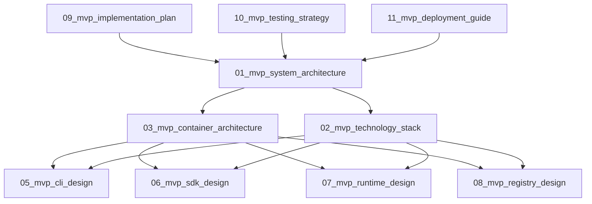

# Agent Hub MVP Architecture Design

**Document Type**: MVP Architecture Index  
**Author**: William  
**Date Created**: 2025-06-28  
**Last Updated**: 2025-06-28  
**Status**: Final  
**Purpose**: MVP-focused architecture documentation for Agent Hub  

## 🎯 **MVP Overview**

Agent Hub MVP focuses on **validating the core integration experience** - transforming AI agent integration from weeks of custom development into a simple, one-line experience: `agent = amg.load("meta/coding-agent")`.

### **MVP Scope**
- ✅ **Core Runtime**: Process-based agent execution with isolation
- ✅ **CLI Interface**: Basic agent lifecycle management
- ✅ **GitHub Registry**: Simple agent discovery (no search)
- ✅ **SDK Integration**: One-line agent loading
- ✅ **Tool Infrastructure**: Tool discovery, injection, and validation framework
- ❌ **Agent Search**: Not needed for MVP validation
- ❌ **Community Features**: Post-MVP enhancement
- ❌ **Centralized Tools**: Tools are implemented inside agents

### **MVP Success Criteria**
- **Integration Success Rate**: 90%+ successful installations
- **Time to Integration**: < 5 minutes from discovery to usage
- **Developer Adoption**: 10+ agents published in first month
- **Technical Success**: One-line loading, dependency isolation, fast execution

## 📋 **MVP Documentation Structure**

### **Level 1: MVP System Architecture**
- **[01_mvp_system_architecture.md](01_mvp_system_architecture.md)** - MVP system overview and scope
- **[02_mvp_technology_stack.md](02_mvp_technology_stack.md)** - MVP technology choices and rationale

### **Level 2: MVP Container Architecture**
- **[03_mvp_container_architecture.md](03_mvp_container_architecture.md)** - MVP system components and interactions
- **[04_mvp_data_architecture.md](04_mvp_data_architecture.md)** - MVP data flow and storage

### **Level 3: MVP Module Design**
- **[05_mvp_cli_design.md](05_mvp_cli_design.md)** - MVP CLI interface design
- **[06_mvp_sdk_design.md](06_mvp_sdk_design.md)** - MVP Python SDK design
- **[07_mvp_runtime_design.md](07_mvp_runtime_design.md)** - MVP agent runtime design
- **[08_mvp_registry_design.md](08_mvp_registry_design.md)** - MVP GitHub registry design

### **Level 4: MVP Implementation**
- **[09_mvp_implementation_plan.md](09_mvp_implementation_plan.md)** - MVP development timeline and phases
- **[10_mvp_testing_strategy.md](10_mvp_testing_strategy.md)** - MVP testing approach and criteria
- **[11_mvp_deployment_guide.md](11_mvp_deployment_guide.md)** - MVP deployment and setup

## 🏗️ **MVP Architecture Principles**

### **1. Simplicity First**
- Use proven, simple technologies over complex solutions
- Focus on core functionality, not edge cases
- Minimize dependencies and complexity

### **2. MVP Validation Focus**
- Build only what's needed to validate core value proposition
- Defer non-essential features to post-MVP
- Prioritize user feedback over feature completeness

### **3. Developer Experience**
- Optimize for fast iteration and ease of use
- Target developer audience with CLI-first approach
- Provide clear error messages and solutions

### **4. Zero Maintenance**
- Leverage GitHub infrastructure for registry
- Minimize operational overhead
- Design for self-service usage

### **5. Agent Autonomy**
- Agents implement their own tools internally
- Agent Hub provides tool infrastructure, not tool implementations
- Each agent is self-contained with its own toolset

## 🚀 **MVP Implementation Phases**

### **Phase 1: Core Foundation (Weeks 1-2)**
- Process manager for subprocess execution
- Virtual environment management with UV
- Basic agent loading and execution

### **Phase 2: CLI Interface (Week 3)**
- Install, list, remove commands
- Local agent storage and management
- Error handling and logging

### **Phase 3: GitHub Integration (Week 4)**
- Simple GitHub-based registry client
- Basic agent discovery (listing only)
- Registry caching

### **Phase 4: SDK & Polish (Weeks 5-6)**
- Python SDK with one-line loading
- Method dispatching and execution
- Documentation and examples

## 🎯 **Quick Navigation**

### **For Business Stakeholders**
Start with:
1. [MVP System Architecture](01_mvp_system_architecture.md) - Business context and MVP scope
2. [MVP Implementation Plan](09_mvp_implementation_plan.md) - Timeline and milestones

### **For Technical Architects**
Start with:
1. [MVP System Architecture](01_mvp_system_architecture.md) - Overall MVP design
2. [MVP Container Architecture](03_mvp_container_architecture.md) - System decomposition
3. [MVP Technology Stack](02_mvp_technology_stack.md) - Technology choices

### **For Developers**
Start with:
1. [MVP Technology Stack](02_mvp_technology_stack.md) - Tools and frameworks
2. [MVP Module Design](05_mvp_cli_design.md) - Implementation details
3. [MVP Implementation Plan](09_mvp_implementation_plan.md) - Development timeline

## 📊 **MVP Architecture Summary**

### **System Overview**
Agent Hub MVP is a CLI-based platform for installing and managing AI agents with one-line integration. The MVP uses:

- **Process-based isolation** for agent execution
- **GitHub-based registry** for zero-maintenance operations
- **UV package manager** for fast dependency management
- **Local execution** for development speed and privacy

### **Key MVP Design Decisions**
1. **Process Isolation**: Subprocess execution with virtual environments
2. **CLI-First**: Command-line interface for developer audience
3. **Local Execution**: All agents run locally for fast iteration
4. **GitHub Registry**: Simple JSON-based registry without search
5. **No Search**: Focus on integration, not discovery
6. **Agent Autonomy**: Agents implement their own tools internally
7. **Tool Infrastructure**: Agent Hub provides framework, not implementations
8. **KISS Principle**: Keep It Simple, Stupid - minimal complexity
9. **YAGNI Principle**: You Aren't Gonna Need It - no unnecessary features

### **MVP Success Metrics**
- **Agent installation**: < 10 seconds
- **Integration time**: < 5 minutes from discovery to usage
- **Developer adoption**: Low barrier to entry with templates
- **System reliability**: 99.9% uptime (leveraging GitHub infrastructure)

## 🔄 **Document Relationships**

## 🚀 **Getting Started**

1. **Read [MVP System Architecture](01_mvp_system_architecture.md)** to understand the MVP scope
2. **Review [MVP Implementation Plan](09_mvp_implementation_plan.md)** for development timeline
3. **Check [MVP Technology Stack](02_mvp_technology_stack.md)** for implementation details
4. **Dive into module designs** based on your implementation focus

## 📝 **Document Standards**

Each MVP document follows a consistent structure:
- **Document metadata** (type, author, status)
- **MVP scope and limitations** clearly defined
- **Implementation details** focused on MVP requirements
- **Post-MVP considerations** noted for future planning
- **Testing and validation** criteria for MVP success

## 🔍 **Cross-References**

- **Full Architecture**: See `docs/.architecture_design/` for complete system design
- **Requirements**: See `docs/.requirement_analysis/` for business requirements
- **Implementation**: See `docs/.implementation_design/` for code-level specifications

This MVP documentation provides the focused architectural foundation for implementing and validating the core Agent Hub value proposition while maintaining clarity, consistency, and practical guidance for the MVP development team. 