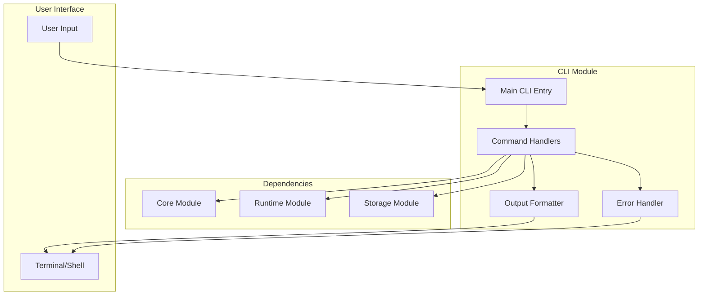

# Phase 1: CLI Module

**Document Type**: CLI Module Overview
**Phase**: 1 - Foundation
**Author**: William
**Date Created**: 2025-06-28
**Last Updated**: 2025-06-28
**Status**: Active
**Purpose**: Basic command-line interface for testing and managing agentplug agents

## 🎯 **CLI Module Overview**

The CLI Module is the **user interaction layer** for Phase 1. It provides basic command-line tools for testing, managing, and interacting with `agentplug` agents during development and validation.

### **Module Purpose**
- **Testing Interface**: Provide commands to test agent functionality
- **Agent Management**: List, inspect, and manage installed agents
- **Development Tools**: Help developers test and validate agents
- **User Feedback**: Provide clear output and error messages

### **Phase 1 Scope**
- Basic agent listing and inspection commands
- Simple agent execution testing commands
- Basic error handling and user feedback
- Simple help and documentation

## 🏗️ **Module Architecture**



## 📋 **Module Components**

### **1. Main CLI Entry**
- **Purpose**: Main entry point for CLI application
- **Responsibilities**: Command parsing, routing, initialization
- **Technology**: Click framework, command routing

### **2. Command Handlers**
- **Purpose**: Handle individual CLI commands
- **Responsibilities**: Command execution, parameter validation, coordination
- **Technology**: Click command handlers, module coordination

### **3. Output Formatter**
- **Purpose**: Format and display command output
- **Responsibilities**: Output formatting, table generation, color coding
- **Technology**: Rich library, output formatting

### **4. Error Handler**
- **Purpose**: Handle and display errors gracefully
- **Responsibilities**: Error formatting, user guidance, logging
- **Technology**: Error handling, user feedback

## 🔗 **Module Dependencies**

### **External Dependencies**
- **Click**: For CLI framework and command handling
- **Rich**: For beautiful terminal output and formatting
- **Python 3.12+**: For core functionality

### **Internal Dependencies**
- **Core Module**: For agent loading and validation
- **Runtime Module**: For agent execution and testing
- **Storage Module**: For agent discovery and management

## 📁 **Documentation Structure**

### **Core Documents**
- **[README.md](README.md)** - This overview (you are here)
- **[01_interface_design.md](01_interface_design.md)** - Public interfaces and APIs
- **[02_implementation_details.md](02_implementation_details.md)** - Internal implementation
- **[03_testing_strategy.md](03_testing_strategy.md)** - Testing approach and examples
- **[04_success_criteria.md](04_success_criteria.md)** - Success metrics and validation

## 🚀 **Getting Started**

### **For Developers**
1. **Read Interface Design**: Understand how to use the CLI module
2. **Review Implementation**: See how the module works internally
3. **Follow Testing Strategy**: Use provided tests to validate functionality
4. **Check Success Criteria**: Ensure your implementation meets requirements

### **For Integration**
1. **Understand Dependencies**: Know what the CLI module needs
2. **Review Interfaces**: See how to interact with CLI functionality
3. **Plan Testing**: Use the testing strategy for validation
4. **Validate Success**: Ensure integration meets success criteria

## 🎯 **Phase 1 Success Criteria**

### **Command Execution Success**
- ✅ Can list installed `agentplug` agents
- ✅ Can inspect agent details and interfaces
- ✅ Can test agent execution through CLI
- ✅ Can provide clear command help and usage

### **User Experience Success**
- ✅ Commands are intuitive and easy to use
- ✅ Output is clear and well-formatted
- ✅ Error messages are helpful and actionable
- ✅ Help system provides useful information

### **Integration Success**
- ✅ CLI can coordinate with core module
- ✅ CLI can coordinate with runtime module
- ✅ CLI can coordinate with storage module
- ✅ All modules work together through CLI

### **Testing Success**
- ✅ CLI provides testing interface for agents
- ✅ Commands can validate agent functionality
- ✅ Output helps developers debug issues
- ✅ Error handling helps identify problems

## 🔄 **Module Evolution**

### **Phase 1 (Current)**
- Basic agent listing and inspection
- Simple agent execution testing
- Basic error handling and user feedback
- Simple help and documentation

### **Phase 2 (Future)**
- Enhanced with registry integration
- Better agent management commands
- Installation and update commands
- Enhanced error handling

### **Phase 3 (Future)**
- Enhanced with SDK integration
- Better agent interaction commands
- Performance monitoring commands
- Advanced management features

### **Phase 4 (Future)**
- Performance optimization
- Advanced user experience
- Production-ready error handling
- Enhanced help and documentation

## 🧪 **Testing Strategy**

### **Unit Testing**
- Test each command individually
- Mock external dependencies
- Validate command behavior
- Test error conditions

### **Integration Testing**
- Test commands working together
- Test with real agentplug agents
- Validate complete command flow
- Test error scenarios

### **User Experience Testing**
- Test command usability
- Test output formatting
- Test error handling
- Test help system

## 📊 **Progress Tracking**

### **Current Status**: 🚧 In Progress
- [ ] Main CLI Entry implementation
- [ ] Command Handlers implementation
- [ ] Output Formatter implementation
- [ ] Error Handler implementation
- [ ] Module integration testing
- [ ] Phase 1 validation

### **Next Steps**
1. **Complete Main CLI Entry**: Implement CLI entry point
2. **Complete Command Handlers**: Implement individual commands
3. **Complete Output Formatter**: Implement output formatting
4. **Complete Error Handler**: Implement error handling
5. **Integration Testing**: Test with real agentplug agents
6. **Phase 1 Validation**: Ensure all success criteria met

## 🔧 **Key Implementation Details**

### **1. CLI Structure with Click**
```python
import click
from rich.console import Console
from rich.table import Table

console = Console()

@click.group()
@click.version_option(version="1.0.0")
@click.option('--verbose', '-v', is_flag=True, help='Enable verbose output')
def cli(verbose):
    """Agent Hub - One-line AI agent integration."""
    pass

@cli.command()
@click.argument('agent_name')
def list(agent_name):
    """List installed agents or show agent details."""
    if agent_name:
        show_agent_details(agent_name)
    else:
        list_all_agents()

@cli.command()
@click.argument('agent_name')
@click.argument('method')
@click.option('--params', '-p', help='Method parameters as JSON')
def test(agent_name, method, params):
    """Test agent method execution."""
    test_agent_method(agent_name, method, params)

if __name__ == '__main__':
    cli()
```

### **2. Command Implementation**
```python
def list_all_agents():
    """List all installed agents."""
    try:
        from agenthub.storage import LocalStorageManager

        storage = LocalStorageManager()
        agents = storage.list_agents()

        if not agents:
            console.print("No agents installed.", style="yellow")
            return

        table = Table(title="Installed Agents")
        table.add_column("Developer", style="cyan")
        table.add_column("Agent", style="magenta")
        table.add_column("Version", style="green")
        table.add_column("Status", style="blue")

        for agent in agents:
            table.add_row(
                agent["developer"],
                agent["name"],
                agent["version"],
                agent["status"]
            )

        console.print(table)

    except Exception as e:
        console.print(f"Error listing agents: {e}", style="red")

def show_agent_details(agent_name):
    """Show detailed information about a specific agent."""
    try:
        from agenthub.core import AgentLoader

        loader = AgentLoader()
        agent_info = loader.load_agent(agent_name)

        if not agent_info:
            console.print(f"Agent '{agent_name}' not found.", style="red")
            return

        console.print(f"\n[bold cyan]Agent:[/bold cyan] {agent_info['name']}")
        console.print(f"[bold cyan]Version:[/bold cyan] {agent_info['version']}")
        console.print(f"[bold cyan]Description:[/bold cyan] {agent_info['description']}")
        console.print(f"[bold cyan]Author:[/bold cyan] {agent_info['author']}")

        # Show interface methods
        if 'interface' in agent_info and 'methods' in agent_info['interface']:
            console.print(f"\n[bold cyan]Available Methods:[/bold cyan]")
            for method_name, method_def in agent_info['interface']['methods'].items():
                console.print(f"  [green]{method_name}[/green]: {method_def['description']}")

    except Exception as e:
        console.print(f"Error loading agent: {e}", style="red")
```

### **3. Error Handling**
```python
def handle_error(error, context=""):
    """Handle and display errors gracefully."""
    if context:
        console.print(f"[bold red]Error in {context}:[/bold red] {error}")
    else:
        console.print(f"[bold red]Error:[/bold red] {error}")

    # Provide helpful suggestions
    if "not found" in str(error).lower():
        console.print("\n[yellow]Suggestions:[/yellow]")
        console.print("  • Use 'agenthub list' to see available agents")
        console.print("  • Check agent name spelling")
        console.print("  • Ensure agent is properly installed")

    elif "permission" in str(error).lower():
        console.print("\n[yellow]Suggestions:[/yellow]")
        console.print("  • Check file permissions")
        console.print("  • Ensure you have access to the agent directory")
        console.print("  • Try running with appropriate permissions")

def test_agent_method(agent_name, method, params):
    """Test agent method execution."""
    try:
        from agenthub.runtime import AgentRuntime

        runtime = AgentRuntime()

        # Parse parameters if provided
        method_params = {}
        if params:
            import json
            method_params = json.loads(params)

        # Execute agent method
        result = runtime.execute_agent(agent_name, method, method_params)

        if "result" in result:
            console.print(f"\n[bold green]Success![/bold green]")
            console.print(f"Result: {result['result']}")
            if "execution_time" in result:
                console.print(f"Execution time: {result['execution_time']:.2f}s")
        else:
            console.print(f"\n[bold red]Execution failed:[/bold red]")
            console.print(f"Error: {result['error']}")

    except Exception as e:
        handle_error(e, "agent method testing")
```

## 🎯 **CLI Module Benefits**

### **1. Testing Interface**
- Provides easy way to test agent functionality
- Enables quick validation of agent behavior
- Helps developers debug agent issues
- Supports iterative development

### **2. User Experience**
- Simple and intuitive commands
- Clear output and error messages
- Helpful suggestions for common issues
- Professional appearance with Rich formatting

### **3. Development Support**
- Helps validate Phase 1 functionality
- Provides feedback on agent quality
- Enables testing of module integration
- Supports development workflow

### **4. Foundation for Growth**
- Supports Phase 2 registry integration
- Enables Phase 3 SDK development
- Provides Phase 4 user experience enhancement
- Creates user interaction patterns

The CLI Module provides the **user interface** for Phase 1, enabling developers to test, manage, and interact with agentplug agents. It serves as both a **testing tool** and a **user experience foundation** for the MVP.
