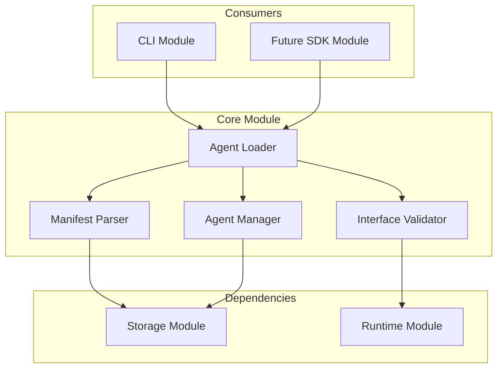

# Phase 1: Core Module

**Document Type**: Core Module Overview  
**Phase**: 1 - Foundation  
**Author**: William  
**Date Created**: 2025-06-28  
**Last Updated**: 2025-06-28  
**Status**: Active  
**Purpose**: Core agent loading and interface management for agentplug agents  

## 🎯 **Core Module Overview**

The Core Module is the **central coordination layer** for Phase 1. It provides agent loading, manifest parsing, and interface management that enables other modules to work with `agentplug` agents consistently.

### **Module Purpose**
- **Agent Loading**: Load and validate agentplug agents from storage
- **Manifest Parsing**: Parse and validate agent manifests (agent.yaml)
- **Interface Management**: Provide consistent agent interface access
- **Validation**: Ensure agents meet Phase 1 requirements

### **Phase 1 Scope**
- Basic agent loading from local storage
- Simple manifest parsing and validation
- Basic interface discovery and validation
- Simple error handling and reporting

## 🏗️ **Module Architecture**



## 📋 **Module Components**

### **1. Agent Loader**
- **Purpose**: Load and initialize agentplug agents
- **Responsibilities**: Agent discovery, loading, validation, initialization
- **Technology**: File system operations, manifest parsing, validation

### **2. Manifest Parser**
- **Purpose**: Parse and validate agent manifests (agent.yaml)
- **Responsibilities**: YAML parsing, schema validation, error reporting
- **Technology**: PyYAML, schema validation, error handling

### **3. Interface Validator**
- **Purpose**: Validate agent interfaces and methods
- **Responsibilities**: Method validation, parameter validation, interface consistency
- **Technology**: Interface validation, method discovery, error reporting

### **4. Agent Manager**
- **Purpose**: Manage agent lifecycle and coordination
- **Responsibilities**: Agent registration, status tracking, coordination
- **Technology**: Agent state management, lifecycle coordination

## 🔗 **Module Dependencies**

### **External Dependencies**
- **Python 3.12+**: For core functionality and type hints
- **PyYAML**: For agent manifest parsing and validation
- **pathlib**: For cross-platform path operations

### **Internal Dependencies**
- **Storage Module**: For agent file access and metadata
- **Runtime Module**: For agent validation and execution testing

## 📁 **Documentation Structure**

### **Core Documents**
- **[README.md](README.md)** - This overview (you are here)
- **[01_interface_design.md](01_interface_design.md)** - Public interfaces and APIs
- **[02_implementation_details.md](02_implementation_details.md)** - Internal implementation
- **[03_testing_strategy.md](03_testing_strategy.md)** - Testing approach and examples
- **[04_success_criteria.md](04_success_criteria.md)** - Success metrics and validation

## 🚀 **Getting Started**

### **For Developers**
1. **Read Interface Design**: Understand how to use the core module
2. **Review Implementation**: See how the module works internally
3. **Follow Testing Strategy**: Use provided tests to validate functionality
4. **Check Success Criteria**: Ensure your implementation meets requirements

### **For Integration**
1. **Understand Dependencies**: Know what the core module needs
2. **Review Interfaces**: See how to interact with core functionality
3. **Plan Testing**: Use the testing strategy for validation
4. **Validate Success**: Ensure integration meets success criteria

## 🎯 **Phase 1 Success Criteria**

### **Agent Loading Success**
- ✅ Can load `agentplug/coding-agent` from local storage
- ✅ Can load `agentplug/analysis-agent` from local storage
- ✅ Can validate agent directory structure
- ✅ Can handle missing or invalid agents gracefully

### **Manifest Parsing Success**
- ✅ Can parse agent.yaml files correctly
- ✅ Can validate manifest schema and structure
- ✅ Can extract agent interface information
- ✅ Can report parsing errors clearly

### **Interface Validation Success**
- ✅ Can validate agent method definitions
- ✅ Can check method parameter specifications
- ✅ Can ensure interface consistency
- ✅ Can report validation errors clearly

### **Integration Success**
- ✅ CLI module can load agents through core module
- ✅ Runtime module can validate agents through core module
- ✅ Storage module can coordinate with core module
- ✅ All modules can work with agent interfaces consistently

## 🔄 **Module Evolution**

### **Phase 1 (Current)**
- Basic agent loading from local storage
- Simple manifest parsing and validation
- Basic interface discovery and validation
- Simple error handling and reporting

### **Phase 2 (Future)**
- Enhanced with registry integration
- Better manifest validation
- Installation tracking support
- Enhanced error handling

### **Phase 3 (Future)**
- Enhanced with SDK integration
- Better interface management
- Performance optimization
- Advanced validation features

### **Phase 4 (Future)**
- Performance optimization
- Advanced interface features
- Production-ready validation
- Enhanced user experience

## 🧪 **Testing Strategy**

### **Unit Testing**
- Test each component individually
- Mock external dependencies
- Validate manifest parsing
- Test error conditions

### **Integration Testing**
- Test components working together
- Test with real agentplug agents
- Validate complete loading flow
- Test error scenarios

### **Validation Testing**
- Test manifest validation
- Test interface validation
- Test error reporting
- Test edge cases

## 📊 **Progress Tracking**

### **Current Status**: 🚧 In Progress
- [ ] Agent Loader implementation
- [ ] Manifest Parser implementation
- [ ] Interface Validator implementation
- [ ] Agent Manager implementation
- [ ] Module integration testing
- [ ] Phase 1 validation

### **Next Steps**
1. **Complete Agent Loader**: Implement agent loading functionality
2. **Complete Manifest Parser**: Implement manifest parsing and validation
3. **Complete Interface Validator**: Implement interface validation
4. **Complete Agent Manager**: Implement agent lifecycle management
5. **Integration Testing**: Test with real agentplug agents
6. **Phase 1 Validation**: Ensure all success criteria met

## 🔧 **Key Implementation Details**

### **1. Agent Loading**
```python
from pathlib import Path
from typing import Dict, Optional

class AgentLoader:
    """Load and validate agentplug agents."""
    
    def __init__(self, storage_module, runtime_module):
        self.storage = storage_module
        self.runtime = runtime_module
    
    def load_agent(self, agent_path: str) -> Optional[Dict]:
        """Load an agent from the specified path."""
        try:
            # Validate agent path
            if not self._is_valid_agent_path(agent_path):
                return None
            
            # Load agent manifest
            manifest = self._load_agent_manifest(agent_path)
            if not manifest:
                return None
            
            # Validate agent interface
            if not self._validate_agent_interface(manifest):
                return None
            
            return {
                "path": agent_path,
                "manifest": manifest,
                "status": "loaded"
            }
        except Exception as e:
            return {"error": str(e), "status": "error"}
```

### **2. Manifest Parsing**
```python
import yaml
from pathlib import Path
from typing import Dict, Optional

class ManifestParser:
    """Parse and validate agent manifests."""
    
    def parse_manifest(self, manifest_path: Path) -> Optional[Dict]:
        """Parse an agent manifest file."""
        try:
            with open(manifest_path, 'r') as f:
                manifest = yaml.safe_load(f)
            
            # Validate required fields
            if not self._validate_required_fields(manifest):
                return None
            
            # Validate interface structure
            if not self._validate_interface_structure(manifest):
                return None
            
            return manifest
        except yaml.YAMLError as e:
            return {"error": f"YAML parsing error: {e}"}
        except Exception as e:
            return {"error": f"Manifest loading error: {e}"}
    
    def _validate_required_fields(self, manifest: Dict) -> bool:
        """Validate that required fields are present."""
        required_fields = ["name", "version", "description", "author", "interface"]
        
        for field in required_fields:
            if field not in manifest:
                return False
        
        return True
```

### **3. Interface Validation**
```python
class InterfaceValidator:
    """Validate agent interfaces and methods."""
    
    def validate_interface(self, manifest: Dict) -> bool:
        """Validate the agent interface."""
        if "interface" not in manifest:
            return False
        
        interface = manifest["interface"]
        
        # Check if methods are defined
        if "methods" not in interface:
            return False
        
        methods = interface["methods"]
        if not isinstance(methods, dict):
            return False
        
        # Validate each method
        for method_name, method_def in methods.items():
            if not self._validate_method(method_name, method_def):
                return False
        
        return True
    
    def _validate_method(self, method_name: str, method_def: Dict) -> bool:
        """Validate a single method definition."""
        # Check required fields
        if "description" not in method_def:
            return False
        
        # Check parameters (optional)
        if "parameters" in method_def:
            if not isinstance(method_def["parameters"], dict):
                return False
        
        # Check return type (optional)
        if "returns" in method_def:
            if not isinstance(method_def["returns"], dict):
                return False
        
        return True
```

## 🎯 **Core Module Benefits**

### **1. Centralized Coordination**
- Single point for agent loading and validation
- Consistent interface across all modules
- Centralized error handling and reporting

### **2. Validation and Quality**
- Ensures agents meet requirements
- Validates manifest structure and content
- Provides clear error messages for issues

### **3. Module Integration**
- Enables other modules to work with agents
- Provides consistent agent interface
- Coordinates between storage and runtime

### **4. Foundation for Growth**
- Supports Phase 2 registry integration
- Enables Phase 3 SDK development
- Provides Phase 4 optimization opportunities

The Core Module is the **central nervous system** for Phase 1, coordinating agent loading, validation, and interface management. It ensures that all other modules can work with agentplug agents consistently and reliably.
