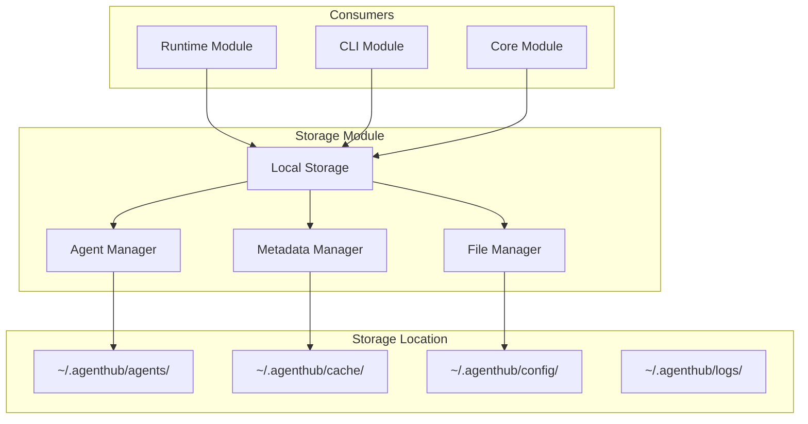

# Phase 1: Storage Module

**Document Type**: Storage Module Overview  
**Phase**: 1 - Foundation  
**Author**: William  
**Date Created**: 2025-06-28  
**Last Updated**: 2025-06-28  
**Status**: Active  
**Purpose**: Local storage system for managing agentplug agents and metadata  

## 🎯 **Storage Module Overview**

The Storage Module is the **data persistence layer** for Phase 1. It manages local storage of `agentplug` agents, their metadata, and provides the foundation for agent discovery and management.

### **Module Purpose**
- **Agent Storage**: Store downloaded and installed agents locally
- **Metadata Management**: Track agent information and installation details
- **File Organization**: Maintain organized directory structure
- **Data Persistence**: Ensure agent data survives system restarts

### **Phase 1 Scope**
- Basic local file system storage
- Agent directory structure management
- Simple metadata storage in JSON format
- Basic agent discovery and validation

## 🏗️ **Module Architecture**



## 📁 **Storage Structure**

### **Directory Layout**
```
~/.agenthub/
├── agents/                          # Installed agents
│   ├── agentplug/                   # Developer namespace
│   │   ├── coding-agent/            # Individual agent
│   │   │   ├── agent.yaml           # Agent manifest
│   │   │   ├── agent.py             # Main agent script
│   │   │   ├── venv/                # Virtual environment
│   │   │   └── .metadata.json       # Installation metadata
│   │   └── analysis-agent/          # Another agent
│   │       ├── agent.yaml
│   │       ├── agent.py
│   │       ├── venv/
│   │       └── .metadata.json
│   └── other-developer/             # Other developers
├── cache/                           # Cached data
│   ├── registry.json               # Registry cache
│   └── cache_metadata.json         # Cache metadata
├── config/                          # Configuration
│   └── settings.yaml               # User settings
└── logs/                            # Execution logs
    ├── install.log
    └── execution.log
```

### **Agent Directory Structure**
```
~/.agenthub/agents/agentplug/coding-agent/
├── agent.yaml                      # Agent manifest (required)
├── agent.py                        # Main agent script (required)
├── venv/                           # Virtual environment (created)
├── .metadata.json                  # Installation metadata (created)
├── requirements.txt                # Dependencies (optional)
├── README.md                       # Documentation (optional)
└── examples/                       # Example files (optional)
```

## 📋 **Module Components**

### **1. Local Storage Manager**
- **Purpose**: Main interface for storage operations
- **Responsibilities**: Agent installation, removal, discovery, validation
- **Technology**: File system operations with JSON metadata

### **2. Agent Manager**
- **Purpose**: Manage individual agent directories and files
- **Responsibilities**: Agent file operations, directory management, validation
- **Technology**: Path operations, file I/O, directory management

### **3. Metadata Manager**
- **Purpose**: Manage agent metadata and installation information
- **Responsibilities**: Metadata storage, retrieval, validation, updates
- **Technology**: JSON file operations, metadata validation

### **4. File Manager**
- **Purpose**: Handle file system operations and organization
- **Responsibilities**: Directory creation, file operations, cleanup
- **Technology**: File system operations, path management

## 🔗 **Module Dependencies**

### **External Dependencies**
- **Python 3.12+**: For file system operations and JSON handling
- **pathlib**: For cross-platform path operations
- **PyYAML**: For agent manifest parsing and validation

### **Internal Dependencies**
- **Runtime Module**: For agent validation and execution testing
- **Core Module**: For agent interface and manifest validation

## 📁 **Documentation Structure**

### **Core Documents**
- **[README.md](README.md)** - This overview (you are here)
- **[01_interface_design.md](01_interface_design.md)** - Public interfaces and APIs
- **[02_implementation_details.md](02_implementation_details.md)** - Internal implementation
- **[03_testing_strategy.md](03_testing_strategy.md)** - Testing approach and examples
- **[04_success_criteria.md](04_success_criteria.md)** - Success metrics and validation

## 🚀 **Getting Started**

### **For Developers**
1. **Read Interface Design**: Understand how to use the storage module
2. **Review Implementation**: See how the module works internally
3. **Follow Testing Strategy**: Use provided tests to validate functionality
4. **Check Success Criteria**: Ensure your implementation meets requirements

### **For Integration**
1. **Understand Dependencies**: Know what the storage module needs
2. **Review Interfaces**: See how to interact with storage
3. **Plan Testing**: Use the testing strategy for validation
4. **Validate Success**: Ensure integration meets success criteria

## 🎯 **Phase 1 Success Criteria**

### **Local Storage Success**
- ✅ Can create and manage `~/.agenthub/` directory structure
- ✅ Can store and retrieve agent files correctly
- ✅ Can organize agents by developer namespace
- ✅ Can maintain agent directory structure

### **Metadata Management Success**
- ✅ Can store and retrieve agent metadata
- ✅ Can track installation information
- ✅ Can validate metadata format
- ✅ Can update metadata when needed

### **Agent Discovery Success**
- ✅ Can discover installed `agentplug` agents
- ✅ Can validate agent directory structure
- ✅ Can check agent file integrity
- ✅ Can provide agent information to other modules

### **Integration Success**
- ✅ Runtime module can access agent files
- ✅ CLI module can list and manage agents
- ✅ Core module can load agent manifests
- ✅ All modules can coordinate through storage

## 🔄 **Module Evolution**

### **Phase 1 (Current)**
- Basic local file system storage
- Simple metadata storage in JSON
- Basic agent discovery and validation
- Simple directory organization

### **Phase 2 (Future)**
- Enhanced with installation tracking
- Better metadata management
- Registry integration support
- Installation history tracking

### **Phase 3 (Future)**
- Enhanced with interface management
- Better agent validation
- Performance optimization
- Advanced metadata features

### **Phase 4 (Future)**
- Performance optimization
- Advanced caching
- Production-ready error handling
- Enhanced user experience

## 🧪 **Testing Strategy**

### **Unit Testing**
- Test each component individually
- Mock file system operations
- Validate metadata handling
- Test error conditions

### **Integration Testing**
- Test components working together
- Test with real agentplug agents
- Validate complete storage flow
- Test error scenarios

### **File System Testing**
- Test directory creation and management
- Test file operations and permissions
- Test cross-platform compatibility
- Test cleanup and error recovery

## 📊 **Progress Tracking**

### **Current Status**: 🚧 In Progress
- [ ] Local Storage Manager implementation
- [ ] Agent Manager implementation
- [ ] Metadata Manager implementation
- [ ] File Manager implementation
- [ ] Module integration testing
- [ ] Phase 1 validation

### **Next Steps**
1. **Complete Local Storage Manager**: Implement main storage interface
2. **Complete Agent Manager**: Implement agent file management
3. **Complete Metadata Manager**: Implement metadata handling
4. **Complete File Manager**: Implement file system operations
5. **Integration Testing**: Test with real agentplug agents
6. **Phase 1 Validation**: Ensure all success criteria met

## 🔧 **Key Implementation Details**

### **1. Cross-Platform Path Handling**
```python
from pathlib import Path

def get_agenthub_dir() -> Path:
    """Get the Agent Hub directory for the current platform."""
    return Path.home() / ".agenthub"

def get_agents_dir() -> Path:
    """Get the agents directory for the current platform."""
    return get_agenthub_dir() / "agents"
```

### **2. Metadata Storage**
```python
import json
from pathlib import Path

def save_agent_metadata(agent_path: Path, metadata: dict):
    """Save agent metadata to .metadata.json file."""
    metadata_file = agent_path / ".metadata.json"
    with open(metadata_file, 'w') as f:
        json.dump(metadata, f, indent=2)

def load_agent_metadata(agent_path: Path) -> dict:
    """Load agent metadata from .metadata.json file."""
    metadata_file = agent_path / ".metadata.json"
    if metadata_file.exists():
        with open(metadata_file, 'r') as f:
            return json.load(f)
    return {}
```

### **3. Agent Validation**
```python
def validate_agent_directory(agent_path: Path) -> bool:
    """Validate that an agent directory has required files."""
    required_files = ["agent.yaml", "agent.py"]
    
    for required_file in required_files:
        if not (agent_path / required_file).exists():
            return False
    
    return True
```

The Storage Module provides the **foundation** for data persistence in Phase 1 and enables **progressive enhancement** through subsequent phases. It ensures that agentplug agents are properly stored, organized, and accessible to all other modules in the system.
