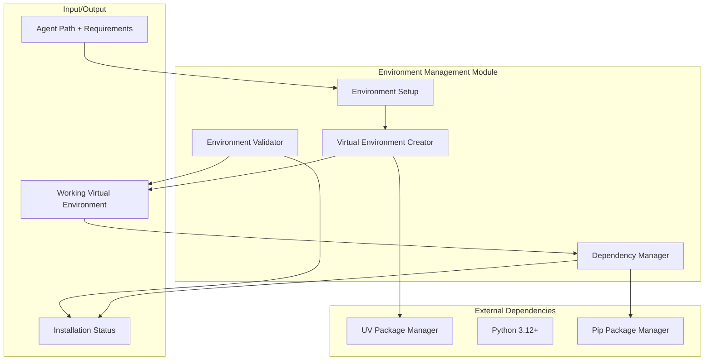

# Environment Management Module

**Document Type**: Environment Management Module Overview
**Module**: Environment Management
**Phase**: 2 - Auto-Install
**Author**: William
**Date Created**: 2025-06-28
**Last Updated**: 2025-06-28
**Status**: Active
**Purpose**: Manage virtual environments and dependencies for auto-installed agents

## 🎯 **Module Overview**

The **Environment Management Module** handles the creation, configuration, and management of isolated virtual environments for each auto-installed agent. This module ensures that agents have their own dependency space and can run without conflicts.

### **Key Capabilities**
- **Virtual Environment Creation**: Create isolated Python environments for each agent
- **Dependency Management**: Install and manage agent-specific dependencies
- **Environment Validation**: Ensure environments are properly configured
- **Cleanup and Recovery**: Handle failed installations and cleanup

### **Simple Usage Example**
```python
from agenthub.environment.environment_setup import EnvironmentSetup
from agenthub.environment.dependency_manager import DependencyManager

# Set up environment for an agent
env_setup = EnvironmentSetup()
env_path = env_setup.create_environment("~/.agenthub/agents/dev/agent")

# Install dependencies
dep_manager = DependencyManager()
dep_manager.install_dependencies(env_path, "~/.agenthub/agents/dev/agent/requirements.txt")
```

## 🏗️ **Module Architecture**



## 📋 **Module Components**

### **1. Environment Setup** (`environment_setup.py`)
- **Purpose**: Coordinate the complete environment setup process
- **Responsibilities**:
  - Coordinate virtual environment creation
  - Manage dependency installation
  - Validate final environment
  - Handle setup failures and cleanup

### **2. Virtual Environment Creator** (`virtual_environment.py`)
- **Purpose**: Create and configure Python virtual environments
- **Responsibilities**:
  - Create virtual environments using UV
  - Configure environment variables
  - Set up Python executable paths
  - Handle environment creation failures

### **3. Dependency Manager** (`dependency_manager.py`)
- **Purpose**: Install and manage Python dependencies
- **Responsibilities**:
  - Parse requirements.txt files
  - Install packages in virtual environments
  - Handle dependency conflicts
  - Manage package versions

### **4. Environment Validator** (integrated in environment_setup.py)
- **Purpose**: Ensure environments are properly configured
- **Responsibilities**:
  - Verify Python executable availability
  - Check package installation status
  - Validate environment isolation
  - Test basic functionality

## 🔗 **Module Dependencies**

### **Internal Dependencies**
- **Storage Module**: For agent path management
- **GitHub Module**: For repository validation

### **External Dependencies**
- **UV Package Manager**: For fast virtual environment creation
- **Python 3.12+**: For subprocess and venv support
- **Pip**: For package installation (fallback)

## 📁 **File Structure**

```
agenthub/environment/
├── __init__.py                    # Module initialization
├── environment_setup.py           # Main environment setup coordinator
├── virtual_environment.py         # Virtual environment creation
├── dependency_manager.py          # Dependency management
└── exceptions.py                  # Custom exceptions
```

## 🚀 **Implementation Approach**

### **Phase 2A: Basic Environment Creation (Week 1)**
1. **Implement Virtual Environment Creator**
   - Create environments using UV
   - Basic environment configuration
   - Handle creation failures

2. **Implement Basic Dependency Manager**
   - Parse requirements.txt
   - Install packages using pip
   - Basic error handling

### **Phase 2B: Enhanced Dependency Management (Week 2)**
1. **Enhance Dependency Manager**
   - Handle dependency conflicts
   - Version compatibility checking
   - Installation retry logic

2. **Implement Environment Validator**
   - Basic environment validation
   - Package verification
   - Functionality testing

### **Phase 2C: Integration and Optimization (Week 3)**
1. **Implement Environment Setup Coordinator**
   - Coordinate all setup steps
   - Handle failures and cleanup
   - Provide progress feedback

2. **Performance Optimization**
   - Parallel dependency installation
   - Caching strategies
   - Resource usage optimization

## 🧪 **Testing Strategy**

### **Unit Testing**
- **Virtual Environment Creator**: Test environment creation, configuration, error handling
- **Dependency Manager**: Test package parsing, installation, conflict resolution
- **Environment Setup**: Test coordination, failure handling, cleanup

### **Integration Testing**
- **End-to-End**: Test complete environment setup flow
- **Dependency Scenarios**: Test various requirements.txt formats and conflicts
- **Failure Scenarios**: Test network issues, permission problems, disk space issues

### **Test Data**
- **Simple Dependencies**: Basic packages with no conflicts
- **Complex Dependencies**: Packages with version conflicts and dependencies
- **Invalid Requirements**: Malformed requirements.txt files
- **Edge Cases**: Large packages, network-dependent packages

## 📊 **Success Criteria**

### **Functional Requirements**
- ✅ Creates isolated virtual environments for each agent
- ✅ Installs all dependencies from requirements.txt
- ✅ Handles common dependency conflicts gracefully
- ✅ Provides clear feedback during installation

### **Performance Requirements**
- ✅ Environment creation completes in under 30 seconds
- ✅ Dependency installation completes in under 2 minutes for typical agents
- ✅ Minimal disk space usage for environments
- ✅ Efficient package caching and reuse

### **Quality Requirements**
- ✅ 95%+ success rate for valid requirements.txt files
- ✅ Clear error messages for installation failures
- ✅ Proper cleanup of failed installations
- ✅ Environment isolation maintained

## 🔄 **Module Evolution**

### **Phase 2 (Current)**
- Basic virtual environment creation using UV
- Simple dependency installation using pip
- Basic error handling and cleanup

### **Phase 3 (Future)**
- Enhanced dependency conflict resolution
- Package version compatibility checking
- Advanced caching strategies

### **Phase 4 (Future)**
- Multi-platform environment support
- Container-based isolation options
- Automated environment health monitoring

## 🚨 **Key Risks and Mitigation**

### **Risk 1: UV Package Manager Dependencies**
- **Risk**: UV not available or incompatible version
- **Mitigation**: Check UV availability, provide clear installation instructions
- **Fallback**: Use standard venv and pip if UV fails

### **Risk 2: Dependency Conflicts**
- **Risk**: Complex dependency conflicts block installation
- **Mitigation**: Implement conflict resolution strategies
- **Fallback**: Install minimal dependencies, provide user guidance

### **Risk 3: Network and Package Issues**
- **Risk**: Package download failures or network issues
- **Mitigation**: Implement retry logic, use multiple package sources
- **Fallback**: Graceful failure with manual installation instructions

### **Risk 4: Environment Corruption**
- **Risk**: Environments become corrupted or unusable
- **Mitigation**: Implement environment validation and recovery
- **Fallback**: Recreate environment from scratch

## 🎯 **Next Steps**

1. **Review Design Documents**: Read detailed design documents for each component
2. **Set Up Development Environment**: Ensure UV and Python dependencies are available
3. **Create Test Scenarios**: Set up various requirements.txt files for testing
4. **Begin Implementation**: Start with Virtual Environment Creator component

## 📚 **Related Documentation**

- **[01_interface_design.md](01_interface_design.md)** - Public interfaces and APIs
- **[02_implementation_details.md](02_implementation_details.md)** - Internal implementation details
- **[03_testing_strategy.md](03_testing_strategy.md)** - Testing approach and examples
- **[04_success_criteria.md](04_success_criteria.md)** - Success metrics and validation

The Environment Management Module ensures that auto-installed agents have properly configured, isolated environments with all necessary dependencies, enabling reliable execution without conflicts.
