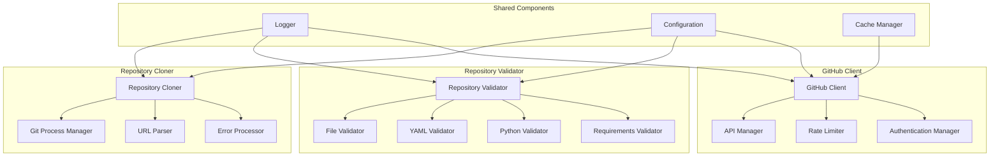

# GitHub Module - Implementation Details

**Document Type**: Implementation Details
**Module**: GitHub Integration
**Phase**: 2 - Auto-Install
**Author**: William
**Date Created**: 2025-06-28
**Last Updated**: 2025-06-28
**Status**: Active

## 🏗️ **Internal Architecture**

### **Component Relationships**



## 🔧 **Core Implementation Classes**

### **Repository Cloner Implementation**

```python
import subprocess
import os
import re
from pathlib import Path
from typing import Optional, Dict, Any
from .exceptions import RepositoryNotFoundError, CloneFailedError, InvalidAgentNameError
from .git_process_manager import GitProcessManager
from .url_parser import URLParser
from .error_processor import ErrorProcessor

class RepositoryCloner:
    """Clone agent repositories from GitHub to local storage."""

    def __init__(self, config: Dict[str, Any] = None):
        self.config = config or {}
        self.git_manager = GitProcessManager()
        self.url_parser = URLParser()
        self.error_processor = ErrorProcessor()
        self.clone_cache = {}

    def clone_agent(self, agent_name: str, target_path: Optional[str] = None) -> str:
        """
        Clone an agent repository from GitHub.

        Args:
            agent_name: Repository name in format "developer/agent-name"
            target_path: Optional local path for cloning

        Returns:
            Local path where repository was cloned
        """
        # Validate agent name format
        if not self.url_parser.is_valid_agent_name(agent_name):
            raise InvalidAgentNameError(agent_name)

        # Determine target path
        if target_path is None:
            target_path = self._get_default_target_path(agent_name)

        # Check if already cloned
        if self._is_already_cloned(agent_name, target_path):
            return target_path

        # Construct GitHub URL
        github_url = self.url_parser.build_github_url(agent_name)

        # Execute git clone
        try:
            clone_result = self.git_manager.clone_repository(github_url, target_path)

            # Validate clone result
            if not clone_result.success:
                raise CloneFailedError(agent_name, clone_result.output, clone_result.exit_code)

            # Cache successful clone
            self.clone_cache[agent_name] = {
                'path': target_path,
                'timestamp': time.time(),
                'status': 'completed'
            }

            return target_path

        except Exception as e:
            # Process and enhance error information
            enhanced_error = self.error_processor.process_clone_error(e, agent_name, github_url)
            raise enhanced_error

    def _get_default_target_path(self, agent_name: str) -> str:
        """Get default target path for cloning."""
        base_path = self.config.get('base_path', '~/.agenthub/agents')
        base_path = os.path.expanduser(base_path)

        # Create agent-specific directory
        agent_dir = agent_name.replace('/', '_')
        target_path = os.path.join(base_path, agent_dir)

        # Ensure directory exists
        os.makedirs(target_path, exist_ok=True)

        return target_path

    def _is_already_cloned(self, agent_name: str, target_path: str) -> bool:
        """Check if repository is already cloned at target path."""
        if not os.path.exists(target_path):
            return False

        # Check if it's a git repository
        git_dir = os.path.join(target_path, '.git')
        if not os.path.exists(git_dir):
            return False

        # Check if it's the right repository
        try:
            remote_url = self.git_manager.get_remote_url(target_path)
            expected_url = self.url_parser.build_github_url(agent_name)
            return remote_url == expected_url
        except Exception:
            return False
```

### **Repository Validator Implementation**

```python
import os
import yaml
import ast
from pathlib import Path
from typing import List, Dict, Any
from .exceptions import ValidationError
from .validators.file_validator import FileValidator
from .validators.yaml_validator import YAMLValidator
from .validators.python_validator import PythonValidator
from .validators.requirements_validator import RequirementsValidator

class RepositoryValidator:
    """Validate that cloned repositories meet required standards."""

    def __init__(self, config: Dict[str, Any] = None):
        self.config = config or {}
        self.file_validator = FileValidator()
        self.yaml_validator = YAMLValidator()
        self.python_validator = PythonValidator()
        self.requirements_validator = RequirementsValidator()

        # Required files for agent repositories
        self.required_files = [
            'agent.yaml',
            'agent.py',
            'requirements.txt',
            'README.md'
        ]

    def validate_repository(self, local_path: str) -> ValidationResult:
        """
        Validate a cloned repository meets all requirements.

        Args:
            local_path: Path to the local repository

        Returns:
            ValidationResult with detailed validation information
        """
        start_time = time.time()

        # Validate required files
        file_validation = self._validate_required_files(local_path)

        # Validate agent.yaml
        yaml_path = os.path.join(local_path, 'agent.yaml')
        yaml_validation = self._validate_agent_yaml(yaml_path)

        # Validate agent.py
        py_path = os.path.join(local_path, 'agent.py')
        py_validation = self._validate_agent_py(py_path, yaml_validation.parsed_data)

        # Validate requirements.txt
        requirements_path = os.path.join(local_path, 'requirements.txt')
        requirements_validation = self._validate_requirements_txt(requirements_path)

        # Calculate overall validation score
        overall_score = self._calculate_validation_score(
            file_validation, yaml_validation, py_validation, requirements_validation
        )

        # Determine if validation passed
        is_valid = overall_score >= self.config.get('min_validation_score', 0.8)

        # Collect all errors and warnings
        all_errors = []
        all_warnings = []

        for validation in [file_validation, yaml_validation, py_validation, requirements_validation]:
            all_errors.extend(validation.validation_errors)
            all_warnings.extend(validation.validation_warnings)

        validation_time = time.time() - start_time

        return ValidationResult(
            is_valid=is_valid,
            errors=all_errors,
            warnings=all_warnings,
            file_validation=file_validation,
            yaml_validation=yaml_validation,
            py_validation=py_validation,
            requirements_validation=requirements_validation,
            overall_score=overall_score,
            validation_time=validation_time
        )

    def _validate_required_files(self, local_path: str) -> Dict[str, FileValidationResult]:
        """Validate that all required files are present and accessible."""
        results = {}

        for filename in self.required_files:
            file_path = os.path.join(local_path, filename)
            results[filename] = self.file_validator.validate_file(file_path)

        return results

    def _validate_agent_yaml(self, yaml_path: str) -> YamlValidationResult:
        """Validate agent.yaml format and content."""
        return self.yaml_validator.validate_yaml(yaml_path)

    def _validate_agent_py(self, py_path: str, yaml_data: dict) -> PyValidationResult:
        """Validate agent.py implements methods defined in agent.yaml."""
        return self.python_validator.validate_python(py_path, yaml_data)

    def _validate_requirements_txt(self, requirements_path: str) -> RequirementsValidationResult:
        """Validate requirements.txt format and content."""
        return self.requirements_validator.validate_requirements(requirements_path)

    def _calculate_validation_score(self, file_validation: Dict, yaml_validation: YamlValidationResult,
                                  py_validation: PyValidationResult,
                                  requirements_validation: RequirementsValidationResult) -> float:
        """Calculate overall validation score (0.0 to 1.0)."""
        scores = []

        # File validation score (25% weight)
        file_score = sum(1 for result in file_validation.values() if result.exists and result.is_readable)
        file_score = file_score / len(self.required_files)
        scores.append(file_score * 0.25)

        # YAML validation score (25% weight)
        yaml_score = 1.0 if yaml_validation.is_valid else 0.0
        scores.append(yaml_score * 0.25)

        # Python validation score (35% weight)
        py_score = 1.0 if py_validation.is_valid else 0.0
        scores.append(py_score * 0.35)

        # Requirements validation score (15% weight)
        req_score = 1.0 if requirements_validation.is_valid else 0.0
        scores.append(req_score * 0.15)

        return sum(scores)
```

### **GitHub Client Implementation**

```python
import requests
import time
from typing import Optional, Dict, Any
from .exceptions import GitHubAPIError, RateLimitExceededError

class GitHubClient:
    """Interact with GitHub API for enhanced validation (optional)."""

    def __init__(self, config: Dict[str, Any] = None):
        self.config = config or {}
        self.base_url = "https://api.github.com"
        self.session = requests.Session()
        self.rate_limit_info = None

        # Set up authentication if available
        self._setup_authentication()

    def check_repository_exists(self, agent_name: str) -> bool:
        """Check if a repository exists and is accessible."""
        try:
            url = f"{self.base_url}/repos/{agent_name}"
            response = self._make_request('GET', url)
            return response.status_code == 200
        except Exception:
            return False

    def get_repository_metadata(self, agent_name: str) -> RepositoryMetadata:
        """Get basic repository metadata."""
        url = f"{self.base_url}/repos/{agent_name}"
        response = self._make_request('GET', url)

        if response.status_code != 200:
            raise GitHubAPIError(f"Failed to get repository metadata: {response.status_code}")

        data = response.json()

        return RepositoryMetadata(
            name=data['name'],
            full_name=data['full_name'],
            description=data.get('description', ''),
            stars=data['stargazers_count'],
            forks=data['forks_count'],
            last_updated=data['updated_at'],
            language=data.get('language', ''),
            size=data['size'],
            default_branch=data['default_branch']
        )

    def get_rate_limit_status(self) -> RateLimitStatus:
        """Get current GitHub API rate limit status."""
        url = f"{self.base_url}/rate_limit"
        response = self._make_request('GET', url)

        if response.status_code != 200:
            return RateLimitStatus(remaining=0, reset_time=0, limit=0)

        data = response.json()
        core = data['resources']['core']

        return RateLimitStatus(
            remaining=core['remaining'],
            reset_time=core['reset'],
            limit=core['limit']
        )

    def is_authenticated(self) -> bool:
        """Check if GitHub API authentication is available."""
        return hasattr(self.session, 'auth') and self.session.auth is not None

    def _setup_authentication(self):
        """Set up GitHub API authentication if credentials are available."""
        # Check for GitHub token in environment
        token = os.environ.get('GITHUB_TOKEN')
        if token:
            self.session.headers.update({
                'Authorization': f'token {token}',
                'Accept': 'application/vnd.github.v3+json'
            })

        # Check for GitHub username/password in config
        username = self.config.get('github_username')
        password = self.config.get('github_password')
        if username and password:
            self.session.auth = (username, password)

    def _make_request(self, method: str, url: str, **kwargs) -> requests.Response:
        """Make HTTP request with rate limiting and error handling."""
        # Check rate limit before making request
        self._check_rate_limit()

        try:
            response = self.session.request(method, url, **kwargs)

            # Handle rate limiting
            if response.status_code == 403 and 'rate limit' in response.text.lower():
                self._handle_rate_limit(response)

            return response

        except requests.exceptions.RequestException as e:
            raise GitHubAPIError(f"Request failed: {e}")

    def _check_rate_limit(self):
        """Check if we're approaching rate limit."""
        if not self.is_authenticated():
            # Unauthenticated requests have very low rate limits
            time.sleep(1)  # Simple delay for unauthenticated requests
            return

        # For authenticated requests, check actual rate limit
        rate_limit = self.get_rate_limit_status()
        if rate_limit.remaining < 10:  # Leave some buffer
            wait_time = rate_limit.reset_time - time.time()
            if wait_time > 0:
                time.sleep(wait_time)

    def _handle_rate_limit(self, response: requests.Response):
        """Handle rate limit exceeded response."""
        rate_limit = self.get_rate_limit_status()
        wait_time = rate_limit.reset_time - time.time()

        if wait_time > 0:
            raise RateLimitExceededError(f"Rate limit exceeded. Reset in {wait_time:.0f} seconds")
        else:
            raise RateLimitExceededError("Rate limit exceeded")
```

## 🔧 **Supporting Classes**

### **Git Process Manager**

```python
import subprocess
import os
from typing import Dict, Any, Optional
from dataclasses import dataclass

@dataclass
class CloneResult:
    """Result of a git clone operation."""
    success: bool
    output: str
    exit_code: int
    target_path: str

class GitProcessManager:
    """Manage git process operations."""

    def __init__(self, config: Dict[str, Any] = None):
        self.config = config or {}
        self.git_path = self._find_git_executable()

    def clone_repository(self, url: str, target_path: str) -> CloneResult:
        """Clone a repository using git."""
        if not self.git_path:
            return CloneResult(
                success=False,
                output="Git executable not found",
                exit_code=-1,
                target_path=target_path
            )

        try:
            # Prepare git clone command
            cmd = [self.git_path, 'clone', url, target_path]

            # Execute git clone
            result = subprocess.run(
                cmd,
                capture_output=True,
                text=True,
                timeout=300  # 5 minute timeout
            )

            return CloneResult(
                success=result.returncode == 0,
                output=result.stdout + result.stderr,
                exit_code=result.returncode,
                target_path=target_path
            )

        except subprocess.TimeoutExpired:
            return CloneResult(
                success=False,
                output="Git clone operation timed out",
                exit_code=-1,
                target_path=target_path
            )
        except Exception as e:
            return CloneResult(
                success=False,
                output=f"Git clone failed: {e}",
                exit_code=-1,
                target_path=target_path
            )

    def get_remote_url(self, repo_path: str) -> Optional[str]:
        """Get the remote URL of a git repository."""
        if not self.git_path:
            return None

        try:
            cmd = [self.git_path, 'remote', 'get-url', 'origin']
            result = subprocess.run(
                cmd,
                cwd=repo_path,
                capture_output=True,
                text=True
            )

            if result.returncode == 0:
                return result.stdout.strip()
            return None

        except Exception:
            return None

    def _find_git_executable(self) -> Optional[str]:
        """Find the git executable in the system."""
        # Check common git locations
        common_paths = [
            '/usr/bin/git',
            '/usr/local/bin/git',
            '/opt/homebrew/bin/git',  # macOS Homebrew
            'git'  # Let PATH handle it
        ]

        for path in common_paths:
            try:
                result = subprocess.run(
                    [path, '--version'],
                    capture_output=True,
                    text=True
                )
                if result.returncode == 0:
                    return path
            except Exception:
                continue

        return None
```

### **URL Parser**

```python
import re
from typing import Optional

class URLParser:
    """Parse and validate agent names and construct GitHub URLs."""

    def __init__(self):
        # Agent name pattern: developer/agent-name
        self.agent_pattern = re.compile(r'^[a-zA-Z0-9_-]+/[a-zA-Z0-9_-]+$')

    def is_valid_agent_name(self, agent_name: str) -> bool:
        """Check if agent name follows the required format."""
        return bool(self.agent_pattern.match(agent_name))

    def build_github_url(self, agent_name: str) -> str:
        """Build GitHub URL from agent name."""
        if not self.is_valid_agent_name(agent_name):
            raise ValueError(f"Invalid agent name format: {agent_name}")

        return f"https://github.com/{agent_name}.git"

    def parse_agent_name(self, github_url: str) -> Optional[str]:
        """Extract agent name from GitHub URL."""
        # Handle various GitHub URL formats
        patterns = [
            r'https://github\.com/([^/]+/[^/]+?)(?:\.git)?/?$',
            r'git@github\.com:([^/]+/[^/]+?)(?:\.git)?/?$'
        ]

        for pattern in patterns:
            match = re.match(pattern, github_url)
            if match:
                return match.group(1)

        return None
```

## 🚨 **Error Handling**

### **Error Processor**

```python
from typing import Dict, Any, Type
from .exceptions import *

class ErrorProcessor:
    """Process and enhance error information."""

    def __init__(self):
        self.error_mapping = {
            'Repository not found': RepositoryNotFoundError,
            'Authentication failed': GitHubAPIError,
            'Rate limit exceeded': RateLimitExceededError,
            'Network error': CloneFailedError,
            'Permission denied': CloneFailedError
        }

    def process_clone_error(self, error: Exception, agent_name: str, github_url: str) -> Exception:
        """Process clone errors and enhance them with context."""
        error_message = str(error).lower()

        # Map error messages to specific exception types
        for pattern, exception_class in self.error_mapping.items():
            if pattern.lower() in error_message:
                return exception_class(agent_name, error_message)

        # Default to CloneFailedError if no specific match
        return CloneFailedError(agent_name, str(error))

    def enhance_error_context(self, error: Exception, context: Dict[str, Any]) -> Exception:
        """Add context information to errors."""
        # Add context to error message
        if hasattr(error, 'args') and error.args:
            enhanced_message = f"{error.args[0]} (Context: {context})"
            error.args = (enhanced_message,) + error.args[1:]

        return error
```

## 📊 **Configuration Management**

### **Configuration Schema**

```python
from typing import Dict, Any
from dataclasses import dataclass

@dataclass
class GitHubModuleConfig:
    """Configuration for GitHub Integration Module."""

    # Base paths
    base_path: str = "~/.agenthub/agents"

    # GitHub API settings
    github_token: Optional[str] = None
    github_username: Optional[str] = None
    github_password: Optional[str] = None

    # Git settings
    git_timeout: int = 300  # seconds
    git_retry_count: int = 3

    # Validation settings
    min_validation_score: float = 0.8
    strict_validation: bool = False

    # Rate limiting
    enable_rate_limiting: bool = True
    rate_limit_buffer: int = 10

    # Caching
    enable_caching: bool = True
    cache_ttl: int = 3600  # seconds

    @classmethod
    def from_dict(cls, config_dict: Dict[str, Any]) -> 'GitHubModuleConfig':
        """Create config from dictionary."""
        return cls(**{
            k: v for k, v in config_dict.items()
            if k in cls.__annotations__
        })

    def to_dict(self) -> Dict[str, Any]:
        """Convert config to dictionary."""
        return {
            k: getattr(self, k)
            for k in self.__annotations__
        }
```

## 🧪 **Testing Support**

### **Mock Implementations**

```python
from typing import Dict, Any, Optional
from .repository_cloner import RepositoryCloner

class MockRepositoryCloner(RepositoryCloner):
    """Mock implementation for testing."""

    def __init__(self, mock_responses: Dict[str, str], mock_errors: Dict[str, Exception] = None):
        super().__init__()
        self.mock_responses = mock_responses
        self.mock_errors = mock_errors or {}
        self.clone_calls = []

    def clone_agent(self, agent_name: str, target_path: Optional[str] = None) -> str:
        """Mock clone operation."""
        self.clone_calls.append({
            'agent_name': agent_name,
            'target_path': target_path
        })

        # Check for mock errors
        if agent_name in self.mock_errors:
            raise self.mock_errors[agent_name]

        # Return mock response
        if agent_name in self.mock_responses:
            return self.mock_responses[agent_name]

        # Default behavior: raise not found error
        raise RepositoryNotFoundError(agent_name, "Mock: Repository not found")

    def get_clone_calls(self) -> List[Dict[str, Any]]:
        """Get list of clone calls made during testing."""
        return self.clone_calls.copy()
```

This implementation details document provides the complete technical foundation for implementing the GitHub Integration Module with robust error handling, configuration management, and testing support.
