# AgentsIQ Architecture Diagram

## 🏗️ System Architecture Overview


## 🔄 Decision Flow Diagram


## 🏢 Component Architecture

```mermaid
graph LR
    subgraph "AgentsIQ Core"
        A[ModelRouter]
        B[Agent]
        C[Collab]
        D[RouterManager]
    end
    
    subgraph "Configuration"
        E["config.yaml"]
        F["Environment Variables"]
        G["Dynamic Weights"]
    end
    
    subgraph "Analytics"
        H[DecisionStore]
        I[AgentOps]
        J[Dashboard]
        K[Benchmark]
    end
    
    subgraph "External APIs"
        L["OpenAI API"]
        M["Anthropic API"]
        N["Google API"]
        O["Ollama API"]
        P["Grok API"]
    end
    
    A --> E
    A --> F
    A --> G
    A --> H
    A --> I
    
    B --> A
    C --> A
    D --> A
    
    A --> L
    A --> M
    A --> N
    A --> O
    A --> P
    
    H --> J
    I --> J
    K --> J
    
    style A fill:#ffeb3b
    style J fill:#4caf50
    style L fill:#2196f3
    style M fill:#ff9800
    style N fill:#4caf50
    style O fill:#9c27b0
    style P fill:#f44336
```



## 📊 Model Selection Matrix

| Model | Cost/1K | Latency | Quality | Best For |
|-------|---------|---------|---------|----------|
| **Ollama Qwen2.5:7b** | $0.00 | 0.25s | 0.80 | Fast, local inference |
| **Ollama Llama3.1:8b** | $0.00 | 0.30s | 0.82 | Balanced local model |
| **Google Gemini-Pro** | $0.125 | 0.60s | 0.78 | General purpose |
| **Anthropic Claude-3-Haiku** | $0.25 | 0.70s | 0.80 | Summarization |
| **OpenAI GPT-4o-mini** | $0.15 | 0.80s | 0.75 | Code generation |
| **Grok Grok-2** | $0.20 | 0.90s | 0.90 | Creative writing |
| **OpenAI GPT-4o** | $5.00 | 1.00s | 0.95 | Complex reasoning |

## 🎯 Optimization Strategy

The intelligent selection uses a **weighted objective function**:

```
Score = (Cost_Weight × Cost_Normalized) + 
        (Latency_Weight × Latency_Normalized) + 
        (Quality_Weight × Quality_Normalized)

Where:
- Cost_Weight = 0.60 (60%)
- Latency_Weight = 0.25 (25%)  
- Quality_Weight = 0.15 (15%)
```

**Task-Specific Quality Boosts:**
- OpenAI models: +0.05 for code tasks
- Anthropic models: +0.05 for summarization tasks
- Google models: +0.02 for general tasks (non-code)

This ensures optimal model selection based on task requirements while maintaining cost efficiency.
