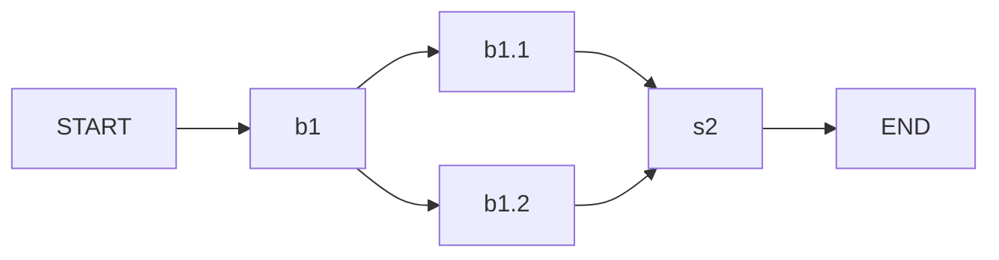
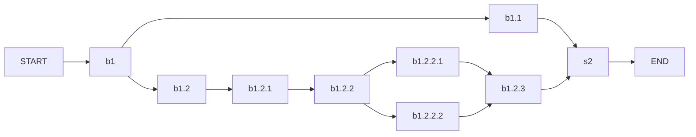

# ansible-plan

A command-line tool for launching workflows composed of Red Hat Ansible® playbooks


## Prerequisites

Install the dependencies with the command:

    pip install -r requirements.txt

## Usage

At minimum a workflow file cam be launched with the following command:

```bash
ansible-plan workflow_file.yml
```
### Verify workflow file
To only check the syntax of the workflow file, you can just add the parameter `--verify-only`.

### Check mode
To launch all the playbooks inside the workflow in check mode, it is possible to specify the `--check` option.

### Logging
Various options can be used to increase the logging capacity. Here the possible options.

| Parameter              | Description                                                                                         |
| :---                   | :---                                                                                                |
| --log-dir LOG_DIR      | Allow to specify a log directory where the log files will be put                                    |
| --log-dir-no-info      | Doesn't produce sub directory with the name of the workflow and the execution time to the log dir   |
| --log-level LEVEL      | Set the logging level. One of {debug,info,warning,error,critical}                                   |

### Modifiy workflow execution
The workflow execution can be modified with a series of parameters.
In the table below the options that modify the execution flow.

| Parameter                     | Description                                                                       |
| :---                          | :---                                                                              |
| --start-from-node START_NODE  / -sn START_NODE| The workflow will start from the node with id START_NODE                                    |
| --end-to-node END_NODE  / -en END_NODE      | The workflow will end the execution at the node with id END_NODE                            |
| --skip-nodes SKIP_NODES       | A list of nodes id, separated by comma, that will be skipped during the execution.          |
| --execute-nodes FILTER_NODES  | The list of nodes that will be execute. Complementary to `--skip-nodes`  options            |

### Variables input from command line

| Parameter                               | Description                                                                             |
| :---                                    | :---                                                                                    |
| --input-templating INPUT_TEMPLATING  / -it INPUT_TEMPLATING    | Allow to specify template variables in the form KEY=VALUE from the command line. Multiple instances of this parameter can be set        |
| --extra-vars                            | Set additional variables to be bassed to playbooks from the command line                |

## Interactive retry
In case of failure of some playbooks inside the workflow, the workflow ask if the playbook need to be relaunched.
It is possible to avoid this questions and fail the entiry workflow by adding the command `--no-interactive-retry` or `-nir`.

## Workflow file

Some examples can be found in the examples directory.

The workflow format is in a YAML file like the following.

```yaml
---
meta:
  format-version: 1
templating:
  second_host: second_hostname
options:
  global_path: examples/
  vault_script: vault_script_test.py
defaults:
  inventory: inventory.ini
  vars:
    default_var1: default_value1
  project_path: .
  limit: first_hostname
  vault_ids:
    - V1
workflow:
  - id: serial_example
    strategy: serial
    block:
      - id: nested_block
        block:
          - id: nested1
            import_playbook: playbooks/first.yml
          - id: nested2
            import_playbook: playbooks/second.yml
    - id: all_params
      inventory: inventory.ini
      project_path: .
      import_playbook: playbooks/extra_vars_play.yml
      vars:
          extra_var1: extra_val1
          extra_var2: extra_val2
      vault_ids:
          - ID1
          - ID2
      limit: third_hostname, {{ second_host }}
  - id: parallel_example
    strategy: parallel
    block:
      - id: p1
        import_playbook: playbooks/third.yml
      - id: p2
        import_playbook: playbooks/fourth.yml
      - id: inc
        id_prefix: 'inc'
        include_block: _to_be_imported.yml
```


Here an explaination of the various keys:

| Name                   | Description                                                                                     |
| :---                   | :---                                                                                            |
| meta/format-version    | Specify the workflow YAML format version. Only 1 is supported                                   |
| templating             | Allow to specify variables to be used inside the values of the workflow using jinja2 template   |
| options/global_path    | Specify a global path the is prepended to playbooks, project_path, inventory and vault script   |
| options/vault_script   | Specify a vault script to be used to get vault id passwords                                     |
| defaults/inventory     | The default inventory applied on all workflow node                                              |
| defaults/vars          | The default extra variables applied on all workflow node                                        |
| defaults/project_path  | The default project path  applied on all workflow node                                          |
| defaults/limit         | The default limit directive  applied on all workflow node                                       |
| defaults/vault_ids     | The default list of vault id  applied on all workflow node                                      |
| workflow               | Where to put the workflow specification                                                         |


## Workflow writing guide

The `workflow` key content allow to specify playbooks to be run.
The first level of the workflow content is a list of playbook to be executed in a serial way.


The following simple workflow executes two playbook in strict sequence.
When the `first.yml` is executed than the `second.yml` is executed if the `first.yml` is not failed.

```yaml
---
defaults:
  inventory: inventory.ini
  vault_script: vault_script.sh
workflow:
  - import_playbook: playbooks/first.yml
  - id: s2
    import_playbook: playbooks/second.yml
    inventory: alternative_inventory.ini
    project_path: .
    vars:
      extra_var1: "extra var content"
    vault_ids:
      - ID1
      - ID2
    limit: third_hostname
```

The execution graph is the following:


The first playbook has no parameters so defaults will be used and an _id_ will be automatically generated.

You can see that the second playbook has many parameter specified. All this parameters can be specified globally using the defaults key but in this case will be overwrited by the one specific of the playbook with id `s2`.
In this case the inventory used is the `alternative_inventory.ini` but the `project_path` influences the
resolution of the _collections_ and _roles_ searched inside the `project_path/collections` and `project_path/roles`folders. The `project_path` influences also the playbook path because the playbook file path specified with the `import_playbook` is searched inside the `project_path`.

The `vars` key allow to define variable that will be passed as _extra variables_ and the `limit` keyword is used to limit the hosts for the playbook execution.

Finally the key `vault_ids` specify wich _vault ids_ are used inside the playbook and to get the related password the script specified in `vault_script` key are used.

Each node of the workflow can be not only a simple playbook run but a block of playbooks that allow
to specify the strategy of execution **parallel** (_default_) or **serial**.
The following code exemplifies the block usage:

```yaml
---
defaults:
  inventory: inventory.ini
workflow:
  - id: b1
    block:
      - id: b1.1
        import_playbook: playbooks/first.yml
      - id: b1.2
        import_playbook: playbooks/second.yml
  - id: s2
    import_playbook: playbooks/third.yml
```

In the above case the first and second playbook are executed in parallel and when both are ended the
third playbook is executed. If one of the playbook in the parallel block
fails then the workflow wait for the completion of the other playbook of the block and then fail the
entire workflow.
The resulting graph:




The blocks can be nested to create more complex playbooks, like for example the following.


```yaml
---
defaults:
  inventory: inventory.ini
workflow:
  - id: b1
    block:
      - id: b1.1
        import_playbook: playbooks/first.yml
      - id: b1.2
        strategy: serial
        block:
          - id: b1.2.1
            import_playbook: playbooks/second.yml
          - id: b1.2.2
            strategy: parallel
            block:
            - id: b1.2.2.1
              import_playbook: playbooks/second.yml
            - id: b1.2.2.2
              import_playbook: playbooks/third.yml
          - id: b1.2.3
            import_playbook: playbooks/third.yml
  - id: s2
    import_playbook: playbooks/fourth.yml
```

In this case the execution flow is the following



### File inclusion
To modularize the creation of workflow is possible to include files that contains the definition of a block.

Here for example a file that include another:

```yaml
---
defaults:
  inventory: inventory.ini
workflow:
  - id: b1
    block:
      - id: b1.1
        import_playbook: playbooks/first.yml
      - id: b1.2
        import_playbook: playbooks/second.yml
  - id: inc2
    include_block: _block_file.yml
```
and here the content of the `_block_file.yml`

```yaml
---
id: not_reported
strategy: parallel
block:
  - id: b1
    import_playbook: playbooks/first.yml
  - id: b2
    import_playbook: playbooks/second.yml
  - id: b3
    import_playbook: playbooks/third.yml
```

the final resulting workflow file is:

```yaml
---
defaults:
  inventory: inventory.ini
workflow:
  - id: b1
    block:
      - id: b1.1
        import_playbook: playbooks/first.yml
      - id: b1.2
        import_playbook: playbooks/second.yml
  - id: inc2
    strategy: parallel
    block:
      - id: b3
        import_playbook: playbooks/first.yml
      - id: b2
        import_playbook: playbooks/second.yml
      - id: b3
        import_playbook: playbooks/third.yml
```
As you can note the resulting included file loose the id that is overwrited by the importing `id`.

Some times the same file need to be included multiple times but in this case the IDs imported will be the same, resulting in a wrong execution flow.

To avoid this issue you can specify an _id prefix_ that are applied to all the _ids_ in the included block.

```yaml
---
defaults:
  inventory: inventory.ini
workflow:
  - id: inc1
    include_block: _block_file.yml
    id_prefix: sub1
  - id: inc2
    include_block: _block_file.yml
    id_prefix: sub2
```

In this case different id prefix are used to include the same file and the resulting workflow is the following:


```yaml
---
defaults:
  inventory: inventory.ini
workflow:
  - id: inc1
    strategy: parallel
    block:
      - id: sub1b1
        import_playbook: playbooks/first.yml
      - id: sub1b2
        import_playbook: playbooks/second.yml
      - id: sub1b3
        import_playbook: playbooks/third.yml
  - id: inc2
    strategy: parallel
    block:
      - id: sub2b1
        import_playbook: playbooks/first.yml
      - id: sub2b2
        import_playbook: playbooks/second.yml
      - id: sub2b3
        import_playbook: playbooks/third.yml
```

### Templating
If you need to reuse some values inside the workflow content you can also use Jinja templating by using the `templating` root key where you can put variables to be used inside the workflow..

```yaml
---
defaults:
  inventory: inventory.ini
templating:
  first_var: content1
  second_var: content2
workflow:
  - id: inc1
    import_playbook: playbooks/first.yml
    vars:
      extra_var1: "{{ fist_var }}"
      extra_var2: "{{ second_var }}"
```

You can also use templating on a block or included block overriding the most global template variables.
For example the following example define a template variable **to_override** that is override within the block
```yaml
---
defaults:
  inventory: inventory.ini
templating:
  to_override: first_value
workflow:
  - id: b1
    block:
      - id: b1.1
        import_playbook: playbooks/first.yml
        limit: "{{ to_override }}"
  - id: inc2
    include_block: _block_file.yml
    templating:
      to_override: second_value
```
and here the content of the `_block_file.yml`

```yaml
---
id: not_reported
strategy: parallel
block:
  - id: b1
    import_playbook: playbooks/first.yml
    limit: "{{ to_override }}"


---
*Ansible® is a registered trademark of Red Hat, Inc. in the United States and other countries.*

```
