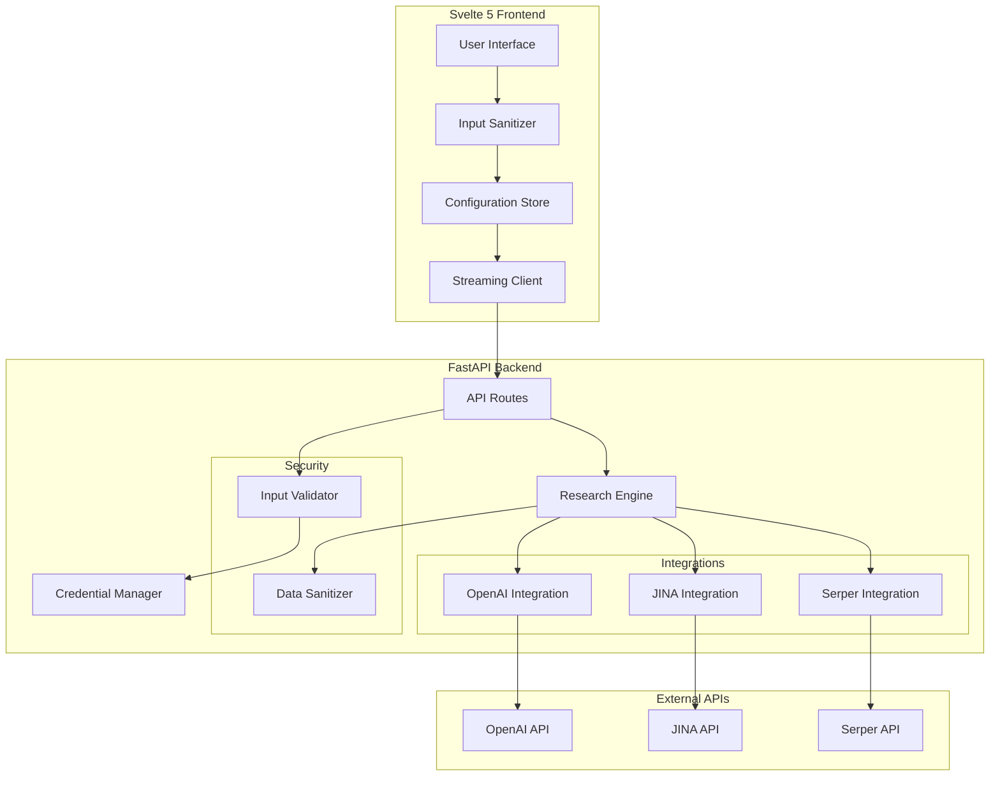
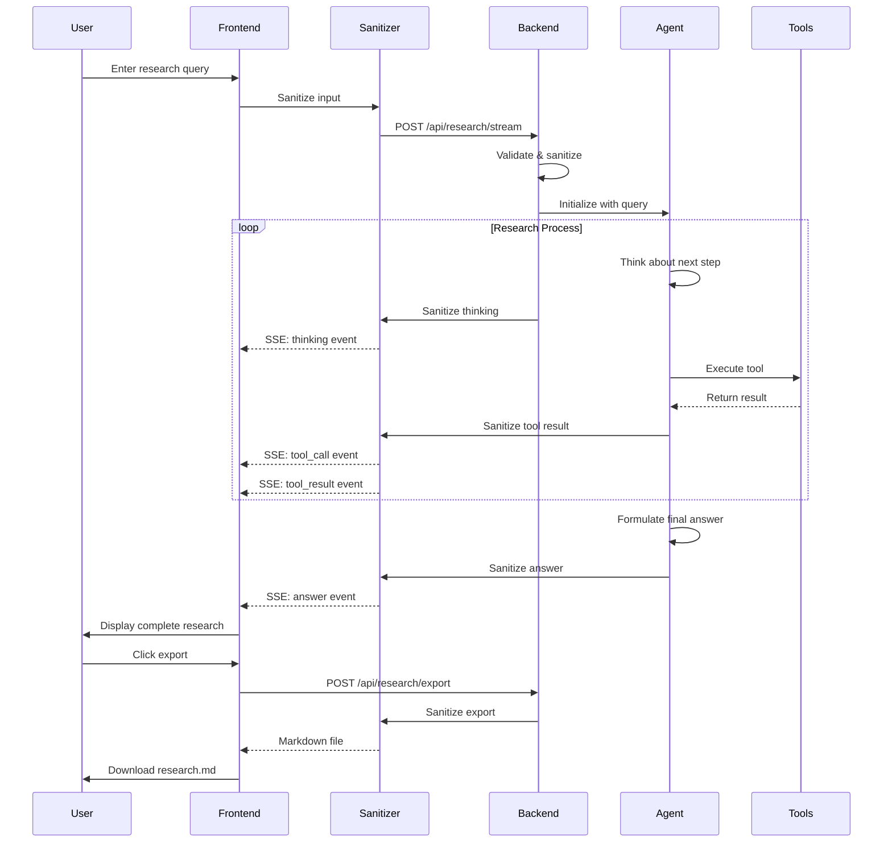

# BrainCloud - Implementation Plan

## Project Overview

BrainCloud is a "bring-your-own-keys" deep research web application built with Svelte 5 frontend and FastAPI backend. It uses an agent-based approach where AI can leverage multiple tools (web search, document parsing, and analysis) to answer complex research questions. Users provide their own API credentials for OpenAI-compatible APIs, JINA, and Serper.

### Key Features
- Agent-based research with tool calling capabilities
- Real-time streaming responses with tool execution visualization
- Markdown export for research results
- Dark theme UI based on MultiBrain patterns
- Secure client-side credential management
- Comprehensive data sanitization for all inputs and outputs

## Reference Repository Mapping

### Repository Structure
- **`tmp/multibrain/`** - Reference for FastAPI backend structure and Svelte 5 frontend patterns
- **`tmp/DeepResearch/inference-remote/`** - Reference for agent implementation and tool integration

### Component Mapping

#### Backend Architecture
- **FastAPI Structure**: Follow `tmp/multibrain/src/multibrain/api/` patterns
  - `main.py` - Application setup, CORS, middleware configuration
  - `routes/streaming.py` - SSE implementation for real-time streaming
- **Agent Implementation**: Adapt `tmp/DeepResearch/inference-remote/react_agent.py`
  - ReAct agent pattern with thinking/tool-calling loop
  - Tool orchestration and response handling

#### Frontend Architecture  
- **Svelte 5 Structure**: Follow `tmp/multibrain/frontend/src/` patterns
  - `App.svelte` - Main application component with modal management
  - `types.ts` - TypeScript interfaces and type definitions
  - Component organization and state management patterns

#### Tool Integration
- **Search Tool**: Adapt `tmp/DeepResearch/inference-remote/tool_search.py`
  - Serper API integration with batch search support
- **Document Tool**: Adapt `tmp/DeepResearch/inference-remote/tool_visit.py`
  - JINA API integration for webpage content extraction
  - Content summarization with LLM

## Architecture Overview



## Project Structure

```
braincloud/
├── src/
│   ├── braincloud/
│   │   ├── __init__.py
│   │   ├── api/
│   │   │   ├── __init__.py
│   │   │   ├── main.py                    # Based on tmp/multibrain/src/multibrain/api/main.py
│   │   │   ├── routes/
│   │   │   │   ├── __init__.py
│   │   │   │   ├── credentials.py
│   │   │   │   ├── research.py
│   │   │   │   └── streaming.py           # Based on tmp/multibrain/src/multibrain/api/routes/streaming.py
│   │   │   └── models/
│   │   │       ├── __init__.py
│   │   │       ├── credentials.py
│   │   │       └── research.py
│   │   ├── core/
│   │   │   ├── __init__.py
│   │   │   ├── config.py
│   │   │   ├── agent.py                   # Based on tmp/DeepResearch/inference-remote/react_agent.py
│   │   │   └── security/
│   │   │       ├── __init__.py
│   │   │       ├── sanitizer.py
│   │   │       └── validator.py
│   │   ├── tools/
│   │   │   ├── __init__.py
│   │   │   ├── base.py
│   │   │   ├── search.py                  # Based on tmp/DeepResearch/inference-remote/tool_search.py
│   │   │   ├── jina_reader.py             # Based on tmp/DeepResearch/inference-remote/tool_visit.py
│   │   │   └── ai_analysis.py
│   │   └── export/
│   │       ├── __init__.py
│   │       └── markdown.py
├── tests/
│   ├── __init__.py
│   ├── test_api/
│   ├── test_core/
│   ├── test_security/
│   └── test_tools/
├── frontend/
│   ├── src/
│   │   ├── components/
│   │   │   ├── CredentialModal.svelte     # Pattern from tmp/multibrain/frontend/src/components/
│   │   │   ├── ResearchInput.svelte
│   │   │   ├── ResearchStream.svelte
│   │   │   ├── ToolExecution.svelte
│   │   │   └── ExportButton.svelte
│   │   ├── stores/
│   │   │   ├── credentials.svelte.ts      # Pattern from tmp/multibrain/frontend/src/stores/
│   │   │   ├── research.svelte.ts
│   │   │   └── streaming.svelte.ts
│   │   ├── lib/
│   │   │   ├── api.ts
│   │   │   ├── sse.ts                     # SSE client pattern from multibrain
│   │   │   ├── storage.ts
│   │   │   ├── export.ts
│   │   │   └── security/
│   │   │       ├── sanitizer.ts
│   │   │       └── validator.ts
│   │   ├── App.svelte                     # Based on tmp/multibrain/frontend/src/App.svelte
│   │   ├── types.ts                       # Based on tmp/multibrain/frontend/src/types.ts
│   │   └── main.ts
│   ├── package.json
│   ├── vite.config.ts
│   ├── tailwind.config.js
│   └── tsconfig.json
├── pyproject.toml
├── .env.example
└── README.md
```

## Security & Data Sanitization Strategy

### Comprehensive Sanitization Approach

1. **User Form Entry Sanitization**:
   - **Frontend**: 
     - HTML entity encoding for all user inputs
     - XSS prevention using DOMPurify
     - Input length validation
     - Character whitelist validation for API keys
   - **Backend**:
     - Pydantic models with strict validation
     - SQL injection prevention (parameterized queries if DB used)
     - Command injection prevention
     - Path traversal prevention

2. **LLM Response Sanitization**:
   - **Content Filtering**:
     - Remove/escape HTML tags and scripts
     - Sanitize markdown to prevent XSS
     - Filter out potential prompt injections
     - Validate response structure
   - **Output Encoding**:
     - JSON encoding for API responses
     - HTML entity encoding for display
     - Safe markdown rendering

3. **JINA API Data Sanitization**:
   - **URL Validation**:
     - Strict URL parsing and validation
     - Protocol whitelist (https only)
     - Domain validation
   - **Content Processing**:
     - Strip scripts and dangerous HTML
     - Limit content size
     - Character encoding validation
     - Safe text extraction

4. **Serper API Data Sanitization**:
   - **Search Query Sanitization**:
     - Remove special characters
     - Length limits
     - Rate limiting per user
   - **Results Processing**:
     - HTML stripping from snippets
     - URL validation
     - Safe link handling

### Implementation Details

```python
# Example sanitizer module structure
class DataSanitizer:
    def sanitize_user_input(self, input: str) -> str:
        """Remove dangerous characters, validate length"""
        
    def sanitize_llm_response(self, response: str) -> str:
        """Clean LLM output for safe display"""
        
    def sanitize_jina_content(self, content: dict) -> dict:
        """Process JINA API responses safely"""
        
    def sanitize_serper_results(self, results: dict) -> dict:
        """Clean search results for safe use"""
        
    def sanitize_api_key(self, key: str) -> str:
        """Validate API key format"""
```

## Key Implementation Details

### Backend (FastAPI)

1. **Agent-Based Architecture** (Reference: `tmp/DeepResearch/inference-remote/react_agent.py`):
   - Implement ReAct pattern with thinking/tool-calling loop
   - Adapt the `MultiTurnReactAgent` class for BrainCloud's needs
   - Use structured tool responses with `<tool_call>` and `<tool_response>` tags
   - Context management across tool calls with token counting

2. **Tools Implementation**:
   - **Search Tool** (Reference: `tmp/DeepResearch/inference-remote/tool_search.py`):
     - Implement batch search capability from line 16-27
     - Use Serper API integration pattern from `google_search_with_serp` method
     - Adapt locale detection for international searches
   - **Document Tool** (Reference: `tmp/DeepResearch/inference-remote/tool_visit.py`):
     - Use JINA API integration from `jina_readpage` method (lines 145-181)
     - Implement content summarization with LLM from `readpage_jina` method
     - Add retry logic and timeout handling
   - **Analysis Tool**: OpenAI-compatible API for AI-powered analysis
   - Base tool class for consistent interface
   - All tools include output sanitization

3. **Streaming Architecture** (Reference: `tmp/multibrain/src/multibrain/api/routes/streaming.py`):
   - Implement SSE endpoint pattern from `generate_sse_events` function
   - Use async queues for real-time chunk streaming (lines 184-268)
   - Event types: tool_start, tool_result, thinking, answer
   - Adapt the streaming response format for agent events

4. **Export System**:
   - Markdown generation from research results
   - Include tool execution history
   - Format with proper sections and citations
   - Sanitize all exported content

### Frontend (Svelte 5)

1. **State Management** (Reference: `tmp/multibrain/frontend/src/`):
   - Use Svelte 5 runes pattern from multibrain
   - Implement stores following the pattern in `types.ts`
   - Local storage for credential persistence
   - Encrypted credential storage

2. **Components** (Reference patterns from multibrain):
   - **CredentialModal**: Adapt modal pattern from `App.svelte` (lines 262-264)
   - **ResearchInput**: Similar to QueryInput component pattern
   - **ResearchStream**: Real-time display using SSE client
   - **ToolExecution**: Visualize tool calls and results (sanitized)
   - **ExportButton**: Download research as Markdown

3. **Dark Theme UI** (Reference: `tmp/multibrain/frontend/src/App.svelte`):
   - Use Tailwind classes: `bg-gray-900`, `text-gray-100`
   - Blue-600 accents for primary actions
   - Consistent spacing and rounded corners
   - Tool execution cards with status indicators

## API Endpoints

### Credential Management
- `POST /api/credentials/validate` - Validate all API credentials
- `POST /api/credentials/test/{service}` - Test specific service (openai/jina/serper)

### Research Operations
- `POST /api/research/stream` - SSE endpoint for agent-based research
  - Request: `{ query: string, credentials: {...} }`
  - Events: thinking, tool_call, tool_result, answer, error
  - All data sanitized before streaming
- `POST /api/research/export/{session_id}` - Export research to Markdown

### Health & Status
- `GET /api/health` - API health check (pattern from `tmp/multibrain/src/multibrain/api/main.py`)
- `GET /api/tools` - List available tools and their status

## Security Considerations

1. **Credential Management**:
   - Credentials stored encrypted in browser localStorage
   - Never persisted on backend
   - Passed only for active API calls
   - API key format validation

2. **API Security**:
   - CORS configuration for frontend origin and braincloud.moe
   - Rate limiting per client
   - Request validation and sanitization
   - Input size limits

3. **Data Privacy**:
   - No user data stored on backend
   - All processing done in-memory
   - Session-based operation
   - Comprehensive data sanitization

## Agent Research Flow



## Development Workflow

1. **Phase 1: Backend Core**
   - Set up FastAPI project structure following `tmp/multibrain/src/multibrain/api/main.py`
   - Create agent framework based on `tmp/DeepResearch/inference-remote/react_agent.py`
   - Implement credential validation
   - Build comprehensive sanitization module

2. **Phase 2: Security Implementation**
   - Create data sanitizer classes
   - Implement input validators
   - Add rate limiting
   - Set up CORS with braincloud.moe

3. **Phase 3: Tool Implementation**
   - Implement Serper search tool based on `tmp/DeepResearch/inference-remote/tool_search.py`
   - Implement JINA document reader based on `tmp/DeepResearch/inference-remote/tool_visit.py`
   - Implement OpenAI analysis tool with sanitization
   - Create tool orchestration in agent

4. **Phase 4: Frontend Foundation**
   - Initialize Svelte 5 project with dark theme
   - Create credential management UI following multibrain patterns
   - Build research input interface with sanitization
   - Implement frontend security module

5. **Phase 5: Streaming Integration**
   - Implement SSE endpoint following `tmp/multibrain/src/multibrain/api/routes/streaming.py`
   - Create SSE client in frontend
   - Build real-time UI updates
   - Ensure all streamed data is sanitized

6. **Phase 6: Export & Polish**
   - Add Markdown export functionality
   - Implement comprehensive error handling
   - Security audit and testing
   - Performance optimization

## Technology Stack

### Backend
- FastAPI (async web framework)
- httpx (async HTTP client)
- SSE-Starlette (Server-Sent Events)
- Pydantic v2 (data validation)
- Python 3.10
- bleach (HTML sanitization)
- python-multipart (form parsing)

### Frontend
- Svelte 5 (with runes)
- Vite (build tool)
- TypeScript
- Tailwind CSS
- EventSource API (SSE client)
- DOMPurify (XSS prevention)

### Deployment
- Standard Python deployment (no Docker)
- Environment-based configuration
- systemd service for production

## Configuration

### Backend (.env)
```env
# CORS Configuration
CORS_ORIGINS=http://localhost:5173,http://localhost:3000,https://braincloud.moe

# API Configuration
MAX_CONCURRENT_REQUESTS=10
STREAM_TIMEOUT=300
REQUEST_TIMEOUT=60

# Rate Limiting
RATE_LIMIT_REQUESTS=100
RATE_LIMIT_WINDOW=3600

# Security
MAX_INPUT_LENGTH=10000
MAX_QUERY_LENGTH=1000
ALLOWED_URL_SCHEMES=https
```

### Frontend (runtime config)
- API endpoint configuration
- Credential encryption key
- UI preferences
- Sanitization rules

## Testing Strategy

1. **Backend Tests**:
   - Unit tests for integrations
   - API endpoint tests
   - Streaming tests
   - Security/sanitization tests
   - Input validation tests

2. **Frontend Tests**:
   - Component tests
   - Store tests
   - E2E tests with Playwright
   - XSS prevention tests

3. **Security Tests**:
   - Injection attack tests
   - XSS vulnerability tests
   - Rate limiting tests
   - Sanitization effectiveness tests

## Deployment Notes

- Use Python 3.10 virtual environment
- Install dependencies from pyproject.toml
- Configure environment variables
- Set up reverse proxy with HTTPS
- Enable CORS for braincloud.moe domain
- No Docker containers required

## Reference Implementation Notes

### From MultiBrain (`tmp/multibrain/`)
- **API Structure**: Follow the clean separation in `src/multibrain/api/`
- **SSE Implementation**: Use the queue-based streaming pattern from `routes/streaming.py`
- **Frontend Types**: Adapt the comprehensive type system from `frontend/src/types.ts`
- **Component Patterns**: Use the modal and state management patterns from `App.svelte`

### From DeepResearch (`tmp/DeepResearch/inference-remote/`)
- **Agent Logic**: Adapt the ReAct loop from `react_agent.py` with thinking tags
- **Tool Integration**: Use the tool calling patterns with proper error handling
- **API Integration**: Follow the retry and timeout patterns for external APIs
- **Content Processing**: Implement the content truncation and summarization approach