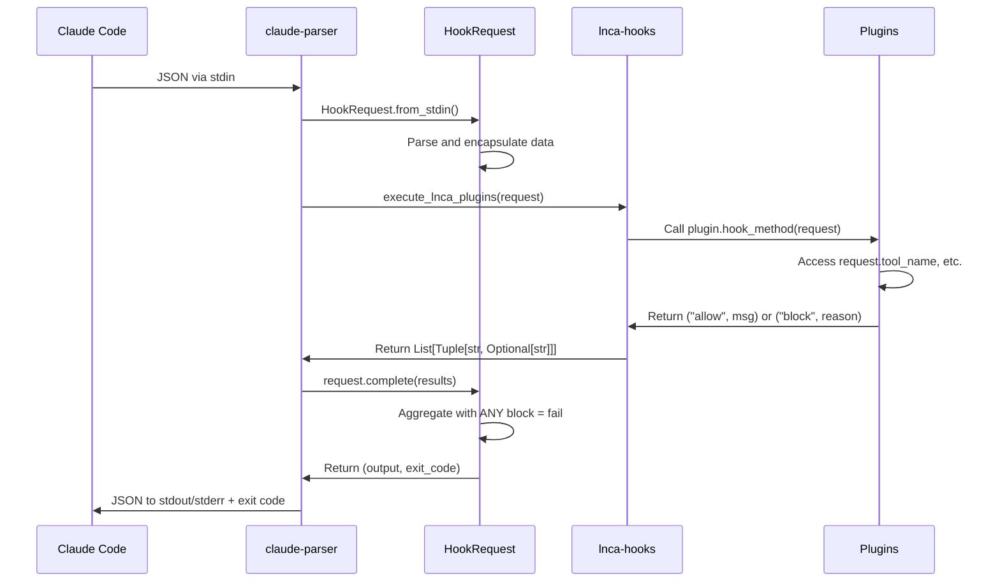

# HookRequest Architecture

## Overview
The HookRequest system provides a clean, LNCA-compliant interface between Claude Code hooks and plugin systems. It follows a clear separation of concerns between claude-parser (I/O orchestration) and lnca-hooks (plugin execution).

## Core Components

### 1. HookRequest Class (`request.py`)
**Purpose**: Clean data encapsulation for hook requests
**LOC**: 68 (✅ LNCA compliant)
**Pattern**: @UTIL_FIRST - Delegates to existing utils

**Key Features**:
- Parses stdin JSON from Claude Code hook events
- Encapsulates all hook data with direct attribute access
- Lazy-loads conversation when needed
- Handles result aggregation and response formatting

**Data Fields**:
```python
# Core fields (always present)
session_id: str
transcript_path: str
cwd: str
hook_event_name: str

# Tool-specific fields (PreToolUse/PostToolUse)
tool_name: Optional[str]
tool_input: Dict[str, Any]
tool_response: Optional[str]

# Other hook-specific fields
prompt: Optional[str]      # UserPromptSubmit
message: Optional[str]      # Various hooks
reason: Optional[str]       # Stop hook
source: Optional[str]       # SessionStart

# Lazy-loaded
conversation: Optional[RichSession]  # Via property
```

### 2. Aggregator (`aggregator.py`)
**Purpose**: Aggregate plugin results with "ANY block = fail" policy
**LOC**: 80 (✅ LNCA compliant)
**Pattern**: @NO_MANUAL_LOOPS - List comprehensions only

**Aggregation Policy**:
- ANY plugin blocks → whole operation fails (exit code 2)
- All plugins allow → success with optional context (exit code 0)
- No output needed → silent success (exit code 0)

**Response Formats by Hook Type**:
```python
# PreToolUse Block
{
    "hookSpecificOutput": {
        "hookEventName": "PreToolUse",
        "permissionDecision": "deny",
        "permissionDecisionReason": "Combined reasons from all blocking plugins"
    }
}

# PostToolUse/UserPromptSubmit/SessionStart Allow with Context
{
    "hookSpecificOutput": {
        "hookEventName": "PostToolUse",
        "additionalContext": "Combined context from all plugins"
    }
}

# Generic Block (Stop, etc.)
{
    "decision": "block",
    "reason": "Combined reasons"
}
```

### 3. Utils (`utils.py`)
**Purpose**: Minimal utilities for hook I/O
**LOC**: 46 (✅ LNCA compliant)
**Pattern**: @SINGLE_SOURCE_TRUTH - Only 2 utilities needed

**Functions**:
- `read_stdin()`: Parse JSON from stdin
- `write_output()`: Write response and exit with code

## Integration Flow



## Conversation Access

### Dict-based Architecture
The HookRequest provides access to conversation data as plain dicts, following @COMPOSITION pattern:

```python
@property
def conversation(self):
    """Returns dict with 'messages' key containing list of message dicts"""
    # Lazy-loads from transcript_path
    # Returns: {'messages': [...], 'session_id': ..., 'metadata': ...}

# Message dict structure:
{
    'type': 'assistant',  # or 'user', 'system'
    'content': '...',     # String or JSON array
    'tool_name': '...',   # For tool operations
    'is_meta': False,     # Meta messages
    'is_compact_summary': False,  # Summaries
    # ... other fields
}
```

### Using Message Utilities
For semantic access, use the message utilities from `claude_parser.messages.utils`:

```python
from claude_parser.messages.utils import get_text, is_tool_operation

# In your plugin:
messages = request.conversation.get('messages', [])
for msg in messages:
    text = get_text(msg)  # Extracts text from any format
    if not is_tool_operation(msg):
        # Process regular messages
```

## Plugin Development

### Writing a Plugin
Plugins receive the HookRequest object directly and return tuples:

```python
import pluggy

hookimpl = pluggy.HookimplMarker("lnca-hooks")

class MyPlugin:
    @hookimpl
    def pre_tool_use(self, request):
        # Direct attribute access on HookRequest
        if request.tool_name == "Write":
            file_path = request.tool_input.get("file_path", "")

            # Validation logic
            if self.should_block(file_path):
                return ("block", f"Cannot modify {file_path}")

            # Allow with optional context
            return ("allow", f"Allowing write to {file_path}")

        # No opinion - return None or ("allow", None)
        return ("allow", None)
```

### Available Hook Methods
- `session_start(request)` - Session initialization
- `user_prompt_submit(request)` - Before user prompt processing
- `pre_tool_use(request)` - Before tool execution
- `post_tool_use(request)` - After tool execution
- `stop(request)` - Stop hook for remote control

### Plugin Return Values
- `("allow", None)` - Allow without comment
- `("allow", "context message")` - Allow with additional context
- `("block", "reason")` - Block with reason
- `None` - No opinion (treated as allow)

## Architecture Patterns

### Clean Separation
**claude-parser** handles:
- Reading stdin JSON from Claude Code
- Creating HookRequest object
- Aggregating plugin results
- Formatting JSON responses per Anthropic spec
- Writing output with proper exit codes

**lnca-hooks** handles:
- Loading plugins via Pluggy
- Passing HookRequest to plugins
- Collecting tuple results
- No JSON formatting or I/O

### LNCA Compliance
- **@SINGLE_SOURCE_TRUTH**: One place for hook I/O and aggregation
- **@FRAMEWORK_FIRST**: 100% delegation to existing components
- **@LOC_ENFORCEMENT**: All files <80 LOC
- **@UTIL_FIRST**: Minimal utilities, maximum reuse
- **@NO_MANUAL_LOOPS**: List comprehensions only

## Migration from Old API

### Old API (deprecated)
```python
# Old: Dict-based with manual parsing
def pre_tool_use(self, input_data):
    tool_name = input_data.get("tool_name")
    cwd = input_data.get("cwd", ".")
```

### New API (HookRequest)
```python
# New: Direct attribute access
def pre_tool_use(self, request):
    tool_name = request.tool_name
    cwd = request.cwd  # Defaults handled by HookRequest
```

## Testing

Test with real JSONL data:
```python
from claude_parser.hooks import HookRequest

# Create mock request
data = {
    "hook_event_name": "PreToolUse",
    "tool_name": "Write",
    "tool_input": {"file_path": "test.py", "content": "..."},
    "session_id": "test-123",
    "transcript_path": "/path/to/transcript.jsonl",
    "cwd": "/project"
}

request = HookRequest(data)
assert request.tool_name == "Write"
assert request.tool_input["file_path"] == "test.py"

# Test aggregation
results = [("allow", "Check 1 passed"), ("block", "Check 2 failed")]
output, exit_code = request.complete(results)
assert exit_code == 2  # ANY block = fail
```

## Files to Remove (Legacy)
These files from the old hook system can be removed:
- `api.py` - Replaced by request.py + aggregator.py
- `handlers.py` - Logic moved to aggregator.py
- `models.py` - HookRequest is the only model needed
- `extraction.py` - Not needed with new API

The `app.py` CLI interface is kept for backward compatibility but is not used by lnca-hooks.

## Summary
The HookRequest architecture provides a clean, minimal interface for hook processing with clear separation of concerns. Plugins focus on business logic while claude-parser handles all I/O and aggregation. The "ANY block = fail" policy ensures conservative security while the tuple-based API keeps plugin development simple.