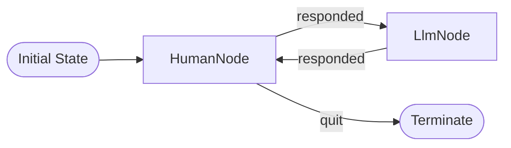

# Chat Example: Intelligent Entity Conversation

Demonstrates ClearFlow's power for modeling conversation as interaction between intelligent entities, a human and a language model, each with their own I/O capabilities and cognitive processes.

## Core Concept: Node == Intelligent Entity

Each node represents a **complete intelligent entity**:

- **HumanNode**: Human participant with console I/O and decision-making
- **LlmNode**: AI participant with API I/O and reasoning capabilities

This creates a natural conversation pattern between two intelligent entities.

## Flow



## Quick Start

```bash
# From project root directory

# 1. Set up your OpenAI API key
cp .env.example .env
# Edit .env and add your API key

# 2. Install dependencies
uv sync --all-extras

# 3. Run the example
cd examples/chat
python main.py  # If venv is activated
# Or: uv run python main.py
```

## How It Works

This example models conversation as interaction between two intelligent entities:

### HumanNode - Complete Human Intelligence

- **Input**: Gets console input from user
- **Output**: Displays AI responses on console
- **Cognition**: Decides whether to continue or quit
- **Memory**: Manages human messages in conversation history

### LlmNode - Complete AI Intelligence  

- **Input**: Receives human messages from state
- **Output**: Generates responses via OpenAI API
- **Cognition**: Reasons about context and generates appropriate responses
- **Memory**: Manages AI responses in conversation history

The flow alternates between these two entities, creating a natural conversational pattern where each participant is a complete intelligent system with its own interface modalities.

## Key Features

- **Intelligent entities**: Each node represents a complete intelligent participant
- **Complete I/O**: Every entity handles its own input and output capabilities
- **Natural conversation**: Two entities alternating in dialogue
- **Clean abstraction**: Intelligence units rather than operational steps
- **Extensible pattern**: Easy to add more intelligent entities (databases, tools, etc.)

## Files

- `main.py` - Entry point that starts the intelligent entity conversation
- `nodes.py` - HumanNode and LlmNode intelligent entity implementations
- `chat_flow.py` - Two-node conversational flow definition
