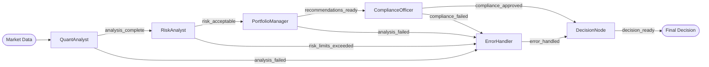

# Portfolio Analysis Example

Multi-specialist workflow for portfolio allocation decisions using simulated market data.

## Flow



## Quick Start

```bash
# From project root directory

# 1. Set up your OpenAI API key
cp .env.example .env
# Edit .env and add your API key

# 2. Install dependencies
uv sync --all-extras

# 3. Run the example
cd examples/portfolio_analysis
python main.py  # If venv is activated
# Or: uv run python main.py
```

## How It Works

This example demonstrates a sequential workflow where each specialist node analyzes market data and passes enriched state to the next stage:

1. **QuantAnalyst** - Technical analysis and opportunity identification
2. **RiskAnalyst** - Risk assessment and limit checking
3. **PortfolioManager** - Allocation recommendations
4. **ComplianceOfficer** - Regulatory validation
5. **DecisionNode** - Final synthesis and execution plan
6. **ErrorHandler** - Converts errors to conservative decisions

Each node uses DSPy for structured LLM outputs with Pydantic validation.

## Key Features

- **Sequential processing** - Each specialist processes in order
- **Type-safe transformations** - `MarketData → QuantInsights → RiskAssessment → Decision`
- **Error recovery** - Failures route to ErrorHandler then continue
- **Structured outputs** - DSPy signatures ensure consistent responses
- **Audit trail** - Complete reasoning chain for compliance

## Files

- `main.py` - Entry point with scenario selection
- `portfolio_flow.py` - Flow definition and routing
- `market_data.py` - Simulated market data generation
- `specialists/` - Individual specialist node implementations
- `shared/` - Common models and configuration
