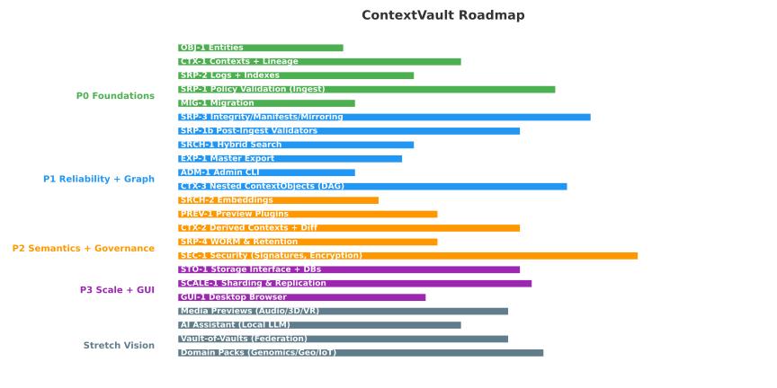

<p align="center">
  
</p>

<p align="center">
  
</p>

# 🌌 ContextVault

[](https://fastapi.tiangolo.com/)
[](https://www.python.org/)
[](LICENSE)

[](https://github.com/saisurya76/contextvault/actions/workflows/ci.yml)

**ContextVault** is a **local-first archival system** that turns any file or raw data (text/JSON) into **PNG images**.  
It provides **versioning, metadata, search, recovery, RBAC, audit logging, and retention** — all fully offline and now SaaS-ready.

---

## ✨ Features

- 🔄 **Create Contexts**
  - From files (`/create_context/`)
  - From raw text/JSON (`/create_context/` with `raw_data`)
- 🎨 **PNG Encoding** → Store data inside PNG snapshots
- 📂 **Collections & Categories** → Organize logically
- 🕒 **Snapshots & Versions** → Track history over time
- 🔍 **Search**
  - Keyword (filenames, metadata, raw text/JSON) ✅ **SQLite inverted index** (scales to 10k+ contexts)
  - Semantic (cosine TF-IDF) ✅ Stub in place (CPU-only, local JSON)
- 🧹 **Delete & Retention**
  - Hard delete / conditional delete / soft delete (tombstones)
  - Expiry metadata (`expires_at`) + scheduled cleanup
  - ✅ Audit log of deletes & retention runs
- 📦 **Compression Toggle** (ZIP stored vs DEFLATE)
- 🛡️ **100% Offline, Local-First** (no cloud, no GPU required)
- ⚡ **Indexing Enhancements**
  - Deterministic keyword & semantic search
  - JSON → SQLite migration script included
  - Health endpoint with **deep consistency check** (JSON vs SQLite)
- 🔑 **Enterprise Features**
  - RBAC roles + permission checks (JWT tokens, admin-only routes)
  - Retention policies with scheduler
  - ✅ Audit log (append-only, rotation + retention policies)
  - ✅ Admin-only endpoints for audit tail/export

---

## 📅 Project Status

- **v0.9 (Pilot Safe)** → ✅ Core serialization + APIs
- **v1.0.0 Candidate (Now)** → ✅ Search, RBAC, Audit, Retention, SaaS-readiness
- **v2.0 Candidate (Planned)** → ⚙️ Extended tests & compliance hardening
- **v2.0 Final** → 🎯 Production-ready release

For detailed requirement coverage, see [docs/requirements_status.md](docs/requirements_status.md).

---

## 🚀 Roadmap

Here’s the planned evolution of **ContextVault**:



- **P0 – Foundations** → Entities, Contexts + Lineage, Logs & Indexes, Policy Validation, Migration
- **P1 – Reliability + Graph** → Integrity Sweeps, Hybrid Search, DAG Linking, Master Export, Admin CLI
- **P2 – Governance + Compliance** → Embeddings, Previews, Retention, Security, ✅ Audit rotation/export
- **P3 – Scale + GUI** → Storage Interface, Sharding/Replication, Desktop Browser
- **Future Sprint** → Multimedia previews, Incremental versioning, Multi-tenant foundation, Audit UI

---

## 🚀 Quick Start

### 1. Install

```bash
git clone https://github.com/yourusername/contextvault.git
cd contextvault
pip install -r requirements.txt
```

Or install as a package:

```bash
pip install .
```

### 2. Run the API

```bash
uvicorn app.main:app --reload
```

Visit: 👉 [http://127.0.0.1:8000/docs](http://127.0.0.1:8000/docs)

---

## 🧩 Example Usage

### Create a Context from File

```bash
curl -X POST "http://127.0.0.1:8000/create_context/"   -F "upload=@myfile.pdf"   -F "compress=true"
```

### Create a Context from Raw JSON

```bash
curl -X POST "http://127.0.0.1:8000/create_context/"   -H "Content-Type: application/json"   -d '{"raw_data": "{ \"project\": \"ContextVault\", \"status\": \"active\" }"}'
```

### Decode a Context

```bash
curl -X POST "http://127.0.0.1:8000/decode_context_raw/"   -F "image=@data/ctx_abcd1234.png"
```

### Search Contexts (Keyword)

```bash
curl "http://127.0.0.1:8000/search_index?q=Alpha"
```

### Semantic Search (Stub)

```bash
curl "http://127.0.0.1:8000/search/semantic?q=project"
```

### Admin Audit Tail (RBAC protected)

```bash
curl -H "Authorization: Bearer <admin-token>"   "http://127.0.0.1:8000/admin/audit/tail?lines=50"
```

---

## 📂 Project Structure

```
app/
  api/               # FastAPI routes
  core/              # serializer, indexer, metadata, audit, retention, scheduler
  main.py            # FastAPI entrypoint
data/
  index/             # keyword/semantic indexes (JSON + SQLite)
  extractions/       # decoded files
  ctx_*.png          # encoded contexts
  audit/             # audit logs (rotated)
```

---

🟥 Red Line — What ContextVault Is Not

ContextVault solves a specific problem: a universal, portable, verifiable vault for small-to-medium mixed data.  
It is **not**:

- ❌ A Data Lake (not optimized for TB–PB scale analytics)
- ❌ A DAM/MAM (not Bynder/Adobe AEM)
- ❌ A Dropbox/Google Drive alternative (no real-time collaboration)
- ❌ A turnkey compliance platform — **but** it now has **audit + retention primitives**
- ❌ High-performance vector DB (designed CPU-only, offline)

---

## 🔬 Architecture


1. **Upload** file or raw text/JSON
2. **Serializer** → ZIP → PNG encoding
3. **Metadata** → record (hash, size, entry_type, collection, etc.)
4. **Indexer** → keyword (SQLite) + semantic embeddings
5. **Context Object** → logical view of collections/categories
6. **Search/Decode** → recover or query contexts
7. **Audit/Retention** → track all actions + auto-clean expired entries

---

## 💡 Use Case Examples

- **🔐 Personal Knowledge Archiving** → Save notes, PDFs, logs, retrieve with keyword search
- **🧠 AI Knowledge Index** → Archive raw text/JSON, index for offline retrieval
- **📊 Data Science & Research** → Archive CSV/JSON, keep provenance & reproducibility
- **🏦 Enterprise Compliance** → Archive sensitive files, audit logs, retention enforcement
- **🎨 Creative Projects** → Store drafts/snippets, search by tags/collections
- **🛰️ Field/Offline Environments** → Encode IoT/geo data, decode & search later

---

## 🔮 Roadmap

- [ ] GUI (Electron/Tkinter) for browsing snapshots
- [ ] Offline LLM-powered semantic search (replace stub with FAISS/Annoy)
- [ ] Batch upload → single snapshot
- [ ] Multimedia previews (audio/video thumbnails) ⚙️ _Future sprint_
- [ ] Master archive export
- [ ] Multi-tenant foundation ⚙️ _Future sprint_

---

## 🛠️ Development

### Run tests

```bash
pytest
```

### Dev server

```bash
uvicorn app.main:app --reload --port 9000
```

### Code style

```bash
black app
isort app
```

---

## 🤝 Contributing

1. Fork the repo
2. Create a feature branch (`git checkout -b feat/my-feature`)
3. Commit (`git commit -m "Add new feature"`)
4. Push (`git push origin feat/my-feature`)
5. Open a Pull Request 🚀

---

## ⚖️ License

MIT © 2024 [Suryanarayana Bollapragada]
