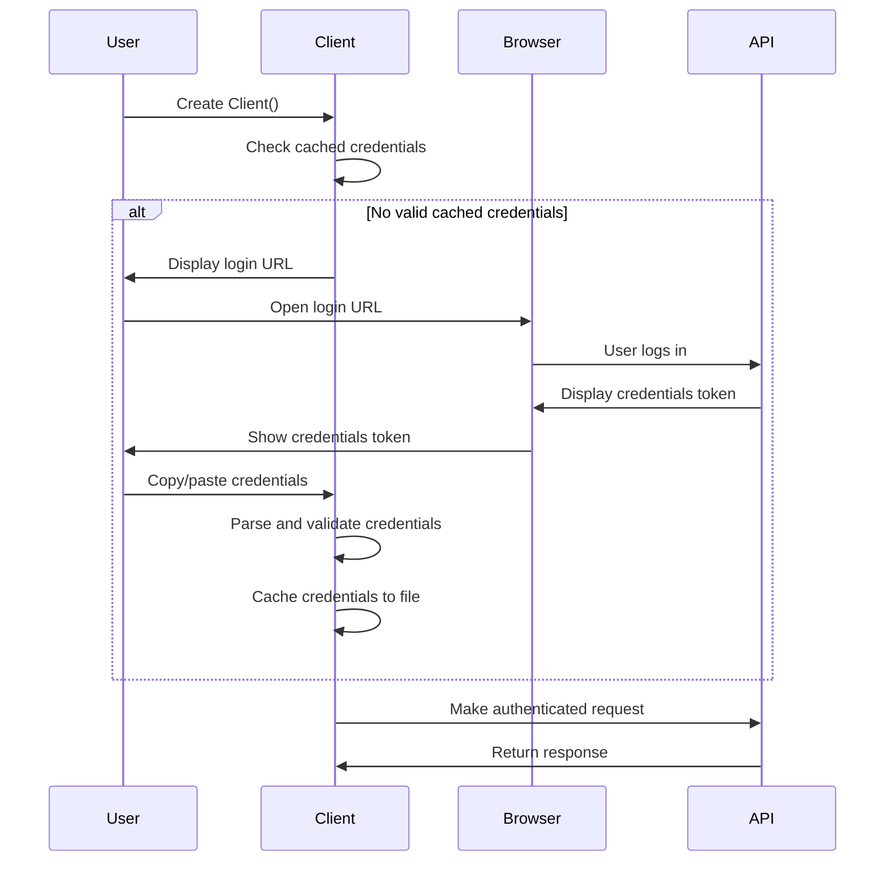
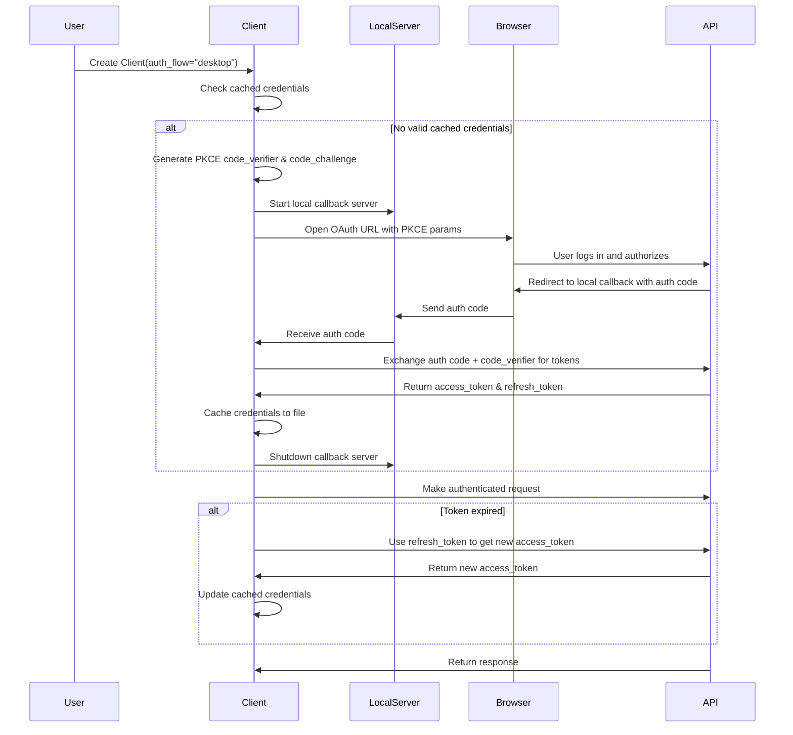

# Contributing

This document describes how to set up a development environment for this project, modify
and test the code, and deploy a new version.

<details>

<summary>Table of Contents</summary>

[Project structure](#project-structure)

[Configuration](#configuration)

[Tests](#tests)
- [Running Tests](#running-tests)
- [Authentication Flow Testing](#authentication-flow-testing)
- [Linting and Formatting](#linting-and-formatting)
- [Environment Variables for Testing](#environment-variables-for-testing)

[Deployment](#deployment)

</details>

## Project structure

The business logic for this package is located
in [`src/hakai_api/client.py`](src/hakai_api/client.py).
All tests are located in the `tests/` directory.

Key components:
- `client.py` - Main OAuth2Session client with authentication flows
- `auth/` - Authentication strategies (web and desktop flows)
- `tests/` - Comprehensive test suite including authentication flow tests

## Configuration

### uv

This project uses [uv](https://github.com/astral-sh/uv) for dependency management and
package installation. Install `uv` using the instructions on their website before continuing.

To set up an environment for development, clone this repository and run the following
commands from the root directory of the repository:

```bash
# Install the package and its dependencies (uv handles virtual environment automatically)
uv sync
```

### Pre-commit

This project uses [pre-commit](https://pre-commit.com/) to run lint checks and tests
before every commit. To install the pre-commit hooks, run the following command from the
root directory of the repository while the virtual environment is active:

```bash
pre-commit install
```

This is highly recommended and will prevent failed builds on GitHub Actions, as well as
ensure consistent code style and quality.

You can also run the pre-commit hooks manually on all files by running:

```bash
pre-commit run -a
```

## Tests

Tests and lint checks are automatically run on pull requests and pushes to the main
branch using GitHub Actions.

### Running Tests

To run the tests locally:

```bash
# Run all tests
pytest

# Run a specific test file
pytest tests/test_client.py

# Run a specific test function
pytest tests/test_client.py::test_get_valid_credentials_from_file

# Run tests with verbose output
pytest -v
```

### Authentication Flow Testing

The project includes comprehensive tests for both authentication flows:

- **Web flow tests**: Test credential parsing, file operations, and web-based authentication
- **Desktop flow tests**: Test OAuth2 with PKCE flow, token refresh, and callback handling
- **Mock tests**: Most tests use mocked authentication to avoid requiring real credentials

When adding new authentication features, ensure you add appropriate tests for both flows.

#### Web Authentication Flow

The web flow requires users to manually copy credentials from a browser:



#### Desktop Authentication Flow (OAuth2 with PKCE)

The desktop flow uses OAuth2 with PKCE for more secure authentication:



### Linting and Formatting

To run lint checks locally:

```bash
ruff check .
```

To automatically fix linting issues:

```bash
ruff check --fix .
```

To automatically format the code:

```bash
ruff format .
```

### Environment Variables for Testing

Some tests may require environment variables:

```bash
# Optional: Set custom user agent for testing
export HAKAI_API_USER_AGENT="test-client/1.0"

# Optional: Set custom credentials file location
export HAKAI_API_CREDENTIALS="/tmp/test-credentials"
```

## Deployment

To build and deploy a new PyPi package version, push a tag matching the
pattern `v[0-9]+.[0-9]+.[0-9]+` or `v[0-9]+.[0-9]+.[0-9]+rc[0-9]+` (e.g. `v0.4.1`
or `v0.5.2rc1`) to GitHub. GitHub Actions will take care of packaging and pushing it
to Hakai's PyPi repository from there.
