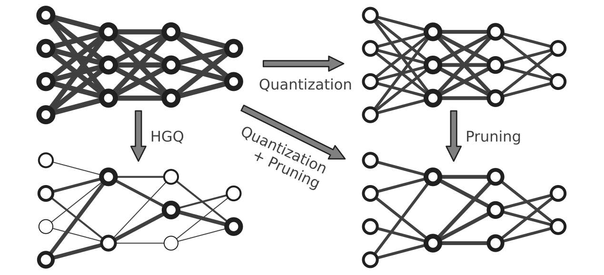

.. High Granularity Quantization documentation master file, created by
   sphinx-quickstart on Sat Nov 25 16:28:11 2023.
   You can adapt this file completely to your liking, but it should at least
   contain the root `toctree` directive.

===============================
High Granularity Quantization 2
===============================

.. image:: https://img.shields.io/badge/License-LGPLv3-blue.svg
   :target: https://www.gnu.org/licenses/lgpl-3.0.en.html
.. image:: https://github.com/calad0i/HGQ2/actions/workflows/sphinx-build.yml/badge.svg
   :target: https://calad0i.github.io/HGQ2/

HGQ2 (High Granularity Quantization 2) is a quantization-aware training framework built on Keras v3, targeting real-time deep learning applications on edge devices like FPGAs. It provides a comprehensive set of tools for creating and training quantized neural networks with minimal effort.

HGQ2 implements an gradient-based automatic bitwidth optimization and quantization-aware training algorithm. By laveraging gradients, it allows for bitwidth optimization at arbitrary granularity, up to per-weight and per-activation level.

.. rst-class:: light

Key Features
-----------

- **Multi-backend support**: Works with TensorFlow, JAX, and PyTorch through Keras v3
- **Flexible quantization**: Supports different quantization schemes including fixed-point and minifloat
- **Hardware synthesis**: Direct integration with hls4ml for FPGA deployment
- **Trainable quantization parameters**: Optimize bitwidths through gradient-based methods
- **Effective Bit-Operations (EBOP)**: Accurate resource estimation during training for the deployed firmware
- **Advanced layer support**: HGQ2 supports advanced layers like einsum, einsum dense, and multi-head attention layers with quantization and hardware synthesis support

.. code-block:: python
   :caption: Simple example

   import keras
   from hgq.layers import QDense, QConv2D
   from hgq.config import LayerConfigScope, QuantizerConfigScope

   # Setup quantization configuration
   # These values are the defaults, just for demonstration purposes here
   with (
      # Configuration scope for setting the default quantization type and overflow mode
      # The second configuration scope overrides the first one for the 'datalane' place
      QuantizerConfigScope(place='all', default_q_type='kbi', overflow_mode='SAT_SYM'),
      # Configuration scope for enabling EBOPs and setting the beta0 value
      QuantizerConfigScope(place='datalane', default_q_type='kif', overflow_mode='WRAP'),
      LayerConfigScope(enable_ebops=True, beta0=1e-5),
   ):
      model = keras.Sequential([
         QConv2D(32, (3, 3), activation='relu'),
         keras.layers.MaxPooling2D((2, 2)),
         keras.layers.Flatten(),
         QDense(10)
      ])

Index
=================

.. toctree::
   :maxdepth: 2
   :caption: Contents:

   status.md
   install.md
   getting_started.md
   qkeras.md
   faq.md

.. toctree::
   :maxdepth: 3
   :caption: API Reference:

   autodoc/hgq
   autodoc/hgq.config
   autodoc/hgq.constraints
   autodoc/hgq.layers
   autodoc/hgq.quantizer
   autodoc/hgq.regularizers
   autodoc/hgq.utils
   autodoc/qkeras

Indices and tables
==================

* :ref:`genindex`
* :ref:`modindex`
* :ref:`search`
