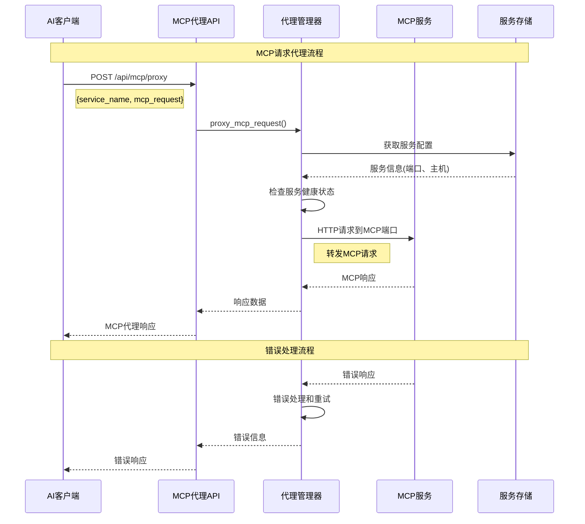

# MCP 代理架构设计

## 🎯 设计目标

提供一个 API，让 AI 可以根据 MCP 服务名将 MCP 请求代理到对应的 MCP 端口，实现统一的 MCP 服务访问接口。

## 🏗️ 架构概览

```
┌─────────────────────────────────────────────────────────────────────────────────┐
│                              AI 客户端                                          │
│  ┌─────────────┐  ┌─────────────┐  ┌─────────────┐  ┌─────────────┐            │
│  │   AI应用    │  │   AI模型    │  │   AI工具    │  │   其他AI    │            │
│  │             │  │             │  │             │  │   客户端    │            │
│  └─────────────┘  └─────────────┘  └─────────────┘  └─────────────┘            │
└─────────────────────────────────────────────────────────────────────────────────┘
                                   │
                                   ▼ MCP 请求
┌─────────────────────────────────────────────────────────────────────────────────┐
│                          MCP Minder 代理层                                      │
│  ┌─────────────────────────────────────────────────────────────────────────┐    │
│  │                    MCP 代理 API                                        │    │
│  │  ┌─────────────┐  ┌─────────────┐  ┌─────────────┐  ┌─────────────┐    │    │
│  │  │ 请求路由    │  │ 协议解析    │  │ 连接管理    │  │ 错误处理    │    │    │
│  │  │ 服务发现    │  │ 数据转换    │  │ 健康检查    │  │ 日志记录    │    │    │
│  │  └─────────────┘  └─────────────┘  └─────────────┘  └─────────────┘    │    │
│  └─────────────────────────────────────────────────────────────────────────┘    │
└─────────────────────────────────────────────────────────────────────────────────┘
                                   │
                                   ▼ 转发请求
┌─────────────────────────────────────────────────────────────────────────────────┐
│                            MCP 服务层                                           │
│  ┌─────────────┐  ┌─────────────┐  ┌─────────────┐  ┌─────────────┐            │
│  │ 天气查询    │  │ 文件管理    │  │ 数据库查询  │  │ 其他MCP服务 │            │
│  │ 服务        │  │ 服务        │  │ 服务        │  │             │            │
│  │ :8001       │  │ :8002       │  │ :8003       │  │ :8004       │            │
│  └─────────────┘  └─────────────┘  └─────────────┘  └─────────────┘            │
└─────────────────────────────────────────────────────────────────────────────────┘
```

## 🔄 数据流架构



## 🧩 核心组件

### 1. MCPProxy 类
- **职责**: 核心代理逻辑
- **功能**:
  - 服务配置管理
  - 连接池管理
  - 请求代理
  - 健康检查
  - 错误处理

### 2. MCPProxyManager 类
- **职责**: 代理管理器
- **功能**:
  - 代理请求调度
  - 服务列表管理
  - 健康状态监控
  - 资源清理

### 3. API 端点
- **职责**: HTTP 接口
- **功能**:
  - `/api/mcp/proxy` - 代理请求
  - `/api/mcp/services` - 服务列表
  - `/api/mcp/health` - 健康检查

## 📊 请求/响应模型

### MCP 代理请求
```json
{
  "service_name": "天气查询啊",
  "mcp_request": {
    "jsonrpc": "2.0",
    "id": 1,
    "method": "tools/call",
    "params": {
      "name": "get_weather",
      "arguments": {
        "city": "北京"
      }
    }
  }
}
```

### MCP 代理响应
```json
{
  "success": true,
  "service_name": "天气查询啊",
  "response": {
    "jsonrpc": "2.0",
    "id": 1,
    "result": {
      "content": "北京今天晴天，温度25°C"
    }
  },
  "timestamp": "2025-01-12T15:30:00.000Z"
}
```

## 🔧 技术实现

### 连接管理
```python
class MCPProxy:
    def __init__(self, service_manager):
        self.connection_pool: Dict[str, httpx.AsyncClient] = {}
    
    async def _get_connection(self, config: MCPProxyConfig):
        connection_key = f"{config.host}:{config.port}"
        if connection_key not in self.connection_pool:
            self.connection_pool[connection_key] = httpx.AsyncClient(
                base_url=f"http://{config.host}:{config.port}",
                timeout=config.timeout
            )
        return self.connection_pool[connection_key]
```

### 请求代理
```python
async def proxy_request(self, service_name: str, mcp_request: Dict[str, Any]):
    config = await self.get_service_config(service_name)
    connection = await self._get_connection(config)
    
    response = await connection.post("/mcp", json=mcp_request)
    return response.json()
```

### 健康检查
```python
async def _check_service_health(self, config: MCPProxyConfig):
    try:
        connection = await self._get_connection(config)
        response = await connection.get("/health", timeout=5)
        return response.status_code == 200
    except Exception:
        return False
```

## 🚀 使用示例

### 异步使用
```python
import asyncio
from minder.client import McpMinder

async def main():
    minder = McpMinder.get_service("http://localhost:8000", "天气查询啊")
    
    # 获取可用服务
    services = await minder.list_mcp_services()
    
    # 代理请求
    mcp_request = {
        "jsonrpc": "2.0",
        "id": 1,
        "method": "tools/call",
        "params": {"name": "get_weather", "arguments": {"city": "北京"}}
    }
    
    response = await minder.proxy_mcp_request("天气查询啊", mcp_request)
    print(response)

asyncio.run(main())
```

### 同步使用
```python
from minder.client import McpMinder

minder = McpMinder.get_service("http://localhost:8000", "天气查询啊")

# 同步代理请求
response = minder.proxy_mcp_request_sync("天气查询啊", mcp_request)
print(response)
```

## 🔒 安全考虑

### 1. 输入验证
- MCP 请求格式验证
- 服务名白名单检查
- 参数类型验证

### 2. 连接安全
- 本地连接限制
- 超时控制
- 连接池管理

### 3. 错误处理
- 异常捕获
- 错误信息过滤
- 日志记录

## 📈 性能优化

### 1. 连接池
- HTTP 连接复用
- 连接生命周期管理
- 连接数限制

### 2. 缓存策略
- 服务配置缓存
- 健康状态缓存
- 响应缓存

### 3. 并发处理
- 异步请求处理
- 并发连接限制
- 请求队列管理

## 🔍 监控和调试

### 1. 日志记录
- 请求/响应日志
- 错误日志
- 性能指标

### 2. 健康监控
- 服务状态检查
- 连接状态监控
- 性能指标收集

### 3. 调试工具
- 请求追踪
- 错误诊断
- 性能分析

## 🎯 扩展性

### 1. 协议支持
- MCP 协议版本支持
- 自定义协议扩展
- 协议转换

### 2. 服务发现
- 动态服务发现
- 负载均衡
- 故障转移

### 3. 插件系统
- 自定义代理逻辑
- 中间件支持
- 扩展点定义
