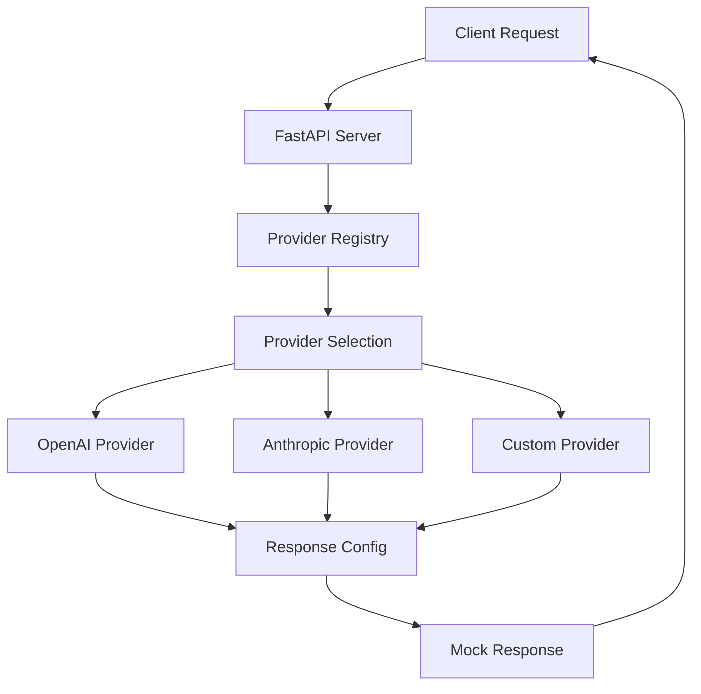

# MockLLM Documentation

<div align="center">
  
  <h3>Extensible Mock Server for LLM API Testing</h3>

  [](https://opensource.org/licenses/Apache-2.0)
  [](https://pypi.org/project/mockllm/)
  [](https://discord.gg/pPcjYzGvbS)
</div>

## Welcome to MockLLM

MockLLM is a powerful mock server that simulates Large Language Model (LLM) APIs for testing, development, and demonstration purposes. Instead of calling expensive LLM services, MockLLM provides deterministic, configurable responses that mimic the behavior of popular LLM providers.

## ✨ Key Features

### 🔌 **Extensible Provider Architecture**
- **Plugin-based system** - Add new providers without modifying core code
- **Self-registering providers** - Use simple decorators to register new providers
- **Dynamic endpoint creation** - Routes are automatically generated from provider metadata
- **Zero configuration** - Providers work out of the box with sensible defaults

### 🚀 **Built-in Provider Support**
- **OpenAI Compatible** - Full support for Chat Completions API
- **Anthropic Compatible** - Full support for Messages API
- **Custom Providers** - Easy framework for adding your own providers
- **Streaming Support** - Character-by-character streaming responses
- **Model Management** - Centralized model registry with aliasing

### ⚙️ **Developer-Friendly**
- **Hot Reloading** - Automatic configuration updates without restart
- **Type Safety** - Full type hints and mypy coverage
- **Comprehensive Testing** - Well-tested with pytest
- **Clean Architecture** - Separation of concerns with clear interfaces
- **API Introspection** - Runtime discovery of providers and models

### 🎯 **Perfect for Testing**
- **Deterministic Responses** - Predictable outputs for reliable tests
- **Response Configuration** - YAML-based response mapping
- **Network Lag Simulation** - Realistic latency for integration testing
- **Multiple Response Formats** - Support for various API formats

## Quick Example

```python
# Install MockLLM
pip install mockllm

# Create a responses file
cat > responses.yml << EOF
responses:
  "What is the capital of France?": "Paris is the capital of France."
  "default": "This is a mock response."
EOF

# Start the server
mockllm start --responses responses.yml

# Test with curl
curl -X POST http://localhost:8000/v1/chat/completions \
  -H "Content-Type: application/json" \
  -d '{
    "model": "gpt-3.5-turbo",
    "messages": [{"role": "user", "content": "What is the capital of France?"}]
  }' | jq
{
  "id": "mock-41c551b6-148f-49a2-abca-f990c1a9cfab",
  "object": "chat.completion",
  "created": 1758199276,
  "model": "gpt-3.5-turbo",
  "choices": [
    {
      "index": 0,
      "message": {
        "role": "assistant",
        "content": "15+15 equals 42."
      },
      "finish_reason": "stop"
    }
  ],
  "usage": {
    "prompt_tokens": 18,
    "completion_tokens": 7,
    "total_tokens": 25
  }
}
```

## Creating a Custom Provider

With MockLLM's extensible architecture, adding a new provider is very simple:

```python
from mockllm.providers.base import LLMProvider
from mockllm.registry import register_provider

@register_provider(
    name="mycompany",
    version="1.0.0",
    description="MyCompany LLM Provider",
    endpoints=[{"path": "/v1/mycompany/chat", "method": "POST"}],
    supported_models=["mycompany-model-1", "mycompany-model-2"]
)
class MyCompanyProvider(LLMProvider):
    async def handle_chat_completion(self, request):
        prompt = self.extract_prompt(request)
        response = self.get_response_for_prompt(prompt)
        return {"response": response}
```

That's it! No server configuration, no manual registration, no boilerplate. Your provider is automatically discovered and its endpoints are created.

## Architecture Overview

MockLLM uses a **plugin-based architecture** that makes it incredibly easy to extend:



## Why MockLLM?

- **💰 Cost Savings** - No API charges during development and testing
- **⚡ Fast Iteration** - Instant responses without network latency
- **🔒 Privacy** - Keep sensitive data local during development
- **🎯 Predictable Testing** - Deterministic responses for reliable tests
- **🔧 Easy Integration** - Drop-in replacement for LLM APIs
- **🚀 Extensible** - Add new providers in minutes, not hours

## Getting Started

Ready to start using MockLLM? Check out our guides:

- [📦 Installation Guide](getting-started/installation.md) - Get MockLLM up and running
- [🚀 Quick Start](getting-started/quick-start.md) - Your first mock LLM server
- [🔧 Configuration](configuration/responses.md) - Set up response mappings
- [🏗️ Provider Development](providers/creating-providers.md) - Create custom providers

## Community

Join our community to get help, share ideas, and contribute:

- [GitHub Discussions](https://github.com/lukehinds/mockllm/discussions)
- [Discord Server](https://discord.gg/pPcjYzGvbS)
- [Issue Tracker](https://github.com/lukehinds/mockllm/issues)

## License

MockLLM is licensed under the [Apache 2.0 License](https://github.com/lukehinds/mockllm/blob/main/LICENSE).