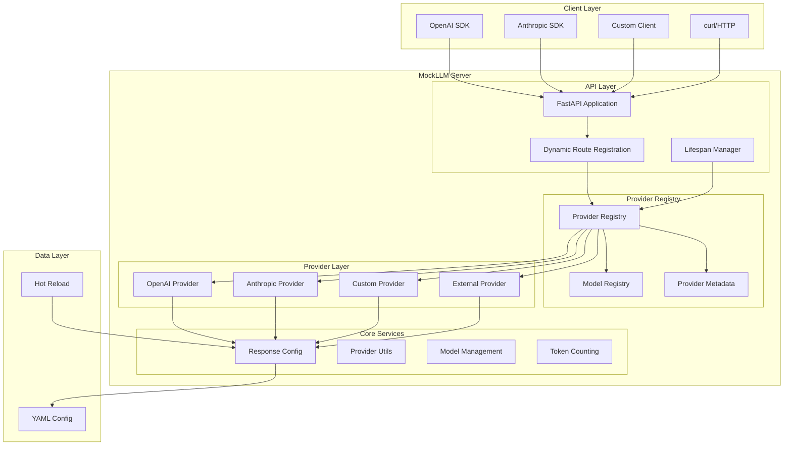
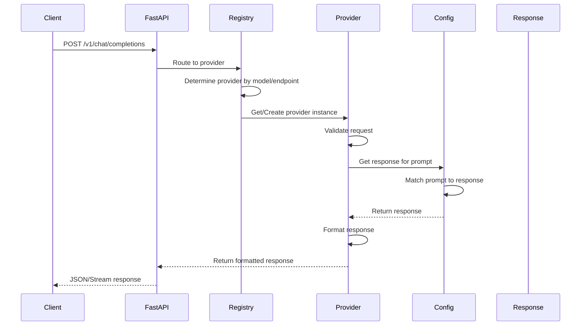
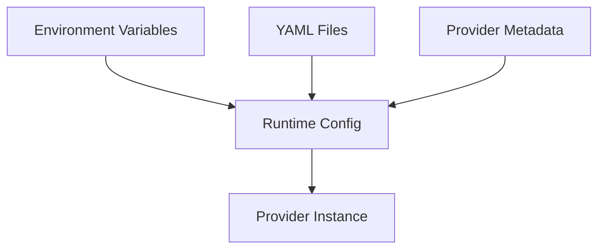

# Architecture Overview

MockLLM uses a modern, extensible plugin-based architecture that makes it easy to add new LLM providers and features without modifying core code.

## System Architecture



## Core Components

### 1. Provider Registry (`registry.py`)

The heart of the extensibility system. It manages provider discovery, registration, and lifecycle.

```python
class ProviderRegistry:
    """Singleton registry for provider management."""

    def register(name: str, metadata: ProviderMetadata):
        """Register a provider with its metadata."""

    def get_provider(name: str, config: Any) -> LLMProvider:
        """Get or create a provider instance."""

    def get_all_endpoints() -> Dict[str, List[EndpointInfo]]:
        """Get all registered endpoints."""
```

**Key Features:**
- Singleton pattern for global access
- Automatic provider discovery
- Lazy initialization of provider instances
- Metadata-driven configuration

### 2. Provider Base Class (`providers/base.py`)

Abstract base class that all providers inherit from:

```python
class LLMProvider(ABC):
    """Base class for all LLM providers."""

    @abstractmethod
    async def handle_chat_completion(request) -> Response:
        """Handle chat completion requests."""

    def get_metadata() -> Dict:
        """Return provider metadata."""

    def get_capabilities() -> Dict[str, bool]:
        """Return provider capabilities."""

    def validate_request(request) -> Optional[str]:
        """Validate incoming requests."""
```

**Key Features:**
- Common interface for all providers
- Built-in utilities and helpers
- Extensible through inheritance
- Type-safe with proper annotations

### 3. Model Registry (`model_registry.py`)

Centralized model management system:

```python
class ModelRegistry:
    """Manages model information and routing."""

    def register_model(model_info: ModelInfo):
        """Register a model with its capabilities."""

    def get_provider_for_model(model: str) -> str:
        """Determine provider based on model name."""

    def validate_model_request(model: str, params: Dict):
        """Validate model parameters."""
```

**Key Features:**
- Model aliasing support
- Provider routing based on models
- Capability validation
- Context window limits

### 4. Dynamic Server (`server.py`)

The FastAPI application with dynamic route generation:

```python
@asynccontextmanager
async def lifespan(app: FastAPI):
    """Application lifecycle management."""
    # Startup
    load_providers()
    setup_dynamic_routes()
    yield
    # Shutdown

def setup_dynamic_routes():
    """Create routes from provider metadata."""
    for path, providers in endpoints.items():
        create_route(path, providers)
```

**Key Features:**
- Automatic route creation
- Provider hot-loading
- Conflict resolution
- API introspection endpoints

## Request Flow

Here's how a request flows through the system:



## Provider Registration Flow

When a provider is registered:

```mermaid
flowchart LR
    A[Provider Module] --> B[@register_provider Decorator]
    B --> C[Extract Metadata]
    C --> D[Register in ProviderRegistry]
    D --> E[Store Provider Class]
    D --> F[Store Metadata]
    D --> G[Map Endpoints]
    G --> H[Dynamic Routes Created]
```

## Key Design Patterns

### 1. Plugin Architecture

Providers are self-contained plugins that register themselves:

```python
@register_provider(name="custom", ...)
class CustomProvider(LLMProvider):
    # Self-contained implementation
```

**Benefits:**
- No central configuration needed
- Providers can be in separate packages
- Easy to add/remove providers
- Clear separation of concerns

### 2. Dependency Injection

Providers receive configuration through injection:

```python
class Provider(LLMProvider):
    def __init__(self, config: ResponseConfig):
        self.config = config  # Injected dependency
```

**Benefits:**
- Loose coupling
- Easy testing
- Configuration flexibility
- Runtime configuration changes

### 3. Registry Pattern

Central registries manage providers and models:

```python
provider = ProviderRegistry.get_provider("openai", config)
model_info = ModelRegistry.get_model("gpt-4")
```

**Benefits:**
- Centralized management
- Lazy loading
- Singleton access
- Easy discovery

### 4. Template Method Pattern

Base class defines structure, providers implement details:

```python
class LLMProvider:
    def get_response(self, prompt):
        # Template method
        validated = self.validate_request(prompt)
        if validated:
            return self.handle_request(prompt)
```

**Benefits:**
- Consistent behavior
- Reusable logic
- Extensible framework
- Clear contracts

## Extension Points

The architecture provides several extension points:

### 1. Custom Providers

Add new LLM providers by implementing `LLMProvider`:

```python
class NewProvider(LLMProvider):
    async def handle_chat_completion(self, request):
        # Custom implementation
```

### 2. Custom Endpoints

Define new API endpoints in provider metadata:

```python
endpoints=[
    {"path": "/v1/custom/translate", "method": "POST"},
    {"path": "/v1/custom/summarize", "method": "POST"}
]
```

### 3. Custom Response Formats

Implement custom streaming or response formats:

```python
async def generate_stream_response(self, content, model):
    yield '{"custom": "format"}\n'
```

### 4. Custom Validators

Add request validation logic:

```python
def validate_request(self, request):
    if request.get("custom_field") is None:
        return "custom_field is required"
```

## Configuration Management

MockLLM uses a layered configuration approach:



### Configuration Layers

1. **Environment Variables** - System-level settings
2. **YAML Configuration** - Response mappings and settings
3. **Provider Metadata** - Provider-specific configuration
4. **Runtime Configuration** - Dynamic updates

## Performance Considerations

### 1. Lazy Loading

Providers are instantiated only when needed:

```python
def get_provider(name: str, config: Any):
    if name not in self._initialized:
        self._initialized[name] = Provider(config)
    return self._initialized[name]
```

### 2. Singleton Registries

Registries use singleton pattern to avoid duplication:

```python
class Registry:
    _instance = None
    def __new__(cls):
        if not cls._instance:
            cls._instance = super().__new__(cls)
        return cls._instance
```

### 3. Async/Await

All I/O operations use async/await for better concurrency:

```python
async def handle_request(request):
    response = await generate_response(request)
    return response
```

## Security Considerations

### 1. Input Validation

All requests are validated before processing:

```python
error = provider.validate_request(request)
if error:
    raise HTTPException(400, error)
```

### 2. Type Safety

Strong typing throughout the codebase:

```python
def handle(request: ChatRequest) -> ChatResponse:
    # Type-checked at runtime with Pydantic
```

### 3. Isolated Providers

Providers are isolated from each other:

```python
# Each provider has its own instance
provider1 = registry.get_provider("openai")
provider2 = registry.get_provider("anthropic")
```

## Future Extensibility

The architecture supports future extensions:

- **Middleware Support** - Add request/response middleware
- **Authentication** - Provider-specific authentication
- **Rate Limiting** - Per-provider rate limits
- **Metrics Collection** - Provider usage metrics
- **Plugin Discovery** - Automatic plugin discovery from packages
- **WebSocket Support** - Real-time streaming connections

## Next Steps

- [Creating Providers](creating-providers.md) - Build your first provider
- [Provider Registry](registry.md) - Deep dive into the registry
- [Model Registry](models.md) - Understand model management
- [Built-in Providers](built-in.md) - Explore existing providers