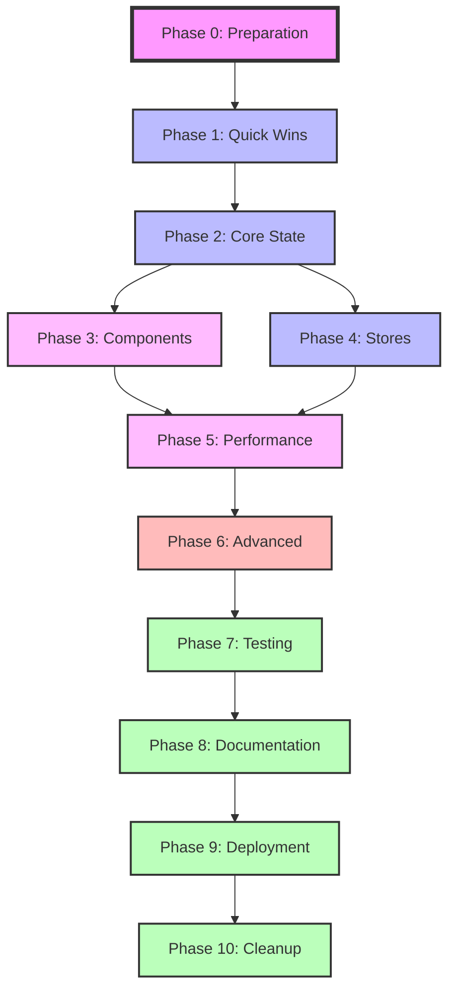
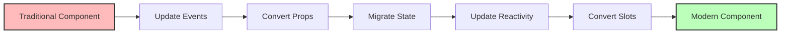
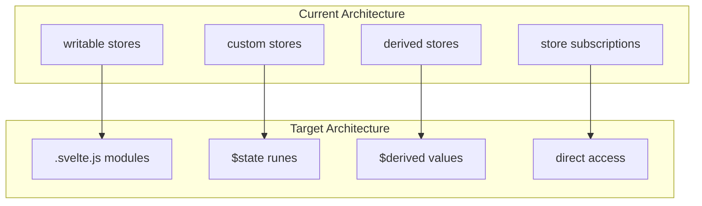
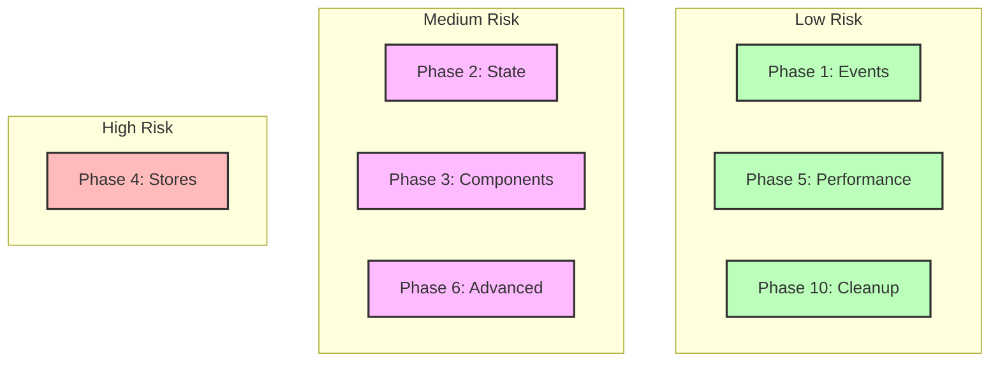
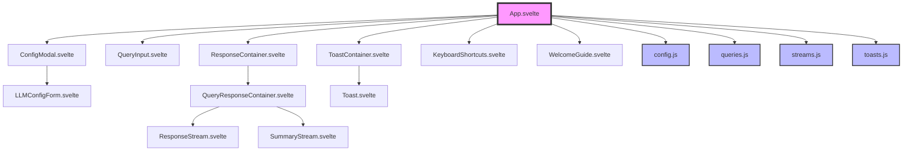
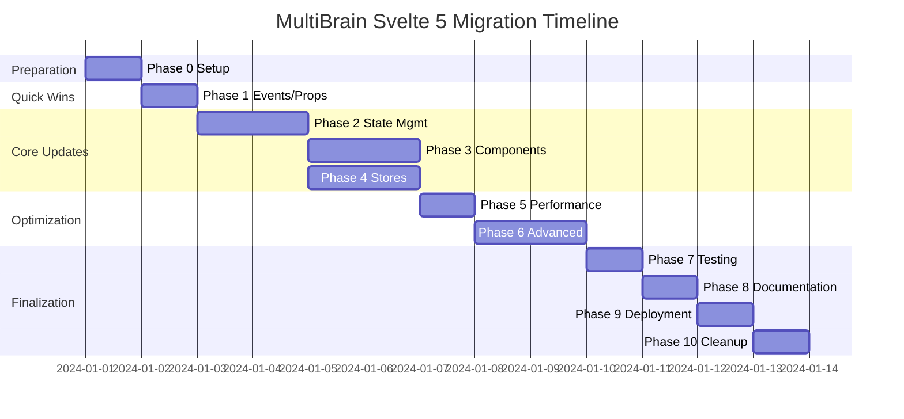

# MultiBrain Svelte 5 Migration Flow

## Migration Phases Overview



## Component Migration Flow



## Store Migration Architecture



## Risk Assessment Matrix



## Component Dependency Graph



## Migration Timeline



## State Management Evolution

```mermaid
graph LR
    subgraph "Svelte 4 Pattern"
        A[export let prop]
        B[let state = value]
        C[$: computed = ...]
        D[on:event]
        E[createEventDispatcher]
    end
    
    subgraph "Svelte 5 Pattern"
        F[let prop = $props]
        G[let state = $state]
        H[let computed = $derived]
        I[onevent callback]
        J[callback props]
    end
    
    A --> F
    B --> G
    C --> H
    D --> I
    E --> J