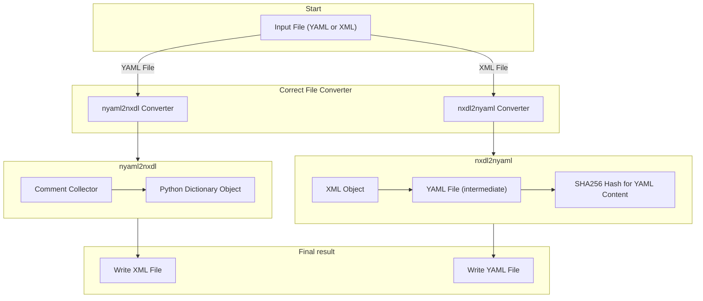

# nyaml Workflow
`nyaml` implements a specific workflow for converting NeXus application definition and base class between XML and YAML formats and vice-versa. The `nyaml` converter checks for the correct file type and calls the appropriate converter following a certain workflow (depicted in the workflow diagram below).

Conversion from YAML to XML follows specific workflow steps (depicted in workflow diagram below) according to NXDL rules and syntax specific to the YAML format. Starting from a given input YAML file (see workflow diagram below), the workflow performs the following steps:

1. The `nyaml` invokes `nyaml2nxdl` converter which collects the input `.yaml` file.

2. Using [PyYAML](https://github.com/yaml/pyyaml), the converter collects and tracks comments in the YAML file.

3. The converter parses the YAML file into a nested hashed map—a Python dictionary object.

4. The converter writes the hashed map and comments into an output XML file in accordance with NXDL concepts.


The conversion algorithm interprets the specific keywords and syntactic rules to transcode the NXDL from YAML into XML. Leveraging the NXDL rules, the conversion process detects possible inconsistencies in the YAML content and raises errors or warnings if the rules are not properly followed.


The XML to YAML conversion also follows a well-defined data workflow (depicted in workflow diagram below) that converts a given input XML file into a YAML file. The workflow begins with the XML input and proceeds as follows:


1. The `nyaml` calls `nxdl2nyaml` converter that takes over the `.nxdl.xml` file.

2. Using [lxml](https://lxml.de/), the converter parses the XML file and builds an XML tree structure.

3. Applying YAML-specific keywords and formatting rules, the converter generates a YAML file from the XML tree.

4. The converter computes a SHA256 hash of the generated YAML content.

5. The converter writes the YAML file and appends both the hash and the original XML content as comments at the end of the YAML file.


By attaching the hash and the original XML content to the YAML output (.yaml file), the tool enables lossless round-trip conversions — provided the YAML content remains unchanged. That is, if the YAML content is not modified, converting back from YAML to XML, the original commented XML content will be written back to the XML file without any modification. However, if the YAML content is modified, the XML tree will be reconstructed from the YAML content and written to the XML file, which will differ from the original XML content included in the comments. This caching approach streamlines the XML → YAML → XML workflow and facilitates straightforward comparisons of XML files in version control systems such as Git.

Like every scientific software, the `nyaml` tool also follows a specific workflow.



## Conversion from YAML to XML and vice versa
Presented below is a concise and trimmed example of the `NXmpes` application definition (for discussion purpose) in YAML format, alongside its corresponding encoding into XML format, as illustrated below. Subsequently, the fundamental rules governing this conversion process are elucidated. For a comprehensive understanding of the basic structure of NXDL, readers are encouraged to explore the [NeXus Manual](https://manual.nexusformat.org/user_manual.html).

!!! note
    For in detailed explanation with examples please follow the [Tutorials for writing NeXus definition in YAML](../tutorials/tutorials.md).
!!! note
    The application definition, we are using here, is an old and trimmed version of `NXmpes`  which does not serve any scientific purpose (standard application definition for MPES follow [NXmpes](https://fairmat-nfdi.github.io/nexus_definitions/classes/applications/NXmpes.html)), but is only used here to illustrate the results of the conversion process.


**NXmpes application definition in YAML and XML format**

=== "YAML"
    ```yaml
    category: application
    type: group
    doc: |
      This is the most general application definition for multidimensional photoelectron spectroscopy.

      .. _ISO 18115-1:2023: https://www.iso.org/standard/74811.html
      .. _IUPAC Recommendations 2020: https://doi.org/10.1515/pac-2019-0404
    symbols:
      doc: |
        The symbols used in the schema to specify e.g. dimensions of arrays
      n_transmission_function: |
        Number of data points in the transmission function.
    NXmpes(NXobject):
      (NXentry):
        definition:
          \@version:
          enumeration: [NXmpes]
        title:
        start_time(NX_DATE_TIME):
          doc: |
            Datetime of the start of the measurement.
        end_time(NX_DATE_TIME):
          exists: recommended
          doc: |
            Datetime of the end of the measurement.
        (NXinstrument):
          doc:
          - |
            Description of the MPES spectrometer and its individual parts.
          - |
            xref:
              spec: ISO 18115-1:2023
              term: 12.58
              url: https://www.iso.org/obp/ui/en/#iso:std:iso:18115:-1:ed-3:v1:en:term:12.58
          source_TYPE(NXsource):
            exists: recommended
            doc: |
              A source used to generate a beam.
          (NXmanipulator):
            exists: optional
            doc: |
              Manipulator for positioning of the sample.
            value_log(NXlog):
              exists: optional
              value(NX_NUMBER):
                unit: NX_PRESSURE
                doc: |
                  In the case of an experiment in which the gas pressure changes and is recorded,
                  this is an array of length m of gas pressures.
        (NXprocess):
          exists: recommended
          doc: |
            Document an event of data processing, reconstruction, or analysis for this data.
          transmission_correction(NXcalibration):
            exists: optional
            doc: |
              This calibration procedure is used to account for the different transmission efficiencies.
            transmission_function(NXdata):
              exists: recommended
              doc: |
                Transmission function of the electron analyzer.
              \@axes:
                enumeration: [kinetic_energy]
              kinetic_energy(NX_FLOAT):
                unit: NX_ENERGY
                doc: |
                  Kinetic energy values
                dimensions:
                  rank: 1
                  dim: [[1, n_transmission_function]]
    ```

=== "XML"
    ```xml
      <?xml version='1.0' encoding='UTF-8'?>
      <?xml-stylesheet type="text/xsl" href="nxdlformat.xsl"?>
      <definition xmlns="http://definition.nexusformat.org/nxdl/3.1" xmlns:xsi="http://www.w3.org/2001/XMLSchema-instance" category="application" type="group" name="NXmpes" extends="NXobject" xsi:schemaLocation="http://definition.nexusformat.org/nxdl/3.1 ../nxdl.xsd">
          <symbols>
              <doc>
                  The symbols used in the schema to specify e.g. dimensions of arrays
              </doc>
              <symbol name="n_transmission_function">
                  <doc>
                      Number of data points in the transmission function.
                  </doc>
              </symbol>
          </symbols>
          <doc>
              This is the most general application definition for multidimensional
              photoelectron spectroscopy.

              .. _ISO 18115-1:2023: https://www.iso.org/standard/74811.html
              .. _IUPAC Recommendations 2020: https://doi.org/10.1515/pac-2019-0404
          </doc>
          <group type="NXentry">
              <field name="definition">
                  <attribute name="version"/>
                  <enumeration>
                      <item value="NXmpes"/>
                  </enumeration>
              </field>
              <field name="title"/>
              <field name="start_time" type="NX_DATE_TIME">
                  <doc>
                      Datetime of the start of the measurement.
                  </doc>
              </field>
              <field name="end_time" type="NX_DATE_TIME" recommended="true">
                  <doc>
                      Datetime of the end of the measurement.
                  </doc>
              </field>
              <group type="NXinstrument">
                  <doc>
                      Description of the MPES spectrometer and its individual parts.

                      This concept is related to term `12.58`_ of the ISO 18115-1:2023 standard.

                      .. _12.58: https://www.iso.org/obp/ui/en/#iso:std:iso:18115:-1:ed-3:v1:en:term:12.58
                  </doc>
                  <group name="source_TYPE" type="NXsource" recommended="true">
                      <doc>
                          A source used to generate a beam.
                      </doc>
                  </group>
                  <group type="NXmanipulator" optional="true">
                      <doc>
                          Manipulator for positioning of the sample.
                      </doc>
                      <group name="value_log" type="NXlog" optional="true">
                          <field name="value" type="NX_NUMBER" units="NX_PRESSURE">
                              <doc>
                                  In the case of an experiment in which the gas pressure changes and is recorded,
                                  this is an array of length m of gas pressures.
                              </doc>
                          </field>
                      </group>
                  </group>
              </group>
              <group type="NXprocess" recommended="true">
                  <doc>
                      Document an event of data processing, reconstruction, or analysis for this data.
                  </doc>
                  <group name="transmission_correction" type="NXcalibration" optional="true">
                      <doc>
                          This calibration procedure is used to account for the different transmission
                          efficiencies.
                      </doc>
                      <group name="transmission_function" type="NXdata" recommended="true">
                          <doc>
                              Transmission function of the electron analyzer.
                          </doc>
                          <attribute name="axes">
                              <enumeration>
                                  <item value="kinetic_energy"/>
                              </enumeration>
                          </attribute>
                          <field name="kinetic_energy" type="NX_FLOAT" units="NX_ENERGY">
                              <doc>
                                  Kinetic energy values
                              </doc>
                              <dimensions rank="1">
                                  <dim index="1" value="n_transmission_function"/>
                              </dimensions>
                          </field>
                      </group>
                  </group>
              </group>
          </group>
      </definition>
    ```
