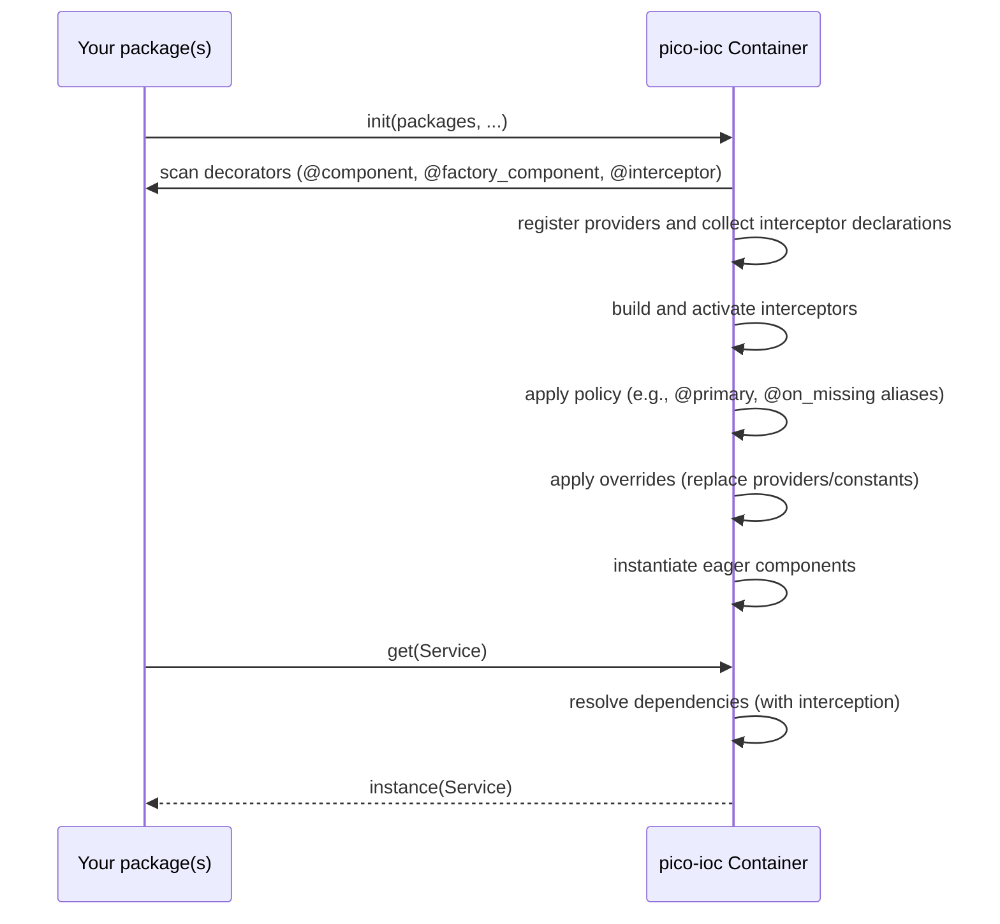
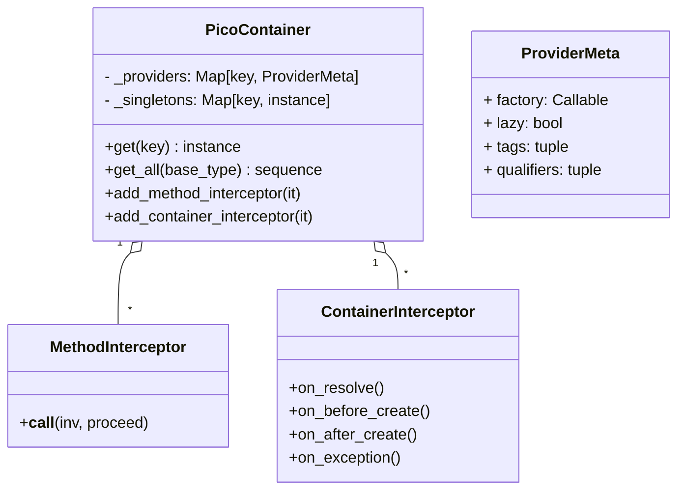

# pico-ioc — Architecture

> **Scope:** internal model, wiring algorithm, lifecycle, and design trade-offs.
> **Non-goals:** tutorials/recipes (see `GUIDE_CREATING_PLUGINS_AND_INTERCEPTORS.md`), product pitch.
>
> ⚠️ **Requires Python 3.10+** (uses `typing.Annotated` with `include_extras=True`).

-----

## 1\) Design goals & non-goals

### Goals

  - **Tiny, predictable DI** for Python apps (CLIs, Flask/FastAPI, services).
  - **Fail fast** at bootstrap; deterministic resolution.
  - **Ergonomic**: typed constructors; minimal reflection; explicit decorators.
  - **Framework-agnostic**: no hard deps on web frameworks.
  - **Safe by default**: thread/async-friendly; no global mutable singletons.

### Non-goals

  - Full Spring feature set (complex scopes, bean post-processors).
  - Hot reload or runtime graph mutation beyond explicit overrides.
  - Magical filesystem-wide auto-imports.

-----

## 2\) High-level model

  - **Component** → class marked with `@component`. Instantiated by the container.
  - **Factory component** → class marked with `@factory_component`; owns provider methods via `@provides(key=TypeOrToken)`. Providers return *externals* (e.g., `Flask`, DB clients).
  - **Interceptor** → class or function marked with `@interceptor`. Discovered automatically to apply cross-cutting logic.
  - **Container** → built by `pico_ioc.init(mod_or_list, ...)`; resolve with `container.get(KeyOrType)`.

### Bootstrap sequence



-----

## 3\) Discovery & registration

1.  **Scan inputs** passed to `init(...)`: module or list of modules/packages.
2.  **Collect**:
      * `@component` classes → registered by a **key** (defaults to the class type).
      * `@factory_component` classes → introspected for `@provides(key=...)` methods.
      * `@interceptor` classes/functions → collected for activation.
      * `@plugin` classes → if explicitly passed via `init(..., plugins=(...))`.
3.  **Registry** (frozen after bootstrap):
      * Map **key → provider**. Keys are typically **types**; string tokens are also supported.

**Precedence:** If multiple providers are active for the same key (e.g., one with `@primary`, another regular), a deterministic policy is applied to choose the winner. Direct overrides are applied last, having the final say.

-----

## 4\) Resolution algorithm (deterministic)

When constructing a component `C`:

1.  Inspect `__init__(self, ...)`; collect **type-annotated** parameters (excluding `self`).
2.  For each parameter `p: T`, resolve by this order:
    1.  **By name**: if a provider key matches the parameter name `p` (if `prefer_name_first=True`).
    2.  **Exact type** `T`.
    3.  **MRO walk**: first registered base class of `T`.
    4.  **By name (fallback)**: if a provider key matches the parameter name `p`.
3.  Instantiate dependencies depth-first; cache singletons.
4.  Construct `C` with resolved instances.

### Failure modes

  * **No provider** for a required key → **bootstrap error** (fail fast) with a full dependency chain.
  * **Ambiguous/incompatible** registrations → policy resolves to a single provider or raises an error.

### 4b) Collection resolution

If the constructor requests `list[T]` or `list[Annotated[T, Q]]`:

  * Return **all** compatible providers for `T`.
  * If `Q` (qualifier) is present, filter to matching ones.
  * Registration order is preserved; no implicit sorting.
  * Returns an empty list if no matches.

-----

## 5\) Lifecycles & scopes

  * **Singleton per container**: a provider is instantiated at most once and cached.
  * **Lazy proxies (optional)**: `@component(lazy=True)` or `@provides(lazy=True)` defers instantiation until first use via a `ComponentProxy`. Prefer eager to catch errors early.

**Rationale:** Most Python app composition (config, clients, web apps) fits singleton-per-container; it’s simple and fast.

-----

## 6\) Factories & providers

Use `@factory_component` for **externals** (framework apps, DB clients, engines).

```python
from pico_ioc import factory_component, provides
from flask import Flask

@factory_component
class AppFactory:
    @provides(key=Flask)
    def provide_flask(self) -> Flask:
        app = Flask(__name__)
        app.config["JSON_AS_ASCII"] = False
        return app
```

Guidelines:

  * Providers should be **pure constructors** (no long-running work).
  * Prefer **typed keys** (e.g., `Flask`) over strings.

-----

## 7\) Concurrency model

  * Container state is **immutable after init**.
  * Caches & resolution are **thread/async safe** (internal isolation; no global singletons).
  * Instances you create **must** be safe for your usage patterns; the container cannot fix non-thread-safe libraries.

-----

## 8\) Error handling & diagnostics

  * **Bootstrap**:
      * Missing providers → explicit `NameError` with full dependency chain details.
      * Duplicate keys → resolved by policy, preferring `@primary`.
  * **Runtime**:
      * Exceptions from providers/constructors bubble up. The resolver path is included in the error for easier debugging.

**Tip:** Keep constructors **cheap**; push I/O to explicit start/serve methods.

-----

## 9\) Configuration

Treat config as a **component**:

```python
@component
class Config:
    WORKERS: int = int(os.getenv("WORKERS", "4"))
    DEBUG: bool = os.getenv("DEBUG", "0") == "1"
```

Inject `Config` where needed; avoid scattered `os.getenv` calls.

-----

## 10\) Overrides & composition

### 10.1 Module-ordered overrides

The policy engine respects definition order. While not a strict "last-wins", providers marked `@primary` will take precedence over others discovered during the scan.

### 10.2 Direct overrides argument

`init()` accepts an `overrides` dictionary for ad-hoc replacement.

```python
c = init(app, overrides={
    Repo: FakeRepo(),                         # constant instance
    "fast_model": lambda: {"mock": True},     # provider
    "expensive": (lambda: object(), True),    # provider with lazy=True
})
```

**Semantics:**

  * Applied **after scanning and policy** but before eager instantiation → replaced providers never run.
  * Accepted forms:
      * `key: instance`
      * `key: callable`
      * `key: (callable, lazy_bool)`
  * With `reuse=True`, re-calling `init(..., overrides=...)` applies new overrides to the cached container.

-----

## 11\) Interceptors (AOP & Lifecycle Hooks)

Interceptors are components that apply cross-cutting logic like logging, metrics, or policy enforcement. They are discovered automatically via the `@interceptor` decorator.

`pico-ioc` supports two kinds of interceptors:

### Method Interceptors

These implement the `MethodInterceptor` protocol and wrap method calls on any component, enabling Aspect-Oriented Programming (AOP). They are ideal for tracing, timing, caching, or feature toggles.

```python
from pico_ioc import interceptor
from pico_ioc.interceptors import MethodInterceptor, Invocation

@interceptor(order=-10) # lower order runs first
class LoggingInterceptor(MethodInterceptor):
    def __call__(self, inv: Invocation, proceed):
        print(f"Calling {inv.method_name}...")
        result = proceed()
        print(f"Finished {inv.method_name}.")
        return result
```

### Container Interceptors

These implement the `ContainerInterceptor` protocol and hook into the container's internal lifecycle events.

**Hook points**:

  * `on_resolve(key, annotation, qualifiers)`
  * `on_before_create(key)`
  * `on_after_create(key, instance)` → may return a **wrapped/replaced** instance.
  * `on_exception(key, exc)`

**Registration:** Interceptors are discovered by the scanner during `init()` or `scope()`. There is no need to pass them manually. Their activation can be controlled with the same `@conditional` decorator and gates (`profiles`, `require_env`) used for other components.

-----

## 12\) Profiles & conditional providers

Use `@conditional` to **activate providers based on profiles, environment variables, or a predicate function**.

```python
from pico_ioc import component, conditional

class Cache: ...

@component
@conditional(profiles=("prod", "staging"))
class RedisCache(Cache): ...

@component
@conditional(require_env=("REDIS_URL",))
class AnotherRedisCache(Cache): ...

@component
@conditional(predicate=lambda: os.path.exists("/tmp/use_mem"))
class InMemoryCache(Cache): ...
```

**Rules**:

  * `profiles=("A","B")` → active if any profile passed to `init()` or `scope()` matches.
  * `require_env=("A","B")` → all environment variables must exist and be non-empty.
  * `predicate=callable` → must return a truthy value to activate.
  * If no active provider satisfies a required type and something depends on it → **bootstrap error** (fail fast).

-----

## 13\) Qualifiers & collection injection

Attach qualifiers to group/select implementations using `@qualifier`.

  * Request `list[T]` → injects all registered implementations of `T`.
  * Request `list[Annotated[T, Q]]` → injects only those implementations of `T` tagged with qualifier `Q`.

This preserves registration order and returns a stable list.

-----

## 14\) Plugins

`@plugin` classes implementing the `PicoPlugin` protocol can observe the **container lifecycle**.

  * `before_scan(package, binder)`
  * `after_scan(package, binder)`
  * `after_bind(container, binder)`
  * `before_eager(container, binder)`
  * `after_ready(container, binder)`

Plugins are passed **explicitly** via `init(..., plugins=(MyPlugin(),))`. Prefer **interceptors** for fine-grained wiring events; use **plugins** for coarse lifecycle integration.

-----

## 15\) Scoped subgraphs (`scope`)

Build a **bounded container** containing only dependencies reachable from selected **roots**.

```python
from pico_ioc import scope
from src.runner_service import RunnerService
from tests.fakes import FakeDocker
import src

c = scope(
    modules=[src],
    roots=[RunnerService],
    overrides={"docker.DockerClient": FakeDocker()},
    strict=True, lazy=True,
)
svc = c.get(RunnerService)
```

### Tag-based pruning

Providers may carry `tags` (via `@component(tags=...)` or `@provides(..., tags=...)`). `scope()` can filter the initial set of providers using `include_tags` and `exclude_tags` before traversing the dependency graph.

### Semantics

  * **Limited reach**: only providers transitively reachable from `roots` are included in the final graph.
  * **Deterministic precedence**: `overrides > scoped providers > base container providers` (if `strict=False`).
  * **Strict mode**: controls whether missing dependencies raise an error (`True`) or can be resolved from the `base` container (`False`).
  * **Lifecycle**: still **singleton-per-container**; `scope` does **not** add request/session scopes.
  * **Context manager**: `with scope(...):` is supported.

**Use cases:** fast unit tests, integration-lite, CLI tools, microbenchmarks.

-----

## 16\) Diagnostics & diagrams

### Registry & resolution (class diagram)



### Resolution flow (activity)

```mermaid
flowchart TD
    A[get(Type T)] --> B{Cached?}
    B -- yes --> Z[Return cached instance]
    B -- no --> D[Resolve dependencies for T (recurse)]
    D --> I_BEFORE[ContainerInterceptors: on_before_create]
    I_BEFORE --> F[Instantiate T]
    F -- exception --> I_EXC[ContainerInterceptors: on_exception]
    F -- success --> H[Wrap with MethodInterceptors if needed]
    H --> I_AFTER[ContainerInterceptors: on_after_create]
    I_AFTER --> G[Cache instance]
    G --> Z
```

-----

## 17\) Rationale & trade-offs

  * **Typed keys first**: better IDE support; fewer foot-guns than strings.
  * **Singleton-per-container**: matches typical Python app composition; simpler mental model.
  * **Explicit decorators**: determinism and debuggability over magical auto-wiring.
  * **Fail fast**: configuration and graph issues surface at startup, not mid-request.
  * **Interceptors over AOP**: precise, opt-in hooks without full-blown aspect weavers.

-----

**TL;DR**
`pico-ioc` builds a **deterministic, typed dependency graph** from decorated components, factories, and interceptors. It resolves by **type** (with qualifiers and collections), memoizes **singletons**, supports **overrides**, **plugins**, **conditionals/profiles**, and **scoped subgraphs**—keeping wiring **predictable, testable, and framework-agnostic**.
