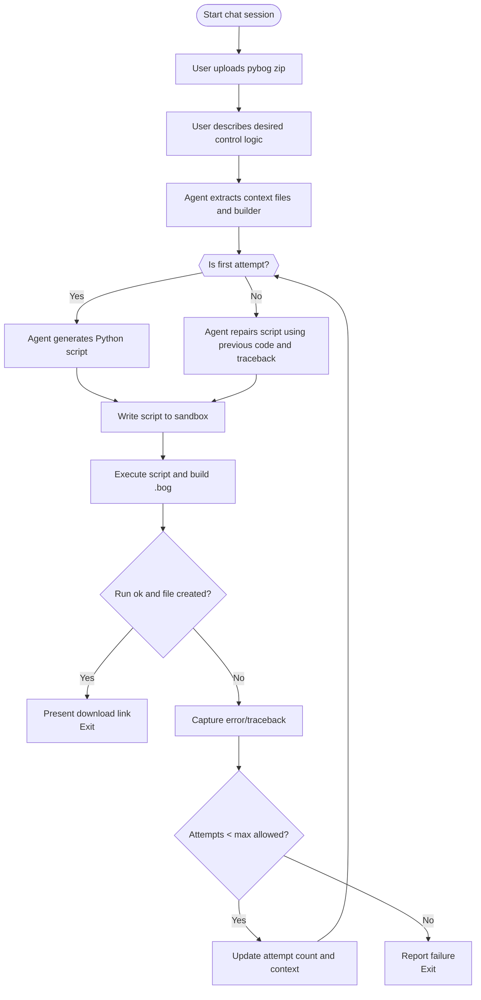

# pybog: A Python Toolkit for Niagara BOG & DIST Files

`bog_builder` is a Python package for constructing Niagara Baja Object Graphs `.bog` files programmatically. The goal is for AI to assist human controls engineers in rapidly prototyping complex HVAC sequencing within wire sheet logic. If the software engineering community can prototype quickly, why shouldn’t the controls engineering community be able to do the same?


## Python Project Setup

📦 PyPI project page: [https://pypi.org/project/pybog/](https://pypi.org/project/pybog/)


The **pybog** project is fundamentally about constructing a **typed knowledge graph** of Niagara components. Every component, slot, and connection is represented as a node or edge in this graph, and the relationships are validated in real time using Pydantic models. This means that when a developer instantiates a component or links two slots together, pybog doesn’t just serialize arbitrary XML—it actively reasons over the structure being built, rejecting anything that doesn’t conform to Niagara’s strict typing rules. At the heart of this process is the `SLOT_TYPE_MAPPING` dictionary, which serves as an explicit ontology for the graph. It encodes the “ground truth” of what each slot expects—whether it’s a `StatusNumeric`, `StatusBoolean`, `RelTime`, `FrozenEnum`, or other Niagara type—and allows the `BogFolderBuilder` to act as a compiler rather than a blind assembler.

When you call `builder.add_link()`, the builder consults this mapping to determine the expected data type of the target slot and compares it against the source component’s declared output type from the `COMPONENT_OUTPUT_TYPE` table. If the two do not match, the builder queries the `CONVERSION_MAP` to locate the proper Niagara converter block, automatically inserts that into the graph, and rewires the edge so the knowledge graph remains valid. This automatic mediation between mismatched types is what transforms pybog from a simple code generator into a **semantic builder**, capable of maintaining type-safety across thousands of links. By embedding these rules, pybog prevents runtime issues such as `ClassCastException` errors and ensures that the generated `.bog` files can be trusted to compile and execute correctly inside Niagara Workbench.

In short, the knowledge graph that pybog produces is both **structural** and **semantic**: structural in that it captures the exact topology of components and links, and semantic in that every edge has been validated against an ontology of slot types and conversion rules. This layered validation gives developers confidence that their automatically generated graphs are not only well-formed but also meaningful in Niagara’s execution model.

The project has been tested on **WSL (Windows Subsystem for Linux)** using a Python **3.12.x** environment with a standard virtual environment (`venv`) and `pip`, ensuring compatibility across modern development setups.

---


<details><summary><strong>Installation Details</strong></summary>

The package is available on **PyPI** and can be installed with:
>
> ```bash
> pip install pybog
> ```
>

The project may get frequent updates so try:
>
> ```bash
> pip install pybog --upgrade
> ```
>

### Contribute to `pybog` via developing a local Python package
>
> ```bash
> pip install .
> ```
>

To uninstall bog_builer if developing:
> ```bash
> pip uninstall bog_builder
> ```
>

Make sure tests pass:
> pytest

PRs welcome for [examples](https://github.com/bbartling/pybog/tree/develop/examples) and beyond. If mega overhauls are in a PR please give me a heads up prior.

</details>

## Running Example Scripts with WSL

<details><summary><strong>Details</strong></summary>

Each example script can be executed directly in WSL to generate a `.bog` file and drop it straight into your Niagara Workbench `JENEsys` directory. All example Python files are also compiled into a text file and used for LLM context.


1. **Run a specific example from project root directory**
   Pass the Niagara Workbench path as the output directory (`-o` argument):

   ```bash
   python examples/bool_latch_play_ground.py -o /mnt/c/Users/ben/Niagara4.11/JENEsys
   ```

   This will create:

   ```
   /mnt/c/Users/ben/Niagara4.11/JENEsys/bool_latch_play_ground.bog
   ```

2. **Open Workbench**
   Now you can import or open the generated `.bog` file inside your Niagara Workbench environment under the JENEsys station.

---

⚡ **Tip:**
If you don’t want to type `-o` every time, you can edit each example script and change the default in its argparse:

```python
parser.add_argument(
    "-o",
    "--output_dir",
    default="/mnt/c/Users/ben/Niagara4.11/JENEsys",
    help="Output directory for the .bog file."
)
```

Then you can just run:

```bash
python examples/bool_latch_play_ground.py
```

and it will always drop files directly into your Workbench directory for easy fast testing.

</details>


---

## Bog Builder Python Example And Bog XML Graph Tutorial

<details><summary><strong>How it works</strong></summary>

This is a code snip from the `examples\subtract_simple.py` file with optional `start_sub_folder` folder structures.

```python
builder = BogFolderBuilder("SubtractionLogic")

# --- Inputs ---
builder.add_numeric_writable(name="Input_A", default_value=100.0)
builder.add_numeric_writable(name="Input_B", default_value=40.0)

# --- Output ---
builder.add_numeric_writable(name="Difference")

builder.start_sub_folder("CalculationLogic")
builder.add_component(comp_type="kitControl:Subtract", name="Subtract")

builder.end_sub_folder()

builder.add_link("Input_A", "out", "Subtract", "inA")
builder.add_link("Input_B", "out", "Subtract", "inB")
builder.add_link("Subtract", "out", "Difference", "in16")

bog_filename = f"{script_filename}.bog"
output_path = os.path.join(args.output_dir, bog_filename)
os.makedirs(args.output_dir, exist_ok=True)
builder.save(output_path)
print(f"\nSuccessfully created Niagara .bog file at: {output_path}")

```


When run, it will create a `.bog` file that can be directly imported into Workbench. Behind the scenes, `pybog` automatically arranges the grid layout to keep it neat and human-readable. Placing logic inside subfolders is optional, but it’s a great way to keep your bog files organized and clean. And yes—AI can handle all of this for you, too 😉.


```bash
python examples/subtract_simple.py -o /mnt/c/Users/ben/Niagara4.11/JENEsys
```


## Write Your Own `.bog` File in XML from scratch

The Python script operates by creating the entire XML structure of the Niagara .bog file as a single, multi-line text string. This string contains all the necessary tags to define each component, its properties, and the links between them. Finally, the script writes this complete XML string directly into a new file, which Niagara can then open and display as a standard wiresheet.

```python
xml_content = '''<bajaObjectGraph version="4.0" reversibleEncodingKeySource="none" FIPSEnabled="false" reversibleEncodingValidator="[null.1]=">
  <p t="b:UnrestrictedFolder" m="b=baja">
    <p n="MyAdderLogic" t="b:Folder">

      <!-- Input1: Settable point with default value -->
      <p n="Input1" t="control:NumericWritable" h="1" m="control=control">
        <p n="out" f="s" t="b:StatusNumeric">
          <p n="value" v="6.0"/>
          <p n="status" v="0;activeLevel=e:17@control:PriorityLevel"/>
        </p>
        <p n="fallback" t="b:StatusNumeric">
          <p n="value" v="6.0"/>
        </p>
        <a n="emergencyOverride" f="h"/>
        <a n="emergencyAuto" f="h"/>
        <a n="override" f="ho"/>
        <a n="auto" f="ho"/>
        <p n="wsAnnotation" t="b:WsAnnotation" v="10,10,8"/>
      </p>
      
      <!-- Input2: Settable point with default value -->
      <p n="Input2" t="control:NumericWritable" h="2" m="control=control">
        <p n="out" f="s" t="b:StatusNumeric">
          <p n="value" v="4.0"/>
          <p n="status" v="0;activeLevel=e:17@control:PriorityLevel"/>
        </p>
        <p n="fallback" t="b:StatusNumeric">
          <p n="value" v="4.0"/>
        </p>
        <a n="emergencyOverride" f="h"/>
        <a n="emergencyAuto" f="h"/>
        <a n="override" f="ho"/>
        <a n="auto" f="ho"/>
        <p n="wsAnnotation" t="b:WsAnnotation" v="10,20,8"/>
      </p>

      <!-- Add: Logic block with verbose links -->
      <p n="Add" t="kitControl:Add" h="3" m="kitControl=kitControl">
        <p n="wsAnnotation" t="b:WsAnnotation" v="20,15,8"/>
        <p n="Link" t="b:Link">
          <p n="sourceOrd" v="h:1"/>
          <p n="relationId" v="n:dataLink"/>
          <p n="sourceSlotName" v="out"/>
          <p n="targetSlotName" v="inA"/>
        </p>
        <p n="Link1" t="b:Link">
          <p n="sourceOrd" v="h:2"/>
          <p n="relationId" v="n:dataLink"/>
          <p n="sourceSlotName" v="out"/>
          <p n="targetSlotName" v="inB"/>
        </p>
      </p>
      
      <!-- Sum: Read-only point with Set action explicitly hidden -->
      <p n="Sum" t="control:NumericWritable" h="4" m="control=control">
        <p n="out" f="h"/>
        <a n="emergencyOverride" f="h"/>
        <a n="emergencyAuto" f="h"/>
        <a n="override" f="ho"/>
        <a n="auto" f="ho"/>
        <a n="set" f="ho"/>
        <p n="wsAnnotation" t="b:WsAnnotation" v="30,15,8"/>
        <p n="Link" t="b:Link">
          <p n="sourceOrd" v="h:3"/>
          <p n="relationId" v="n:dataLink"/>
          <p n="sourceSlotName" v="out"/>
          <p n="targetSlotName" v="in16"/>
        </p>
      </p>

    </p>
  </p>
</bajaObjectGraph>'''

with open("PyMadeAddr.bog", "w", encoding="utf-8") as f:
    f.write(xml_content)

```

### How it Works

* Each `<p>` tag represents a Niagara component or a **slot within a component** (like `out` or `fallback`). Each `<a>` tag represents an **action** on that component, like `set` or `override`.
* The `f` attribute (flags) is critical for controlling behavior. `f="s"` makes a slot **settable**, while `f="h"` or `f="ho"` **hides** a slot or action, which is how we create read-only points.
* To set a **default value**, the `out` and `fallback` slots must be fully defined as complex properties containing nested `<p n="value".../>` and `<p n="status".../>` tags.
* `h="1"`, `h="2"`, etc., are unique **handles** that links use to reference their source and target components.
* `wsAnnotation` controls the block's position on the wiresheet. The coordinates are calculated using our **Hierarchical Data Flow** strategy to ensure a clean, grid-based layout.
* The `Add` block's links use these handles to reference the `out` slots from `Input1` and `Input2` and connect them to its `inA` and `inB` inputs.


</details>

---

## Using ChatGPT Agent Mode to Build `.bog` Files

<details><summary><strong>How It Works</strong></summary>

The workflow is entirely conversational: upload your project zip, describe the control sequence you need, and ChatGPT will do the rest. Be se sure to hit the plus sign to enable "Agent" mode in ChatGPT.


1. **Upload the project zip**
   In the chat interface, attach the `pybog-develop.zip` file (found in this repository). The agent will automatically extract the archive and inspect the code.

2. **Describe your control logic**
   Tell ChatGPT what sequence of operations you want to implement. For example:

   > “Create a central plant with a boiler and chiller. Enable heating when the outside air temperature is 50 °F or below, and cooling when it is 65 °F or above. Use variable speed pumps with a differential pressure setpoint of 20 PSI and include a 2 °F deadband for both heating and cooling.”

3. **ChatGPT builds and tests the script**

   * The agent writes a Python script using the `BogFolderBuilder` API.
   * It runs the script in a sandboxed environment and inspects the results.
   * If it fails, the agent reads the traceback, fixes the code, and tries again.
   * This iterate-and-repair loop continues until a valid `.bog` file is produced.

4. **Download the result**
   Once successful, ChatGPT presents a link to download the generated `.bog` file. You can import this file directly into Niagara Workbench for testing.

---

## ✅ Advantages

* No API key required
* No local Python setup
* Faster prototyping directly within the conversation

---

## 📊 AI Agent

The following Mermaid diagram illustrates the high-level flow when using ChatGPT Agent Mode:



---

## 💡 Tips

* **Be specific** when describing your control logic (setpoints, deadbands, number of pumps, etc.). The more detail you provide, the more accurate the generated `.bog` file will be.
* **Validate in Workbench**: After downloading, import the `.bog` file into Niagara Workbench to review the wiresheet and adjust as needed.

With Agent Mode, you can rapidly prototype complex HVAC sequences without writing any code yourself. Just describe what you need, and let ChatGPT handle the heavy lifting.

</details>

---

## Generate LLM Context Text Files

<details><summary><strong>Details</strong></summary>

The **context directory** contains documentation specifically formatted for use by the LLM agent.
Running the generator will take all Python files in the `examples` directory and combine them into a set of **LLM-friendly documentation files** (see [GoFast MCP docs](https://gofastmcp.com/getting-started/welcome#llm-friendly-docs) for the format specification).

* **`llms.txt`** — a lightweight *sitemap* listing each example file and its relative path.
* **`llms-full.txt`** — a single, concatenated file with the complete source of every example, wrapped with clear delimiters (`=== FILE: ... ===`, `=== CODE START ===`, `=== CODE END ===`).
  ⚠️ *Note:* this file can be quite large and may exceed the context window of some LLMs. For this project the `llms-full.txt` can push upwords of 20,000 tokens.

Generate the docs with:

```bash
python src/bog_builder/generate_llm_docs.py --examples examples --output context
```

This ensures the agent has direct access to all available example scripts, either as a quick index (`llms.txt`) or full training context (`llms-full.txt`).

</details>

---

## Traversing Baja Object Graphs

<details><summary><strong>Details</strong></summary>

* <strong>TODO</strong> - Unfinished and need more research here especially Graph theory best practices and inefficient operations in pybog

Niagara represents the contents of a station as a directed graph of objects and properties.
When working with the raw XML stored inside `.bog` and `.dist` archives you are effectively traversing this graph.

The graph is **not strictly hierarchical**: components can have links and references to other components across folders, and cycles may exist in more complex projects.

### Best Practices

* **Parse once, traverse many.** Extract the `file.xml` contents into an `xml.etree.ElementTree` and hold onto the root element. Re-parsing repeatedly is expensive.
* **Use breadth-first or depth-first search with a visited set.** Each component element has a unique handle (`h` attribute). Track visited handles to avoid infinite loops.
* **Follow both containment and link relationships.** Components are nested via `<p h=...>` elements, but logical connections are represented with `b:Link` child elements.
* **Build a handle → name map.** Handles (e.g. `s="h:123"`) are common in link definitions. Build a dictionary so you can resolve these references.
* **Be mindful of palettes.** The `type` attribute encodes the palette and block name (e.g. `kitControl:Add`). Grouping by palette helps narrow searches or generate statistics.

</details>

---

<details><summary><strong>Analyzer Class</strong></summary>

The `Analyzer` in `bog_builder.analyzer` encapsulates these patterns. It:

* Parses a `.bog` or `.dist` archive and extracts a **flat JSON structure** of components, properties, and links.
* Builds a **handle map** so you can resolve references by handle.
* Provides helpers to **count kitControl blocks** and generate bar/pie charts.

### Example Usage

Analyse a `.dist` file, export JSON, and produce charts:

```bash
python -m bog_builder.analyzer analyze "/path/to/file.dist" \
  -o "/path/to/output.json" \
  --plots "/path/to/outputdir"
```

This will:

* Save the JSON analysis into `output.json`.
* Generate two PNGs in the `outputdir` folder:

  * `kitcontrol_counts_bar.png`
  * `kitcontrol_counts_pie.png`

---

### Comparator Class

The `BogComparator` in `bog_builder.analyzer` provides a powerful diffing tool for your Niagara files. It:

* Compares two `.bog` or `.dist` archives to find the differences between them.
* Identifies components that have been added, removed, or modified.
* Highlights specific changes to component properties and links, including changes to link types and converters.

### Example Usage

Compare two `.bog` files to generate a diff report directly in your terminal:

```bash
python -m bog_builder.analyzer compare /path/to/version_A.bog /path/to/version_B.bog
```

This will print a detailed report listing:

* Components that were added (`+`) or removed (`-`).
* Modified components, detailing the exact property and link changes.

---

## Example Output

**Bar Chart (counts by block type)**


**Pie Chart (distribution of block usage)**


👉 With this, you now have both **machine-readable JSON for reverse engineering** and **visual plots for quick insights** into station complexity and palette usage.

</details>

---


## Support Niagara4 kitControl Components

<details><summary><strong>KitControl Widget Implementation Checklist</strong></summary>

Reference logic building blocks from Niagara’s kitControl palette are documented in `pdf/docKitControl.pdf`.

### Alarm
- [ ] ChangeOfStateCountAlarmExt
- [ ] ElapsedActiveTimeAlarmExt
- [ ] LoopAlarmExt
- [ ] AlarmCountToRelay

### Constants
- [x] NumericConst
- [x] BooleanConst
- [x] EnumConst
- [ ] StringConst

### Conversion
- [ ] StatusBooleanToBoolean
- [ ] StatusEnumToEnum
- [ ] StatusEnumToInt
- [ ] StatusNumericToDouble
- [ ] StatusNumericToFloat
- [ ] StatusNumericToInt
- [ ] BooleanToStatusBoolean
- [ ] EnumToStatusEnum
- [ ] IntToStatusNumeric
- [ ] LongToStatusNumeric
- [ ] StringToStatusString
- [ ] StatusEnumToStatusBoolean
- [ ] StatusEnumToStatusNumeric
- [ ] StatusNumericToStatusEnum
- [ ] StatusNumericToStatusString
- [ ] StatusStringToStatusNumeric
- [ ] NumericUnitConverter

### Energy
- [ ] DegreeDays
- [ ] ElectricalDemandLimit
- [ ] NightPurge
- [ ] OptimizedStartStop
- [ ] OutsideAirOptimization
- [ ] Psychrometric
- [ ] SetpointLoadShed
- [ ] SetpointOffset
- [ ] ShedControl
- [ ] SlidingWindowDemandCalc

### HVAC
- [x] LeadLagCycles
- [x] LeadLagRuntime
- [x] LoopPoint
- [x] Tstat
- [ ] InterstartDelayControl
- [ ] InterstartDelayMaster
- [ ] RaiseLower
- [ ] SequenceBinary
- [ ] SequenceLinear

### Latch
- [x] BooleanLatch
- [x] NumericLatch
- [ ] EnumLatch
- [ ] StringLatch

### Logic
- [x] And
- [x] Or
- [x] Xor
- [x] Not
- [x] Equal
- [x] NotEqual
- [x] GreaterThan
- [x] GreaterThanEqual
- [x] LessThan
- [x] LessThanEqual

### Math
- [x] Add
- [x] Subtract
- [x] Multiply
- [x] Divide
- [x] Average
- [x] Minimum
- [x] Maximum
- [x] SineWave
- [x] Reset
- [ ] Modulus
- [ ] Power
- [ ] AbsValue
- [ ] ArcCosine
- [ ] ArcSine
- [ ] ArcTangent
- [ ] Cosine
- [ ] Exponential
- [ ] Factorial
- [ ] LogBase10
- [ ] LogNatural
- [ ] Negative
- [ ] SquareRoot
- [ ] Tangent

### Select
- [x] NumericSelect
- [ ] BooleanSelect
- [ ] EnumSelect
- [ ] StringSelect

### String
- [ ] StringConcat
- [ ] StringSubstring
- [ ] StringTrim
- [ ] StringIndexOf
- [ ] StringTest
- [ ] StringLen

### Timer
- [x] BooleanDelay
- [x] NumericDelay
- [x] OneShot
- [ ] CurrentTime
- [ ] TimeDifference

### Util
- [x] BooleanSwitch
- [x] NumericSwitch
- [x] MultiVibrator
- [x] Counter
- [ ] DigitalInputDemux
- [ ] EnumSwitch
- [ ] MinMaxAvg
- [ ] NumericBitAnd
- [ ] NumericBitOr
- [ ] NumericBitXor
- [ ] NumericToBitsDemux
- [ ] Ramp
- [ ] Random
- [ ] StatusDemux
- [ ] SineWave (already listed under Math)
</details>


<details><summary><strong>pybog API Reference: BogFolderBuilder Methods</strong></summary>

These methods create standard input/output points that are typically exposed on the wiresheet interface.

### `add_numeric_writable`

Creates a standard settable numeric point (`control:NumericWritable`).

```python
def add_numeric_writable(
    self,
    name: str,
    default_value: float = 0.0,
    precision: int = 2,
    units: str = "u:null"
) -> None:
```

  * **`name`**: The unique name for the component.
  * **`default_value`**: The initial fallback value for the point.
  * **`precision`**: The number of decimal places for display.
  * **`units`**: The Niagara units string (e.g., `"u:degreeFahrenheit"`, `"u:percent"`).

### `add_boolean_writable`

Creates a standard settable boolean point (`control:BooleanWritable`).

```python
def add_boolean_writable(
    self,
    name: str,
    default_value: bool = False
) -> None:
```

  * **`name`**: The unique name for the component.
  * **`default_value`**: The initial fallback value for the point (`True` or `False`).

### `add_enum_writable`

Creates a standard settable enumeration point (`control:EnumWritable`).

```python
def add_enum_writable(
    self,
    name: str,
    facets: str,
    default_value: str = "0"
) -> None:
```

  * **`name`**: The unique name for the component.
  * **`facets`**: The Niagara enumeration string (e.g., `"range=E:{Off=0,On=1}"`).
  * **`default_value`**: The string representation of the default ordinal index (e.g., `"0"`).

## 2\. Enumeration Helpers

These high-level methods simplify working with `EnumWritable` and `EnumConst` components by managing range definitions centrally.

### `define_enum_range`

Registers a reusable enumeration range mapping.

```python
def define_enum_range(
    self,
    name: str,
    mapping: Dict[str, int]
) -> None:
```

  * **`name`**: A unique alias for the range (e.g., `"Mode"`).
  * **`mapping`**: A dictionary mapping string tags to integer ordinals (e.g., `{"Occupied": 0, "Unoccupied": 1}`).

### `add_enum_writable_by_name`

Adds an `EnumWritable` using a pre-defined range.

```python
def add_enum_writable_by_name(
    self,
    component_name: str,
    enum_name: str,
    default_tag: str
) -> None:
```

  * **`component_name`**: The name for the new component.
  * **`enum_name`**: The alias of the range registered with `define_enum_range()`.
  * **`default_tag`**: The string tag from the mapping to set as the default value (e.g., `"Occupied"`).

### `add_enum_const_by_name`

Adds an `EnumConst` using a pre-defined range.

```python
def add_enum_const_by_name(
    self,
    component_name: str,
    enum_name: str,
    value_tag: str
) -> None:
```

  * **`component_name`**: The name for the new component.
  * **`enum_name`**: The alias of the range registered with `define_enum_range()`.
  * **`value_tag`**: The string tag from the mapping to set as the constant's value.

## 3\. Constant Components

Creates read-only constant value blocks.

| Method Signature | Niagara Type | Description |
| --- | --- | --- |
| `add_numeric_const(name: str, value: float)` | `kitControl:NumericConst` | Creates a constant numeric value. |
| `add_boolean_const(name: str, value: bool)` | `kitControl:BooleanConst` | Creates a constant boolean value. |
| `add_enum_const(name: str, facets: str, value: str)` | `kitControl:EnumConst` | Creates a constant enum value. |

## 4\. Math Components

Wrapper methods for mathematical operations from `kitControl`.

| Method Signature | Niagara Type | Description |
| --- | --- | --- |
| `add_add(name: str)` | `kitControl:Add` | Adds multiple numeric inputs. |
| `add_subtract(name: str)` | `kitControl:Subtract` | Subtracts input B from input A. |
| `add_multiply(name: str)` | `kitControl:Multiply` | Multiplies multiple numeric inputs. |
| `add_divide(name: str)` | `kitControl:Divide` | Divides input A by input B. |
| `add_average(name: str)` | `kitControl:Average` | Calculates the average of active inputs. |
| `add_minimum(name: str)` | `kitControl:Minimum` | Finds the minimum value among active inputs. |
| `add_maximum(name: str)` | `kitControl:Maximum` | Finds the maximum value among active inputs. |
| `add_reset(name: str)` | `kitControl:Reset` | Rescales a value from one range to another. |
| `add_sine_wave(name: str)` | `kitControl:SineWave` | Generates a sine wave output for testing. |

## 5\. Logic and Comparison Components

Wrapper methods for boolean logic and numeric comparisons from `kitControl`.

| Method Signature | Niagara Type | Description |
| --- | --- | --- |
| `add_and(name: str)` | `kitControl:And` | Boolean AND operation on multiple inputs. |
| `add_or(name: str)` | `kitControl:Or` | Boolean OR operation on multiple inputs. |
| `add_xor(name: str)` | `kitControl:Xor` | Boolean XOR operation on multiple inputs. |
| `add_not(name: str)` | `kitControl:Not` | Inverts a boolean signal. |
| `add_equal(name: str)` | `kitControl:Equal` | Outputs true if input A equals input B. |
| `add_not_equal(name: str)` | `kitControl:NotEqual` | Outputs true if input A does not equal input B. |
| `add_greater_than(name: str)` | `kitControl:GreaterThan`| Outputs true if input A \> input B. |
| `add_greater_than_equal(name: str)`| `kitControl:GreaterThanEqual` | Outputs true if input A \>= input B. |
| `add_less_than(name: str)` | `kitControl:LessThan` | Outputs true if input A \< input B. |
| `add_less_than_equal(name: str)` | `kitControl:LessThanEqual` | Outputs true if input A \<= input B. |

## 6\. Timer and Delay Components

Wrapper methods for time-based operations. Time arguments accept integers (milliseconds) or human-readable strings like `"30s"` or `"5m"`.

### `add_boolean_delay`

Delays a boolean signal on rise, fall, or both (`kitControl:BooleanDelay`).

```python
def add_boolean_delay(
    self,
    name: str,
    on_delay: str | int | None = None,
    off_delay: str | int | None = None,
    properties: dict | None = None
) -> None:
```

### `add_numeric_delay`

Applies a ramp or delay to a numeric value (`kitControl:NumericDelay`).

```python
def add_numeric_delay(
    self,
    name: str,
    update_time: str | int | None = None,
    max_step_size: float | None = None,
    properties: dict | None = None
) -> None:
```

### Other Timer Components

| Method Signature | Niagara Type | Description |
| --- | --- | --- |
| `add_multi_vibrator(name: str, period_ms: str \| int)` | `kitControl:MultiVibrator` | Creates a periodic boolean pulse (oscillator). |
| `add_one_shot(name: str)` | `kitControl:OneShot` | Emits a single true pulse when triggered. |

## 7\. HVAC and Sequencing Components

Wrappers for complex HVAC control blocks.

| Method Signature | Niagara Type | Description |
| --- | --- | --- |
| `add_lead_lag_cycles(name: str)` | `kitControl:LeadLagCycles` | Manages equipment rotation based on start cycles. |
| `add_lead_lag_runtime(name:str)` | `kitControl:LeadLagRuntime` | Manages equipment rotation based on accumulated runtime. |
| `add_loop_point(name: str)` | `kitControl:LoopPoint` | PID loop controller component. |
| `add_tstat(name: str)` | `kitControl:Tstat` | Thermostat logic block with setpoint and differential. |

## 8\. Latch and Switch Components

Components used for stateful logic and signal routing.

| Method Signature | Niagara Type | Description |
| --- | --- | --- |
| `add_boolean_latch(name: str)` | `kitControl:BooleanLatch` | Holds a boolean value based on a clock trigger. |
| `add_numeric_latch(name: str)` | `kitControl:NumericLatch` | Holds a numeric value based on a clock trigger. |
| `add_boolean_switch(name: str)`| `kitControl:BooleanSwitch`| Selects between `inTrue` and `inFalse` boolean inputs based on `inSwitch`.|
| `add_numeric_switch(name: str)`| `kitControl:NumericSwitch`| Selects between `inTrue` and `inFalse` numeric inputs based on `inSwitch`.|

## 9\. Utility Components

Miscellaneous utility blocks.

### `add_counter`

Counts up or down based on boolean triggers (`kitControl:Counter`).

```python
def add_counter(
    self,
    name: str,
    count_increment: float = 1.0,
    precision: int | None = None,
    properties: dict | None = None
) -> None:
```

### `add_numeric_select`

Selects one numeric input from a list based on an integer index (`kitControl:NumericSelect`).

```python
def add_numeric_select(
    self,
    name: str
) -> None:
```

## 10\. Schedule Components

Wrappers for creating schedule objects.

| Method Signature | Niagara Type | Description |
| --- | --- | --- |
| `add_boolean_schedule(name: str, properties: dict)` | `sch:BooleanSchedule` | Creates a schedule for boolean events. |
| `add_numeric_schedule(name: str, properties: dict)` | `sch:NumericSchedule` | Creates a schedule for numeric setpoints. |
| `add_enum_schedule(name: str, properties: dict)` | `sch:EnumSchedule` | Creates a schedule for enumerated values. |

</details>

---

[🎥 Keep Up with Talk Shop With Ben on YouTube](https://www.youtube.com/@TalkShopWithBen)

---

## License

MIT License — free for reuse with attribution. Any files generated here are provided strictly for research and educational purposes. All outputs are delivered “as-is,” with no guarantees of accuracy, safety, or fitness for any application. Neither the pybog project nor its creator accepts any responsibility or liability under any circumstances. By generating or using a .bog file produced by this project, you agree that you assume all risks and full responsibility for any outcomes—including, but not limited to, personal injury, loss of life, financial loss, equipment damage, or mechanical system failures. If you choose to use these files in any way, you do so entirely at your own risk.


