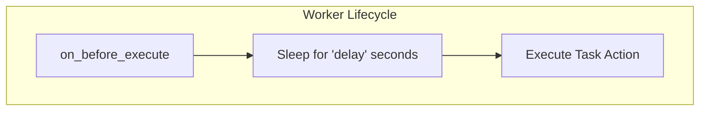

# Delayed Trait

Delays the execution of a task by a specified amount of time.

```mermaid
graph TD
    subgraph Worker Lifecycle
        A[on_before_execute] --> B["Sleep for 'delay' seconds"];
        B --> C[Execute Task Action];
    end
```
