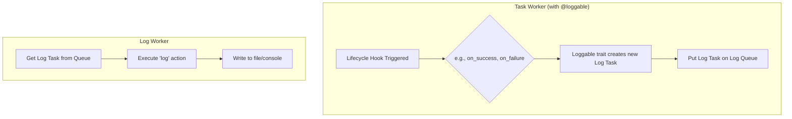

# Loggable Trait

Enables automatic logging of a task's lifecycle events (e.g., start, finish, fail) and allows for customization of the log level. All log messages are processed by a dedicated logging worker. Manual logging within a task's action can be performed using the worker.log() method.

