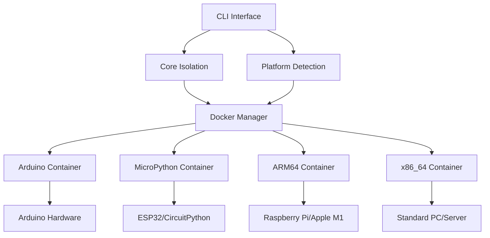

# Servos - Service Environment Isolation & Orchestration System

[](https://opensource.org/licenses/Apache-2.0)
[](https://www.python.org/downloads/)
[](https://pypi.org/project/servos/)
[](https://www.docker.com/)

A lightweight Python library for environment isolation, Docker orchestration, and multi-platform service deployment. Extracted from the ProServe framework to provide focused environment isolation capabilities.

## 🎯 Overview

Servos provides robust environment isolation and orchestration for running services across multiple platforms including Arduino, MicroPython, ARM64, and x86_64 architectures. It offers containerized execution environments with automatic platform detection and deployment.

## 📁 Architecture

```
┌─────────────────────────────────────────────────────────────┐
│                        Servos Architecture                  │
├─────────────────────────────────────────────────────────────┤
│                                                             │
│  ┌─────────────────┐    ┌─────────────────┐                │
│  │   CLI Interface │    │  Core Isolation │                │
│  │                 │    │                 │                │
│  │ • Platform      │◄──►│ • Environment   │                │
│  │   Detection     │    │   Management    │                │
│  │ • Script Exec   │    │ • Process       │                │
│  │ • Orchestration │    │   Isolation     │                │
│  └─────────────────┘    └─────────────────┘                │
│           │                       │                        │
│           ▼                       ▼                        │
│  ┌─────────────────────────────────────────┐               │
│  │          Docker Environments            │               │
│  ├─────────────────────────────────────────┤               │
│  │ Arduino    │ MicroPython │ ARM64  │ x86 │               │
│  │ Container  │  Container  │Container│ 64 │               │
│  │            │             │        │Cont│               │
│  │ • Platform │ • CircuitPy │ • ARM  │ • │               │
│  │   IO       │ • ESP32     │   CPU  │Std │               │
│  │ • Firmware │ • Embedded  │ • Pi4  │CPU │               │
│  │   Upload   │   Libs      │ • M1   │x86 │               │
│  └─────────────────────────────────────────┘               │
└─────────────────────────────────────────────────────────────┘
```

## 🔧 Component Layers



## 🚀 Quick Start

### Installation

```bash
# Basic installation
pip install servos

# With all optional dependencies
pip install servos[all]

# With Docker support
pip install servos[docker]

# For MicroPython development
pip install servos[micropython]

# For Arduino development  
pip install servos[arduino]
```

### Basic Usage

```python
from servos import IsolationManager, PlatformDetector

# Detect current platform
detector = PlatformDetector()
platform = detector.detect_platform()
print(f"Detected platform: {platform}")

# Create isolated environment
manager = IsolationManager(platform=platform)
result = manager.execute_isolated("my_script.py")
```

### CLI Usage

```bash
# Detect current platform
servos detect

# Run script in isolated environment
servos isolate my_script.py

# List supported platforms
servos list-platforms

# Show version information
servos version
```

## 🌍 Supported Platforms

| Platform | Description | Container | Use Cases |
|----------|-------------|-----------|-----------|
| `arduino` | Arduino & compatible MCUs | ✅ | IoT, embedded systems |
| `micropython` | MicroPython environments | ✅ | ESP32, CircuitPython |
| `arm64` | ARM64 processors | ✅ | Raspberry Pi, Apple M1 |
| `x86_64` | Standard x86_64 | ✅ | PCs, servers |
| `rpi-arm` | Raspberry Pi ARM | ✅ | Pi-specific projects |

## 📦 Package Structure

```
servos/
├── servos/
│   ├── __init__.py              # Main package interface
│   ├── cli.py                   # Command-line interface
│   ├── core/
│   │   ├── __init__.py
│   │   └── isolation.py         # Core isolation management
│   └── isolation/
│       ├── __init__.py
│       ├── extended_environments.py  # Extended isolation
│       └── platforms/           # Platform-specific code
├── docker/                      # Container definitions
│   ├── arduino/                 # Arduino container
│   ├── micropython/            # MicroPython container
│   ├── arm64/                  # ARM64 container
│   └── x86_64/                 # x86_64 container
├── tests/                      # Test suite
├── setup.py                    # Package configuration
├── requirements.txt            # Dependencies
├── Makefile                    # Build automation
└── README.md                   # This file
```

## 🔨 Development

### Local Development

```bash
# Clone and setup
git clone https://github.com/servos/servos.git
cd servos

# Install in development mode
make install

# Run tests
make test

# Build package
make build

# Format code
make format
```

### Building Containers

The Docker environments are automatically built when needed, but you can also build them manually:

```bash
# Build specific platform container
docker build -f docker/arduino/Dockerfile -t servos:arduino .
docker build -f docker/micropython/Dockerfile -t servos:micropython .
docker build -f docker/arm64/Dockerfile -t servos:arm64 .
docker build -f docker/x86_64/Dockerfile -t servos:x86_64 .
```

## 🧪 Testing

```bash
# Run all tests
make test

# Run specific test
python -m pytest tests/test_isolation.py

# Run with coverage
python -m pytest --cov=servos tests/
```

## 📚 API Reference

### IsolationManager

Main class for managing environment isolation:

```python
from servos import IsolationManager, EnvironmentConfig

config = EnvironmentConfig()
manager = IsolationManager(platform="arduino", config=config)
result = manager.execute_isolated("blink_led.py")
```

### PlatformDetector  

Automatic platform detection:

```python
from servos.isolation.platforms import PlatformDetector

detector = PlatformDetector()
platform = detector.detect_platform()
architecture = detector.get_architecture()
```

## 🔗 Integration with ProServe

Servos is designed to work seamlessly with the [ProServe](https://pypi.org/project/proserve/) framework:

```python
# In your ProServe service manifest
dependencies:
  - servos>=1.0.0

# Use in ProServe services
from servos import IsolationManager
from proserve import Service

class MyService(Service):
    def __init__(self):
        self.isolation = IsolationManager()
    
    async def handle_request(self, request):
        result = self.isolation.execute_isolated("user_script.py")
        return {"status": "success", "result": result}
```

## 🤝 Contributing

1. Fork the repository
2. Create a feature branch: `git checkout -b feature/amazing-feature`
3. Commit changes: `git commit -m 'Add amazing feature'`
4. Push to branch: `git push origin feature/amazing-feature`
5. Open a Pull Request

## 📄 License

This project is licensed under the Apache License 2.0 - see the [LICENSE](LICENSE) file for details.

## 👨‍💻 Author

**Tom Sapletta**

- GitHub: [@tom-sapletta](https://github.com/tom-sapletta)
- Email: tom@sapletta.com

## 🙏 Acknowledgments

- Extracted from the [ProServe](https://pypi.org/project/proserve/) framework
- Built for the EDPMT (Electronic Device Programming & Management Tool) ecosystem
- Inspired by modern containerization and microservices architectures

---

**Servos** - Making environment isolation simple and powerful! 🚀
