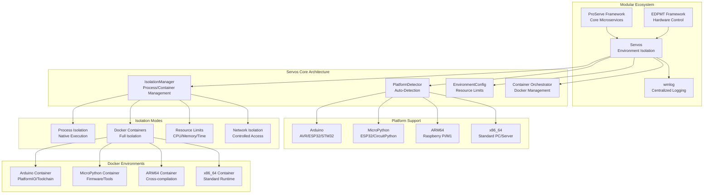
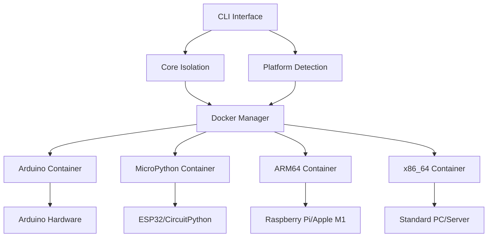

# Servos - Service Environment Isolation & Orchestration System

[](https://opensource.org/licenses/Apache-2.0)
[](https://www.python.org/downloads/)
[](https://pypi.org/project/servos/)
[](https://www.docker.com/)
[](https://badge.fury.io/py/servos)
[](https://travis-ci.com/tom-sapletta-com/servos)

A lightweight Python library for environment isolation, Docker orchestration, and multi-platform service deployment. Extracted from the ProServe framework to provide focused environment isolation capabilities.

> 🚀 **Part of the modular ecosystem**: [ProServe](https://pypi.org/project/proserve/) (core framework) • **Servos** (isolation) • [EDPMT](https://github.com/tom-sapletta-com/edpmt) (hardware) • [wmlog](https://pypi.org/project/wmlog/) (logging)

## 🎯 Overview

Servos provides robust environment isolation and orchestration for running services across multiple platforms including Arduino, MicroPython, ARM64, and x86_64 architectures. It offers containerized execution environments with automatic platform detection and deployment.

## 🏗️ Architecture

### Servos Ecosystem Integration


### Detailed Servos Architecture

```
┌─────────────────────────────────────────────────────────────────────────────┐
│                           Servos Architecture                              │
├─────────────────────────────────────────────────────────────────────────────┤
│                                                                             │
│  ┌─────────────────────────────────────────────────────────────────────┐     │
│  │                         CLI Interface                               │     │
│  │                                                                     │     │
│  │  ┌─────────────┐ ┌─────────────┐ ┌─────────────┐ ┌─────────────────┐  │     │
│  │  │   servos    │ │   servos    │ │   servos    │ │     servos      │  │     │
│  │  │   detect    │ │list-platforms│ │   version   │ │    <command>    │  │     │
│  │  │             │ │             │ │             │ │                 │  │     │
│  │  │• Auto-detect│ │• Show all   │ │• Version    │ │• Custom         │  │     │
│  │  │  current    │ │  supported  │ │  info       │ │  isolation      │  │     │
│  │  │  platform   │ │  platforms  │ │• Build      │ │  commands       │  │     │
│  │  │• Hardware   │ │• Docker     │ │  metadata   │ │• Interactive    │  │     │
│  │  │  details    │ │  images     │ │• CLI help   │ │  shell          │  │     │
│  │  │• System     │ │• Capabilities│ │             │ │                 │  │     │
│  │  │  info       │ │             │ │             │ │                 │  │     │
│  │  └─────────────┘ └─────────────┘ └─────────────┘ └─────────────────┘  │     │
│  └─────────────────────────────────────────────────────────────────────┘     │
│                                │                                             │
│                                ▼                                             │
│  ┌─────────────────────────────────────────────────────────────────────┐     │
│  │                      Core Isolation Engine                         │     │
│  │                                                                     │     │
│  │  ┌─────────────┐ ┌─────────────┐ ┌─────────────┐ ┌─────────────────┐  │     │
│  │  │ Isolation   │ │  Platform   │ │Environment  │ │   Container     │  │     │
│  │  │  Manager    │ │  Detector   │ │   Config    │ │  Orchestrator   │  │     │
│  │  │             │ │             │ │             │ │                 │  │     │
│  │  │• Process    │ │• Hardware   │ │• Resource   │ │• Docker API     │  │     │
│  │  │  Spawn      │ │  Detection  │ │  Limits     │ │• Image Build    │  │     │
│  │  │• Container  │ │• Arch Query │ │• CPU/Memory │ │• Container      │  │     │
│  │  │  Create     │ │• OS Info    │ │• Network    │ │  Lifecycle      │  │     │
│  │  │• Security   │ │• Feature    │ │  Rules      │ │• Volume Mount   │  │     │
│  │  │  Sandbox    │ │  Support    │ │• Time Limits│ │• Health Check   │  │     │
│  │  │• Resource   │ │• Embedded   │ │• User/Group │ │• Log Stream     │  │     │
│  │  │  Monitor    │ │  Board ID   │ │  Mapping    │ │• Network Setup  │  │     │
│  │  └─────────────┘ └─────────────┘ └─────────────┘ └─────────────────┘  │     │
│  └─────────────────────────────────────────────────────────────────────┘     │
│                                │                                             │
│                                ▼                                             │
│  ┌─────────────────────────────────────────────────────────────────────┐     │
│  │                    Platform-Specific Environments                  │     │
│  │                                                                     │     │
│  │  ┌─────────────┐ ┌─────────────┐ ┌─────────────┐ ┌─────────────────┐  │     │
│  │  │   Arduino   │ │MicroPython  │ │   ARM64     │ │     x86_64      │  │     │
│  │  │Environment  │ │ Environment │ │Environment  │ │   Environment   │  │     │
│  │  │             │ │             │ │             │ │                 │  │     │
│  │  │• PlatformIO │ │• MicroPython│ │• Cross-     │ │• Standard       │  │     │
│  │  │  Toolchain  │ │  Runtime    │ │  compilation│ │  Runtime        │  │     │
│  │  │• AVR-GCC    │ │• CircuitPy  │ │• QEMU       │ │• Python 3.8+   │  │     │
│  │  │• ESP-IDF    │ │  Support    │ │  Emulation  │ │• Build Tools    │  │     │
│  │  │• STM32Cube  │ │• Firmware   │ │• RPi Tools  │ │• Dev Libraries  │  │     │
│  │  │• Board      │ │  Upload     │ │• Native     │ │• Testing        │  │     │
│  │  │  Configs    │ │• Serial     │ │  Execution  │ │  Framework      │  │     │
│  │  │• Flash      │ │• Debug      │ │• Profiling  │ │• Debug Tools    │  │     │
│  │  │  Tools      │ │• Serial     │ │  Tools      │ │• Performance    │  │     │
│  │  └─────────────┘ └─────────────┘ └─────────────┘ └─────────────────┘  │     │
│  └─────────────────────────────────────────────────────────────────────┘     │
│                                │                                             │
│                                ▼                                             │
│  ┌─────────────────────────────────────────────────────────────────────┐     │
│  │                      Docker Integration                            │     │
│  │                                                                     │     │
│  │  ┌─────────────┐ ┌─────────────┐ ┌─────────────┐ ┌─────────────────┐  │     │
│  │  │  Arduino    │ │ MicroPython │ │   ARM64     │ │     x86_64      │  │     │
│  │  │ Container   │ │  Container  │ │  Container  │ │   Container     │  │     │
│  │  │             │ │             │ │             │ │                 │  │     │
│  │  │• Ubuntu     │ │• Python 3.x │ │• Multi-arch │ │• Ubuntu/Alpine  │  │     │
│  │  │  Base       │ │  Base       │ │  Support    │ │  Base           │  │     │
│  │  │• PlatformIO │ │• MicroPython│ │• Cross-comp │ │• Python 3.8+   │  │     │
│  │  │  Install    │ │  Tools      │ │  Toolchain  │ │• Development    │  │     │
│  │  │• Serial     │ │• esptool    │ │• QEMU User  │ │  Environment    │  │     │
│  │  │  Support    │ │• ampy       │ │  Mode       │ │• Build Utils    │  │     │
│  │  │• USB/GPIO   │ │• rshell     │ │• Native     │ │• Package        │  │     │
│  │  │  Access     │ │• mpremote   │ │  Runtime    │ │  Managers       │  │     │
│  │  │• Firmware   │ │• Firmware   │ │• Debug      │ │• Testing        │  │     │
│  │  │  Flash      │ │  Management │ │  Support    │ │  Frameworks     │  │     │
│  │  └─────────────┘ └─────────────┘ └─────────────┘ └─────────────────┘  │     │
│  └─────────────────────────────────────────────────────────────────────┘     │
│                                │                                             │
│                                ▼                                             │
│  ┌─────────────────────────────────────────────────────────────────────┐     │
│  │                        Integration Layer                           │     │
│  │                                                                     │     │
│  │  ┌─────────────┐ ┌─────────────┐ ┌─────────────┐ ┌─────────────────┐  │     │
│  │  │   wmlog     │ │  ProServe   │ │    EDPMT    │ │     Docker      │  │     │
│  │  │  Logging    │ │ Framework   │ │  Hardware   │ │     Engine      │  │     │
│  │  │             │ │             │ │ Management  │ │                 │  │     │
│  │  │• Structured │ │• Service    │ │• Device     │ │• Container      │  │     │
│  │  │  Logging    │ │  Framework  │ │  Control    │ │  Runtime        │  │     │
│  │  │• Real-time  │ │• Manifest   │ │• GPIO/I2C   │ │• Image          │  │     │
│  │  │  Stream     │ │  Driven     │ │• Sensor     │ │  Management     │  │     │
│  │  │• Context    │ │• Multi-env  │ │  Reading    │ │• Volume         │  │     │
│  │  │  Enrichment │ │  Deploy     │ │• Hardware   │ │  Management     │  │     │
│  │  │• WebSocket  │ │• Discovery  │ │  Testing    │ │• Network        │  │     │
│  │  │• MQTT       │ │• Migration  │ │• Firmware   │ │  Management     │  │     │
│  │  │• Console    │ │• Auto Scale │ │  Upload     │ │• Resource       │  │     │
│  │  │  Output     │ │• Load Bal.  │ │• Monitor    │ │  Monitoring     │  │     │
│  │  └─────────────┘ └─────────────┘ └─────────────┘ └─────────────────┘  │     │
│  └─────────────────────────────────────────────────────────────────────┘     │
└─────────────────────────────────────────────────────────────────────────────┘
```

## ✨ Features

## 🔧 Component Layers



## 🚀 Quick Start

### Installation

```bash
# Basic installation
pip install servos

# With all optional dependencies
pip install servos[all]

# With Docker support
pip install servos[docker]

# For MicroPython development
pip install servos[micropython]

# For Arduino development  
pip install servos[arduino]
```

### Basic Usage

```python
from servos import IsolationManager, PlatformDetector

# Detect current platform
detector = PlatformDetector()
platform = detector.detect_platform()
print(f"Detected platform: {platform}")

# Create isolated environment
manager = IsolationManager(platform=platform)
result = manager.execute_isolated("my_script.py")
```

### CLI Usage

```bash
# Detect current platform
servos detect

# Run script in isolated environment
servos isolate my_script.py

# List supported platforms
servos list-platforms

# Show version information
servos version
```

## 🌍 Supported Platforms

| Platform | Description | Container | Use Cases |
|----------|-------------|-----------|-----------|
| `arduino` | Arduino & compatible MCUs | ✅ | IoT, embedded systems |
| `micropython` | MicroPython environments | ✅ | ESP32, CircuitPython |
| `arm64` | ARM64 processors | ✅ | Raspberry Pi, Apple M1 |
| `x86_64` | Standard x86_64 | ✅ | PCs, servers |
| `rpi-arm` | Raspberry Pi ARM | ✅ | Pi-specific projects |

## 📦 Package Structure

```
servos/
├── servos/
│   ├── __init__.py              # Main package interface
│   ├── cli.py                   # Command-line interface
│   ├── core/
│   │   ├── __init__.py
│   │   └── isolation.py         # Core isolation management
│   └── isolation/
│       ├── __init__.py
│       ├── extended_environments.py  # Extended isolation
│       └── platforms/           # Platform-specific code
├── docker/                      # Container definitions
│   ├── arduino/                 # Arduino container
│   ├── micropython/            # MicroPython container
│   ├── arm64/                  # ARM64 container
│   └── x86_64/                 # x86_64 container
├── tests/                      # Test suite
├── setup.py                    # Package configuration
├── requirements.txt            # Dependencies
├── Makefile                    # Build automation
└── README.md                   # This file
```

## 🔨 Development

### Local Development

```bash
# Clone and setup
git clone https://github.com/servos/servos.git
cd servos

# Install in development mode
make install

# Run tests
make test

# Build package
make build

# Format code
make format
```

### Building Containers

The Docker environments are automatically built when needed, but you can also build them manually:

```bash
# Build specific platform container
docker build -f docker/arduino/Dockerfile -t servos:arduino .
docker build -f docker/micropython/Dockerfile -t servos:micropython .
docker build -f docker/arm64/Dockerfile -t servos:arm64 .
docker build -f docker/x86_64/Dockerfile -t servos:x86_64 .
```

## 🧪 Testing

```bash
# Run all tests
make test

# Run specific test
python -m pytest tests/test_isolation.py

# Run with coverage
python -m pytest --cov=servos tests/
```

## 📚 API Reference

### IsolationManager

Main class for managing environment isolation:

```python
from servos import IsolationManager, EnvironmentConfig

config = EnvironmentConfig()
manager = IsolationManager(platform="arduino", config=config)
result = manager.execute_isolated("blink_led.py")
```

### PlatformDetector  

Automatic platform detection:

```python
from servos.isolation.platforms import PlatformDetector

detector = PlatformDetector()
platform = detector.detect_platform()
architecture = detector.get_architecture()
```

## 🔗 Integration with ProServe

Servos is designed to work seamlessly with the [ProServe](https://pypi.org/project/proserve/) framework:

```python
# In your ProServe service manifest
dependencies:
  - servos>=1.0.0

# Use in ProServe services
from servos import IsolationManager
from proserve import Service

class MyService(Service):
    def __init__(self):
        self.isolation = IsolationManager()
    
    async def handle_request(self, request):
        result = self.isolation.execute_isolated("user_script.py")
        return {"status": "success", "result": result}
```

## 🤝 Contributing

1. Fork the repository
2. Create a feature branch: `git checkout -b feature/amazing-feature`
3. Commit changes: `git commit -m 'Add amazing feature'`
4. Push to branch: `git push origin feature/amazing-feature`
5. Open a Pull Request

## 📄 License

This project is licensed under the Apache Software License 2.0 - see the [LICENSE](LICENSE) file for details.

## 👨‍💻 Author

**Tom Sapletta**

- Email: info@softreck.dev
- GitHub: [@tom-sapletta-com](https://github.com/tom-sapletta-com)
- Website: [softreck.dev](https://softreck.dev)

## 🙏 Acknowledgments

- Extracted from the [ProServe](https://pypi.org/project/proserve/) framework
- Built for the EDPMT (Electronic Device Programming & Management Tool) ecosystem
- Inspired by modern containerization and microservices architectures

---

**Servos** - Making environment isolation simple and powerful! 🚀

## Documentation

- [API Documentation](docs/API_DOCUMENTATION.md) - Detailed reference for Servos APIs
- [Quick Start](docs/QUICK_START.md) - Getting started with environment isolation

### Python Packages

Explore the ecosystem of Python packages related to Servos:

- [ProServe](https://pypi.org/project/proserve/) - Core microservices framework
- [Servos](https://pypi.org/project/servos/) - Environment isolation and orchestration
- [wmlog](https://pypi.org/project/wmlog/) - Centralized structured logging
- [SELLM](https://pypi.org/project/sellm/) - AI-powered manifest generator
- [EDPMT](https://pypi.org/project/edpmt/) - Hardware control framework for IoT

## Why Servos?
